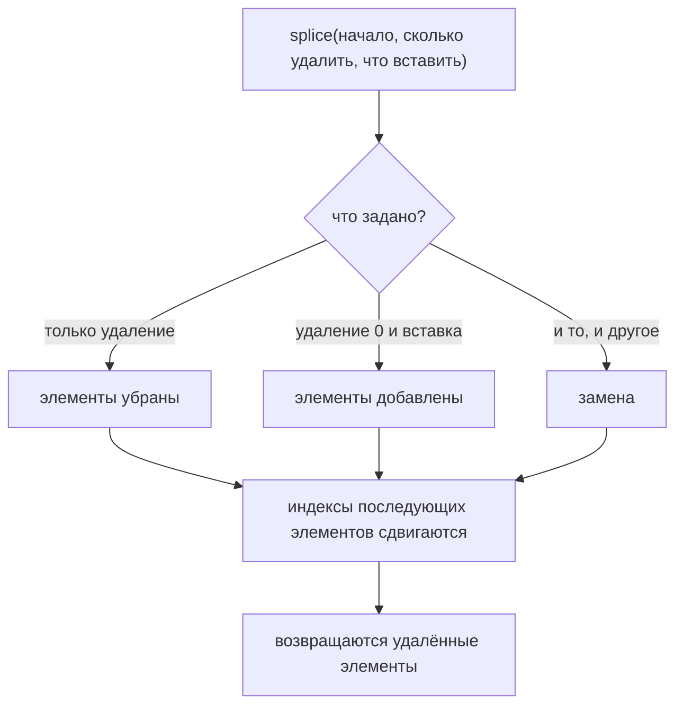

# splice()

## Связь с предыдущей главой

Предыдущая глава показала, как array изменяется в начале:

До этого мы уже изменяли конец через `push()` и `pop()`.

Теперь остается область, которую нельзя описать только словами "начало" или "конец".

Тестовый фреймворк хранит список test cases. Иногда новый test case нужно вставить не в конец, а между уже существующими проверками. Иногда устаревший test case нужно удалить из середины. Иногда один test case нужно заменить другим.

## Главный вопрос

> Как изменить середину массива?

Ответ этой главы: использовать `splice()`.

## Предварительные требования

Для этой главы нужно понимать:

* что array — это ordered collection;
* что каждый element имеет index;
* что `length` отражает количество elements;
* что `push()` и `pop()` изменяют конец;
* что `shift()` и `unshift()` изменяют начало;
* что методы array могут изменять исходный array.

Не требуется знать `slice()`, iteration, `forEach()`, `map()`, `filter()` или `reduce()`. Эти темы будут изучаться позже.

## Цели обучения

После главы вы будете понимать:

* зачем существует `splice()`;
* как удалить elements из середины;
* как добавить elements в середину;
* как заменить elements;
* что возвращает `splice()`;
* почему исходный array изменяется;
* почему array после `splice()` нужно читать как новое состояние;
* как меняются indexes после операции;
* почему старые index references становятся небезопасными;
* как `splice()` применяется в Automation QA.

## Мотивация

Представим test automation framework.

Есть список test cases:

```javascript
const testCases = [
  'login smoke',
  'create order',
  'pay order',
  'logout smoke'
];
```

Появилось новое требование: перед оплатой нужно добавить test case `apply discount`.

Нельзя использовать `push()`, потому что новый test case окажется в конце.

Нельзя использовать `unshift()`, потому что он окажется в начале.

Нужна операция для середины:

## Теория

### Array как состояние во времени

`splice()` изменяет существующий array.

Для этой главы важно думать об array не как о статичной записи, а как о состоянии во времени. Array — это mutable состояние object: один и тот же array может находиться в разных состояниях в разные моменты выполнения программы. Каждый вызов `splice()` является переходом состояния: он берёт текущее состояние array и превращает его в следующее.

Это значит, что несколько операций `splice()` нельзя читать как независимые команды, применённые к одному исходному списку. Вторая операция работает уже с результатом первой.

### Общая форма и смысл аргументов

```javascript
array.splice(startIndex, deleteCount, newElement1, newElement2);
```

| Аргумент | Что означает |
| --- | --- |
| `startIndex` | с какой позиции начать изменение |
| `deleteCount` | сколько элементов удалить начиная с этой позиции |
| остальные | что вставить на освободившееся место |

Отрицательный `startIndex` отсчитывается от конца: `splice(-2, 1)` удалит предпоследний элемент. А если `deleteCount` не указан вовсе, удаляется **всё до конца массива** — `["a","b","c","d"].splice(1)` оставит `["a"]`.

### Три операции одним методом

Комбинация аргументов задаёт, что именно произойдёт:

```javascript
testCases.splice(1, 1);                      // только удалить
testCases.splice(2, 0, 'apply discount');    // только добавить
testCases.splice(1, 1, 'create paid order'); // заменить
```

Ключ к чтению — второй аргумент: ноль означает «ничего не удалять, только вставить», а положительное число — «удалить столько и, возможно, вставить взамен».

Один метод выполняет три разные операции:



## Внутренний механизм

### Что происходит при вставке в середину

```javascript
const testCases = ['login smoke', 'create order', 'pay order', 'logout smoke'];

testCases.splice(2, 0, 'apply discount');
```

Шаги:

1. взять позицию `2`;
2. удалить `0` элементов начиная с неё;
3. вставить `'apply discount'` на эту позицию;
4. сдвинуть все последующие элементы вправо.

Состояние до и после:

| Index | До | После |
| --- | --- | --- |
| 0 | `login smoke` | `login smoke` |
| 1 | `create order` | `create order` |
| 2 | `pay order` | **`apply discount`** |
| 3 | `logout smoke` | `pay order` |
| 4 | — | `logout smoke` |

### Сдвиг индексов — не мелочь

Обратите внимание: `pay order` был на index `2`, а после вставки оказался на index `3`.

Это инженерное правило, а не деталь. Если код заранее сохранил index `2` как «позицию payment test», после `splice()` это значение уже указывает на другой элемент. После каждой мутации нужно заново смотреть на текущее состояние array.

### Возвращаемое значение

`splice()` возвращает array удалённых элементов — именно удалённых, а не изменённый массив:

```javascript
const removed = testCases.splice(1, 1);   // ['create order']
const nothing = testCases.splice(2, 0, 'apply discount');   // []
```

Если ничего не удалено, возвращается пустой array. Это удобно для журнала: удалённый элемент можно записать, не восстанавливая его из копии.

## Главная ментальная модель

Главная модель этой главы: **middle modification** — изменение середины списка.

Более точная формулировка: `splice()` не создаёт безопасную копию для чтения, он меняет исходный array и сообщает, что из него изъял.

Поэтому вызовы `splice()` всегда читаются слева направо по времени: каждый следующий работает с массивом, который получился после предыдущего. Если нужен снимок исходного состояния — его делают заранее, и для этого существует `slice()` из следующей главы.

## Практические примеры

Примеры находятся в:

```text
examples/01-javascript/chapter-47/
```

Запуск:

```bash
node examples/01-javascript/chapter-47/01-remove-test-case.js
node examples/01-javascript/chapter-47/02-insert-test-case.js
node examples/01-javascript/chapter-47/03-replace-test-case.js
node examples/01-javascript/chapter-47/04-return-value.js
node examples/01-javascript/chapter-47/05-qa-suite-update.js
```

## Примеры Automation QA

В реальном фреймворке список test cases может строиться динамически:

```javascript
const regressionPlan = [
  'login smoke',
  'create order',
  'pay order',
  'logout smoke'
];

regressionPlan.splice(2, 0, 'apply discount');
```

Так можно вставить обязательную проверку между созданием заказа и оплатой.

После этой операции план уже изменился:

Другой пример — удаление временного теста:

```javascript
const removedTests = regressionPlan.splice(1, 1);
```

Удаленный test case сохраняется в `removedTests`, поэтому его можно залогировать.

Если после этого нужно выполнить еще одну операцию по index, index нужно выбирать уже по новому состоянию `regressionPlan`, а не по старой схеме.

## Распространённые мифы

**Миф: `splice()` возвращает изменённый массив.**
Он возвращает массив удалённых элементов, а изменённым оказывается исходный.

**Миф: без `deleteCount` ничего не удалится.**
Пропущенный `deleteCount` удаляет всё от `startIndex` до конца массива.

**Миф: индексы после вставки остаются прежними.**
Все элементы правее точки вставки сдвигаются. Сохранённый ранее индекс указывает уже на другой элемент.

**Миф: отрицательный индекс — ошибка.**
Он допустим и отсчитывается от конца: `splice(-2, 1)` удалит предпоследний элемент.

**Миф: несколько `splice()` подряд можно считать независимыми.**
Каждый следующий работает с результатом предыдущего.

## Частые вопросы

**Как вставить элемент, ничего не удаляя?**
Передать `deleteCount` равным нулю: `splice(index, 0, element)`.

**Как узнать, что именно было удалено?**
Взять возвращённое значение: это массив удалённых элементов, пустой если ничего не удалялось.

**Почему после `splice()` сломался код, работавший по индексу?**
Индексы сдвинулись. После мутации их нужно вычислять заново.

**Чем `splice()` отличается от `slice()`?**
`splice()` меняет исходный массив, `slice()` возвращает копию части и исходный не трогает.

**Что произойдёт при `splice(0)`?**
Удалится весь массив: начало с нулевой позиции и отсутствующий `deleteCount`.

## Проверьте себя

1. Что возвращает `splice()` и чем это отличается от результата операции?
2. Что произойдёт при вызове `splice(1)` на массиве из четырёх элементов?
3. Почему сохранённый индекс нельзя переиспользовать после вставки?
4. Как одним вызовом заменить элемент?
5. Как отсчитывается отрицательный `startIndex`?

## Распространённые ошибки

### Ошибка 1. Ожидать новый array

Неправильная модель: «`splice()` вернёт новый массив с изменениями, а исходный останется прежним».

Реальность: изменяется исходный массив, а возвращается список удалённых элементов.

### Ошибка 2. Путать `startIndex` и `deleteCount`

```javascript
testCases.splice(2, 1);
```

Это означает:

### Ошибка 3. Забыть про сдвиг indexes

После добавления или удаления из середины indexes следующих elements меняются.

Строгое правило: после любой операции, меняющей состав массива, индексы вычисляются заново.

Небезопасная модель: вычислить индекс один раз и пользоваться им после любых изменений списка.

Правильная модель: вычислять индекс заново после каждой операции, меняющей состав массива.

В Automation QA это особенно важно: если один helper вставил test case в середину плана, другой helper не должен молча использовать index, рассчитанный до изменения.

## Краткие итоги

`splice()` нужен, когда нужно изменить середину array.

Он может:

* удалить elements;
* добавить elements;
* заменить elements;
* вернуть удаленные elements;
* изменить исходный array.

Главная мысль:

## Переход к следующей главе

`splice()` изменяет исходный array.

Следующий вопрос естественный:

> Как получить часть array, не меняя исходный список test cases?

Эта задача ведет к `slice()`.

Практика:

```text
practice/01-javascript/47-splice.md
```

Решения:

```text
solutions/01-javascript/47-splice.md
```
