# splice()

## Связь с предыдущей главой

Предыдущая глава показала, как array изменяется в начале:

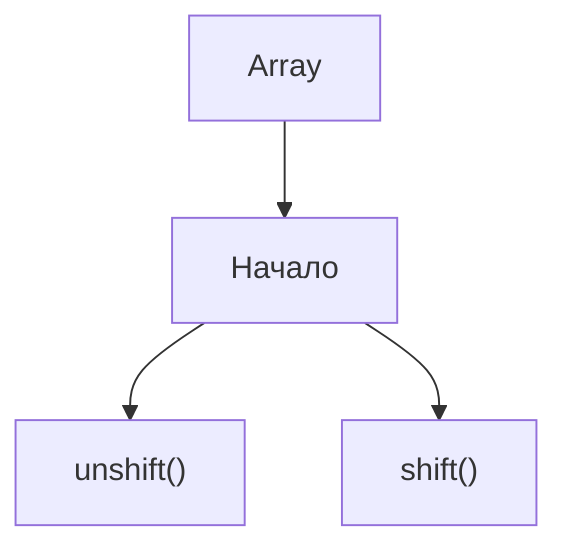

До этого мы уже изменяли конец через `push()` и `pop()`.

Теперь остается область, которую нельзя описать только словами "начало" или "конец".

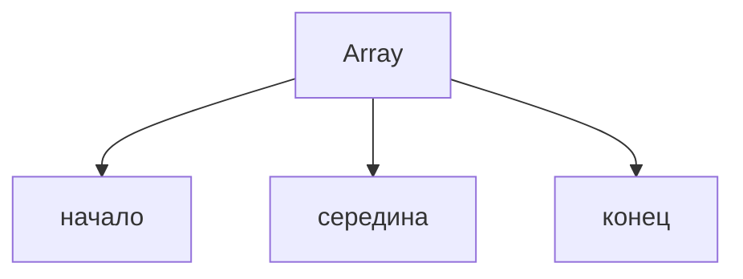

Тестовый фреймворк хранит список test cases. Иногда новый test case нужно вставить не в конец, а между уже существующими проверками. Иногда устаревший test case нужно удалить из середины. Иногда один test case нужно заменить другим.

## Главный вопрос

> Как изменить середину массива?

Ответ этой главы: использовать `splice()`.

## Предварительные требования

Для этой главы нужно понимать:

* что array — это ordered collection;
* что каждый element имеет index;
* что `length` отражает количество elements;
* что `push()` и `pop()` изменяют конец;
* что `shift()` и `unshift()` изменяют начало;
* что методы array могут изменять исходный array.

Не требуется знать `slice()`, iteration, `forEach()`, `map()`, `filter()` или `reduce()`. Эти темы будут изучаться позже.

## Цели обучения

После главы вы будете понимать:

* зачем существует `splice()`;
* как удалить elements из середины;
* как добавить elements в середину;
* как заменить elements;
* что возвращает `splice()`;
* почему исходный array изменяется;
* почему array после `splice()` нужно читать как новое состояние;
* как меняются indexes после операции;
* почему старые index references становятся небезопасными;
* как `splice()` применяется в Automation QA.

## Мотивация

Представим test automation framework.

Есть список test cases:

```javascript
const testCases = [
  'login smoke',
  'create order',
  'pay order',
  'logout smoke'
];
```

Появилось новое требование: перед оплатой нужно добавить test case `apply discount`.

Нельзя использовать `push()`, потому что новый test case окажется в конце.

Нельзя использовать `unshift()`, потому что он окажется в начале.

Нужна операция для середины:

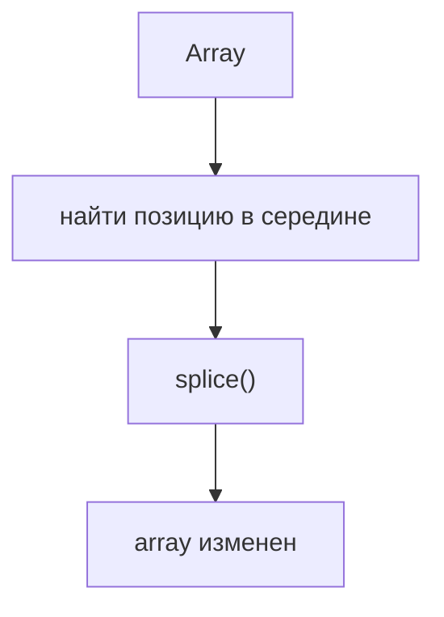

## Теория

`splice()` изменяет существующий array.

Для этой главы важно думать об array не как о статичной записи, а как о состоянии во времени.

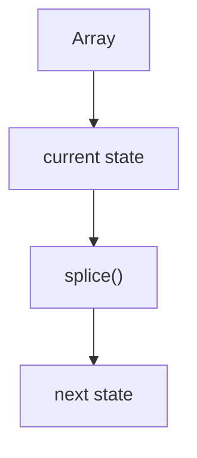

Array — это mutable состояние object: один и тот же array может находиться в разных состояниях в разные моменты выполнения программы. Каждый вызов `splice()` является состояние transition: он берет текущее состояние array и превращает его в следующее состояние.

Это значит, что несколько операций `splice()` нельзя читать как независимые команды, примененные к одному исходному списку. Вторая операция работает уже с результатом первой.

Общая форма:

```javascript
array.splice(startIndex, deleteCount, newElement1, newElement2);
```

Смысл:

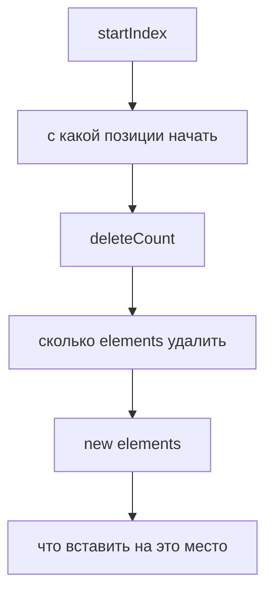

Если нужно только удалить:

```javascript
testCases.splice(1, 1);
```

Если нужно только добавить:

```javascript
testCases.splice(2, 0, 'apply discount');
```

Если нужно заменить:

```javascript
testCases.splice(1, 1, 'create paid order');
```

## Внутренний механизм

Рассмотрим добавление test case в середину:

```javascript
const testCases = [
  'login smoke',
  'create order',
  'pay order',
  'logout smoke'
];

testCases.splice(2, 0, 'apply discount');
```

Шаги:

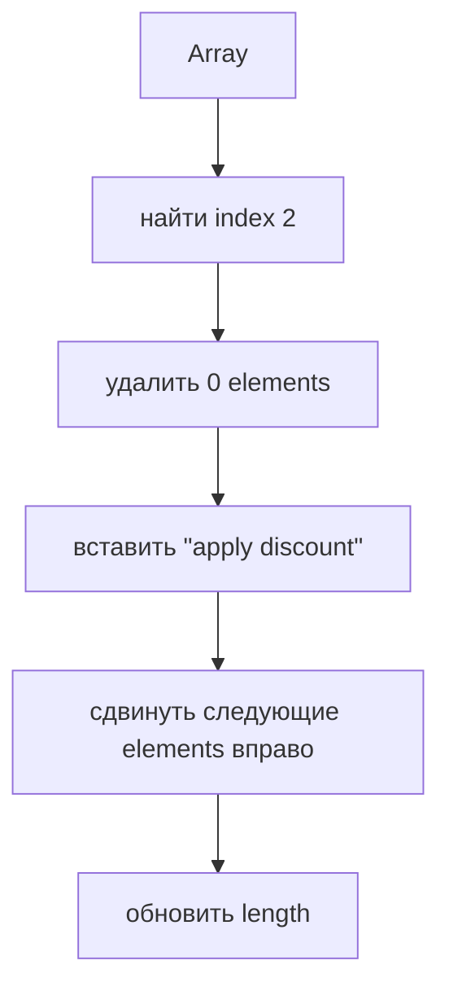

Результат:

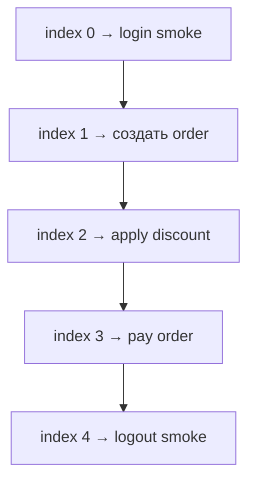

Теперь посмотрим на это как на transition состояния:

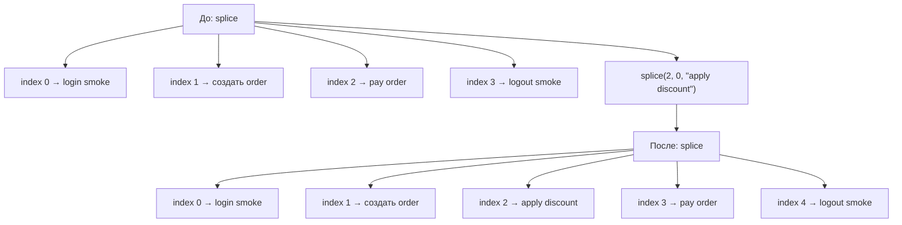

Обратите внимание: `pay order` был на index `2`, но после вставки оказался на index `3`.

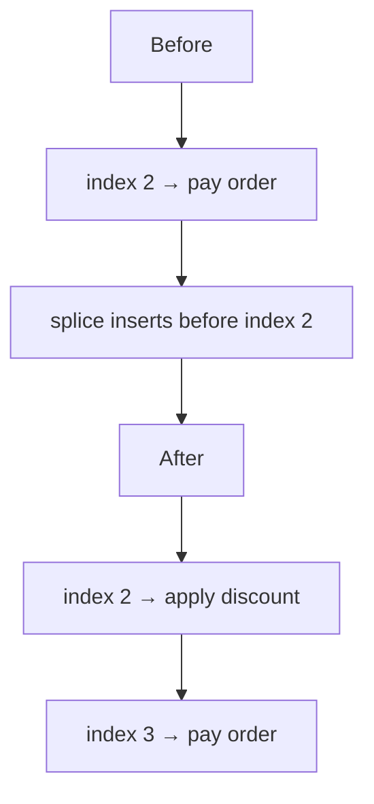

Это не мелкая деталь. Это инженерное правило:

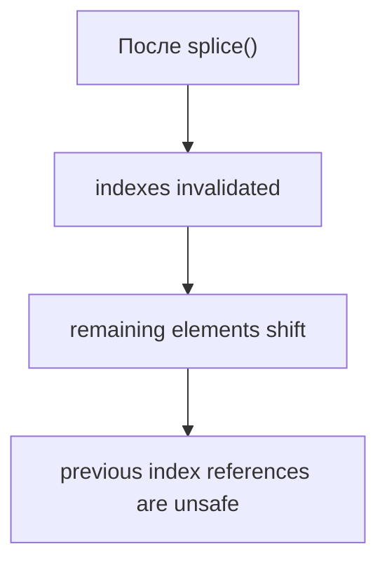

Если код заранее сохранил index `2` как "позицию payment test", после `splice()` это значение уже может указывать на другой element. После каждой mutation нужно заново смотреть на текущее состояние array.

`splice()` возвращает array удаленных elements.

Если ничего не удалено, возвращается empty array:

```javascript
const removed = testCases.splice(2, 0, 'apply discount');
console.log(removed); // []
```

## Главная ментальная модель

Главная модель этой главы: **middle modification**.

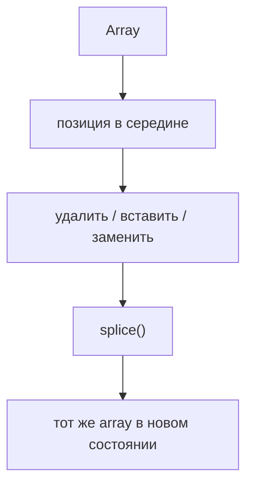

Важно: `splice()` не создает безопасную копию для чтения. Он меняет исходный array.

Более точная инженерная формулировка:

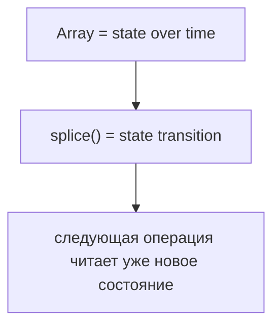

Поэтому `splice()` всегда нужно читать слева направо по времени:

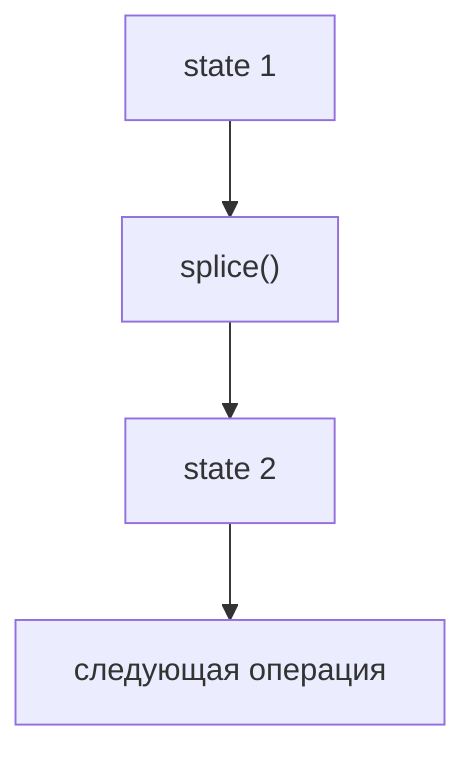

## Практические примеры

Примеры находятся в:

```text
examples/01-javascript/chapter-47/
```

Запуск:

```bash
node examples/01-javascript/chapter-47/01-remove-test-case.js
node examples/01-javascript/chapter-47/02-insert-test-case.js
node examples/01-javascript/chapter-47/03-replace-test-case.js
node examples/01-javascript/chapter-47/04-return-value.js
node examples/01-javascript/chapter-47/05-qa-suite-update.js
```

## Примеры Automation QA

В реальном фреймворке список test cases может строиться динамически:

```javascript
const regressionPlan = [
  'login smoke',
  'create order',
  'pay order',
  'logout smoke'
];

regressionPlan.splice(2, 0, 'apply discount');
```

Так можно вставить обязательную проверку между созданием заказа и оплатой.

После этой операции план уже изменился:

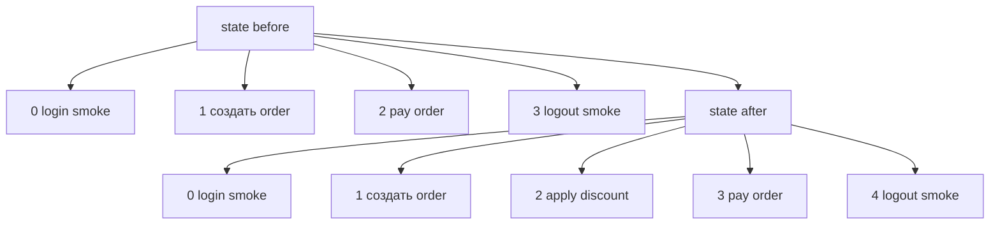

Другой пример — удаление временного теста:

```javascript
const removedTests = regressionPlan.splice(1, 1);
```

Удаленный test case сохраняется в `removedTests`, поэтому его можно залогировать.

Если после этого нужно выполнить еще одну операцию по index, index нужно выбирать уже по новому состоянию `regressionPlan`, а не по старой схеме.

## Распространённые ошибки

### Ошибка 1. Ожидать новый array

Неправильная модель:

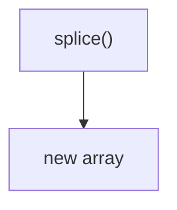

Реальность:

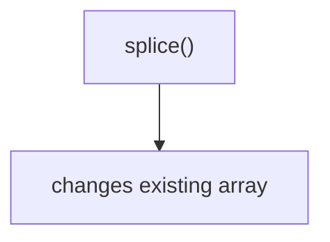

### Ошибка 2. Путать `startIndex` и `deleteCount`

```javascript
testCases.splice(2, 1);
```

Это означает:

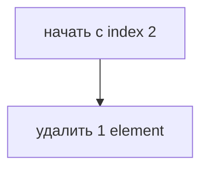

### Ошибка 3. Забыть про сдвиг indexes

После добавления или удаления из середины indexes следующих elements меняются.

Строгое правило:

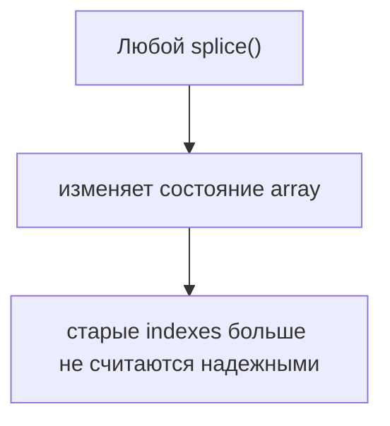

Небезопасная модель:

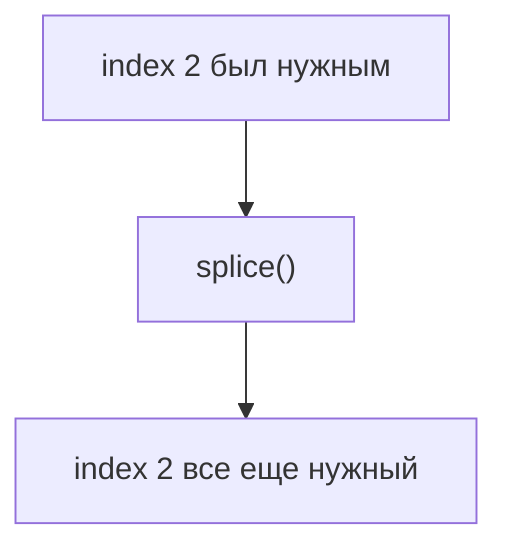

Правильная модель:

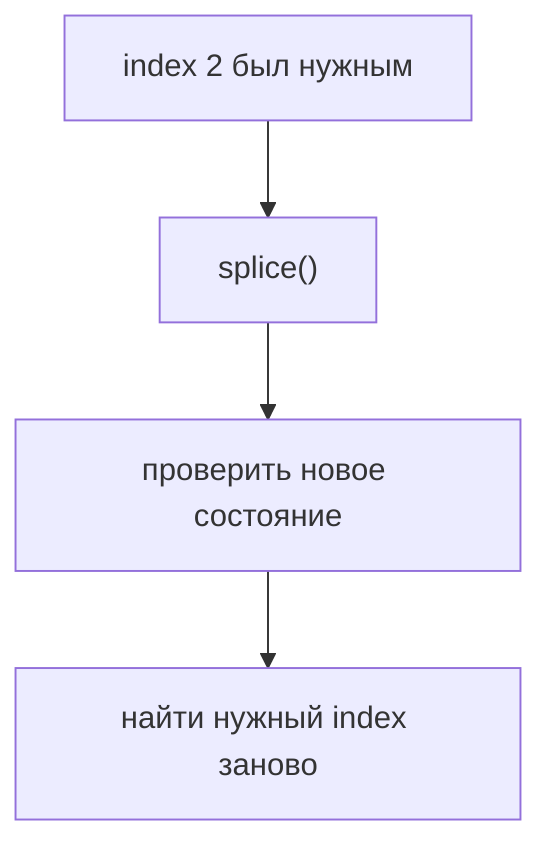

В Automation QA это особенно важно: если один helper вставил test case в середину плана, другой helper не должен молча использовать index, рассчитанный до изменения.

## Краткие итоги

`splice()` нужен, когда нужно изменить середину array.

Он может:

* удалить elements;
* добавить elements;
* заменить elements;
* вернуть удаленные elements;
* изменить исходный array.

Главная мысль:

```mermaid
flowchart TD
    N1["array current state"]
    N2["splice()"]
    N3["array next state"]
    N4["indexes после операции нужно читать заново"]
    N1 --> N2
    N2 --> N3
    N3 --> N4
```

## Переход к следующей главе

`splice()` изменяет исходный array.

Следующий вопрос естественный:

> Как получить часть array, не меняя исходный список test cases?

Эта задача ведет к `slice()`.

Практика:

```text
practice/01-javascript/47-splice.md
```

Решения:

```text
solutions/01-javascript/47-splice.md
```
