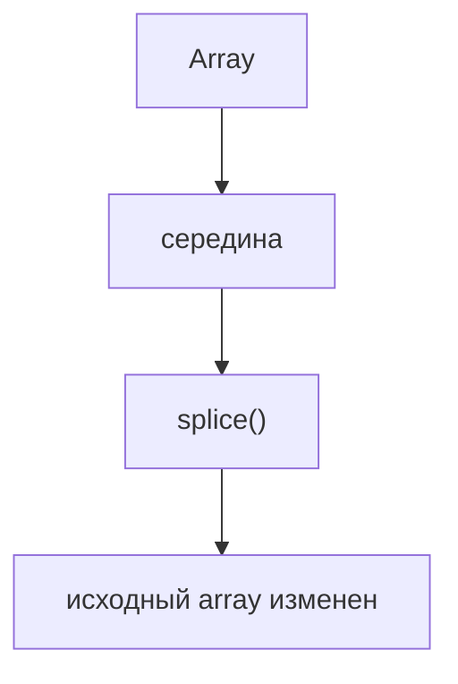
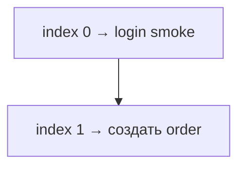
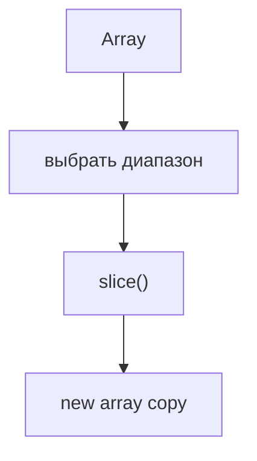
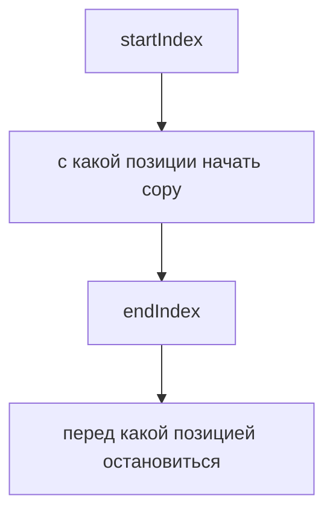
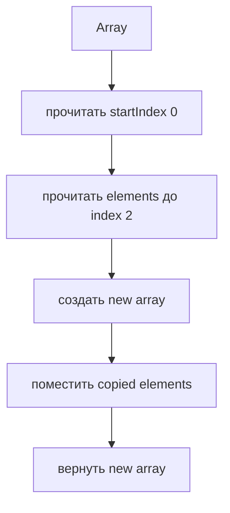
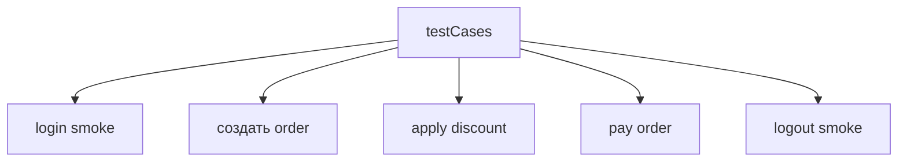
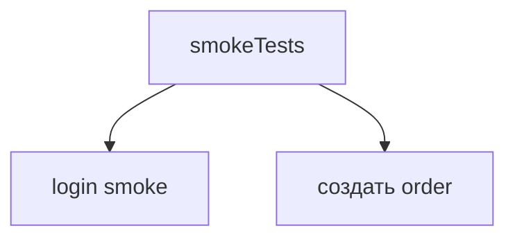
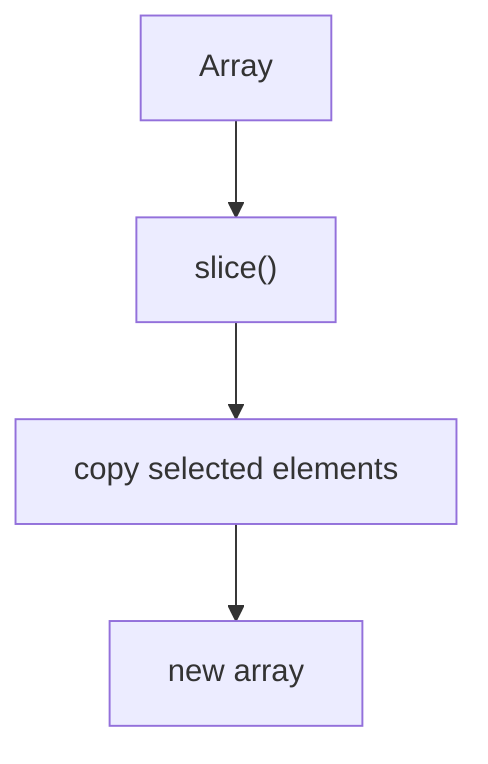
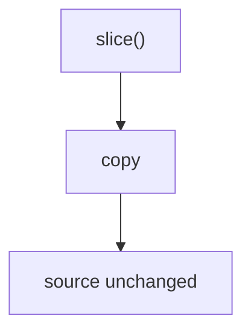
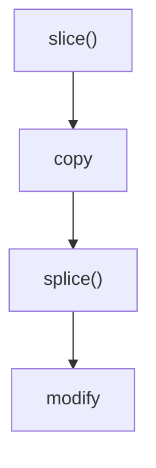

# slice()

## Связь с предыдущей главой

Предыдущая глава объяснила `splice()`.

Главная модель была такой:



Но не каждая операция со списком test cases должна менять исходный список.

Иногда нужно получить snapshot: часть regression plan для отдельного запуска, полный copy списка перед изменением или первые несколько smoke tests для быстрого pipeline.

## Главный вопрос

> Как получить копию массива или его части?

Ответ этой главы: использовать `slice()`.

## Предварительные требования

Для этой главы нужно понимать:

* что array хранит ordered elements;
* что indexes начинаются с `0`;
* что `splice()` изменяет исходный array;
* что Automation QA часто хранит test cases в порядке выполнения.

Не требуется знать immutable operations, deep copy, `map()`, `filter()`, `reduce()` или sorting. Эти темы будут изучаться позже.

## Цели обучения

После главы вы будете понимать:

* зачем существует `slice()`;
* как получить копию всего array;
* как получить часть array;
* что исходный array не изменяется;
* как работают `startIndex` и `endIndex`;
* почему `endIndex` не включается;
* чем `slice()` отличается от `splice()`;
* как snapshots используются в Automation QA.

## Мотивация

Продолжим scenario test automation framework.

Есть список test cases:

```javascript
const testCases = [
  'login smoke',
  'create order',
  'apply discount',
  'pay order',
  'logout smoke'
];
```

Нужно запустить только первые два smoke-related tests:



Но исходный regression plan должен остаться целым.

Нужна операция:



## Теория

`slice()` возвращает copy части array.

Общая форма:

```javascript
array.slice(startIndex, endIndex);
```

Смысл:



`endIndex` не включается.

```javascript
const smokeTests = testCases.slice(0, 2);
```

Результат:


Исходный `testCases` остается без изменений.

## Внутренний механизм

Когда engine выполняет:

```javascript
const smokeTests = testCases.slice(0, 2);
```

он делает conceptual steps:



Исходный array:



Новый array:



## Главная ментальная модель

Главная модель этой главы: **copying**.



`slice()` не изменяет исходный array.

## Практические примеры

Примеры находятся в:

```text
examples/01-javascript/chapter-48/
```

Запуск:

```bash
node examples/01-javascript/chapter-48/01-copy-all.js
node examples/01-javascript/chapter-48/02-copy-range.js
node examples/01-javascript/chapter-48/03-end-index.js
node examples/01-javascript/chapter-48/04-splice-vs-slice.js
node examples/01-javascript/chapter-48/05-qa-snapshot.js
```

## Примеры Automation QA

Snapshot regression plan:

```javascript
const snapshot = testCases.slice();
```

Subset for smoke pipeline:

```javascript
const smokePlan = testCases.slice(0, 2);
```

Subset for payment-related поток:

```javascript
const paymentFlow = testCases.slice(2, 4);
```

В каждом случае исходный `testCases` остается тем же.

## Распространённые ошибки

### Ошибка 1. Ожидать изменение исходного array

`slice()` не удаляет и не вставляет elements.



### Ошибка 2. Думать, что `endIndex` включается

```javascript
testCases.slice(0, 2);
```

Берет indexes `0` и `1`, но не `2`.

### Ошибка 3. Путать `slice()` и `splice()`



## Краткие итоги

`slice()` нужен, когда нужно получить copy array или его части.

Он:

* возвращает new array;
* не изменяет исходный массив;
* берет elements от `startIndex` до `endIndex`;
* не включает `endIndex`.

## Переход к следующей главе

Теперь мы умеем получать snapshot списка test cases.

Следующий вопрос:

> Как пройти по каждому test case в списке?

Эта задача ведет к iteration.

Практика:

```text
practice/01-javascript/48-slice.md
```

Решения:

```text
solutions/01-javascript/48-slice.md
```
