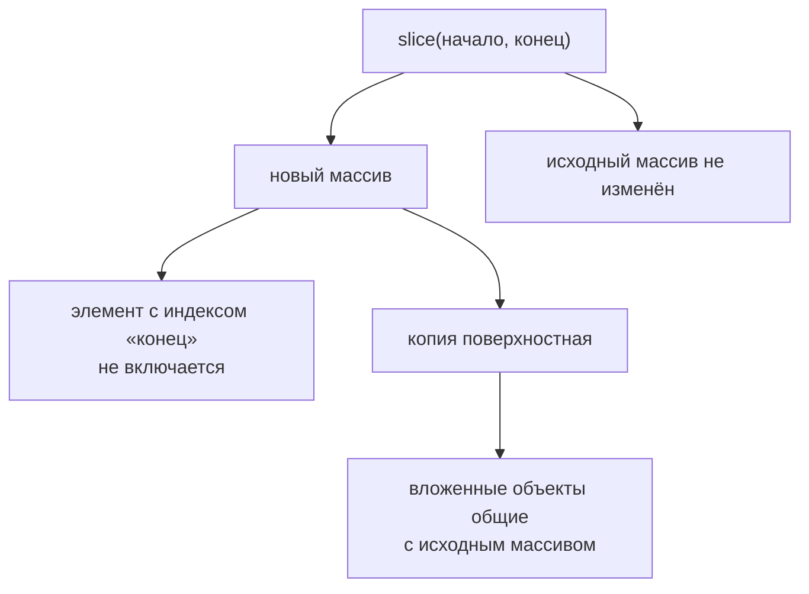

# slice()

## Связь с предыдущей главой

Предыдущая глава объяснила `splice()`.

Главная модель была такой: `splice()` изменяет исходный массив и возвращает удалённые элементы.

Но не каждая операция со списком test cases должна менять исходный список.

Иногда нужно получить snapshot: часть regression plan для отдельного запуска, полный copy списка перед изменением или первые несколько smoke tests для быстрого pipeline.

## Главный вопрос

> Как получить копию массива или его части?

Ответ этой главы: использовать `slice()`.

## Предварительные требования

Для этой главы нужно понимать:

* что array хранит ordered elements;
* что indexes начинаются с `0`;
* что `splice()` изменяет исходный array;
* что Automation QA часто хранит test cases в порядке выполнения.

Не требуется знать immutable operations, deep copy, `map()`, `filter()`, `reduce()` или sorting. Эти темы будут изучаться позже.

## Цели обучения

После главы вы будете понимать:

* зачем существует `slice()`;
* как получить копию всего array;
* как получить часть array;
* что исходный array не изменяется;
* как работают `startIndex` и `endIndex`;
* почему `endIndex` не включается;
* чем `slice()` отличается от `splice()`;
* как snapshots используются в Automation QA.

## Мотивация

Продолжим scenario test automation framework.

Есть список test cases:

```javascript
const testCases = [
  'login smoke',
  'create order',
  'apply discount',
  'pay order',
  'logout smoke'
];
```

Нужно запустить только первые два smoke-related tests:

Но исходный regression plan должен остаться целым.

Нужна операция:

## Теория

### Копия вместо изменения

`slice()` возвращает копию части array. Исходный массив остаётся нетронутым — это главное отличие от `splice()` из предыдущей главы.

```javascript
array.slice(startIndex, endIndex);
```

| Аргумент | Что означает |
| --- | --- |
| `startIndex` | с какого индекса начать копирование |
| `endIndex` | до какого индекса копировать, **не включая его** |

### Граница `endIndex` не включается

Это правило стоит запомнить отдельно, потому что на нём ошибаются чаще всего:

```javascript
const smokeTests = testCases.slice(0, 2);
```

Берутся индексы `0` и `1`, а `2` — нет. Удобный способ читать такую запись: второй аргумент отвечает не на вопрос «какой последний элемент взять», а «где остановиться».

Отсюда полезное следствие: `endIndex - startIndex` сразу даёт количество элементов в результате.

### Варианты вызова

| Вызов | Результат для `['a','b','c','d']` |
| --- | --- |
| `slice(0, 2)` | `['a', 'b']` |
| `slice()` | `['a', 'b', 'c', 'd']` — полная копия |
| `slice(-2)` | `['c', 'd']` — два последних |
| `slice(2, 1)` | `[]` — конец раньше начала |

Отрицательный индекс отсчитывается от конца, а вызов без аргументов даёт копию всего массива — это самый частый способ сделать снимок состояния.

`slice()` не трогает исходный массив:



## Внутренний механизм

### Что делает движок

```javascript
const smokeTests = testCases.slice(0, 2);
```

Концептуальные шаги:

1. создать новый пустой array;
2. взять элементы с `startIndex` до `endIndex`, не включая последний;
3. положить их в новый array;
4. вернуть новый array, оставив исходный без изменений.

| | Исходный `testCases` | Новый `smokeTests` |
| --- | --- | --- |
| содержимое | все четыре теста | первые два |
| изменился ли | нет | это отдельный массив |

### Копия поверхностная

Здесь прячется главная ловушка главы. `slice()` копирует **сам массив**, но не те объекты, на которые он ссылается.

```javascript
const objs = [{ id: 1, tags: ['x'] }];
const copy = objs.slice();

copy[0].id = 99;
copy[0].tags.push('y');

console.log(objs);   // [{ id: 99, tags: ['x', 'y'] }]
```

Исходный объект изменился, потому что в копии лежит та же ссылка. При этом структура массивов действительно независима: `copy.push(...)` не влияет на длину `objs`.

Практическое правило: `slice()` защищает от изменений **состава** списка, но не от изменений элементов внутри него. Для независимых объектов нужна копия и на уровне элементов.

## Главная ментальная модель

Главная модель этой главы: **copying** — получение части списка без вмешательства в оригинал.

Сравнение с предыдущей главой удобно держать рядом:

| | `splice()` | `slice()` |
| --- | --- | --- |
| исходный массив | изменяется | не изменяется |
| возвращает | удалённые элементы | копию выбранной части |
| назначение | изменить середину | прочитать часть или сделать снимок |

## Практические примеры

Примеры находятся в:

```text
examples/01-javascript/chapter-48/
```

Запуск:

```bash
node examples/01-javascript/chapter-48/01-copy-all.js
node examples/01-javascript/chapter-48/02-copy-range.js
node examples/01-javascript/chapter-48/03-end-index.js
node examples/01-javascript/chapter-48/04-splice-vs-slice.js
node examples/01-javascript/chapter-48/05-qa-snapshot.js
```

## Примеры Automation QA

Snapshot regression plan:

```javascript
const snapshot = testCases.slice();
```

Subset for smoke pipeline:

```javascript
const smokePlan = testCases.slice(0, 2);
```

Subset for payment-related поток:

```javascript
const paymentFlow = testCases.slice(2, 4);
```

В каждом случае исходный `testCases` остается тем же.

## Распространённые мифы

**Миф: `slice()` изменяет исходный массив.**
Он возвращает копию. Исходный список остаётся прежним — именно за этим его и используют.

**Миф: `endIndex` включается в результат.**
Не включается. `slice(0, 2)` берёт индексы `0` и `1`.

**Миф: `slice()` даёт полностью независимые данные.**
Копия поверхностная: объекты внутри остаются общими, и их изменение видно в исходном массиве.

**Миф: отрицательный индекс недопустим.**
Он отсчитывается от конца: `slice(-2)` даёт два последних элемента.

**Миф: `slice(2, 1)` вызовет ошибку.**
Он вернёт пустой массив: конец раньше начала — это не ошибка.

## Частые вопросы

**Как сделать снимок всего массива?**
Вызвать `slice()` без аргументов.

**Как взять последние N элементов?**
`slice(-N)`.

**Сколько элементов вернёт `slice(a, b)`?**
`b - a`, если границы внутри массива.

**Почему изменение копии отразилось в оригинале?**
Копия поверхностная: элемент-объект общий. Нужна копия и на уровне элементов.

**Что выбрать для «отрезать кусок и забыть про оригинал»?**
`slice()` для чтения; если оригинал должен измениться — `splice()`.

## Проверьте себя

1. Какие индексы попадут в результат `slice(1, 3)`?
2. Чем `slice()` отличается от `splice()` по влиянию на исходный массив?
3. Что вернёт `slice(2, 1)`?
4. Почему копия называется поверхностной и когда это важно?
5. Как получить два последних элемента одной операцией?

## Распространённые ошибки

### Ошибка 1. Ожидать изменение исходного array

`slice()` не удаляет и не вставляет elements.

### Ошибка 2. Думать, что `endIndex` включается

```javascript
testCases.slice(0, 2);
```

Берет indexes `0` и `1`, но не `2`.

### Ошибка 3. Путать `slice()` и `splice()`

## Краткие итоги

`slice()` нужен, когда нужно получить copy array или его части.

Он:

* возвращает new array;
* не изменяет исходный массив;
* берет elements от `startIndex` до `endIndex`;
* не включает `endIndex`.

## Переход к следующей главе

Теперь мы умеем получать snapshot списка test cases.

Следующий вопрос:

> Как пройти по каждому test case в списке?

Эта задача ведет к iteration.

Практика:

```text
practice/01-javascript/48-slice.md
```

Решения:

```text
solutions/01-javascript/48-slice.md
```
