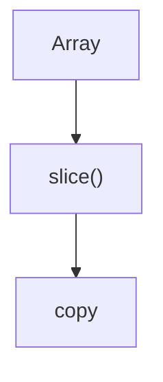
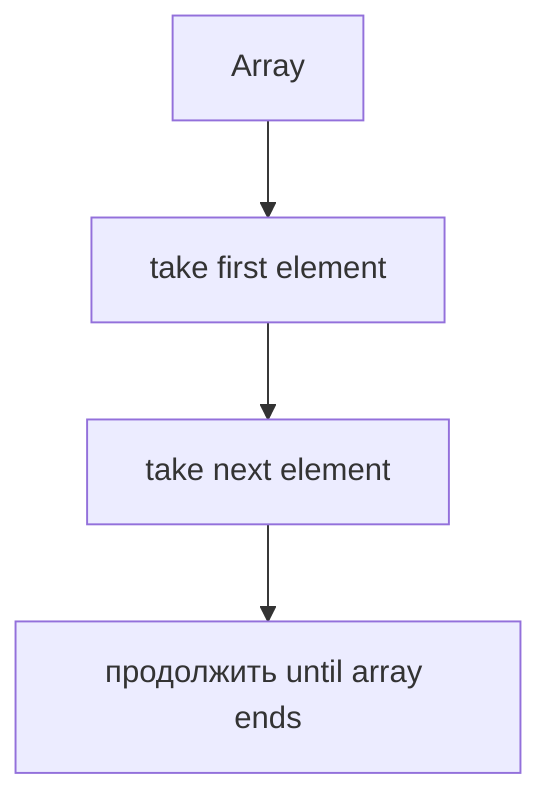
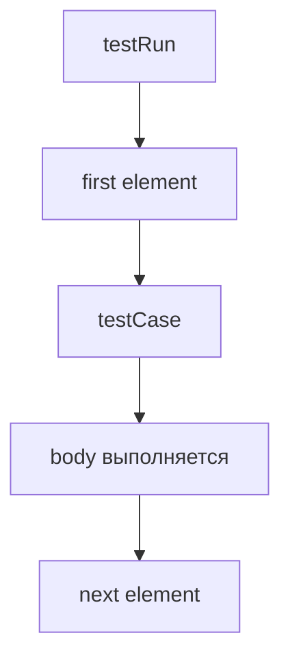
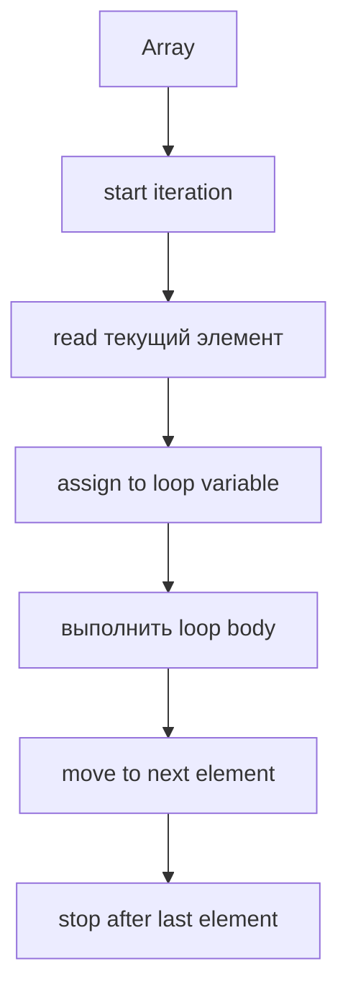
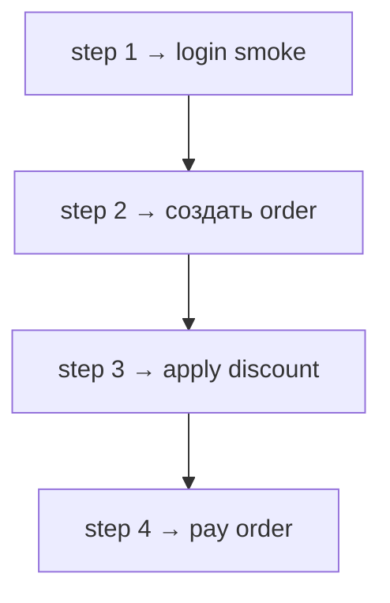
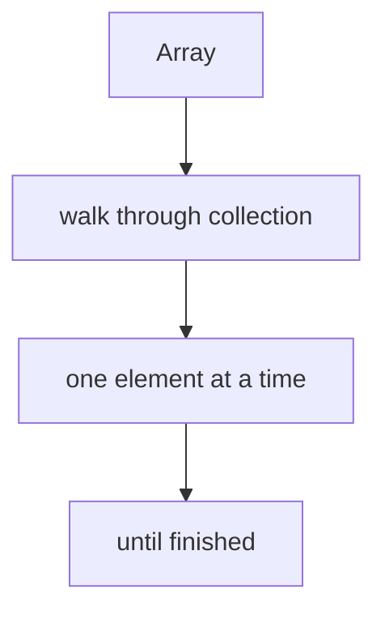

# Iteration

## Связь с предыдущей главой

Предыдущая глава объяснила `slice()`.

Мы научились получать snapshot test cases:



Теперь появляется новая задача. Snapshot создан, но сам по себе он ничего не делает. Нужно пройти по каждому test case и подготовить выполнение.

## Главный вопрос

> Как последовательно пройти по каждому элементу коллекции?

Ответ этой главы: использовать iteration. В этой главе мы изучаем `for...of`.

## Предварительные требования

Для этой главы нужно понимать:

* что array — ordered collection;
* что `slice()` может создать copy для запуска;
* что test cases могут храниться как strings или objects;
* что loop уже изучался как repeated execution.

Не требуется знать `forEach()`, callbacks, `map()`, `filter()`, `reduce()`, iterators internals или async iteration. Эти темы будут изучаться позже.

## Цели обучения

После главы вы будете понимать:

* зачем нужна iteration;
* почему indexes не всегда удобны;
* как `for...of` проходит по array;
* что на каждом шаге доступен текущий element;
* как читать код с последовательным обходом;
* как iteration применяется в test framework.

## Мотивация

Есть снимок:

```javascript
const testRun = [
  'login smoke',
  'create order',
  'apply discount',
  'pay order'
];
```

Нужно вывести каждый test case перед запуском:

```text
prepare login smoke
prepare create order
prepare apply discount
prepare pay order
```

Можно читать indexes вручную:

```javascript
console.log(testRun[0]);
console.log(testRun[1]);
console.log(testRun[2]);
console.log(testRun[3]);
```

Но это плохо масштабируется.

Нужен последовательный обход:



## Теория

Iteration — это последовательный обход elements collection.

`for...of` читает значения из array:

```javascript
for (const testCase of testRun) {
  console.log(testCase);
}
```

Смысл:



На каждом шаге `testCase` получает current element.

## Внутренний механизм

Концептуальные шаги:



Для `testRun`:



`for...of` хорошо подходит, когда нужен сам element, а не index.

## Главная ментальная модель

Главная модель этой главы: **iteration**.



## Практические примеры

Примеры находятся в:

```text
examples/01-javascript/chapter-49/
```

Запуск:

```bash
node examples/01-javascript/chapter-49/01-for-of-basic.js
node examples/01-javascript/chapter-49/02-test-case-objects.js
node examples/01-javascript/chapter-49/03-from-snapshot.js
node examples/01-javascript/chapter-49/04-common-mistakes.js
node examples/01-javascript/chapter-49/05-qa-iteration.js
```

## Примеры Automation QA

Test framework может готовить запуск:

```javascript
for (const testCase of testRun) {
  console.log(`Preparing: ${testCase}`);
}
```

Если test cases are objects:

```javascript
for (const testCase of testRun) {
  console.log(`${testCase.id}: ${testCase.title}`);
}
```

Такой код читается как workпоток: пройти по каждому test case.

## Распространённые ошибки

### Ошибка 1. Использовать index там, где нужен element

Если index не нужен, `for...of` обычно читается проще.

### Ошибка 2. Думать, что `for...of` сам запускает тесты

`for...of` только проходит по elements. Что делать с element, решает body.

### Ошибка 3. Изменять array во время обхода без необходимости

Для этой главы лучше считать, что list prepared before iteration.

## Краткие итоги

Iteration нужна, чтобы пройти по collection последовательно.

`for...of`:

* читает current element;
* выполняет body для каждого element;
* останавливается после последнего element;
* хорошо подходит для читаемого обхода test cases.

## Переход к следующей главе

Мы научились проходить по test cases.

Следующий вопрос:

> Как выполнить одинаковое действие для каждого element через array method?

Эта задача ведет к `forEach()`.

Практика:

```text
practice/01-javascript/49-iteration.md
```

Решения:

```text
solutions/01-javascript/49-iteration.md
```
