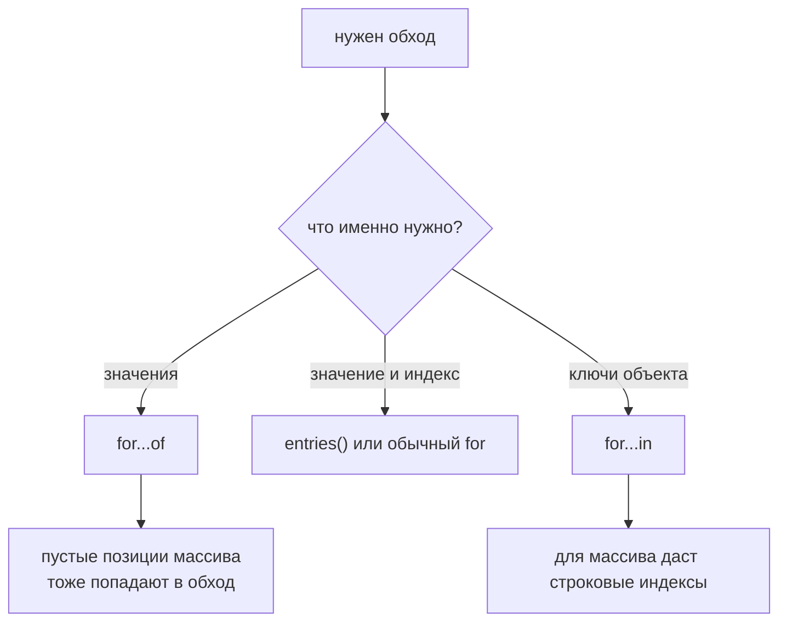

# Перебор массива

## Связь с предыдущей главой

Предыдущая глава объяснила `slice()`.

Мы научились получать snapshot test cases:

Теперь появляется новая задача. Snapshot создан, но сам по себе он ничего не делает. Нужно пройти по каждому test case и подготовить выполнение.

## Главный вопрос

> Как последовательно пройти по каждому элементу коллекции?

Ответ этой главы: использовать обход коллекции. Здесь мы изучаем `for...of`.

## Предварительные требования

Для этой главы нужно понимать:

* что array — ordered collection;
* что `slice()` может создать copy для запуска;
* что test cases могут храниться как strings или objects;
* что loop уже изучался как repeated execution.

Не требуется знать `forEach()`, callbacks, `map()`, `filter()`, `reduce()`, iterators internals или async iteration. Эти темы будут изучаться позже.

## Цели обучения

После главы вы будете понимать:

* зачем нужна iteration;
* почему indexes не всегда удобны;
* как `for...of` проходит по array;
* что на каждом шаге доступен текущий element;
* как читать код с последовательным обходом;
* как iteration применяется в test framework.

## Мотивация

Есть снимок:

```javascript
const testRun = [
  'login smoke',
  'create order',
  'apply discount',
  'pay order'
];
```

Нужно вывести каждый test case перед запуском:

```text
prepare login smoke
prepare create order
prepare apply discount
prepare pay order
```

Можно читать indexes вручную:

```javascript
console.log(testRun[0]);
console.log(testRun[1]);
console.log(testRun[2]);
console.log(testRun[3]);
```

Но это плохо масштабируется.

Нужен последовательный обход:

## Теория

### Обход по значениям

Обход — это последовательное прохождение элементов коллекции. `for...of` читает **значения** из массива:

```javascript
for (const testCase of testRun) {
  console.log(testCase);
}
```

На каждом шаге `testCase` получает текущий элемент. Ни индекс, ни длина массива в коде не появляются — и это главная причина, по которой такой цикл читается проще классического `for`.

### `for...of` против `for...in`

Эти конструкции похожи внешне и делают разное:

| | `for...of` | `for...in` |
| --- | --- | --- |
| что даёт | значения элементов | **ключи** свойств |
| включает добавленные свойства | нет | да |
| подходит для массивов | да | нет |

Разница проверяется одним примером:

```javascript
const arr = ['a', 'b'];
arr.extra = 'служебное';

for (const v of arr) { /* 'a', 'b' */ }
for (const k in arr) { /* '0', '1', 'extra' */ }
```

`for...in` перебирает ключи объекта, и к массиву это применимо плохо: он вернёт индексы в виде строк и захватит посторонние свойства. Для массивов используют `for...of`.

### Когда индекс всё-таки нужен

Если в теле цикла нужен номер элемента, есть варианты без ручного счётчика:

```javascript
for (const [index, testCase] of testRun.entries()) {
  console.log(`${index}: ${testCase}`);
}
```

Выбор простой: нужен только элемент — `for...of`; нужны элемент и его позиция — `entries()`.

Разные циклы обходят разные вещи:


```mermaid
flowchart TD
    A["нужен обход"] --> B{"что именно нужно?"}
    B -- "значения" --> C["for...of"]
    B -- "значение и индекс" --> D["entries() или обычный for"]
    B -- "ключи объекта" --> E["for...in"]
    E --> F["для массива даст строковые индексы"]
    C --> G["пустые позиции массива<br/>тоже попадают в обход"]
```

## Внутренний механизм

### Концептуальные шаги

На каждом проходе движок выполняет одно и то же:

1. запросить у коллекции следующее значение;
2. если значения закончились — выйти из цикла;
3. связать полученное значение с переменной цикла;
4. выполнить тело цикла;
5. вернуться к шагу 1.

Для массива `testRun` это означает последовательный проход от первого элемента к последнему в порядке их расположения.

### Пропуски в массиве не пропускаются

Массив может содержать «дырки» — позиции без значения. `for...of` их **не пропускает**: для такой позиции переменная цикла получит `undefined`.

```javascript
const sparse = ['a', , 'c'];
for (const v of sparse) { /* 'a', undefined, 'c' */ }
```

Это отличает его от `forEach()` из следующей главы, который дырки пропускает молча. Разница проявляется редко, но если она проявилась — расследование без знания этого факта уходит далеко в сторону.

### `for...of` управляет обходом, а не действиями

Цикл только доставляет значения. Что с ними делать — решает тело. Из этого следуют два полезных свойства: внутри работают `break` и `continue`, а `await` в теле останавливает обход до завершения операции.

Именно этим `for...of` отличается от `forEach()`: прервать перебор он позволяет, а `forEach()` — нет.

## Главная ментальная модель

Главная модель этой главы: **обход** — «взять следующий элемент и что-то с ним сделать».

Полезно сформулировать выбор цикла как вопрос к задаче:

| Что нужно | Конструкция |
| --- | --- |
| сам элемент | `for...of` |
| элемент и его позиция | `for...of` с `entries()` |
| выполнить действие для каждого без прерывания | `forEach()` |
| ключи объекта | `for...in` |

## Практические примеры

Примеры находятся в:

```text
examples/01-javascript/chapter-49/
```

Запуск:

```bash
node examples/01-javascript/chapter-49/01-for-of-basic.js
node examples/01-javascript/chapter-49/02-test-case-objects.js
node examples/01-javascript/chapter-49/03-from-snapshot.js
node examples/01-javascript/chapter-49/04-common-mistakes.js
node examples/01-javascript/chapter-49/05-qa-iteration.js
```

## Примеры Automation QA

Тестовый фреймворк может готовить запуск:

```javascript
for (const testCase of testRun) {
  console.log(`Preparing: ${testCase}`);
}
```

Если тестовые случаи — объекты:

```javascript
for (const testCase of testRun) {
  console.log(`${testCase.id}: ${testCase.title}`);
}
```

Такой код читается как рабочий процесс: пройти по каждому тестовому случаю.

### Последовательная подготовка данных

```javascript
for (const testCase of testRun) {
  // Каждая запись создаётся после предыдущей: стенд не получает
  // четыре одновременных запроса, а порядок в логе совпадает с порядком
  // в списке.
  await createWorkItem(testCase);
}
```

Это главная причина выбирать `for...of` в тестах: внутри работает `await`, и
обход ждёт завершения операции. `forEach()` из следующей главы так не умеет —
он запустит все обратные вызовы сразу и вернёт управление до того, как хоть
один запрос закончится.

### Первое исключение обрывает весь обход

```javascript
const results = [];

for (const testCase of testRun) {
  try {
    results.push({ id: testCase.id, value: await run(testCase) });
  } catch (error) {
    // Без перехвата второй упавший тестовый случай останется неизвестным.
    results.push({ id: testCase.id, error: error.message });
  }
}
```

Цикл не изолирует шаги. Если третий элемент выбросил ошибку, четвёртый и
пятый не обработаются, а отчёт покажет одну проблему вместо трёх.

Решение зависит от цели: для подготовки данных обрыв правильный — дальше идти
незачем; для сбора результатов нужен перехват внутри тела, как выше.

## Распространённые мифы

**Миф: `for...in` подходит для массивов.**
Он перебирает ключи и захватывает добавленные свойства. Для массивов нужен `for...of`.

**Миф: `for...of` даёт индексы.**
Он даёт значения. Для индексов есть `entries()`.

**Миф: `for...of` пропускает пустые позиции.**
Он выдаёт для них `undefined`. Пропускает дырки `forEach()`.

**Миф: цикл сам что-то делает с элементами.**
Он только доставляет значения. Действие определяет тело цикла.

**Миф: прервать перебор нельзя.**
В `for...of` работают `break` и `continue` — в отличие от `forEach()`.

## Частые вопросы

**Когда выбрать `for...of`, а когда `forEach()`?**
`for...of` — если нужен выход из цикла или `await` внутри; `forEach()` — для простого действия над каждым элементом.

**Как получить и элемент, и его номер?**
Через `entries()`: `for (const [index, value] of arr.entries())`.

**Почему `for...in` вернул строки вместо чисел?**
Он перебирает ключи объекта, а ключи массива — строки.

**Можно ли изменять массив во время обхода?**
Лучше не нужно: поведение зависит от вида изменения. Список готовят до цикла.

**Работает ли `await` внутри `for...of`?**
Да, и он останавливает обход до завершения операции — это одно из главных отличий от `forEach()`.

## Проверьте себя

1. Что даёт `for...of` — значения или ключи?
2. Что вернёт `for...in` для массива с добавленным свойством?
3. Как получить индекс элемента внутри `for...of`?
4. Что произойдёт с пустой позицией массива при обходе `for...of`?
5. В каком цикле работает `break`, а в каком нет?

### Ответы

1. Значения элементов.
2. Все перечисляемые ключи, включая добавленное свойство и индексы в виде строк. Поэтому для массивов его не используют.
3. Через `entries()`: `for (const [index, value] of items.entries())`.
4. Пустая позиция будет пройдена со значением `undefined`: `for...of` идёт по всем позициям от начала до длины.
5. `break` работает в `for`, `for...of`, `for...in`, `while` и `do...while`. В переборе методом, например `forEach()`, он не работает — там прерывания нет.

## Распространённые ошибки

### Ошибка 1. Использовать индекс там, где нужен элемент

Если индекс не нужен, `for...of` обычно читается проще.

### Ошибка 2. Думать, что `for...of` сам запускает тесты

`for...of` только проходит по элементам. Что делать с элементом, решает тело цикла.

### Ошибка 3. Изменять массив во время обхода без необходимости

Для этой главы лучше считать, что список подготовлен до обхода.

## Краткие итоги

Обход нужен, чтобы пройти по коллекции последовательно.

`for...of`:

* читает текущий элемент;
* выполняет тело для каждого элемента;
* останавливается после последнего элемента;
* хорошо подходит для читаемого обхода тестовых случаев.

## Переход к следующей главе

Мы научились проходить по тестовым случаям.

Следующий вопрос:

> Как выполнить одинаковое действие для каждого элемента через метод массива?

Эта задача ведет к `forEach()`.

Практика:

```text
practice/01-javascript/49-iteration.md
```

Решения:

```text
solutions/01-javascript/49-iteration.md
```
