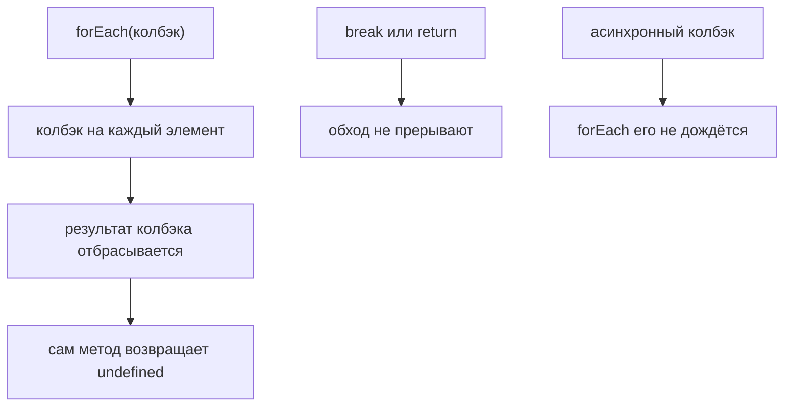

# Метод `forEach()`

## Связь с предыдущей главой

Предыдущая глава объяснила iteration через `for...of`.

Главная модель была такой: `for...of` последовательно достаёт значения, а телом цикла управляет разработчик.

Теперь мы хотим выразить похожую идею через array method:

## Главный вопрос

> Как выполнить одинаковое действие для каждого элемента?

Ответ этой главы: использовать `forEach()`.

## Предварительные требования

Для этой главы нужно понимать:

* что array stores ordered elements;
* что iteration проходит по elements;
* что function can be passed as value;
* что action can be represented by function.

Не требуется знать `map()`, `filter()`, `reduce()`, async callbacks, promises or test runner internals. Эти темы будут изучаться позже.

## Цели обучения

После главы вы будете понимать:

* зачем существует `forEach()`;
* как он проходит по array;
* что action передается как function;
* что `forEach()` выполняет side effect;
* почему `forEach()` не возвращает новый array;
* когда `forEach()` читается уместно;
* как использовать его в Automation QA.

## Мотивация

Есть подготовленный тестовый запуск:

```javascript
const testRun = [
  'login smoke',
  'create order',
  'apply discount',
  'pay order'
];
```

Нужно для каждого test case выполнить одинаковое действие: зарегистрировать запуск.

Можно использовать `for...of`.

Но array also provides method for this shape:

```javascript
testRun.forEach(function (testCase) {
  console.log(`Running: ${testCase}`);
});
```

## Теория

### Действие для каждого элемента

`forEach()` вызывает функцию для каждого элемента массива.

```javascript
array.forEach(function (element, index, wholeArray) {
  // действие
});
```

Обратный вызов получает три аргумента: сам элемент, его индекс и весь массив. Пользуются обычно первыми двумя, но знать о третьем полезно — он объясняет, почему иногда встречается `forEach(console.log)` с неожиданным выводом.

### `forEach()` ничего не возвращает

Ключевое свойство: результат вызова — `undefined`, а не новый массив.

```javascript
const result = ['a', 'b'].forEach((x) => x.toUpperCase());
console.log(result);   // undefined
```

Возвращаемое значение обратного вызова тоже никуда не попадает — оно просто отбрасывается. Если результаты нужны, это задача `map()` из следующей главы.

Поэтому `forEach()` используют для побочных эффектов:

* журнал;
* регистрация;
* отправка команды;
* накопление строки отчёта;
* выполнение действия.

### Прервать обход нельзя

`return` внутри обратного вызова завершает только текущий вызов — то есть пропускает шаг, но не останавливает перебор:

```javascript
const collected = [];
['a', 'b', 'c'].forEach((x) => {
  if (x === 'b') return;
  collected.push(x);
});
console.log(collected);   // ['a', 'c'] — обход дошёл до конца
```

Ни `break`, ни `continue` в `forEach()` не работают. Если перебор нужно прервать, берут `for...of` из предыдущей главы.

`forEach()` выполняет действие и ничего не отдаёт:



## Внутренний механизм

### Концептуальные шаги

1. взять элемент по текущему индексу;
2. вызвать обратный вызов, передав элемент, индекс и сам массив;
3. отбросить результат вызова;
4. перейти к следующему индексу;
5. когда элементы закончились — вернуть `undefined`.

Важно: `forEach()` не создаёт нового массива с результатами. Он выполняет действия и забывает о том, что они вернули.

### Пустые позиции пропускаются

В отличие от `for...of`, дырки в массиве `forEach()` **пропускает молча**:

```javascript
const sparse = ['a', , 'c'];
const seen = [];
sparse.forEach((x) => seen.push(x));
console.log(seen);   // ['a', 'c'] — только два вызова
```

Для пропущенной позиции обратный вызов не выполняется вовсе. Если код рассчитывает на число вызовов, равное длине массива, разреженный массив нарушит это ожидание.

### `forEach()` и асинхронность

Отдельная ловушка, из-за которой появляются загадочные тесты. `forEach()` не ждёт асинхронный обратный вызов: он выполнит все функции подряд и завершится, не дожидаясь их результатов.

```javascript
items.forEach(async (item) => {
  await sendRequest(item);   // forEach не дождётся ни одного await
});
```

Код выглядит последовательным, но выполняется иначе: перебор завершается мгновенно, а запросы продолжают выполняться. Для последовательной обработки нужен `for...of` с `await` внутри.

## Главная ментальная модель

Главная модель этой главы: **выполнение действия** — сделать что-то для каждого элемента.

Сравнение с соседними конструкциями:

| | `for...of` | `forEach()` | `map()` |
| --- | --- | --- | --- |
| возвращает | — | `undefined` | новый массив |
| можно прервать | да | нет | нет |
| ждёт `await` | да | нет | нет |
| пустые позиции | даёт `undefined` | пропускает | сохраняет |

## Практические примеры

Примеры находятся в:

```text
examples/01-javascript/chapter-50/
```

Запуск:

```bash
node examples/01-javascript/chapter-50/01-foreach-basic.js
node examples/01-javascript/chapter-50/02-test-case-action.js
node examples/01-javascript/chapter-50/03-index-argument.js
node examples/01-javascript/chapter-50/04-no-returned-array.js
node examples/01-javascript/chapter-50/05-qa-runner.js
```

## Примеры Automation QA

Регистрация тестовых случаев:

```javascript
testRun.forEach(function (testCase) {
  console.log(`Register test: ${testCase}`);
});
```

Выполнение подготовленного действия:

```javascript
testRun.forEach(function (testCase) {
  console.log(`Run test case: ${testCase.title}`);
});
```

Главное: `forEach()` хорошо выражает действие «сделать это для каждого».

### Чего `forEach()` не умеет

```javascript
// Так не работает: прервать обход нельзя.
testRun.forEach(testCase => {
  if (testCase.status === 'failed') return;   // пропускает элемент, а не выходит
});
```

`return` внутри обратного вызова завершает только текущую итерацию. Выйти из
обхода досрочно нельзя — для этого нужен `for...of` с `break` или метод,
который останавливается сам: `find`, `some`, `every`.

В тестах это важно там, где нужен первый подходящий элемент: перебирать весь
список из трёхсот записей ради одной — лишняя работа и лишнее время прогона.

### `forEach()` и асинхронные шаги

```javascript
// Опасно: обход завершится раньше, чем выполнятся операции.
items.forEach(async item => {
  await deleteItem(item.id);
});

// Последовательно и дожидаясь каждой операции:
for (const item of items) {
  await deleteItem(item.id);
}
```

`forEach()` не ждёт промис, который вернул обратный вызов, — он просто
переходит к следующему элементу. Очистка, написанная первым способом,
завершится «успешно», не удалив ничего: тест закончится раньше запросов.

Это одна из самых дорогих ошибок в фикстурах, потому что она не падает.

## Распространённые мифы

**Миф: `forEach()` возвращает новый массив.**
Он возвращает `undefined`. Новый массив даёт `map()`.

**Миф: `return` прерывает обход.**
Он завершает только текущий вызов. Перебор продолжается.

**Миф: в `forEach()` работает `break`.**
Не работает. Для выхода из цикла нужен `for...of`.

**Миф: `forEach()` дождётся асинхронного обратного вызова.**
Не дождётся: перебор завершится мгновенно, а операции останутся выполняться.

**Миф: обратный вызов выполняется ровно столько раз, какова длина массива.**
Пустые позиции пропускаются, и вызовов будет меньше.

## Частые вопросы

**Что выбрать, если нужен результат обработки?**
`map()`: он собирает возвращённые значения в новый массив.

**Как прервать перебор по условию?**
Использовать `for...of` с `break` — `forEach()` этого не позволяет.

**Как последовательно выполнить асинхронные операции?**
`for...of` с `await` внутри. `forEach()` запустит их все сразу.

**Зачем обратному вызову третий аргумент?**
Это сам массив. Нужен редко, но объясняет неожиданный вывод при передаче готовой функции.

**Когда `forEach()` — лучший выбор?**
Когда нужно выполнить действие для каждого элемента, не собирая результат и не прерывая обход.

## Проверьте себя

1. Что возвращает `forEach()` и куда девается результат обратного вызова?
2. Что делает `return` внутри обратного вызова?
3. Сколько раз выполнится обратный вызов на массиве `['a', , 'c']`?
4. Почему `forEach()` с асинхронным обратным вызовом выполняется не последовательно?
5. Какие три аргумента получает обратный вызов?

### Ответы

1. Возвращает `undefined`. Результат обратного вызова нигде не собирается и просто отбрасывается — метод нужен ради побочного действия.
2. Завершает текущий вызов обратного вызова, то есть пропускает остаток шага. Цикл при этом продолжается: это не `break`.
3. Два раза. `forEach()` пропускает пустые позиции массива.
4. `forEach()` не ждёт возвращённый промис: он вызывает обратный вызов для всех элементов подряд, и операции стартуют почти одновременно. Для последовательности нужен обычный `for...of` с `await`.
5. Значение элемента, его индекс и сам массив.

## Распространённые ошибки

### Ошибка 1. Ожидать новый массив

`forEach()` не предназначен для превращения одной коллекции в другую.

### Ошибка 2. Использовать `forEach()` для вычисления значения

Если нужен результат, будущие главы объяснят другие методы.

### Ошибка 3. Смешивать слишком сложную логику внутри обратного вызова

Если действие разрастается, лучше вынести его в именованную функцию.

## Краткие итоги

`forEach()` нужен, когда для каждого элемента нужно выполнить действие.

Он:

* проходит по массиву;
* вызывает функцию для каждого элемента;
* удобен для побочных действий;
* не возвращает нового массива.

## Переход к следующей главе

Теперь мы умеем выполнять действие для каждого тестового случая.

Следующий вопрос:

> Как преобразовать каждый элемент и получить новый массив?

Эта задача ведет к `map()`.

Практика:

```text
practice/01-javascript/50-foreach.md
```

Решения:

```text
solutions/01-javascript/50-foreach.md
```
