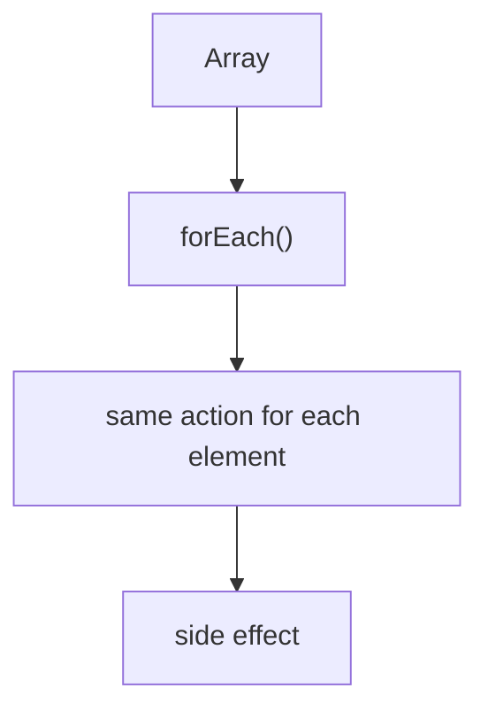
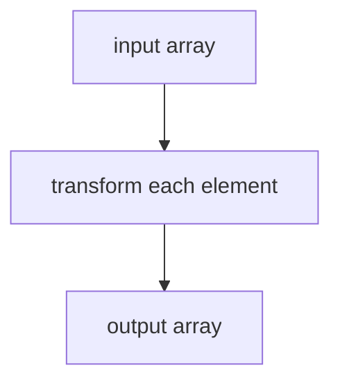
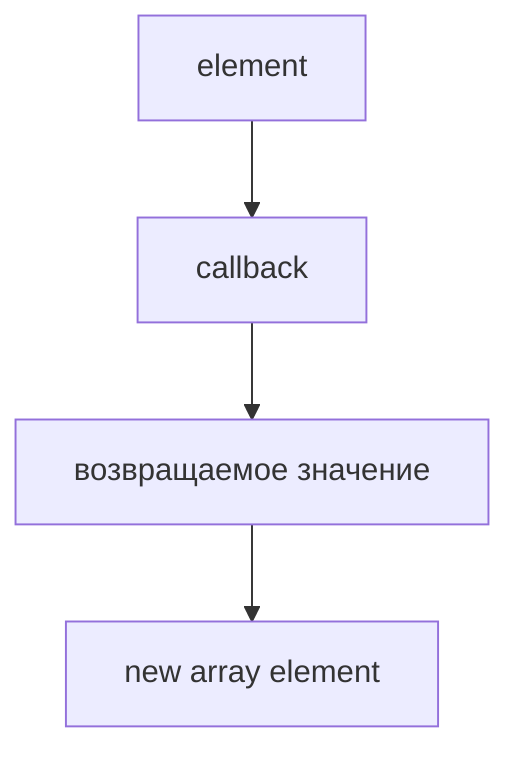
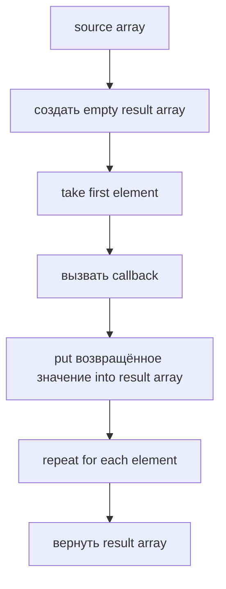
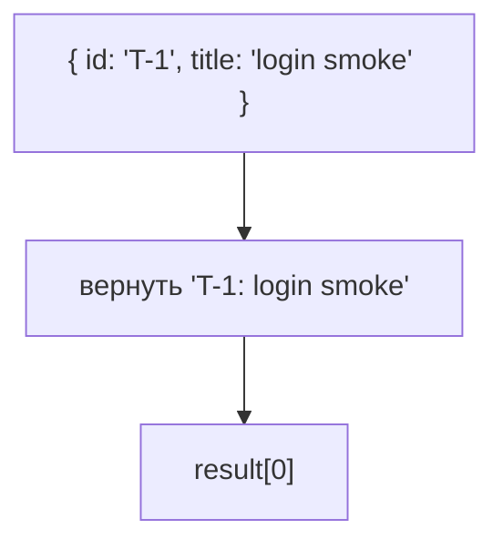
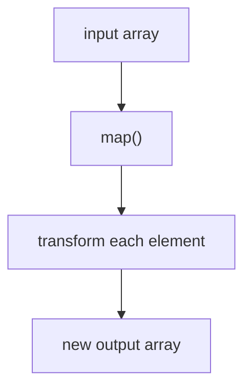
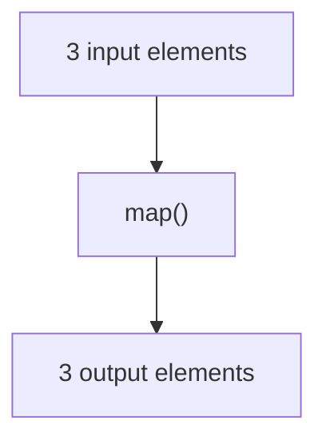
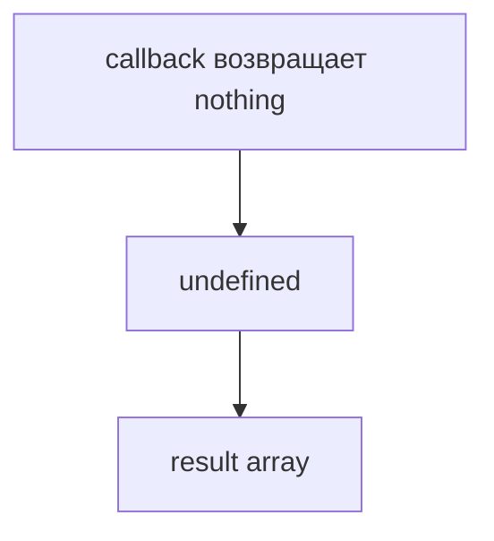

# map()

## Связь с предыдущей главой

Предыдущая глава объяснила `forEach()`.

Главная модель была такой:



`forEach()` удобен, когда нужно выполнить действие: вывести log, зарегистрировать test case, отправить команду.

Но иногда действие не является конечной целью. Иногда нужно взять каждый test case и получить из него новое значение: строку отчета, краткое имя, объект для CI, список titles.

## Главный вопрос

> Как преобразовать каждый element и получить новый array?

Ответ этой главы: использовать `map()`.

## Предварительные требования

Для этой главы нужно понимать:

* что array хранит ordered elements;
* что `forEach()` выполняет action для каждого element;
* что function можно передавать в array method;
* что return value может выйти из function.

Не требуется знать следующие array methods. Они будут изучаться в следующих главах.

## Цели обучения

После главы вы будете понимать:

* зачем существует `map()`;
* чем `map()` отличается от `forEach()`;
* как `map()` преобразует каждый element;
* почему результатом является новый array;
* почему исходный array не нужно менять;
* как применять `map()` в test case pipeline.

## Мотивация

Есть test cases:

```javascript
const testCases = [
  { id: 'T-1', title: 'login smoke', status: 'passed', priority: 'high' },
  { id: 'T-2', title: 'create order', status: 'failed', priority: 'high' },
  { id: 'T-3', title: 'pay order', status: 'passed', priority: 'medium' },
];
```

Нужно получить строки для отчета:

```text
T-1: login smoke
T-2: create order
T-3: pay order
```

`forEach()` может вывести эти строки, но он не собирает новый array.

Нужна операция другого типа:



## Теория

`map()` вызывает function для каждого element и собирает return значения в новый array.

Общая форма:

```javascript
const result = array.map(function (element) {
  return transformedValue;
});
```

Смысл:



Если нужен выходной массив, результат `map()` нужно сохранить.

## Внутренний механизм

Концептуальные шаги:



Для test cases:



Исходный `testCases` остается тем же array с теми же objects. `map()` создает новый array для transformed значения.

## Главная ментальная модель

Главная модель этой главы: **вход -> transformed выходной массив**.



Количество elements обычно сохраняется, а форма данных меняется:



## Практические примеры

Примеры находятся в:

```text
examples/01-javascript/chapter-51/
```

Запуск:

```bash
node examples/01-javascript/chapter-51/01-map-titles.js
node examples/01-javascript/chapter-51/02-map-report-lines.js
node examples/01-javascript/chapter-51/03-map-ci-payload.js
node examples/01-javascript/chapter-51/04-map-does-not-mutate.js
node examples/01-javascript/chapter-51/05-common-mistakes.js
```

## Примеры Automation QA

Report generation:

```javascript
const reportLines = testCases.map(function (testCase) {
  return `${testCase.id}: ${testCase.title} - ${testCase.status}`;
});
```

CI payload:

```javascript
const ciPayload = testCases.map(function (testCase) {
  return {
    testId: testCase.id,
    name: testCase.title,
    priority: testCase.priority,
  };
});
```

Такой код читается как pipeline step: взять test cases и преобразовать их в формат, нужный следующей части системы.

## Распространённые ошибки

### Ошибка 1. Использовать `map()` только ради `console.log`

Если нужен только side effect, `forEach()` выражает намерение точнее.

### Ошибка 2. Забыть `return`

Если callback ничего не возвращает, `map()` положит `undefined` в новый array.



### Ошибка 3. Ожидать изменение исходного array

`map()` возвращает новый array. Если результат нужен дальше, его нужно сохранить.

## Краткие итоги

`map()` проходит по исходный массив, берет return value callback и собирает новый выходной массив.

Главное: используйте `map()`, когда нужен результат преобразования, а не только действие для каждого element.

## Переход к следующей главе

Теперь мы умеем преобразовать каждый test case.

Следующий вопрос:

> Как выбрать только часть test cases по условию?

Эта задача ведет к `filter()`.

Практика:

```text
practice/01-javascript/51-map.md
```

Решения:

```text
solutions/01-javascript/51-map.md
```
