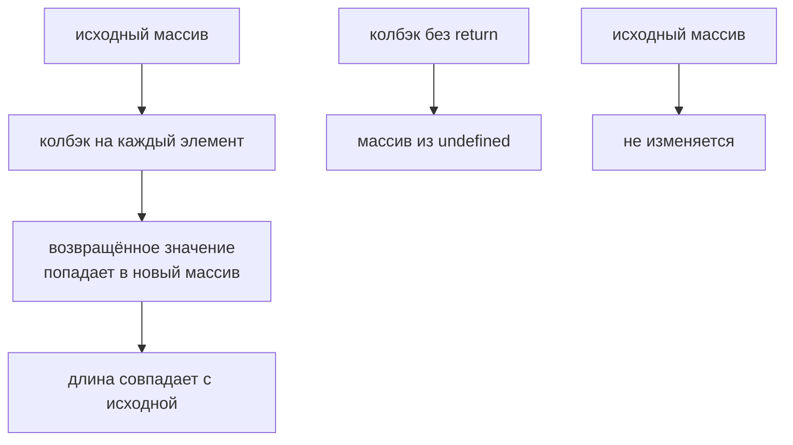

# map()

## Связь с предыдущей главой

Предыдущая глава объяснила `forEach()`.

Главная модель была такой: `forEach()` выполняет действие для каждого элемента и ничего не возвращает.

`forEach()` удобен, когда нужно выполнить действие: вывести log, зарегистрировать test case, отправить команду.

Но иногда действие не является конечной целью. Иногда нужно взять каждый test case и получить из него новое значение: строку отчета, краткое имя, объект для CI, список titles.

## Главный вопрос

> Как преобразовать каждый element и получить новый array?

Ответ этой главы: использовать `map()`.

## Предварительные требования

Для этой главы нужно понимать:

* что array хранит ordered elements;
* что `forEach()` выполняет action для каждого element;
* что function можно передавать в array method;
* что return value может выйти из function.

Не требуется знать следующие array methods. Они будут изучаться в следующих главах.

## Цели обучения

После главы вы будете понимать:

* зачем существует `map()`;
* чем `map()` отличается от `forEach()`;
* как `map()` преобразует каждый element;
* почему результатом является новый array;
* почему исходный array не нужно менять;
* как применять `map()` в test case pipeline.

## Мотивация

Есть test cases:

```javascript
const testCases = [
  { id: 'T-1', title: 'login smoke', status: 'passed', priority: 'high' },
  { id: 'T-2', title: 'create order', status: 'failed', priority: 'high' },
  { id: 'T-3', title: 'pay order', status: 'passed', priority: 'medium' },
];
```

Нужно получить строки для отчета:

```text
T-1: login smoke
T-2: create order
T-3: pay order
```

`forEach()` может вывести эти строки, но он не собирает новый array.

Нужна операция другого типа:

## Теория

### Преобразование в новый массив

`map()` вызывает function для каждого элемента и собирает возвращённые значения в новый array.

```javascript
const result = array.map(function (element, index, wholeArray) {
  return transformedValue;
});
```

Отличие от `forEach()` в одном: `map()` **использует** то, что вернул callback, а `forEach()` отбрасывает.

Если результат нужен, его необходимо сохранить: сам исходный массив `map()` не меняет.

### `return` обязателен

Самая частая ошибка новичка выглядит безобидно:

```javascript
[1, 2].map((x) => { x * 2; });   // [undefined, undefined]
```

Фигурные скобки превращают стрелочную функцию в блок, и без явного `return` callback возвращает `undefined` — а `map()` честно собирает эти `undefined` в новый массив. Правильные варианты: `(x) => x * 2` или `(x) => { return x * 2; }`.

### Длина сохраняется

`map()` всегда возвращает массив той же длины, что исходный: один элемент на входе — один на выходе.

```javascript
['a', 'bb'].map((s) => s.length);   // [1, 2]
```

Если количество элементов должно измениться, нужен другой метод: `filter()` для отбора из следующей главы, `reduce()` для свёртки. Попытка «пропустить» элемент внутри `map()` ничего не пропустит — вместо него появится `undefined`.

Пустые позиции тоже сохраняются: `map()` не вызывает callback для дырки, но оставляет её в результате на том же месте.

Длина сохраняется, элементы заменяются результатом:



## Внутренний механизм

### Концептуальные шаги

1. создать новый пустой array длины исходного;
2. для каждого индекса вызвать callback с элементом, индексом и массивом;
3. положить возвращённое значение в новый array на тот же индекс;
4. вернуть новый array.

Для массива test cases это означает: исходный `testCases` остаётся тем же array с теми же объектами, а `map()` создаёт новый array для преобразованных значений.

### Новый массив — не новые объекты

Здесь та же ловушка, что у `slice()`: новый массив не означает новых элементов.

```javascript
const shared = [{ n: 1 }];
const mapped = shared.map((o) => { o.n = 99; return o; });

console.log(shared);   // [{ n: 99 }] — исходный объект изменён
```

Callback получил ссылку и изменил объект, который лежит и в исходном массиве. Чтобы этого не произошло, из callback возвращают **новое** значение:

```javascript
const mapped = shared.map((o) => ({ ...o, n: o.n + 1 }));
```

Тогда исходные объекты остаются нетронутыми — проверено: `shared` сохраняет `n: 1`, а в результате лежит `n: 2`.

Правило простое: `map()` создаёт новый массив, а за неизменность элементов отвечает ваш callback.

## Главная ментальная модель

Главная модель этой главы: **вход → преобразованный выходной массив**.

Количество элементов сохраняется, а форма данных меняется:

| | Вход | Выход |
| --- | --- | --- |
| длина | N | N |
| тип элементов | объекты test case | строки заголовков |
| исходный массив | — | не изменяется |

Полезный способ выбирать метод: если нужно «то же количество, другая форма» — это `map()`; если «меньше элементов, та же форма» — `filter()`; если «одно значение из многих» — `reduce()`.

## Практические примеры

Примеры находятся в:

```text
examples/01-javascript/chapter-51/
```

Запуск:

```bash
node examples/01-javascript/chapter-51/01-map-titles.js
node examples/01-javascript/chapter-51/02-map-report-lines.js
node examples/01-javascript/chapter-51/03-map-ci-payload.js
node examples/01-javascript/chapter-51/04-map-does-not-mutate.js
node examples/01-javascript/chapter-51/05-common-mistakes.js
```

## Примеры Automation QA

Report generation:

```javascript
const reportLines = testCases.map(function (testCase) {
  return `${testCase.id}: ${testCase.title} - ${testCase.status}`;
});
```

CI payload:

```javascript
const ciPayload = testCases.map(function (testCase) {
  return {
    testId: testCase.id,
    name: testCase.title,
    priority: testCase.priority,
  };
});
```

Такой код читается как pipeline step: взять test cases и преобразовать их в формат, нужный следующей части системы.

## Распространённые мифы

**Миф: `map()` изменяет исходный массив.**
Он создаёт новый. Исходный остаётся прежним — если callback сам его не испортил.

**Миф: новый массив означает новые объекты.**
В нём лежат те значения, что вернул callback. Вернув исходную ссылку, вы получите общий объект.

**Миф: внутри `map()` можно пропустить элемент.**
Нельзя: вместо пропущенного появится `undefined`. Для отбора существует `filter()`.

**Миф: `{ }` в стрелочной функции не влияет на результат.**
Влияет: без `return` callback вернёт `undefined`, и результатом станет массив `undefined`.

**Миф: `map()` годится для побочных действий.**
Для них есть `forEach()`. `map()` без использования результата вводит читателя в заблуждение.

## Частые вопросы

**Почему в результате одни `undefined`?**
В callback пропущен `return` — обычно из-за фигурных скобок в стрелочной функции.

**Как не изменить исходные объекты?**
Возвращать из callback новое значение, а не изменённую исходную ссылку.

**Может ли `map()` вернуть массив другой длины?**
Нет. Длина всегда совпадает с исходной.

**Чем `map()` отличается от `forEach()`?**
`map()` собирает возвращённые значения, `forEach()` их отбрасывает.

**Что выбрать для «отобрать и преобразовать»?**
Сначала `filter()`, затем `map()` — или `reduce()`, если нужно одно значение.

## Проверьте себя

1. Чем `map()` отличается от `forEach()` по отношению к результату callback?
2. Что вернёт `[1, 2].map((x) => { x * 2; })` и почему?
3. Может ли результат `map()` быть короче исходного массива?
4. Как добиться того, чтобы исходные объекты не изменились?
5. Какой метод выбрать, если нужно уменьшить количество элементов?

## Распространённые ошибки

### Ошибка 1. Использовать `map()` только ради `console.log`

Если нужен только side effect, `forEach()` выражает намерение точнее.

### Ошибка 2. Забыть `return`

Если callback ничего не возвращает, `map()` положит `undefined` в новый array.

### Ошибка 3. Ожидать изменение исходного array

`map()` возвращает новый array. Если результат нужен дальше, его нужно сохранить.

## Краткие итоги

`map()` проходит по исходный массив, берет return value callback и собирает новый выходной массив.

Главное: используйте `map()`, когда нужен результат преобразования, а не только действие для каждого element.

## Переход к следующей главе

Теперь мы умеем преобразовать каждый test case.

Следующий вопрос:

> Как выбрать только часть test cases по условию?

Эта задача ведет к `filter()`.

Практика:

```text
practice/01-javascript/51-map.md
```

Решения:

```text
solutions/01-javascript/51-map.md
```
