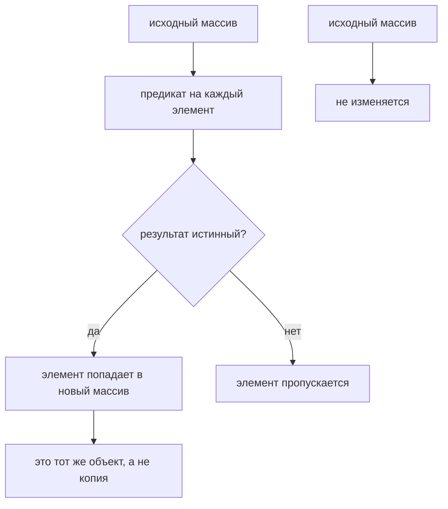

# Метод `filter()`

## Связь с предыдущей главой

Предыдущая глава объяснила `map()`.

Главная модель была такой: `map()` преобразует каждый элемент и сохраняет их количество.

`map()` меняет форму каждого element и обычно сохраняет количество elements.

Теперь появляется другая задача: не преобразовать все test cases, а выбрать только нужные.

## Главный вопрос

> Как выбрать элементы по условию?

Ответ этой главы: использовать `filter()`.

## Предварительные требования

Для этой главы нужно понимать:

* что `map()` создает новый array transformed значения;
* что callback может возвращать value;
* что condition может давать `true` или `false`;
* что test case может иметь поля `status` и `priority`.

Не требуется знать следующие array methods. Они будут изучаться в следующих главах.

## Цели обучения

После главы вы будете понимать:

* зачем существует `filter()`;
* как condition выбирает elements;
* почему результатом является subset array;
* почему исходный array не изменяется;
* как фильтровать test cases для CI;
* какие ошибки встречаются при чтении predicate.

## Мотивация

Есть единый список test cases:

```javascript
const testCases = [
  { id: 'T-1', title: 'login smoke', status: 'passed', priority: 'high' },
  { id: 'T-2', title: 'create order', status: 'failed', priority: 'high' },
  { id: 'T-3', title: 'pay order', status: 'passed', priority: 'medium' },
  { id: 'T-4', title: 'logout smoke', status: 'skipped', priority: 'low' },
];
```

CI pipeline должен перезапустить только failed tests.

Нужна операция:

## Теория

### Отбор по условию

`filter()` вызывает функцию для каждого элемента. Если она возвращает `true`, элемент попадает в результирующий массив; если `false` — пропускается.

```javascript
const result = array.filter(function (element, index, wholeArray) {
  return condition;
});
```

Функцию для `filter()` называют предикатом: она отвечает на вопрос «подходит ли элемент?».

### Проверяется истинность, а не строгое `true`

Важная деталь: `filter()` не сравнивает результат с `true`, а проверяет его истинность. Поэтому ложные значения отсеиваются сами:

```javascript
[0, 1, '', 'x', null, 'ok'].filter((v) => v);   // [1, 'x', 'ok']
```

Это удобно для отсева пустых значений, но требует осторожности: `0` и пустая строка — валидные данные во многих задачах, и такой фильтр выбросит их молча.

### Предикат получает индекс

Второй аргумент предиката — индекс элемента, и это позволяет отбирать по позиции:

```javascript
['a', 'b', 'c'].filter((value, index) => index > 0);   // ['b', 'c']
```

Третий аргумент — сам массив; он нужен редко, но именно благодаря ему можно написать предикат, сравнивающий элемент с соседями.

### Длина меняется, форма — нет

`filter()` возвращает новый массив, длина которого может быть любой от нуля до исходной. При этом сами элементы не преобразуются: на выходе те же значения, что были на входе.

| Метод | Количество элементов | Форма элементов |
| --- | --- | --- |
| `map()` | сохраняется | меняется |
| `filter()` | уменьшается | сохраняется |

Если нужно и отобрать, и преобразовать — это два шага: сначала `filter()`, затем `map()`.

Отбирается то, что предикат признал истинным:



## Внутренний механизм

### Концептуальные шаги

1. создать новый пустой массив;
2. для каждого элемента вызвать предикат;
3. если результат истинный — добавить элемент в новый массив;
4. если ложный — пропустить;
5. вернуть новый массив.

Важно: `filter()` не меняет сами объекты тестовых случаев. Он выбирает ссылки на элементы, которые уже были в исходном массиве.

### Выбранные элементы — те же объекты

Отсюда следует то, что удивляет при первом столкновении:

```javascript
const all = [{ id: 1 }, { id: 2 }];
const selected = all.filter((o) => o.id === 1);

selected[0].id = 99;
console.log(all);   // [{ id: 99 }, { id: 2 }]
```

Массив новый, объекты — прежние. Изменение элемента в отфильтрованном списке видно в исходном.

Это ровно то же свойство, что у `slice()` и `map()`: новый контейнер, общие ссылки. Если выбранные элементы нужно изменять независимо, их копируют явно — например, следующим шагом через `map()`.

## Главная ментальная модель

Главная модель этой главы: **вход → отобранное подмножество**.

Количество элементов может уменьшиться, а форма каждого выбранного элемента остаётся той же:

| | Вход | Выход |
| --- | --- | --- |
| длина | N | от 0 до N |
| тип элементов | тестовый случай | тот же тестовый случай |
| исходный массив | — | не изменяется |

Полезная формулировка для выбора метода: `filter()` отвечает на вопрос «какие из них», `map()` — «во что их превратить», `reduce()` — «что получится из всех вместе».

## Практические примеры

Примеры находятся в:

```text
examples/01-javascript/chapter-52/
```

Запуск:

```bash
node examples/01-javascript/chapter-52/01-filter-failed.js
node examples/01-javascript/chapter-52/02-filter-high-priority.js
node examples/01-javascript/chapter-52/03-filter-ci-ready.js
node examples/01-javascript/chapter-52/04-filter-does-not-mutate.js
node examples/01-javascript/chapter-52/05-common-mistakes.js
```

## Примеры Automation QA

Упавшие тесты для перезапуска:

```javascript
const failedTests = testCases.filter(function (testCase) {
  return testCase.status === 'failed';
});
```

Отбор высокого приоритета для CI:

```javascript
const highPriorityTests = testCases.filter(function (testCase) {
  return testCase.priority === 'high';
});
```

Такой код делает конвейер читаемым: сначала есть полный список, потом выбрано подмножество для конкретного прогона.

### Отбор своих данных из общего ответа

```javascript
const mine = response.items.filter(item => item.title.startsWith(testId));
```

На общем стенде в ответе лежат записи всех параллельных прогонов. Утверждение
«создалась одна запись» на полном списке нестабильно: количество зависит от
соседей.

Фильтр по собственному префиксу возвращает тест к своим данным, и проверка
`mine.length === 1` снова означает то, что написано.

### Пустой результат — тоже результат

```javascript
const failed = testCases.filter(item => item.status === 'failed');

console.log(failed[0].title);   // TypeError: Cannot read properties of undefined
```

`filter()` никогда не выбрасывает ошибку и никогда не возвращает `null`: если
не подошло ничего, он вернёт пустой массив. Сообщение о падении тогда говорит
про `undefined`, а не про «ни один тест не упал» — и время уходит на чтение
трассировки вместо чтения условия.

Отдельно опасен асинхронный предикат: `filter(async item => …)` получает промис,
а промис всегда истинный, поэтому фильтр вернёт **все** элементы и не сообщит
об этом ничем.

## Распространённые мифы

**Миф: предикат обязан вернуть ровно `true` или `false`.**
Проверяется истинность значения. Любое ложное значение исключает элемент.

**Миф: `filter()` создаёт копии элементов.**
Он собирает ссылки. Изменение выбранного объекта видно в исходном массиве.

**Миф: `filter()` может изменить элементы.**
Он только отбирает. Для преобразования нужен `map()`.

**Миф: фильтр `(v) => v` безопасно убирает пустые значения.**
Он также выбросит `0` и пустую строку, которые часто являются валидными данными.

**Миф: результат всегда короче исходного массива.**
Он может совпадать по длине или быть пустым — всё зависит от предиката.

## Частые вопросы

**Как отобрать по позиции, а не по значению?**
Использовать второй аргумент предиката — индекс.

**Как отобрать и сразу преобразовать?**
Двумя шагами: `filter()`, затем `map()`. Один метод обе задачи не решает.

**Почему изменение отфильтрованного списка затронуло исходный?**
В новом массиве лежат те же ссылки. Нужна явная копия элементов.

**Что вернёт `filter()`, если ничего не подошло?**
Пустой массив, а не `undefined`.

**Чем `filter()` отличается от `find()`?**
`filter()` возвращает все подходящие элементы массивом, `find()` — первый подходящий элемент.

## Проверьте себя

1. Что именно проверяет `filter()` в результате предиката?
2. Какие значения выбросит фильтр `(v) => v` и чем это опасно?
3. Как отобрать элементы по их позиции?
4. Почему изменение элемента в результате видно в исходном массиве?
5. Как отобрать и преобразовать элементы за одну операцию — и можно ли?

### Ответы

1. Истинность возвращённого значения. Возвращать именно `true` или `false` не обязательно, но полагаться на приведение типов — источник ошибок.
2. Выбросит все ложные значения: `0`, `''`, `null`, `undefined`, `NaN`, `false`. Опасно тем, что законный ноль или пустая строка молча исчезают из выборки.
3. Использовать второй аргумент предиката — индекс: `items.filter((item, index) => index % 2 === 0)`.
4. Потому что элементы-объекты не копируются: в новом массиве лежат те же ссылки. Новый только сам массив.
5. Да, через `flatMap()` или через `reduce()`. Связка `filter().map()` тоже решает задачу и обычно читается лучше — два прохода по массиву теста не замедлят.

## Распространённые ошибки

### Ошибка 1. Возвращать объект вместо условия

Функция должна отвечать, оставить элемент или нет.

### Ошибка 2. Ожидать преобразованные значения

`filter()` выбирает элементы. Он не превращает их в строки отчёта. Для преобразования используется `map()`.

### Ошибка 3. Забыть `return`

Если функция ничего не возвращает, элемент не пройдёт условие.

## Краткие итоги

`filter()` проверяет каждый элемент и возвращает новое подмножество.

Главное: используйте `filter()`, когда нужно выбрать элементы, а не изменить их форму.

## Переход к следующей главе

Теперь мы умеем выбрать нужные тестовые случаи.

Следующий вопрос:

> Как собрать из многих тестовых случаев один итоговый результат?

Эта задача ведет к `reduce()`.

Практика:

```text
practice/01-javascript/52-filter.md
```

Решения:

```text
solutions/01-javascript/52-filter.md
```
