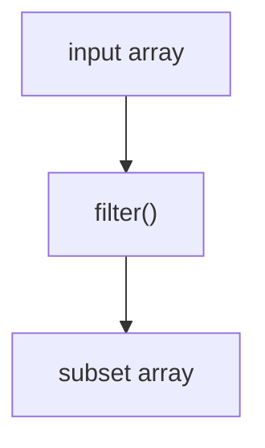
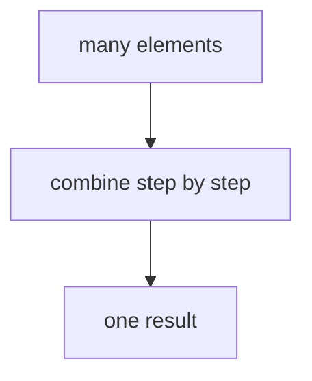
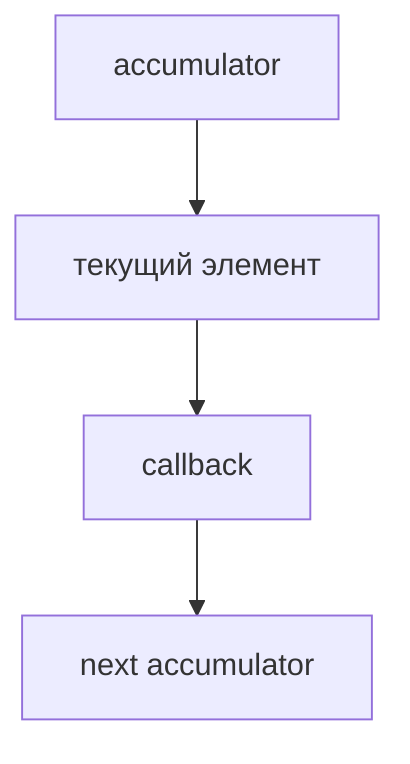
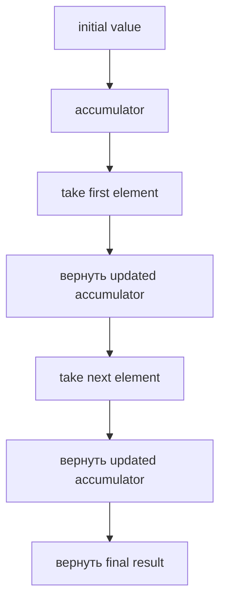
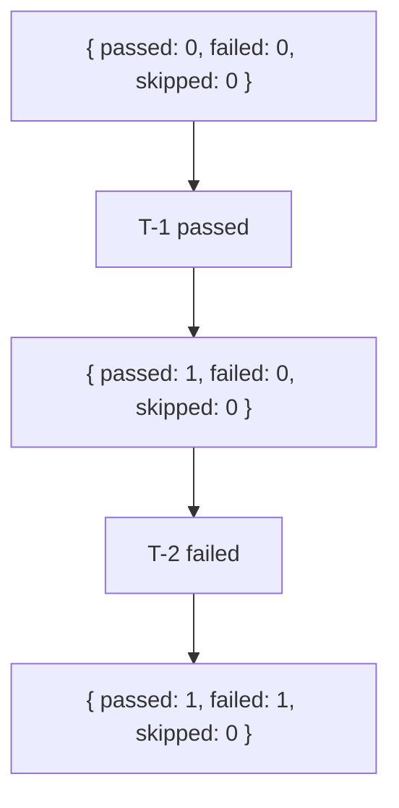
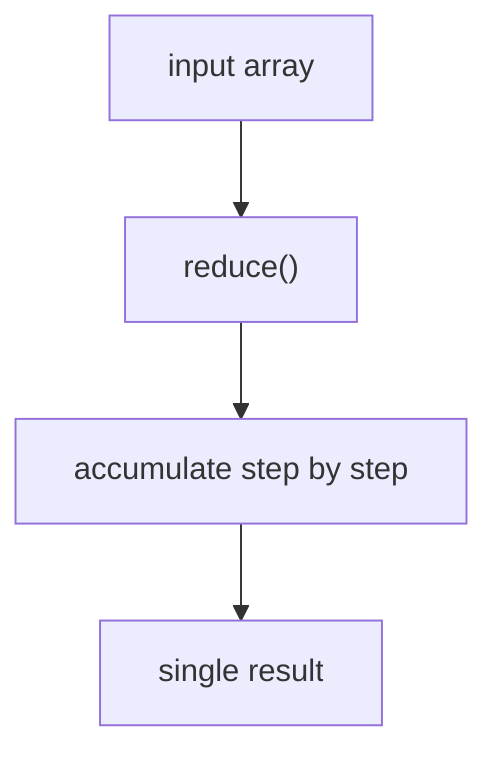

# reduce()

## Связь с предыдущей главой

Предыдущая глава объяснила `filter()`.

Главная модель была такой:



`filter()` выбирает часть elements.

Теперь появляется новая задача: не получить array, а вычислить один итог по всему списку.

## Главный вопрос

> Как агрегировать множество значения в один result?

Ответ этой главы: использовать `reduce()`.

## Предварительные требования

Для этой главы нужно понимать:

* что array method может проходить по каждому element;
* что callback может возвращать value;
* что `map()` возвращает transformed array;
* что `filter()` возвращает subset array;
* что report может быть одним итоговым object или number.

Не требуется знать следующие array methods или сложные accumulator patterns. Они будут изучаться позже.

## Цели обучения

После главы вы будете понимать:

* зачем существует `reduce()`;
* что такое accumulator;
* что такое initial value;
* как каждый element влияет на итог;
* почему result может быть number, string, object или array;
* как собирать summary для Automation QA report.

## Мотивация

Есть test cases:

```javascript
const testCases = [
  { id: 'T-1', title: 'login smoke', status: 'passed', priority: 'high' },
  { id: 'T-2', title: 'create order', status: 'failed', priority: 'high' },
  { id: 'T-3', title: 'pay order', status: 'passed', priority: 'medium' },
  { id: 'T-4', title: 'logout smoke', status: 'skipped', priority: 'low' },
];
```

Нужно получить один summary:

```javascript
{
  passed: 2,
  failed: 1,
  skipped: 1
}
```

Это уже не transformation каждого element и не selection subset.

Нужна операция, которая постепенно собирает один итог:



## Теория

`reduce()` проходит по array и переносит промежуточный result от шага к шагу.

Общая форма:

```javascript
const result = array.reduce(function (accumulator, element) {
  return nextAccumulator;
}, initialValue);
```

Смысл:



`initialValue` задает начальное состояние aggregation.

## Внутренний механизм

Концептуальные шаги:



Один trace для status summary:



Этого достаточно для основной модели: каждый callback call получает текущий accumulator и возвращает следующий.

## Главная ментальная модель

Главная модель этой главы: **вход -> single accumulated result**.



Ключевой вопрос при чтении `reduce()`: как текущий element меняет accumulator?

## Практические примеры

Примеры находятся в:

```text
examples/01-javascript/chapter-53/
```

Запуск:

```bash
node examples/01-javascript/chapter-53/01-count-tests.js
node examples/01-javascript/chapter-53/02-status-summary.js
node examples/01-javascript/chapter-53/03-priority-summary.js
node examples/01-javascript/chapter-53/04-initial-value.js
node examples/01-javascript/chapter-53/05-common-mistakes.js
```

## Примеры Automation QA

Status summary:

```javascript
const summary = testCases.reduce(function (accumulator, testCase) {
  accumulator[testCase.status] = accumulator[testCase.status] + 1;
  return accumulator;
}, { passed: 0, failed: 0, skipped: 0 });
```

CI report часто требует один итоговый object, а не набор строк. Здесь `reduce()` явно собирает summary из списка test cases.

## Распространённые ошибки

### Ошибка 1. Не возвращать accumulator

Если callback не возвращает next accumulator, следующий шаг получает неправильное value.

### Ошибка 2. Выбирать `reduce()` для простой transformation

Если нужен array same length, обычно лучше `map()`.

### Ошибка 3. Забывать initial value

Initial value делает начальное состояние aggregation явным и читаемым.

## Краткие итоги

`reduce()` начинает с initial value, передает accumulator от шага к шагу и возвращает один final result.

Главное: используйте `reduce()`, когда нужен summary, count, report object или другой единый итог.

## Переход к следующей главе

Теперь у нас есть несколько отдельных array operations.

Следующий вопрос:

> Как объединить несколько transformations step by step?

Эта задача ведет к chaining basics.

Практика:

```text
practice/01-javascript/53-reduce.md
```

Решения:

```text
solutions/01-javascript/53-reduce.md
```
