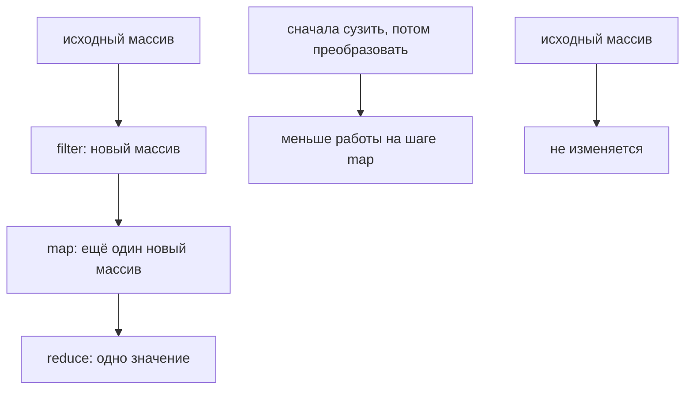

# Chaining basics

## Связь с предыдущей главой

Предыдущие главы показали несколько отдельных array operations.

В реальном test pipeline эти steps часто идут друг за другом: сначала выбираются нужные test cases, потом они преобразуются в формат отчета.

## Главный вопрос

> Как объединить transformations step by step?

Ответ этой главы: использовать chaining basics для `map()` и `filter()`.

## Предварительные требования

Для этой главы нужно понимать:

* что `map()` возвращает новый array;
* что `filter()` возвращает новый array;
* что результат одного expression можно использовать дальше;
* что pipeline должен читаться по шагам.

Не требуется знать следующие array methods или сложные pipeline patterns. Они будут изучаться позже.

## Цели обучения

После главы вы будете понимать:

* зачем нужен chaining;
* почему chaining возможен после `map()` и `filter()`;
* как читать chain слева направо;
* как не смешивать слишком много действий;
* как строить простой QA processing pipeline.

## Мотивация

Есть test cases:

```javascript
const testCases = [
  { id: 'T-1', title: 'login smoke', status: 'passed', priority: 'high' },
  { id: 'T-2', title: 'create order', status: 'failed', priority: 'high' },
  { id: 'T-3', title: 'pay order', status: 'passed', priority: 'medium' },
  { id: 'T-4', title: 'logout smoke', status: 'skipped', priority: 'low' },
];
```

Нужно:

* выбрать high priority tests;
* превратить их в строки для CI report.

Можно сделать двумя переменными:

```javascript
const highPriorityTests = testCases.filter(function (testCase) {
  return testCase.priority === 'high';
});

const reportLines = highPriorityTests.map(function (testCase) {
  return `${testCase.id}: ${testCase.title}`;
});
```

Chaining записывает тот же pipeline рядом:

```javascript
const reportLines = testCases
  .filter(function (testCase) {
    return testCase.priority === 'high';
  })
  .map(function (testCase) {
    return `${testCase.id}: ${testCase.title}`;
  });
```

## Теория

### Когда цепочка возможна

Chaining возможен, когда результат одного шага подходит как вход следующего. В этой главе мы рассматриваем простой pipeline: исходный массив проходит через несколько последовательных операций и превращается в финальный массив.

Условие работает не для всех методов:

| Метод | Что возвращает | Можно продолжить цепочку |
| --- | --- | --- |
| `map()` | массив | да |
| `filter()` | массив | да |
| `slice()` | массив | да |
| `find()` | элемент или `undefined` | нет, дальше уже не массив |
| `forEach()` | `undefined` | **нет** |
| `reduce()` | одно значение | зависит от того, что накопили |

Попытка продолжить цепочку после `forEach()` даёт ошибку обращения к свойству `undefined` — и это самая частая причина сломанного pipeline.

### Порядок шагов влияет на стоимость

Один и тот же результат можно получить разными путями, но работы будет разное количество:

```javascript
testCases.map(toReportLine).filter(isFailed);   // преобразуем все, потом отбираем
testCases.filter(isFailed).map(toReportLine);   // отбираем, потом преобразуем меньше
```

Второй вариант делает меньше вызовов `toReportLine`. Правило простое: **сначала сокращать, потом преобразовывать**. На больших массивах это заметно, а на читаемость не влияет.

Есть и обратный случай: если признак отбора появляется только после преобразования, порядок меняется на противоположный — сначала `map()`, потом `filter()`.

### Где цепочка перестаёт помогать

Каждый шаг должен иметь понятную цель. Если цель неочевидна, лучше вынести промежуточный результат в именованную переменную:

```javascript
const failed = testCases.filter(isFailed);
const report = failed.map(toReportLine);
```

Имя `failed` объясняет смысл лучше, чем третий подряд метод в цепочке. Практический ориентир — три-четыре звена: дальше цепочка начинает требовать мысленного выполнения вместо чтения.

Каждое звено цепочки — отдельный проход:



## Внутренний механизм

### Как движок выполняет цепочку

Внутри chain нет отдельной магии. JavaScript сначала вычисляет первый вызов метода, получает промежуточный результат, затем вызывает следующий метод уже на этом результате.

```javascript
testCases.filter(isFailed).map(toReportLine);
```

Шаги:

1. `filter()` выполняется полностью и создаёт новый массив;
2. этот массив становится получателем следующего вызова;
3. `map()` выполняется полностью и создаёт ещё один новый массив;
4. результат возвращается.

### Каждое звено — отдельный проход и отдельный массив

Важное следствие: цепочка из трёх методов — это три полных прохода по данным и три новых массива, а не один умный обход.

| Звено | Проходов | Создано массивов |
| --- | --- | --- |
| `filter()` | 1 | 1 |
| `map()` | 1 | 1 |
| `slice()` | 1 | 1 |

Промежуточные массивы существуют, но недоступны по имени — именно поэтому при отладке цепочку временно разбивают на шаги с переменными.

Для обычных размеров данных в тестах это несущественно. Знать стоит ради понимания, а не ради преждевременной оптимизации.

### Исходный массив не меняется

Все методы цепочки из этого модуля — `map()`, `filter()`, `slice()` — возвращают новые массивы. Исходный список остаётся нетронутым, и его можно использовать дальше.

Исключение — `splice()` и `sort()`: они изменяют исходный массив, и в цепочке ведут себя неожиданно для читателя. Их вставляют в pipeline только осознанно.

## Главная ментальная модель

Главная модель этой главы: **pipeline of transformations** — конвейер, где каждое звено получает результат предыдущего.

Полезно читать цепочку как предложение: «взять тест-кейсы, оставить упавшие, превратить в строки отчёта». Если такое предложение не складывается, цепочку стоит разбить.

## Практические примеры

Примеры находятся в:

```text
examples/01-javascript/chapter-54/
```

Запуск:

```bash
node examples/01-javascript/chapter-54/01-filter-map-chain.js
node examples/01-javascript/chapter-54/02-map-filter-chain.js
node examples/01-javascript/chapter-54/03-readable-steps.js
node examples/01-javascript/chapter-54/04-ci-report-pipeline.js
node examples/01-javascript/chapter-54/05-common-mistakes.js
```

## Примеры Automation QA

CI report pipeline:

```javascript
const reportLines = testCases
  .filter(function (testCase) {
    return testCase.priority === 'high';
  })
  .map(function (testCase) {
    return `${testCase.id}: ${testCase.title} - ${testCase.status}`;
  });
```

Такой chain читается как business рабочий процесс: взять список test cases, оставить high priority и подготовить строки отчета.

## Распространённые мифы

**Миф: цепочку можно продолжить после `forEach()`.**
Он возвращает `undefined`, и следующий вызов упадёт с ошибкой обращения к свойству.

**Миф: порядок `map()` и `filter()` не важен.**
Отбор перед преобразованием сокращает количество вызовов. Обратный порядок нужен, только если признак появляется после преобразования.

**Миф: цепочка выполняется за один проход.**
Каждое звено — отдельный полный проход и отдельный новый массив.

**Миф: длинная цепочка — признак хорошего кода.**
После трёх-четырёх звеньев её приходится мысленно выполнять. Промежуточное имя часто понятнее.

**Миф: любой метод массива можно включить в цепочку.**
`splice()` и `sort()` меняют исходный массив и ведут себя неожиданно для читателя.

## Частые вопросы

**Почему цепочка упала с ошибкой `undefined`?**
Скорее всего, в середине оказался `forEach()` или `find()`, вернувший не массив.

**Что ставить раньше — `filter()` или `map()`?**
Обычно `filter()`: меньше данных доходит до преобразования.

**Когда разбивать цепочку на переменные?**
Когда шаг перестаёт быть очевидным или звеньев больше трёх-четырёх.

**Сколько памяти занимает цепочка?**
По новому массиву на каждое звено. Для объёмов тестовых данных это несущественно.

**Можно ли включить `sort()` в цепочку?**
Технически да, но он изменит исходный массив. Безопаснее сортировать копию.

## Проверьте себя

1. Какое условие делает цепочку возможной?
2. Почему после `forEach()` цепочка обрывается?
3. Почему `filter()` перед `map()` обычно дешевле?
4. Сколько проходов по данным делает цепочка из трёх методов?
5. Какие методы опасно включать в цепочку и почему?

## Распространённые ошибки

### Ошибка 1. Делать chain слишком длинным

Если chain трудно читать, лучше сохранить intermediate result в named variable.

### Ошибка 2. Путать порядок steps

`filter().map()` и `map().filter()` могут означать разные pipelines.

### Ошибка 3. Добавлять side effects внутрь chain

Chaining лучше подходит для data transformation pipeline. Side effects стоит держать отдельно.

## Краткие итоги

Chaining basics соединяет несколько простых steps в один pipeline.

Главное: chain должен читаться как последовательность понятных состояния, а не как плотная строка трюков.

## Переход к следующей главе

Мы собрали первый processing pipeline. Дальше раздел Arrays продолжит разбирать методы, которые помогают искать, проверять и упорядочивать данные.

Практика:

```text
practice/01-javascript/54-chaining.md
```

Решения:

```text
solutions/01-javascript/54-chaining.md
```
