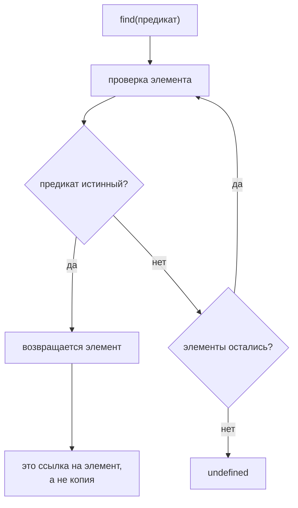

# find()

## Связь с предыдущим модулем

Предыдущий модуль показал processing pipeline:

Теперь задача меняется. Иногда pipeline не должен строить новый список или summary. Иногда нужно найти один конкретный test case и принять решение по нему.

## Главный вопрос

> Как найти один element в array?

Ответ этой главы: использовать `find()`.

## Предварительные требования

Для этой главы нужно понимать:

* что array хранит ordered elements;
* что callback может проверять condition;
* что test case object может иметь поля `id`, `title`, `status`, `priority`;
* что `filter()` возвращает subset array.

Не требуется заново изучать `map()`, `filter()` или `reduce()`. В этой главе фокус только на поиске одного element.

## Цели обучения

После главы вы будете понимать:

* зачем существует `find()`;
* как `find()` проверяет elements;
* что возвращает `find()`;
* что происходит, если совпадение не найдено;
* почему `find()` отличается от `filter()`;
* как применять `find()` в CI validation.

## Мотивация

Есть test case catalog:

```javascript
const testCases = [
  { id: 'T-1', title: 'login smoke', status: 'passed', priority: 'high' },
  { id: 'T-2', title: 'create order', status: 'failed', priority: 'high' },
  { id: 'T-3', title: 'pay order', status: 'passed', priority: 'medium' },
  { id: 'T-4', title: 'logout smoke', status: 'skipped', priority: 'low' },
];
```

CI получил failure для `T-2`. Нужно найти именно этот test case, чтобы показать его title и priority.

Нужна операция:

## Теория

### Первый подходящий элемент

`find()` проходит по array и возвращает первый элемент, для которого callback вернул `true`.

```javascript
const found = array.find(function (element, index) {
  return condition;
});
```

Если совпадение найдено, результат — сам элемент. Если не найдено — `undefined`.

Отличие от `filter()` из главы 52 в двух вещах сразу: возвращается **один элемент**, а не массив, и обход прекращается на первом совпадении.

### `undefined` вместо пустого результата

Это главная практическая особенность метода. `filter()` при отсутствии совпадений вернёт пустой массив, а `find()` — `undefined`:

```javascript
const item = items.find((o) => o.id === 99);
item.title;   // TypeError: Cannot read properties of undefined
```

Обращение к свойству без проверки даёт ошибку, причём в строке, которая сама по себе выглядит безобидно. Поэтому результат `find()` почти всегда проверяют:

```javascript
const item = items.find((o) => o.id === expectedId);
if (!item) throw new Error(`Тест-кейс ${expectedId} не найден`);
```

Явная ошибка с понятным текстом лучше, чем падение на чтении свойства тремя строками ниже.

### `find()` и `findIndex()`

Когда нужна позиция, а не элемент, существует парный метод:

| Метод | Нашёл | Не нашёл |
| --- | --- | --- |
| `find()` | элемент | `undefined` |
| `findIndex()` | индекс | `-1` |

Значение `-1` тоже требует проверки: как индекс оно выглядит правдоподобно, но означает отсутствие.

Поиск останавливается на первом совпадении:



## Внутренний механизм

### Концептуальные шаги

1. взять элемент по текущему индексу;
2. вызвать callback с элементом и его индексом;
3. если результат истинный — вернуть **элемент** и прекратить обход;
4. если ложный — перейти к следующему индексу;
5. если элементы закончились — вернуть `undefined`.

Как только `find()` нашёл первый подходящий элемент, дальнейшие элементы уже не нужны для ответа.

### Ранний выход проверяется

Это не теоретическое свойство: на массиве из трёх элементов, где подходит второй, callback вызовется ровно **два** раза. Третий элемент не будет просмотрен вовсе.

Отсюда практическое следствие для предикатов с побочными эффектами: если в callback есть запись в журнал или счётчик, он выполнится не для всех элементов. Предикат должен отвечать на вопрос и ничего больше не делать.

### Возвращается ссылка, а не копия

`find()` отдаёт сам элемент исходного массива:

```javascript
const found = items.find((o) => o.ok);
found.id = 99;   // изменён объект внутри items
```

То же свойство, что у `filter()` и `map()`: новый результат не означает новых объектов. Если найденный элемент нужно изменить независимо, его копируют явно.

## Главная ментальная модель

Главная модель этой главы: **первый подходящий элемент**.

`find()` отвечает на вопрос: «Где первый элемент, который подходит?»

Четыре похожих метода удобно различать по вопросу, на который каждый отвечает:

| Метод | Вопрос | Результат |
| --- | --- | --- |
| `find()` | где первый подходящий? | элемент или `undefined` |
| `findIndex()` | на какой позиции первый подходящий? | индекс или `-1` |
| `filter()` | какие подходят? | массив |
| `some()` | есть ли хоть один? | `true` / `false` |

## Практические примеры

Примеры находятся в:

```text
examples/01-javascript/chapter-55/
```

Запуск:

```bash
node examples/01-javascript/chapter-55/01-find-by-id.js
node examples/01-javascript/chapter-55/02-find-failed.js
node examples/01-javascript/chapter-55/03-find-missing.js
node examples/01-javascript/chapter-55/04-find-high-priority.js
node examples/01-javascript/chapter-55/05-qa-gate.js
```

## Примеры Automation QA

Найти failed test для отчета:

```javascript
const failedTest = testCases.find(function (testCase) {
  return testCase.status === 'failed';
});
```

Найти test by id:

```javascript
const targetTest = testCases.find(function (testCase) {
  return testCase.id === 'T-2';
});
```

Такой код хорошо подходит для validation steps, где нужен один known test case.

## Распространённые мифы

**Миф: `find()` возвращает массив из одного элемента.**
Он возвращает сам элемент. Массив даёт `filter()`.

**Миф: при отсутствии совпадения вернётся пустое значение, с которым можно работать.**
Вернётся `undefined`, и обращение к свойству даст `TypeError`.

**Миф: callback вызывается для всех элементов.**
Обход прекращается на первом совпадении: на массиве из трёх элементов может быть два вызова.

**Миф: `findIndex()` при неудаче вернёт `undefined`.**
Он вернёт `-1` — значение, которое выглядит как индекс и требует проверки.

**Миф: найденный элемент — копия.**
Это ссылка на элемент исходного массива; его изменение видно в оригинале.

## Частые вопросы

**Как отличить «не найдено» от «найдено, но пустое»?**
Проверять сам результат на `undefined`, а не его свойства.

**Что использовать, если нужна позиция?**
`findIndex()`, помня про `-1` как признак отсутствия.

**Что выбрать, если подходящих может быть несколько?**
`filter()`, если нужны все; `find()` — только если важен именно первый.

**Почему счётчик внутри предиката показал меньше вызовов?**
Из-за раннего выхода. Предикат не должен иметь побочных эффектов.

**Как безопасно работать с результатом?**
Проверить и выбросить понятную ошибку, если элемент не найден.

## Проверьте себя

1. Что вернёт `find()`, если совпадений нет, и чем это опасно?
2. Сколько раз вызовется callback, если подходит второй из трёх элементов?
3. Чем `findIndex()` отличается от `find()` при неудаче?
4. Почему предикат не должен иметь побочных эффектов?
5. Когда выбрать `filter()` вместо `find()`?

## Распространённые ошибки

### Ошибка 1. Ожидать array

`find()` возвращает один element или `undefined`, а не array.

### Ошибка 2. Не проверять `undefined`

Если element не найден, попытка читать property может привести к runtime error.

### Ошибка 3. Использовать `find()` там, где нужны все совпадения

Если нужны все matching elements, это другая задача.

## Краткие итоги

`find()` нужен, когда нужно найти один element.

Он:

* проверяет elements по condition;
* возвращает первый matching element;
* возвращает `undefined`, если ничего не найдено;
* хорошо подходит для поиска test case by id или первого failed test.

## Переход к следующей главе

Теперь мы умеем найти один matching test case.

Следующий вопрос:

> Как проверить, есть ли хотя бы один matching test case?

Эта задача ведет к `some()`.

Практика:

```text
practice/01-javascript/55-find.md
```

Решения:

```text
solutions/01-javascript/55-find.md
```
