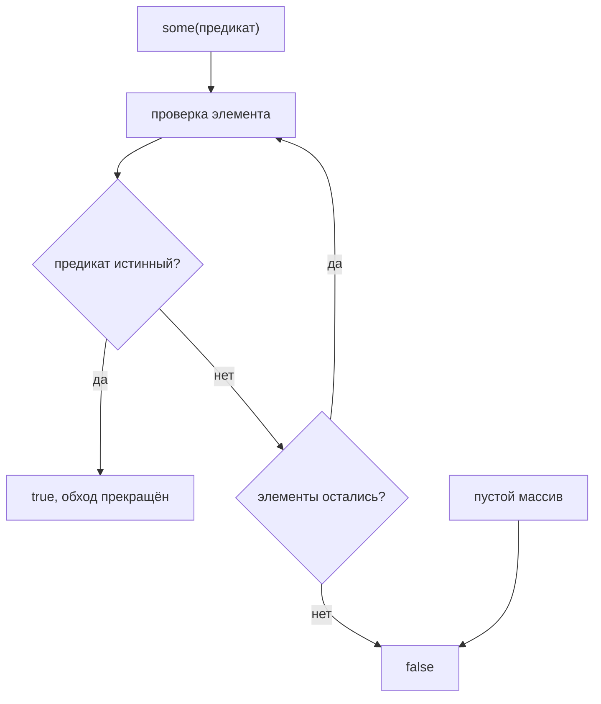

# Метод `some()`

## Связь с предыдущей главой

Предыдущая глава объяснила `find()`.

Главная модель была такой: найти первый matching element.

Но иногда сам element не нужен. CI gate часто спрашивает проще: "Есть ли хотя бы один failed test?"

## Главный вопрос

> Как проверить, что хотя бы один элемент подходит под условие?

Ответ этой главы: использовать `some()`.

## Предварительные требования

Для этой главы нужно понимать:

* что `find()` возвращает element или `undefined`;
* что Boolean result используется в decision logic;
* что test cases имеют `status` и `priority`.

Не требуется заново изучать transformation pipeline. Здесь фокус на Boolean decision.

## Цели обучения

После главы вы будете понимать:

* зачем существует `some()`;
* что означает "at least one match";
* что возвращает `some()`;
* чем `some()` отличается от `find()`;
* как использовать `some()` для QA gating logic.

## Мотивация

Есть test cases:

```javascript
const testCases = [
  { id: 'T-1', title: 'login smoke', status: 'passed', priority: 'high' },
  { id: 'T-2', title: 'create order', status: 'failed', priority: 'high' },
  { id: 'T-3', title: 'pay order', status: 'passed', priority: 'medium' },
  { id: 'T-4', title: 'logout smoke', status: 'skipped', priority: 'low' },
];
```

Перед merge нужно понять: есть ли failed tests?

Нужен не сам failed test, а ответ:

## Теория

### Вопрос о наличии хотя бы одного

`some()` отвечает на вопрос «есть ли хотя бы один подходящий элемент?»

```javascript
const hasMatch = array.some(function (element, index) {
  return condition;
});
```

Результат — всегда булево значение, независимо от того, что вернул предикат: проверяется истинность значения, а наружу выходит `true` или `false`.

### Отличие от `find()` и `filter()`

Все три метода принимают предикат, но отвечают на разные вопросы:

| Метод | Вопрос | Результат |
| --- | --- | --- |
| `some()` | есть ли хоть один? | `true` / `false` |
| `find()` | где первый подходящий? | элемент или `undefined` |
| `filter()` | какие подходят? | массив |

Практическое правило: если результат нужен только для условия в `if`, берут `some()` — он выражает намерение точнее и не заставляет читателя думать о том, что делать с найденным элементом.

Запись `filter(...).length > 0` даёт тот же ответ, но просматривает весь массив и создаёт лишний массив по пути.

### Пустой массив даёт `false`

На пустом массиве `some()` возвращает `false`: подходящих элементов нет, потому что нет никаких.

Это согласуется со здравым смыслом и противоположно поведению `every()` из следующей главы — там пустой массив даёт `true`.

`some()` ищет подтверждение и сразу выходит:



## Внутренний механизм

### Концептуальные шаги

1. взять элемент по текущему индексу;
2. вызвать предикат;
3. если результат истинный — немедленно вернуть `true`;
4. если ложный — перейти к следующему элементу;
5. если элементы закончились — вернуть `false`.

Метод может остановиться на первом совпадении, потому что дальнейшие элементы уже не изменят ответ.

### Ранний выход измерим

На массиве `[1, 2, 3]` с условием «больше единицы» предикат вызывается ровно **два** раза: первый элемент не подошёл, второй подошёл, третий не просматривался.

Как и у `find()`, отсюда следует требование к предикату: он отвечает на вопрос и не выполняет побочных действий, иначе часть элементов останется необработанной.

### Связь с `every()`

`some()` и `every()` выражаются друг через друга через отрицание:

```javascript
array.every((x) => ok(x)) === !array.some((x) => !ok(x));
```

Проверено: обе части дают одинаковый результат. Знать это полезно не ради экономии, а ради чтения чужого кода — конструкция `!list.some(...)` встречается часто и означает «ни одного такого нет».

## Главная ментальная модель

Главная модель этой главы: **хотя бы одно совпадение**.

Вопрос: «Есть ли хотя бы один?»

Полезная формулировка для выбора: `some()` ищет **подтверждение** и останавливается, как только его нашёл. `every()` из следующей главы ищет **опровержение** и останавливается на первом нарушении.

## Практические примеры

Примеры находятся в:

```text
examples/01-javascript/chapter-56/
```

Запуск:

```bash
node examples/01-javascript/chapter-56/01-has-failed.js
node examples/01-javascript/chapter-56/02-has-high-priority.js
node examples/01-javascript/chapter-56/03-no-match.js
node examples/01-javascript/chapter-56/04-ci-gate.js
node examples/01-javascript/chapter-56/05-common-mistakes.js
```

## Примеры Automation QA

Контрольная точка CI:

```javascript
const hasFailedTests = testCases.some(function (testCase) {
  return testCase.status === 'failed';
});
```

Решение:

```javascript
if (hasFailedTests) {
  console.log('Block merge');
}
```

`some()` делает условие читаемым: решение зависит от наличия хотя бы одного подходящего теста.

### Остановка на первом совпадении

`some()` прекращает обход, как только предикат вернул истину. Для проверки
набора из трёхсот результатов это разница между одним сравнением и тремя
сотнями.

```javascript
// Читается так же, но обходит весь массив и создаёт лишний.
const hasFailed = testCases.filter(item => item.status === 'failed').length > 0;
```

Разница не только в скорости: `filter` сообщает «сколько», `some` — «есть ли».
Вопрос стоит задавать тот, на который нужен ответ.

### Пустой массив даёт `false`

```javascript
console.log([].some(item => item.status === 'failed'));   // false
```

Это то, чего ждёшь, — но у зеркального `every()` поведение противоположное.
Пустой список результатов в контрольной точке CI означает не «всё прошло», а
«тесты не запускались», и различать эти случаи должен отдельный признак.

## Распространённые мифы

**Миф: `some()` возвращает найденный элемент.**
Он возвращает булево значение. Элемент даёт `find()`.

**Миф: предикат вызывается для всех элементов.**
Обход прекращается на первом совпадении.

**Миф: `filter(...).length > 0` эквивалентен `some()`.**
Ответ тот же, но просматривается весь массив и создаётся лишний.

**Миф: на пустом массиве `some()` вернёт `true`.**
Он вернёт `false`: подходящих элементов нет.

**Миф: результат зависит от того, что именно вернул предикат.**
Проверяется истинность, а наружу выходит строго `true` или `false`.

## Частые вопросы

**Когда выбрать `some()`, а когда `find()`?**
`some()` — если нужен только факт наличия; `find()` — если нужен сам элемент.

**Как проверить, что подходящих нет вовсе?**
Отрицанием: `!array.some(predicate)`.

**Почему `some()` дешевле, чем `filter()` с проверкой длины?**
Он останавливается на первом совпадении и не создаёт новый массив.

**Что вернёт `some()` на пустом массиве?**
`false`.

**Можно ли в предикате логировать?**
Нежелательно: из-за раннего выхода часть элементов не будет обработана.

## Проверьте себя

1. Какой тип результата у `some()` и зависит ли он от значения, возвращённого предикатом?
2. Сколько раз вызовется предикат на `[1, 2, 3]` при условии «больше единицы»?
3. Почему `filter(...).length > 0` хуже, чем `some()`?
4. Что возвращает `some()` на пустом массиве?
5. Как выразить «ни одного такого нет»?

### Ответы

1. Результат всегда булев: `true` или `false`. Значение предиката приводится к булеву, а наружу отдаётся именно `true` или `false`.
2. Два: перебор останавливается на первом подошедшем элементе.
3. `filter()` обходит весь массив и создаёт новый, а `some()` останавливается на первом совпадении. Кроме того, `some()` прямо выражает намерение — «есть ли хотя бы один».
4. `false`. Ни одного элемента нет, значит и подходящего нет.
5. Отрицанием: `!items.some(predicate)`. Читается как «ни один элемент не подходит».

## Распространённые ошибки

### Ошибка 1. Ожидать найденный объект

`some()` отвечает на вопрос «есть ли такой», а не возвращает тестовый случай.

### Ошибка 2. Использовать `some()` для подсчета

`some()` отвечает только да/нет.

### Ошибка 3. Забыть `return`

Без `return` предикат не даёт результата условия.

## Краткие итоги

`some()` проверяет, есть ли хотя бы одно совпадение, и поэтому хорошо подходит для условий прохода в CI.

## Переход к следующей главе

Теперь мы умеем проверять "есть ли хотя бы один".

Следующий вопрос:

> Как проверить, что все элементы подходят под условие?

Эта задача ведет к `every()`.

Практика:

```text
practice/01-javascript/56-some.md
```

Решения:

```text
solutions/01-javascript/56-some.md
```
