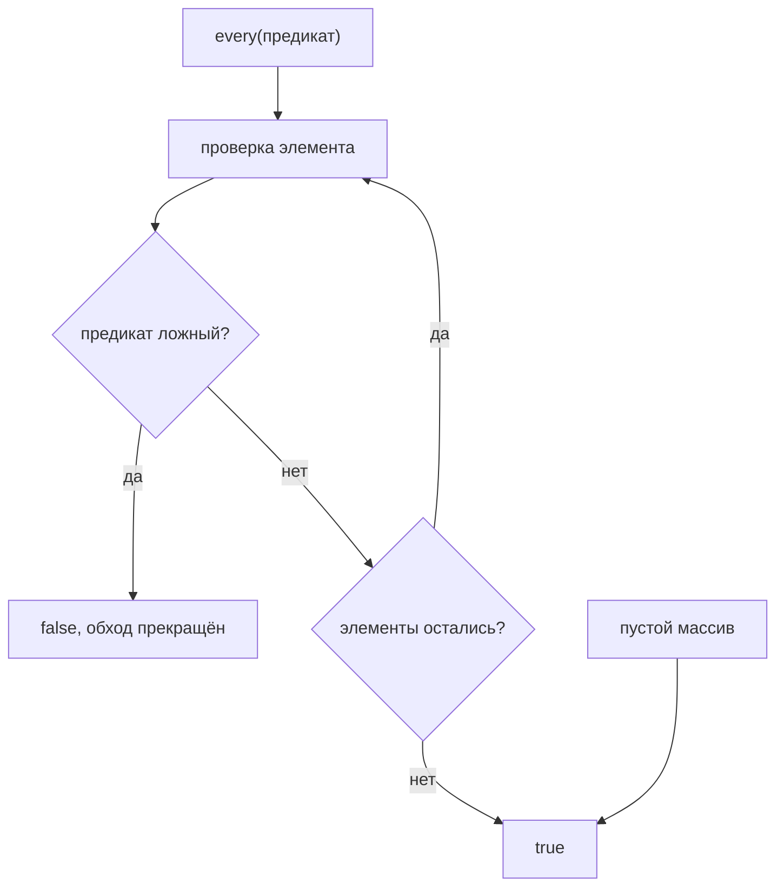

# Метод `every()`

## Связь с предыдущей главой

Предыдущая глава объяснила `some()`: проверку "есть ли хотя бы один match".

Для CI gate иногда этого недостаточно. Вопрос может быть строже: "Все ли tests готовы к запуску?"

## Главный вопрос

> Как проверить, что все элементы подходят под условие?

Ответ этой главы: использовать `every()`.

## Предварительные требования

Для этой главы нужно понимать:

* что `some()` отвечает на Boolean question;
* что QA gate может требовать строгую проверку всех test cases;
* что test cases имеют поля `status` и `priority`.

Не требуется изучать новые pipeline methods. Здесь фокус на rule: all must match.

## Цели обучения

После главы вы будете понимать:

* зачем существует `every()`;
* что означает "all match";
* что возвращает `every()`;
* чем `every()` отличается от `some()`;
* как использовать `every()` для validation rules.

## Мотивация

Есть test cases:

```javascript
const testCases = [
  { id: 'T-1', title: 'login smoke', status: 'passed', priority: 'high' },
  { id: 'T-2', title: 'create order', status: 'failed', priority: 'high' },
  { id: 'T-3', title: 'pay order', status: 'passed', priority: 'medium' },
  { id: 'T-4', title: 'logout smoke', status: 'skipped', priority: 'low' },
];
```

Перед release нужно проверить: все ли tests завершились passed?

Нужна операция:

## Теория

### Вопрос о всех элементах

`every()` проверяет, выполняется ли условие для всех элементов.

```javascript
const allMatch = array.every(function (element, index) {
  return condition;
});
```

Результат — булево значение. Как и у `some()`, проверяется истинность возвращённого значения, а наружу выходит строго `true` или `false`.

### Метод ищет нарушение, а не совпадение

Это ключ к пониманию его работы. `every()` не пытается подтвердить правило на всех элементах — он ищет **первый контрпример** и останавливается на нём.

На массиве `[1, 2, 3]` с условием «больше единицы» предикат вызывается ровно **один** раз: первый же элемент нарушает правило, и ответ известен.

Отсюда зеркальность с предыдущей главой:

| Метод | Что ищет | Когда останавливается |
| --- | --- | --- |
| `some()` | подтверждение | на первом совпадении |
| `every()` | опровержение | на первом нарушении |

### Пустой массив даёт `true`

Здесь поведение противоречит интуиции, и об этом стоит знать заранее:

```javascript
[].every(() => false);   // true
```

Даже с заведомо ложным предикатом результат — `true`. Причина в формулировке: «все элементы удовлетворяют условию» истинно, когда нарушающих элементов нет, а в пустом массиве их нет.

В тестах это даёт реальный дефект. Проверка «все тест-кейсы прошли» на пустом списке пройдёт успешно — хотя прогон не выполнил ни одного теста. Поэтому перед таким утверждением обычно проверяют, что список вообще непуст.

`every()` ищет нарушение, а не совпадение:



## Внутренний механизм

### Концептуальные шаги

1. взять элемент по текущему индексу;
2. вызвать предикат;
3. если результат ложный — немедленно вернуть `false`;
4. если истинный — перейти к следующему элементу;
5. если элементы закончились без нарушений — вернуть `true`.

Обратите внимание на порядок: выход по ложному результату, а `true` возвращается только после полного обхода. Именно поэтому пустой массив даёт `true` — цикл завершается, не встретив нарушений.

### Предикат без побочных эффектов

Как и в двух предыдущих главах, ранний выход означает, что предикат выполняется не для всех элементов. На массиве из сотни элементов при нарушении в первом будет ровно один вызов.

Любая логика, рассчитывающая на обработку всех элементов, в предикат не помещается.

### Выражение через `some()`

Два метода связаны отрицанием:

```javascript
array.every((x) => ok(x)) === !array.some((x) => !ok(x));
```

Читается это как «все подходят» ⟷ «ни один не нарушает». Обе записи встречаются в реальном коде, и понимать нужно обе.

## Главная ментальная модель

Главная модель этой главы: **все должны подойти**.

Вопрос: «Все ли подходят?»

Полезно запомнить пару целиком, включая поведение на пустом массиве:

| | `some()` | `every()` |
| --- | --- | --- |
| вопрос | есть ли хоть один? | все ли подходят? |
| ищет | совпадение | нарушение |
| пустой массив | `false` | `true` |
| результат | булево значение | булево значение |

Строка про пустой массив — та, из-за которой чаще всего появляются ложно проходящие проверки.

## Практические примеры

Примеры находятся в:

```text
examples/01-javascript/chapter-57/
```

Запуск:

```bash
node examples/01-javascript/chapter-57/01-all-passed.js
node examples/01-javascript/chapter-57/02-all-have-priority.js
node examples/01-javascript/chapter-57/03-release-gate.js
node examples/01-javascript/chapter-57/04-empty-array.js
node examples/01-javascript/chapter-57/05-common-mistakes.js
```

## Примеры Automation QA

Контрольная точка выпуска:

```javascript
const allPassed = testCases.every(function (testCase) {
  return testCase.status === 'passed';
});
```

Проверка метаданных:

```javascript
const allHavePriority = testCases.every(function (testCase) {
  return testCase.priority !== undefined;
});
```

`every()` хорошо выражает строгие правила: все тесты обязаны удовлетворять условию.

### Пустой массив даёт `true`

```javascript
console.log([].every(item => item.status === 'passed'));   // true
```

Утверждение «все элементы подходят» для пустого списка истинно по определению.
В контрольной точке выпуска это опаснее, чем кажется: набор, который не
запустился, отчитается как полностью успешный.

Поэтому проверка обычно состоит из двух условий:

```javascript
const ready = testCases.length > 0
  && testCases.every(item => item.status === 'passed');
```

### Остановка на первом несовпадении

`every()` прекращает обход, как только предикат вернул ложь. Это делает его
дешёвым для больших наборов, но означает и другое: он не сообщает, **сколько**
элементов нарушили правило и какие именно.

Когда отчёт должен перечислить нарушителей, нужен `filter`:

```javascript
const missingPriority = testCases.filter(item => item.priority === undefined);
```

`every` отвечает «можно ли выпускать», `filter` — «что чинить».

## Распространённые мифы

**Миф: на пустом массиве `every()` вернёт `false`.**
Он вернёт `true` даже с заведомо ложным предикатом: нарушающих элементов нет.

**Миф: `every()` проверяет все элементы.**
Он останавливается на первом нарушении: при нарушении в первом элементе будет один вызов.

**Миф: `every()` и `some()` — независимые методы.**
Они выражаются друг через друга отрицанием.

**Миф: проверка «все тесты прошли» надёжна сама по себе.**
На пустом списке она пройдёт. Сначала убеждаются, что список непуст.

**Миф: результат равен тому, что вернул предикат.**
Проверяется истинность, результат всегда булев.

## Частые вопросы

**Почему проверка прошла, хотя тестов не было?**
`every()` на пустом массиве возвращает `true`. Нужна отдельная проверка непустоты.

**Сколько вызовов предиката будет при нарушении в середине?**
Столько, сколько элементов до нарушения включительно.

**Как записать «ни один не нарушает» через `some()`?**
`!array.some((x) => !ok(x))`.

**Что выбрать для проверки «хотя бы один упал»?**
`some()` — он выражает это напрямую.

**Можно ли считать элементы внутри предиката?**
Нет: из-за раннего выхода счёт будет неполным.

## Проверьте себя

1. Что вернёт `[].every(() => false)` и почему?
2. Что ищет `every()` — совпадение или нарушение?
3. Сколько вызовов предиката будет на `[1, 2, 3]` при условии «больше единицы»?
4. Как выразить `every()` через `some()`?
5. Какую дополнительную проверку нужно делать перед утверждением «все прошли»?

### Ответы

1. `true`. Нарушений нет, потому что нет и элементов, — это соглашение языка, а не ошибка.
2. Нарушение: перебор останавливается на первом элементе, который не удовлетворяет условию.
3. Один: первый же элемент условию не удовлетворяет, и перебор прекращается.
4. `items.every(p)` равнозначно `!items.some((x) => !p(x))` — «нет ни одного нарушения».
5. Что массив не пустой. Иначе утверждение «все проверки прошли» окажется истинным при нуле проверок.

## Распространённые ошибки

### Ошибка 1. Путать `every()` и `some()`

`some()` спрашивает "есть ли хотя бы один", `every()` спрашивает "все ли".

### Ошибка 2. Ожидать список неподходящих тестов

`every()` сообщает результат проверки, а не список нарушителей.

### Ошибка 3. Не понимать поведение на пустом массиве

Для пустого массива `every()` возвращает `true`, потому что нет элемента, который нарушает условие.

## Краткие итоги

`every()` нужен для строгой проверки всех элементов и хорошо подходит для условий выпуска и проверки метаданных.

## Переход к следующей главе

Теперь мы умеем проверять условия на объектах.

Следующий вопрос:

> Как проверить, что простое значение есть в массиве?

Эта задача ведет к `includes()`.

Практика:

```text
practice/01-javascript/57-every.md
```

Решения:

```text
solutions/01-javascript/57-every.md
```
