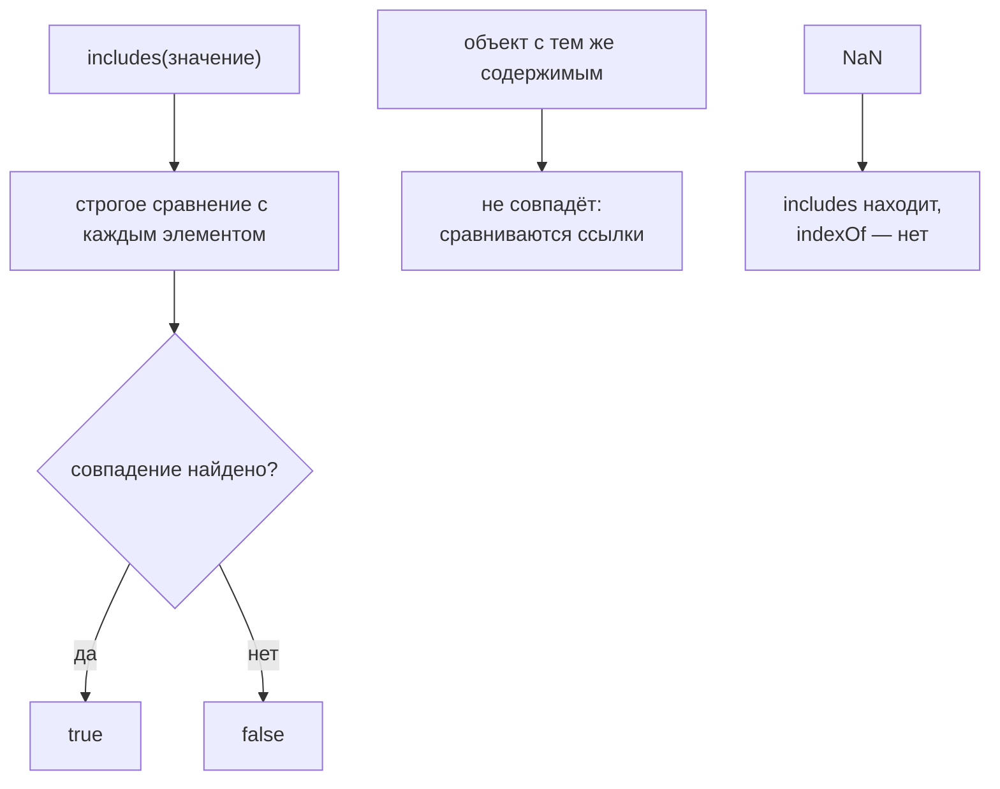

# includes()

## Связь с предыдущей главой

Предыдущая глава объяснила `every()`: строгую проверку всех objects по condition.

Теперь задача проще. Иногда нужно проверить наличие простого value в array: status, priority, tag, id из заранее подготовленного списка.

## Главный вопрос

> Как проверить, что value существует в array?

Ответ этой главы: использовать `includes()`.

## Предварительные требования

Для этой главы нужно понимать:

* что arrays могут хранить primitive значения;
* что для simple значения callback не всегда нужен;
* что status и priority могут храниться отдельными lists.

Не требуется изучать object search заново. Для objects с condition обычно используются methods из предыдущих глав.

## Цели обучения

После главы вы будете понимать:

* зачем существует `includes()`;
* как он проверяет presence value;
* что возвращает `includes()`;
* почему он особенно удобен для simple arrays;
* чем он отличается от `find()` и `some()`;
* как применять его в QA validation rules.

## Мотивация

Есть разрешенные statuses:

```javascript
const allowedStatuses = ['passed', 'failed', 'skipped'];
```

И есть test case:

```javascript
const testCase = {
  id: 'T-2',
  title: 'create order',
  status: 'failed',
  priority: 'high',
};
```

Нужно проверить: входит ли `testCase.status` в список разрешенных значения?

## Теория

### Проверка наличия значения

`includes()` — самый простой метод в этом модуле: он проверяет наличие значения в array.

```javascript
const exists = array.includes(value);
```

Результат — Boolean. Callback не нужен: вместо условия передаётся само искомое значение.

Для массивов строк, чисел и boolean это читается как прямая проверка присутствия и не требует пояснений.

### Сравнение строгое, без приведения типов

`includes()` не приводит типы. Строка и число с одинаковым написанием — разные значения:

```javascript
['1'].includes(1);   // false
```

Это отличает его от нестрогого сравнения и делает поведение предсказуемым: совпадение означает совпадение и по значению, и по типу.

### Отличие от `indexOf()`

Исторически ту же задачу решали через `indexOf()`, и разница между ними не только в форме записи:

| | `includes()` | `indexOf()` |
| --- | --- | --- |
| результат | `true` / `false` | индекс или `-1` |
| находит `NaN` | **да** | **нет** |
| пустая позиция как `undefined` | **да** | нет |

Проверено: `[NaN].includes(NaN)` даёт `true`, а `[NaN].indexOf(NaN)` — `-1`. Причина в том, что `indexOf()` использует строгое равенство, а `NaN` не равен самому себе.

Практический вывод: для вопроса «есть ли значение» берут `includes()`; `indexOf()` нужен, только когда требуется позиция.

### Объекты сравниваются по ссылке

Важное ограничение: для объектов сравнивается идентичность ссылки, а не содержимое.

```javascript
[{ id: 1 }].includes({ id: 1 });   // false — разные объекты

const item = { id: 1 };
[item].includes(item);             // true — та же ссылка
```

Поэтому для поиска объекта по признаку `includes()` не подходит — нужен `some()` из главы 56 с предикатом по полю.

Сравнение строгое, а объекты сравниваются по ссылке:



## Внутренний механизм

### Концептуальные шаги

1. взять элемент по текущему индексу;
2. сравнить его с искомым значением;
3. если совпало — вернуть `true` и прекратить обход;
4. если нет — перейти к следующему индексу;
5. если элементы закончились — вернуть `false`.

Как и у `some()`, обход прекращается на первом совпадении.

### Что считается совпадением

Сравнение почти строгое, с одним исключением: `NaN` считается равным `NaN`. Это сделано намеренно — иначе метод не мог бы ответить на вопрос «содержит ли массив `NaN`».

Пустые позиции разреженного массива воспринимаются как `undefined`, поэтому `[,].includes(undefined)` возвращает `true`, тогда как `indexOf()` их не находит.

## Главная ментальная модель

Главная модель этой главы: **значение присутствует в массиве**.

Вопрос: «Есть ли это значение в списке?»

Завершая модуль, полезно собрать все методы поиска в одну таблицу выбора:

| Нужно | Метод |
| --- | --- |
| конкретное значение есть? | `includes()` |
| есть хоть один по условию? | `some()` |
| все ли по условию? | `every()` |
| первый подходящий элемент | `find()` |
| позиция первого подходящего | `findIndex()` |
| все подходящие | `filter()` |

Первая строка отличается от остальных: только `includes()` работает со значением, всем прочим нужен предикат.

## Практические примеры

Примеры находятся в:

```text
examples/01-javascript/chapter-58/
```

Запуск:

```bash
node examples/01-javascript/chapter-58/01-status-includes.js
node examples/01-javascript/chapter-58/02-priority-includes.js
node examples/01-javascript/chapter-58/03-id-list.js
node examples/01-javascript/chapter-58/04-includes-vs-find.js
node examples/01-javascript/chapter-58/05-qa-gate.js
```

## Примеры Automation QA

Validate status:

```javascript
const allowedStatuses = ['passed', 'failed', 'skipped'];
const isValidStatus = allowedStatuses.includes(testCase.status);
```

Validate priority:

```javascript
const allowedPriorities = ['high', 'medium', 'low'];
const isValidPriority = allowedPriorities.includes(testCase.priority);
```

Такой код хорошо подходит для validation rules, где есть fixed list of allowed значения.

## Распространённые мифы

**Миф: `includes()` найдёт объект с такими же полями.**
Он сравнивает ссылки. Для поиска по признаку нужен `some()`.

**Миф: `includes()` приводит типы.**
`['1'].includes(1)` — `false`. Сравнение учитывает и тип.

**Миф: `indexOf() !== -1` полностью эквивалентен `includes()`.**
`indexOf()` не находит `NaN` и не видит пустые позиции.

**Миф: `NaN` нельзя найти в массиве.**
`includes()` его находит — это единственное отступление от строгого равенства.

**Миф: `includes()` проверяет вхождение подстроки в элементы.**
Он сравнивает элементы целиком. Одноимённый метод строк — другое дело.

## Частые вопросы

**Как проверить наличие объекта по полю?**
`some((o) => o.id === expected)` — `includes()` сравнивает ссылки.

**Когда нужен `indexOf()`?**
Когда требуется позиция элемента, а не факт наличия.

**Почему `indexOf()` не нашёл `NaN`?**
Он использует строгое равенство, а `NaN` не равен самому себе.

**Подходит ли `includes()` для поиска по части строки?**
Для элементов массива — нет. Для содержимого строки есть одноимённый метод строк.

**Что быстрее на большом массиве?**
Оба прекращают обход на первом совпадении; разница в удобстве чтения, а не в скорости.

## Проверьте себя

1. Почему `['1'].includes(1)` возвращает `false`?
2. Чем `includes()` отличается от `indexOf()` в трёх аспектах?
3. Почему `[{id: 1}].includes({id: 1})` — `false`?
4. Какое значение является исключением из строгого сравнения и зачем?
5. Какой метод выбрать для поиска объекта по полю?

## Распространённые ошибки

### Ошибка 1. Использовать callback

`includes()` не принимает callback.

### Ошибка 2. Искать object by condition

Для object conditions нужен другой method. `includes()` проверяет presence конкретного value.

### Ошибка 3. Путать allowed значения и actual значения

Проверяйте actual value against allowed list, а не наоборот.

## Краткие итоги

`includes()` проверяет presence value в simple array.

Главное: используйте его для allowed statuses, priorities и tag lists, где нужно проверить конкретное value.

## Переход к следующей главе

Теперь decision-layer module выглядит так:

Дальше раздел Arrays продолжит разбирать методы, которые помогают упорядочивать и сравнивать данные.

Практика:

```text
practice/01-javascript/58-includes.md
```

Решения:

```text
solutions/01-javascript/58-includes.md
```
