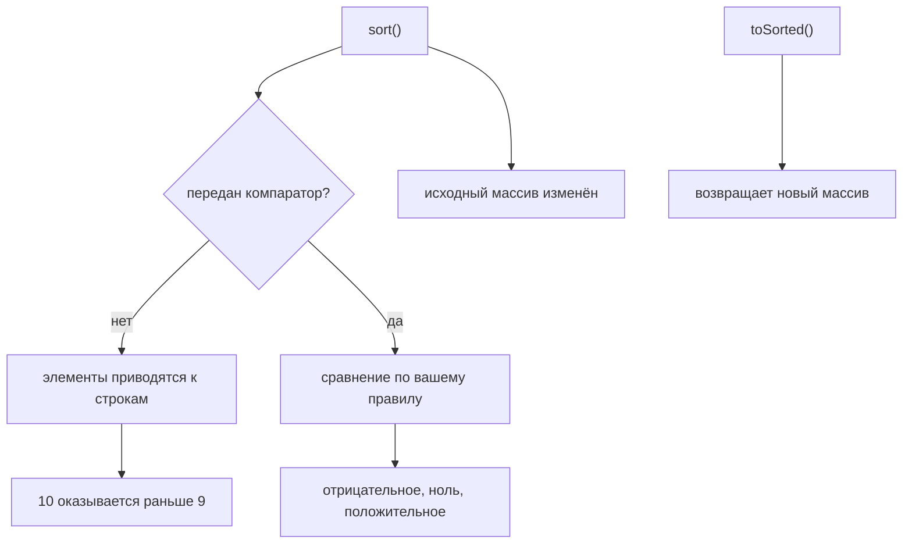

# sort()

## Связь с предыдущим модулем

Предыдущий модуль завершил decision layer:

```text
find()
some()
every()
includes()
```

Мы научились находить test cases и принимать Boolean decisions.

Теперь появляется другая задача: CI report уже содержит нужные test cases, но порядок неудобен. Failed tests могут быть в середине, high priority tests — в конце, а ids — перемешаны.

## Главный вопрос

> Как упорядочить elements в array?

Ответ этой главы: использовать `sort()`.

## Предварительные требования

Для этой главы нужно понимать:

* что array хранит ordered elements;
* что порядок elements влияет на чтение отчета;
* что test case object имеет поля `id`, `title`, `status`, `priority`;
* что array methods могут изменять исходный array.

Не требуется знать внутреннее устройство сортировки. В этой главе важна модель: ordering by rule.

## Цели обучения

После главы вы будете понимать:

* зачем существует `sort()`;
* что `sort()` упорядочивает elements по rule;
* как `sort()` влияет на current array;
* почему сортировка по умолчанию is string-based;
* зачем нужна функция сравнения;
* как применять `sort()` для приоритизации отчета.

## Мотивация

Есть test execution result:

```javascript
const testCases = [
  { id: 'T-3', title: 'pay order', status: 'passed', priority: 'medium' },
  { id: 'T-1', title: 'login smoke', status: 'passed', priority: 'high' },
  { id: 'T-4', title: 'logout smoke', status: 'skipped', priority: 'low' },
  { id: 'T-2', title: 'create order', status: 'failed', priority: 'high' },
];
```

Для анализа такой порядок неудобен. Обычно хочется видеть high priority tests выше, failed tests раньше или ids по порядку.

Нужна операция:

## Теория

### Сортировка меняет исходный массив

`sort()` упорядочивает элементы внутри array по заданному правилу.

```javascript
array.sort(compareFunction);
```

Важное поведение: `sort()` изменяет исходный массив — и возвращает **его же**, а не копию. Проверяется это прямо: `arr.sort(...) === arr` истинно.

Отсюда практическое следствие: если исходный порядок ещё нужен, сортируют копию.

```javascript
const sorted = [...testCases].sort(byId);   // исходный массив цел
```

### Без компаратора сортировка строковая

Это главная ловушка метода. Если вызвать `sort()` без функции сравнения, JavaScript приводит значения к строкам и сравнивает их посимвольно:

```javascript
[10, 9, 1, 80].sort();   // [1, 10, 80, 9]
```

Результат выглядит как ошибка, но он корректен для строкового сравнения: `'10'` меньше `'9'`, потому что символ `'1'` идёт раньше `'9'`.

Для чисел компаратор обязателен:

```javascript
[10, 9, 1, 80].sort((a, b) => a - b);   // [1, 9, 10, 80]
```

Для объектов порядок почти всегда нужно описывать явно — сравнивать их как строки бессмысленно.

### Контракт функции сравнения

Компаратор получает два элемента и возвращает число:

| Возвращено | Что означает |
| --- | --- |
| отрицательное | первый элемент идёт раньше |
| ноль | порядок этих двух не меняется |
| положительное | второй элемент идёт раньше |

Поэтому `(a, b) => a - b` даёт возрастание, а `(a, b) => b - a` — убывание. Для строк используют `localeCompare()`, который учитывает правила языка: `'ё'.localeCompare('е')` возвращает `1`, тогда как простое сравнение `'ё' < 'е'` даёт `false` — по кодам символов «ё» стоит далеко от «е».

Без компаратора порядок определяют строки:



## Внутренний механизм

### Наблюдаемая модель

Для этой главы не важен конкретный алгоритм. Достаточно наблюдаемой модели: движок многократно вызывает компаратор для пар элементов и расставляет их согласно полученным ответам.

Функция сравнения говорит JavaScript, какой элемент должен идти раньше. Всё остальное — детали реализации движка, и полагаться на них не нужно.

### Сортировка стабильна

Современный JavaScript гарантирует стабильность: элементы, которые компаратор считает равными, сохраняют исходный взаимный порядок.

```javascript
[{k:'b',i:1}, {k:'a',i:2}, {k:'b',i:3}, {k:'a',i:4}].sort(byK);
// a2, a4, b1, b3 — внутри групп порядок прежний
```

Это позволяет сортировать в несколько проходов: сначала по второстепенному признаку, затем по главному — и второстепенный порядок сохранится внутри групп.

### `undefined` всегда в конце

Элементы со значением `undefined` не передаются в компаратор и перемещаются в конец массива независимо от правила сравнения. Пустые позиции разреженного массива уходят ещё дальше — за них.

Знать это стоит, потому что такой элемент не подчиняется вашему компаратору и может выглядеть как его ошибка.

### Неизменяющая альтернатива

В современных средах есть `toSorted()` — он возвращает новый отсортированный массив, не трогая исходный:

```javascript
const sorted = testCases.toSorted(byId);   // исходный массив не изменился
```

Там, где он доступен, это более безопасный выбор по умолчанию: исчезает целый класс ошибок, связанных с неожиданным изменением общего списка.

## Главная ментальная модель

Главная модель этой главы: **упорядочивание элементов**.

`sort()` не выбирает и не преобразует тест-кейсы. Он меняет порядок — и меняет его в исходном массиве.

| Метод | Что делает с исходным массивом |
| --- | --- |
| `sort()` | изменяет порядок в нём самом |
| `toSorted()` | не трогает, возвращает новый |
| `filter()`, `map()` | не трогают, возвращают новый |

## Практические примеры

Примеры находятся в:

```text
examples/01-javascript/chapter-59/
```

Запуск:

```bash
node examples/01-javascript/chapter-59/01-sort-by-id.js
node examples/01-javascript/chapter-59/02-sort-by-priority.js
node examples/01-javascript/chapter-59/03-sort-by-status.js
node examples/01-javascript/chapter-59/04-sort-mutates.js
node examples/01-javascript/chapter-59/05-default-sort.js
```

## Примеры Automation QA

Sort by priority:

```javascript
const priorityOrder = { high: 1, medium: 2, low: 3 };

testCases.sort(function (firstTest, secondTest) {
  return priorityOrder[firstTest.priority] - priorityOrder[secondTest.priority];
});
```

Sort by id:

```javascript
testCases.sort(function (firstTest, secondTest) {
  return firstTest.id.localeCompare(secondTest.id);
});
```

Это полезно для приоритизации: сначала важные tests, затем менее важные.

## Распространённые мифы

**Миф: `sort()` возвращает новый массив.**
Он возвращает тот же массив, отсортировав его на месте. Новый даёт `toSorted()`.

**Миф: без компаратора числа сортируются по величине.**
Они приводятся к строкам: `[10, 9, 1]` станет `[1, 10, 9]`.

**Миф: компаратор должен возвращать `true` или `false`.**
Он возвращает число: отрицательное, ноль или положительное.

**Миф: равные элементы могут поменяться местами.**
Сортировка стабильна: их исходный порядок сохраняется.

**Миф: `undefined` отсортируется по вашему правилу.**
Он не передаётся в компаратор и всегда уходит в конец.

## Частые вопросы

**Как отсортировать, не меняя исходный массив?**
Через `toSorted()` или сортировкой копии: `[...arr].sort(...)`.

**Как задать убывающий порядок?**
Поменять аргументы местами: `(a, b) => b - a`.

**Чем `localeCompare()` лучше простого сравнения строк?**
Он учитывает правила языка, а не коды символов.

**Зачем нужна стабильность сортировки?**
Она позволяет сортировать в несколько проходов, сохраняя второстепенный порядок внутри групп.

**Почему результат сортировки выглядит случайным?**
Скорее всего, компаратор не возвращает число или возвращает `true`/`false`.

## Проверьте себя

1. Что вернёт `[10, 9, 1].sort()` и почему?
2. Что означают отрицательное, нулевое и положительное значение компаратора?
3. Изменяет ли `sort()` исходный массив и что он возвращает?
4. Что гарантирует стабильность сортировки?
5. Куда попадут элементы со значением `undefined`?

## Распространённые ошибки

### Ошибка 1. Ожидать новый array

`sort()` меняет current array. Если нужен исходный порядок, его нужно сохранить отдельно.

### Ошибка 2. Полагаться на сортировка по умолчанию для объектов

Для test case objects нужна функция сравнения.

### Ошибка 3. Делать функцию сравнения нечитаемой

Если порядок важен для CI, лучше явно назвать priority order или status order.

## Краткие итоги

`sort()` упорядочивает elements внутри array.

Важно запомнить:

* `sort()` задает order по rule;
* сортировка по умолчанию is string-based;
* для объектов обычно нужна функция сравнения;
* sorting порядок должен быть понятен из кода.

## Переход к следующей главе

Теперь мы умеем задавать порядок.

Следующий вопрос:

> Как быстро инвертировать текущий порядок array?

Эта задача ведет к `reverse()`.

Практика:

```text
practice/01-javascript/59-sort.md
```

Решения:

```text
solutions/01-javascript/59-sort.md
```
