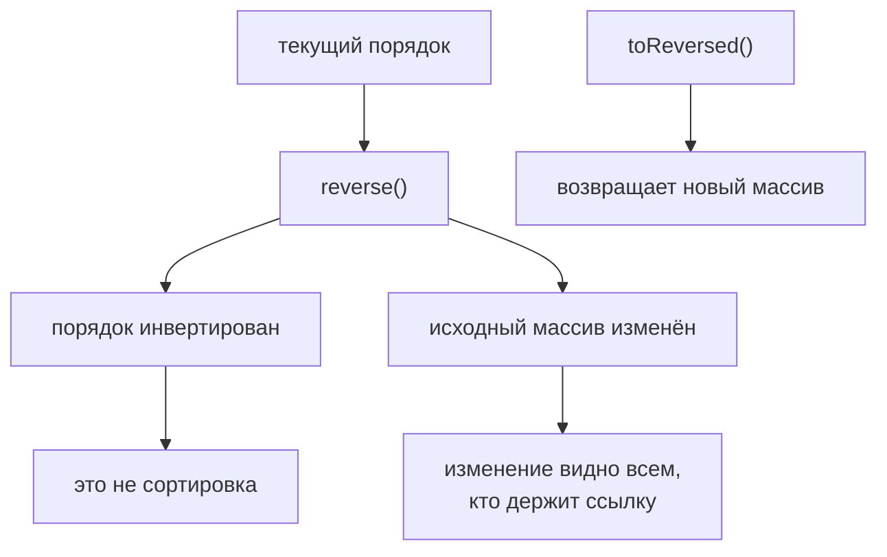

# reverse()

## Связь с предыдущей главой

Предыдущая глава объяснила `sort()`.

Главная модель была такой: `sort()` упорядочивает элементы по заданному правилу и изменяет исходный массив.

Теперь порядок уже существует. Иногда нужно не строить новый order, а просто перевернуть текущий: посмотреть последние failures первыми, прочитать execution sequence в обратном направлении или подготовить обратный rerun order.

## Главный вопрос

> Как инвертировать порядок array?

Ответ этой главы: использовать `reverse()`.

## Предварительные требования

Для этой главы нужно понимать:

* что array имеет order;
* что `sort()` может изменить этот order;
* что test execution order важен для CI analysis;
* что destructive array methods меняют исходный массив.

Не требуется знать внутреннее устройство array methods. В этой главе важна модель: inversion of текущий порядок.

## Цели обучения

После главы вы будете понимать:

* зачем существует `reverse()`;
* что значит invert array order;
* как `reverse()` влияет на current array;
* чем `reverse()` отличается от `sort()`;
* как использовать `reverse()` для обратного анализа.

## Мотивация

Есть already ordered test execution list:

```javascript
const testCases = [
  { id: 'T-1', title: 'login smoke', status: 'passed', priority: 'high' },
  { id: 'T-2', title: 'create order', status: 'failed', priority: 'high' },
  { id: 'T-3', title: 'pay order', status: 'passed', priority: 'medium' },
  { id: 'T-4', title: 'logout smoke', status: 'skipped', priority: 'low' },
];
```

Для debugging иногда удобнее начать с последнего executed test и двигаться назад.

Нужна операция:

## Теория

### Инверсия текущего порядка

`reverse()` инвертирует текущий порядок массива.

```javascript
array.reverse();
```

Важное поведение: `reverse()` изменяет исходный массив и возвращает **его же** — проверяется так же, как у `sort()`: `arr.reverse() === arr` истинно.

### `reverse()` не сортирует

Это главное, что нужно запомнить. Метод не смотрит на `id`, `status` или `priority` — он просто переворачивает то, что есть:

```javascript
[3, 1, 2].reverse();   // [2, 1, 3]
```

Результат не отсортирован и не должен быть: обратный порядок к неупорядоченному — тоже неупорядоченный.

Чтобы получить убывающий порядок, нужен `sort()` с подходящим компаратором, а не `sort()` с последующим `reverse()`. Второй вариант работает, но делает лишний проход и хуже читается.

### Неизменяющая альтернатива

Как и у сортировки, есть безопасный вариант — `toReversed()`:

```javascript
const backwards = testCases.toReversed();   // исходный массив цел
```

Там, где он доступен, его стоит предпочитать: изменение общего списка «по пути» — частая причина неожиданного поведения в соседнем коде.

Если его нет, порядок переворачивают у копии: `[...testCases].reverse()`.

`reverse()` переворачивает то, что есть сейчас:



## Внутренний механизм

### Наблюдаемая модель

Модель простая: элемент с первой позиции становится последним, со второй — предпоследним, и так далее до середины массива.

| Позиция до | Позиция после |
| --- | --- |
| 0 | последняя |
| 1 | предпоследняя |
| последняя | 0 |

Это текущий порядок, прочитанный в обратном направлении — никакого сравнения элементов не происходит.

### Изменение видно всем, кто держит ссылку

Поскольку метод меняет массив на месте, результат увидит любой код, работающий с тем же массивом:

```javascript
const plan = ['login', 'create', 'pay'];
const alias = plan;

plan.reverse();
console.log(alias);   // ['pay', 'create', 'login']
```

Переменная `alias` не участвовала в вызове, но указывает на тот же массив. Это то же свойство, что у `sort()` и `splice()`, и именно из-за него изменяющие методы требуют осторожности в общем коде.

## Главная ментальная модель

Главная модель этой главы: **переворот порядка**.

`reverse()` не сортирует — он только инвертирует уже существующий порядок.

Три изменяющих метода этого модуля удобно держать вместе:

| Метод | Что делает | Возвращает |
| --- | --- | --- |
| `splice()` | меняет середину | удалённые элементы |
| `sort()` | упорядочивает | тот же массив |
| `reverse()` | переворачивает | тот же массив |

У всех трёх есть неизменяющие альтернативы: `slice()`, `toSorted()`, `toReversed()`.

## Практические примеры

Примеры находятся в:

```text
examples/01-javascript/chapter-60/
```

Запуск:

```bash
node examples/01-javascript/chapter-60/01-reverse-basic.js
node examples/01-javascript/chapter-60/02-reverse-after-sort.js
node examples/01-javascript/chapter-60/03-reverse-mutates.js
node examples/01-javascript/chapter-60/04-debugging-order.js
node examples/01-javascript/chapter-60/05-rerun-strategy.js
```

## Примеры Automation QA

Reverse execution order:

```javascript
testCases.reverse();
```

Reverse after sorting by id:

```javascript
testCases.sort(function (firstTest, secondTest) {
  return firstTest.id.localeCompare(secondTest.id);
});

testCases.reverse();
```

Это полезно для обратного анализа: последние executed tests становятся первыми.

## Распространённые мифы

**Миф: `reverse()` сортирует по убыванию.**
Он переворачивает текущий порядок. На неупорядоченном массиве результат останется неупорядоченным.

**Миф: он возвращает новый массив.**
Возвращается тот же массив. Новый даёт `toReversed()`.

**Миф: изменение затронет только ту переменную, через которую вызвали метод.**
Массив один; его увидят все, кто держит на него ссылку.

**Миф: `sort()` с последующим `reverse()` — нормальный способ получить убывание.**
Он работает, но делает лишний проход. Убывание задаётся компаратором.

**Миф: `reverse()` смотрит на содержимое элементов.**
Он не сравнивает их вовсе.

## Частые вопросы

**Как перевернуть, не меняя исходный массив?**
`toReversed()` или `[...arr].reverse()`.

**Как получить убывающий порядок?**
`sort((a, b) => b - a)` — одним проходом вместо двух.

**Почему изменился массив в другом месте кода?**
Там та же ссылка. Изменяющие методы видны всем её держателям.

**Что вернёт `reverse()` на пустом массиве?**
Тот же пустой массив.

**Чем `reverse()` отличается от `sort()` по стоимости?**
Он не вызывает компаратор вовсе — только переставляет элементы.

## Проверьте себя

1. Что вернёт `[3, 1, 2].reverse()` и почему это не сортировка?
2. Что возвращает метод — новый массив или тот же?
3. Почему изменение видно через другую переменную?
4. Как получить убывающий порядок одним проходом?
5. Какие неизменяющие альтернативы есть у `sort()` и `reverse()`?

## Распространённые ошибки

### Ошибка 1. Ожидать новый array

`reverse()` меняет current array. Если нужен исходный порядок, его нужно сохранить отдельно.

### Ошибка 2. Думать, что `reverse()` сортирует

`reverse()` не знает, какой order "правильный". Он только инвертирует текущий порядок.

### Ошибка 3. Переворачивать shared array без причины

Если этот array нужен в исходном порядке дальше, destructive operation может сломать следующий step.

## Краткие итоги

`reverse()` инвертирует текущий порядок массива.

Важно запомнить:

* `reverse()` инвертирует текущий порядок;
* он не сортирует;
* он полезен для debugging order и reverse analysis.

## Переход к следующей главе

Теперь мы умеем управлять order:

Дальше раздел Arrays продолжит разбирать способы получать и преобразовывать данные без лишней ручной работы.

Практика:

```text
practice/01-javascript/60-reverse.md
```

Решения:

```text
solutions/01-javascript/60-reverse.md
```
