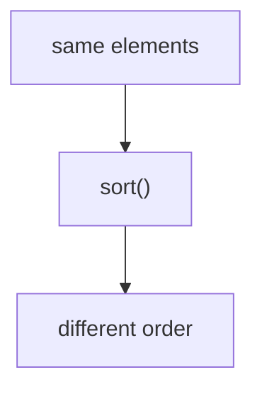
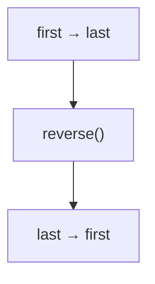
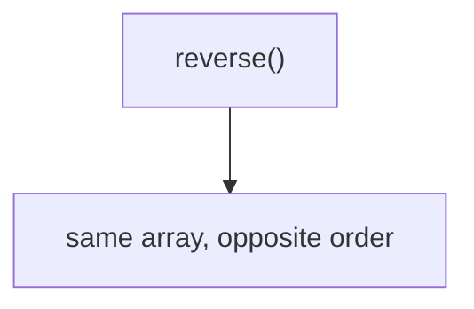
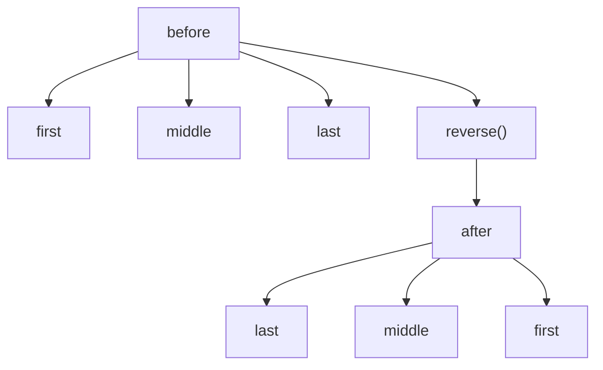
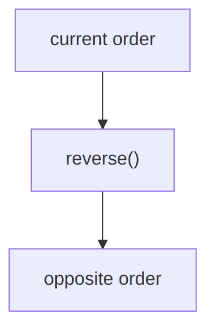
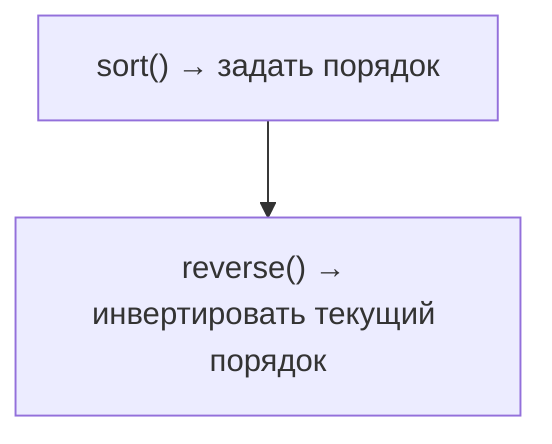

# reverse()

## Связь с предыдущей главой

Предыдущая глава объяснила `sort()`.

Главная модель была такой:



Теперь порядок уже существует. Иногда нужно не строить новый order, а просто перевернуть текущий: посмотреть последние failures первыми, прочитать execution sequence в обратном направлении или подготовить обратный rerun order.

## Главный вопрос

> Как инвертировать порядок array?

Ответ этой главы: использовать `reverse()`.

## Предварительные требования

Для этой главы нужно понимать:

* что array имеет order;
* что `sort()` может изменить этот order;
* что test execution order важен для CI analysis;
* что destructive array methods меняют исходный массив.

Не требуется знать внутреннее устройство array methods. В этой главе важна модель: inversion of текущий порядок.

## Цели обучения

После главы вы будете понимать:

* зачем существует `reverse()`;
* что значит invert array order;
* как `reverse()` влияет на current array;
* чем `reverse()` отличается от `sort()`;
* как использовать `reverse()` для обратного анализа.

## Мотивация

Есть already ordered test execution list:

```javascript
const testCases = [
  { id: 'T-1', title: 'login smoke', status: 'passed', priority: 'high' },
  { id: 'T-2', title: 'create order', status: 'failed', priority: 'high' },
  { id: 'T-3', title: 'pay order', status: 'passed', priority: 'medium' },
  { id: 'T-4', title: 'logout smoke', status: 'skipped', priority: 'low' },
];
```

Для debugging иногда удобнее начать с последнего executed test и двигаться назад.

Нужна операция:



## Теория

`reverse()` инвертирует текущий порядок массива.

Общая форма:

```javascript
array.reverse();
```

Важное поведение: `reverse()` mutates исходный массив.



`reverse()` не смотрит на `id`, `status` или `priority`. Он просто переворачивает текущий порядок.

## Внутренний механизм

Observable model:



Это текущий порядок, прочитанный в обратном направлении.

## Главная ментальная модель

Главная модель этой главы: **flipping order**.



Главное: `reverse()` не сортирует. Он только инвертирует уже существующий порядок.

## Практические примеры

Примеры находятся в:

```text
examples/01-javascript/chapter-60/
```

Запуск:

```bash
node examples/01-javascript/chapter-60/01-reverse-basic.js
node examples/01-javascript/chapter-60/02-reverse-after-sort.js
node examples/01-javascript/chapter-60/03-reverse-mutates.js
node examples/01-javascript/chapter-60/04-debugging-order.js
node examples/01-javascript/chapter-60/05-rerun-strategy.js
```

## Примеры Automation QA

Reverse execution order:

```javascript
testCases.reverse();
```

Reverse after sorting by id:

```javascript
testCases.sort(function (firstTest, secondTest) {
  return firstTest.id.localeCompare(secondTest.id);
});

testCases.reverse();
```

Это полезно для обратного анализа: последние executed tests становятся первыми.

## Распространённые ошибки

### Ошибка 1. Ожидать новый array

`reverse()` меняет current array. Если нужен исходный порядок, его нужно сохранить отдельно.

### Ошибка 2. Думать, что `reverse()` сортирует

`reverse()` не знает, какой order "правильный". Он только инвертирует текущий порядок.

### Ошибка 3. Переворачивать shared array без причины

Если этот array нужен в исходном порядке дальше, destructive operation может сломать следующий step.

## Краткие итоги

`reverse()` инвертирует текущий порядок массива.

Важно запомнить:

* `reverse()` инвертирует текущий порядок;
* он не сортирует;
* он полезен для debugging order и reverse analysis.

## Переход к следующей главе

Теперь мы умеем управлять order:



Дальше раздел Arrays продолжит разбирать способы получать и преобразовывать данные без лишней ручной работы.

Практика:

```text
practice/01-javascript/60-reverse.md
```

Решения:

```text
solutions/01-javascript/60-reverse.md
```
