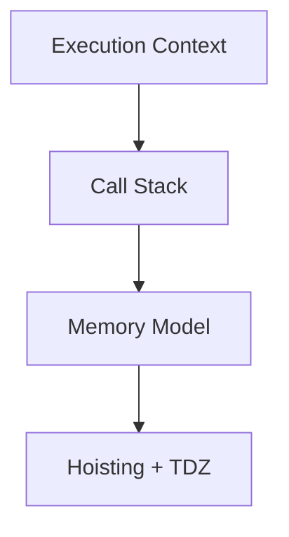
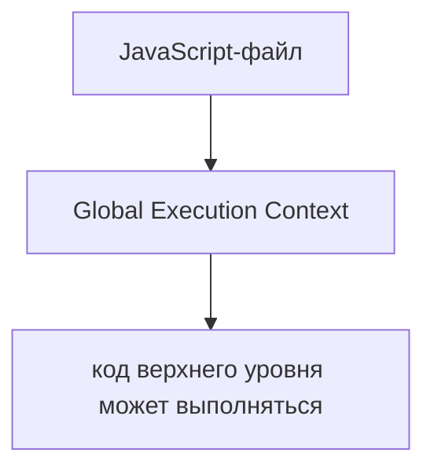
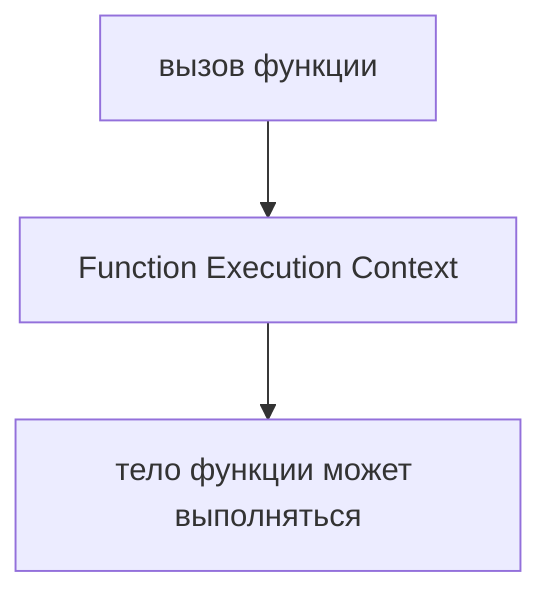
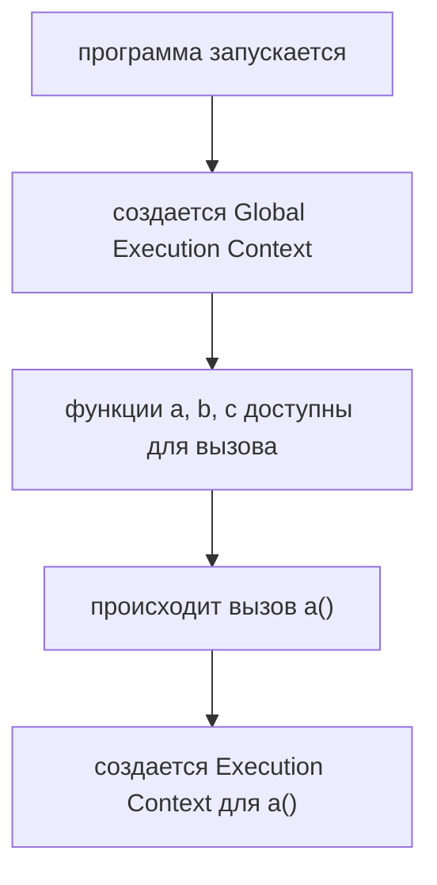
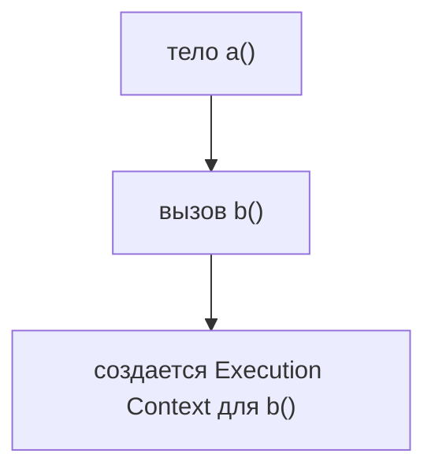
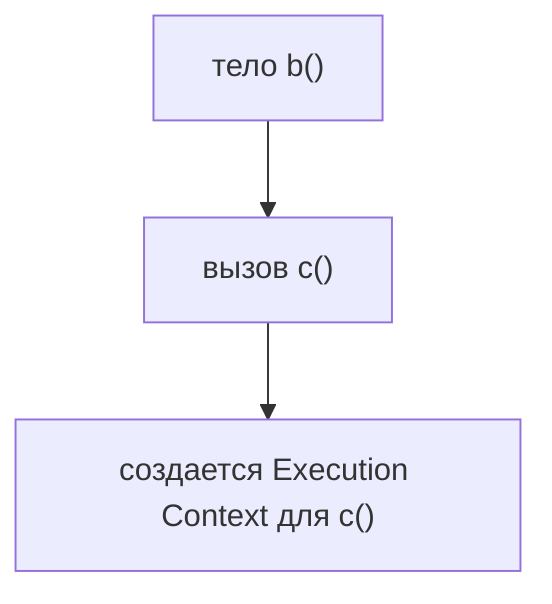
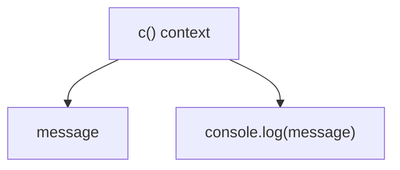
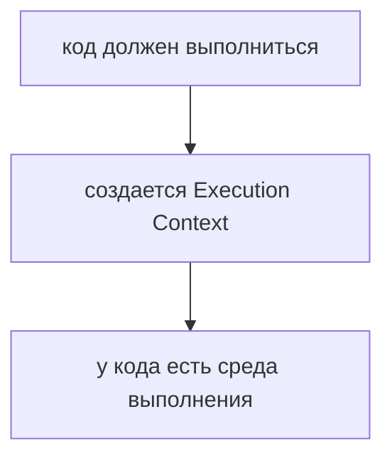
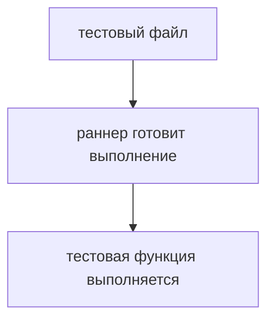
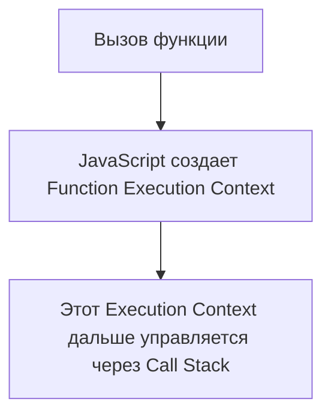

# Execution Context

## Связь с предыдущей главой

Предыдущая глава завершила работу с порядком элементов:

```text
sort()
reverse()
```

Там мы управляли порядком массива. Теперь уровень меняется: нас интересует не метод массива, а сам запуск JavaScript-кода.

Дальше модуль будет идти как одна система:



## Главный вопрос

> Как JavaScript начинает выполнять код?

Ответ этой главы: перед выполнением создается Execution Context.

## Предварительные требования

Для этой главы нужно понимать:

* что JavaScript выполняет код последовательно;
* что тело функции выполняется только после вызова;
* что переменные дают доступ к значениям;
* что раньше уже были изучены функции, переменные и объекты.

Не требуется знать внутреннее устройство конкретного движка. Эта глава строит концептуальную модель.

## Цели обучения

После главы вы будете понимать:

* зачем нужен Execution Context;
* что создается перед выполнением кода;
* чем выполнение на уровне файла отличается от выполнения функции;
* почему вызов функции создает отдельную среду выполнения;
* как эта тема готовит Call Stack.

## Мотивация

Посмотрим на простой код:

```javascript
function c() {
  const message = 'inside c';
  console.log(message);
}

function b() {
  c();
}

function a() {
  b();
}

a();
```

Видимый вывод простой:

```text
inside c
```

Но внутри JavaScript должен ответить на несколько вопросов:

* какой код выполняется на верхнем уровне;
* что такое `a`, `b` и `c`;
* когда выполнять тело функции `a`;
* где появится локальное значение `message`;
* что создать при вызове каждой функции.

Execution Context отвечает на первый слой этих вопросов.

## Теория

Execution Context — это единица запуска кода. Это среда, в которой JavaScript выполняет код.

Когда запускается файл, сначала создается глобальный Execution Context:



Когда происходит вызов функции, создается Function Execution Context:



Важно: объявление функции не означает выполнение. Тело функции начнет выполняться только после вызова.

## Внутренний механизм

Для нашего сквозного примера последовательность выглядит так:



Затем `a()` вызывает `b()`:



Затем `b()` вызывает `c()`:



Внутри `c()` появляется локальное значение:



В этой главе важно только одно: перед выполнением кода JavaScript создает единицу запуска, в которой этот код может выполняться.

## Главная ментальная модель

Главная модель главы: **единица запуска выполнения**.



Execution Context можно представить как рабочую область для выполнения кода. Это не объект, который вы создаете руками, а модель того, что JavaScript подготавливает перед выполнением.

## Примеры

Примеры находятся в:

```text
examples/01-javascript/chapter-61/
```

Запуск:

```bash
node examples/01-javascript/chapter-61/01-global-context.js
node examples/01-javascript/chapter-61/02-function-context.js
node examples/01-javascript/chapter-61/03-nested-contexts.js
node examples/01-javascript/chapter-61/04-context-per-call.js
```

Все примеры используют одну идею: `a()` вызывает `b()`, `b()` вызывает `c()`.

## Практическое использование

Execution Context нужен не для того, чтобы писать специальный синтаксис. Он нужен для чтения поведения программы.

Он помогает понять:

* почему тело функции не выполняется до вызова;
* почему локальные переменные появляются только во время выполнения функции;
* почему следующий вызов той же функции получает новую единицу запуска;
* почему ошибка внутри функции должна рассматриваться в контексте конкретного вызова.

## Использование в Automation QA

В Automation QA похожая идея видна в тестовом раннере:



Не нужно перегружать аналогию. Достаточно помнить: как тестовый раннер создает среду для выполнения теста, так JavaScript создает Execution Context для выполняемого кода.

## Распространённые ошибки

### Ошибка 1. Думать, что объявление функции сразу выполняет тело функции

Объявление делает функцию доступной. Выполнение начинается только после вызова.

### Ошибка 2. Смешивать Global Execution Context и Function Execution Context

Код верхнего уровня и тело функции выполняются в разных единицах запуска.

### Ошибка 3. Искать детали конкретного движка

В этой главе нужна концептуальная модель, а не детали устройства конкретного движка JavaScript.

## Практика

Практика находится в:

```text
practice/01-javascript/61-execution-context.md
```

Решения находятся в:

```text
solutions/01-javascript/61-execution-context.md
```

## Краткие итоги

Execution Context — это единица запуска, которую JavaScript создает перед выполнением кода.

Главное:

* выполнение файла начинается с Global Execution Context;
* вызов функции создает Function Execution Context;
* тело функции выполняется только после вызова;
* Execution Context отвечает на вопрос: где сейчас выполняется код?

## Переход к следующей главе

Теперь понятно, что вызовы функций создают новые Execution Context.



Следующий вопрос:

> Если Execution Context становится несколько, как JavaScript понимает, какой выполняется сейчас?

Ответ ведет к Call Stack.
