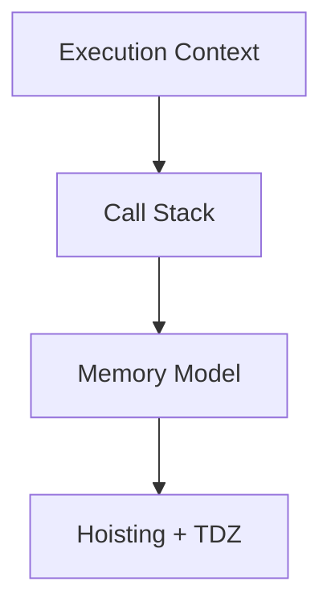
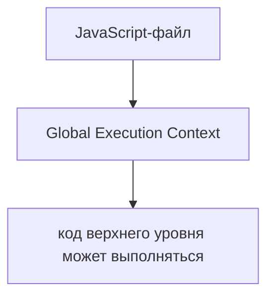
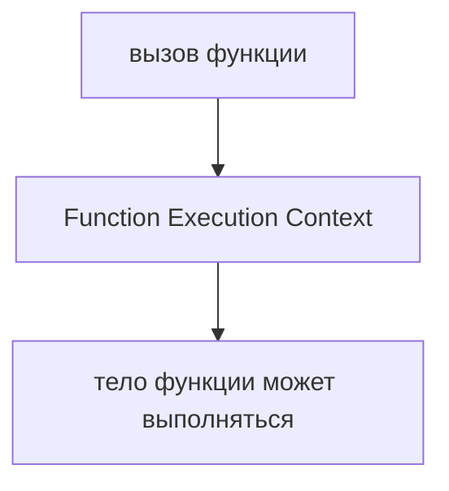
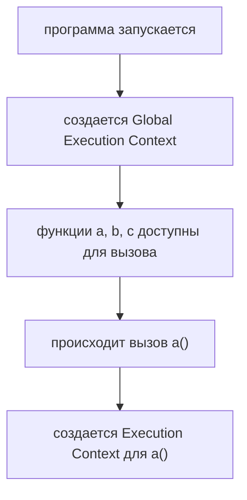
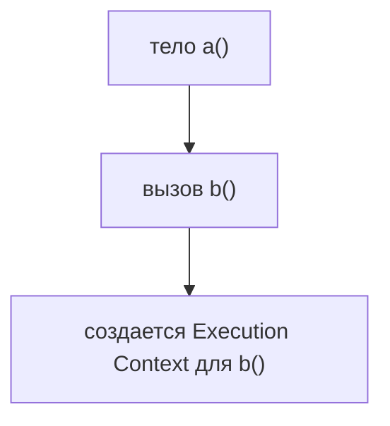
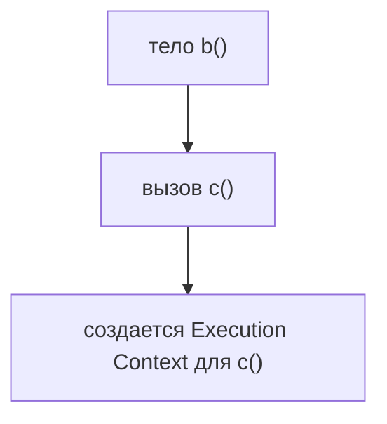

# Контекст выполнения: углублённое повторение

## Связь с предыдущей главой

Предыдущая глава завершила работу с порядком элементов:

```text
sort()
reverse()
```

Там мы управляли порядком массива. Теперь уровень меняется: нас интересует не метод массива, а сам запуск JavaScript-кода.

Дальше модуль будет идти как одна система:


```mermaid
flowchart TD
    N1["Execution Context"]
    N2["Call Stack"]
    N3["Memory Model"]
    N4["Hoisting + TDZ"]
    N1 --> N2
    N2 --> N3
    N3 --> N4
```

## Главный вопрос

> Как JavaScript начинает выполнять код?

Ответ этой главы: перед выполнением создаётся контекст выполнения.

## Предварительные требования

Для этой главы нужно понимать:

* что JavaScript выполняет код последовательно;
* что тело функции выполняется только после вызова;
* что переменные дают доступ к значениям;
* что раньше уже были изучены функции, переменные и объекты.

Не требуется знать внутреннее устройство конкретного движка. Эта глава строит концептуальную модель.

## Цели обучения

После главы вы будете понимать:

* зачем нужен Execution Context;
* что создается перед выполнением кода;
* чем выполнение на уровне файла отличается от выполнения функции;
* почему вызов функции создает отдельную среду выполнения;
* как эта тема готовит Call Stack.

## Мотивация

Посмотрим на простой код:

```javascript
function c() {
  const message = 'inside c';
  console.log(message);
}

function b() {
  c();
}

function a() {
  b();
}

a();
```

Видимый вывод простой:

```text
inside c
```

Но внутри JavaScript должен ответить на несколько вопросов:

* какой код выполняется на верхнем уровне;
* что такое `a`, `b` и `c`;
* когда выполнять тело функции `a`;
* где появится локальное значение `message`;
* что создать при вызове каждой функции.

Execution Context отвечает на первый слой этих вопросов.

## Теория

Контекст выполнения — это единица запуска кода. Это среда, в которой JavaScript выполняет код.

Когда запускается файл, сначала создаётся глобальный контекст выполнения:


```mermaid
flowchart TD
    N1["JavaScript-файл"]
    N2["Global Execution Context"]
    N3["код верхнего уровня может выполняться"]
    N1 --> N2
    N2 --> N3
```

Когда происходит вызов функции, создаётся контекст выполнения функции:


```mermaid
flowchart TD
    N1["вызов функции"]
    N2["Function Execution Context"]
    N3["тело функции может выполняться"]
    N1 --> N2
    N2 --> N3
```

Важно: объявление функции не означает выполнение. Тело функции начнет выполняться только после вызова.

## Внутренний механизм

Для нашего сквозного примера последовательность выглядит так:


```mermaid
flowchart TD
    N1["программа запускается"]
    N2["создается Global Execution Context"]
    N3["функции a, b, c доступны для вызова"]
    N4["происходит вызов a()"]
    N5["создается Execution Context для a()"]
    N1 --> N2
    N2 --> N3
    N3 --> N4
    N4 --> N5
```

Затем `a()` вызывает `b()`:


```mermaid
flowchart TD
    N1["тело a()"]
    N2["вызов b()"]
    N3["создается Execution Context для b()"]
    N1 --> N2
    N2 --> N3
```

Затем `b()` вызывает `c()`:


```mermaid
flowchart TD
    N1["тело b()"]
    N2["вызов c()"]
    N3["создается Execution Context для c()"]
    N1 --> N2
    N2 --> N3
```

Внутри `c()` появляется локальное значение: переменная, объявленная в теле функции, существует только в её контексте выполнения и исчезает вместе с ним после завершения вызова.

В этой главе важно только одно: перед выполнением кода JavaScript создает единицу запуска, в которой этот код может выполняться.

### Каждый вызов получает свою единицу запуска

Ключевое уточнение: контекст выполнения создаётся не для функции, а для **вызова**. Два вызова одной функции — две независимые единицы запуска со своими локальными значениями.

```javascript
function makeId(prefix) {
  const value = prefix + '-1';   // своя переменная в каждом вызове
  return value;
}

makeId('a');   // первый Execution Context
makeId('b');   // второй, не связанный с первым
```

Именно поэтому рекурсивный вызов не затирает значения предыдущего: у каждого уровня рекурсии свой контекст.

### Что находится внутри контекста

Для практической работы достаточно трёх составляющих:

| Составляющая | За что отвечает |
| --- | --- |
| окружение переменных | какие имена доступны и какие им сопоставлены значения |
| ссылка на внешнее окружение | где искать имя, если его нет здесь |
| значение `this` | к какому объекту относится вызов |

Вторая строка объясняет, почему функция видит переменные внешнего кода: поиск имени идёт вверх по цепочке окружений. Третья — тема отдельной главы.

### Две фазы: подготовка и выполнение

Перед тем как выполнять код, движок его подготавливает: регистрирует объявления, определяет внешнее окружение, устанавливает `this`. Только после этого начинается пошаговое выполнение.

Эта пара фаз объясняет поведение, которое иначе выглядит магией: почему функцию можно вызвать до строки её объявления, а переменную `let` — нельзя прочитать до объявления. Подробности — в главе 64.

## Главная ментальная модель

Главная модель главы: **единица запуска выполнения**.

Контекст выполнения можно представить как рабочую область для выполнения кода. Это не объект, который вы создаёте руками, а модель того, что JavaScript подготавливает перед выполнением.

## Примеры

Примеры находятся в:

```text
examples/01-javascript/chapter-61/
```

Запуск:

```bash
node examples/01-javascript/chapter-61/01-global-context.js
node examples/01-javascript/chapter-61/02-function-context.js
node examples/01-javascript/chapter-61/03-nested-contexts.js
node examples/01-javascript/chapter-61/04-context-per-call.js
```

Все примеры используют одну идею: `a()` вызывает `b()`, `b()` вызывает `c()`.

## Практическое использование

Контекст выполнения нужен не для того, чтобы писать специальный синтаксис. Он нужен для чтения поведения программы.

Он помогает понять:

* почему тело функции не выполняется до вызова;
* почему локальные переменные появляются только во время выполнения функции;
* почему следующий вызов той же функции получает новую единицу запуска;
* почему ошибка внутри функции должна рассматриваться в контексте конкретного вызова.

## Использование в Automation QA

В автоматизации тестов похожая идея видна в раннере: он создаёт окружение для каждого теста, выполняет тело теста в этом окружении и освобождает его после завершения — так же, как движок создаёт контекст выполнения для каждого вызова функции.

Не нужно перегружать аналогию. Достаточно помнить: как раннер создаёт среду для выполнения теста, так JavaScript создаёт контекст выполнения для выполняемого кода.

### Тело теста — это вызов, а верх файла — нет

```javascript
let token;                       // выполнится один раз на весь файл

test('первый', async () => {
  token = await issueToken();    // свой контекст вызова
});

test('второй', async () => {
  await useToken(token);         // видит значение из первого теста
});
```

Каждый тест получает собственный контекст выполнения, и локальные имена в нём
независимы. Но код верхнего уровня выполняется **один раз при загрузке
модуля**, и объявленная там переменная общая для всех тестов файла.

Отсюда самая частая скрытая связь между тестами: второй проходит только
потому, что перед ним отработал первый. Запуск его одного (`-g «второй»`)
падает — и выглядит это как нестабильность.

### Повтор выполняет тело заново, а модуль — нет

При повторе упавшего теста раннер снова вызывает тело: создаётся новый
контекст, локальные переменные создаются заново.

Всё, что лежало на верхнем уровне модуля, при этом сохраняет состояние от
предыдущей попытки. Поэтому подготовку данных держат внутри теста или в
фикстуре, а не рядом с импортами.

## Распространённые мифы

**Миф: контекст выполнения создаётся для функции.**
Он создаётся для каждого **вызова**. Два вызова одной функции — две независимые единицы запуска.

**Миф: объявление функции запускает её тело.**
Объявление делает функцию доступной. Выполнение начинается с вызовом.

**Миф: локальные переменные существуют всё время работы программы.**
Они живут столько, сколько живёт контекст выполнения вызова.

**Миф: контекст выполнения — это объект, который можно получить в коде.**
Это модель того, что движок подготавливает перед выполнением, а не доступная сущность.

**Миф: код верхнего уровня и тело функции выполняются в одной среде.**
Это разные единицы запуска с разными наборами локальных имён.

## Частые вопросы

**Почему рекурсия не затирает переменные?**
У каждого вызова свой контекст выполнения со своими локальными значениями.

**Как функция видит внешние переменные?**
Через ссылку на внешнее окружение: поиск имени идёт вверх по цепочке.

**Что происходит с контекстом после завершения функции?**
Он снимается, и локальные значения перестают быть доступными.

**Зачем нужны две фазы?**
Подготовка объясняет, почему часть объявлений доступна до своей строки, а часть — нет.

**Нужно ли это знание на практике?**
Да — оно объясняет поведение при чтении кода: где живут переменные и почему ошибка относится к конкретному вызову.

## Проверьте себя

1. Для чего создаётся контекст выполнения — для функции или для вызова?
2. Что происходит с локальными значениями после завершения вызова?
3. Какие три составляющие есть у контекста?
4. Почему рекурсивные вызовы не мешают друг другу?
5. Зачем движку фаза подготовки перед выполнением?

### Ответы

1. Для вызова. Одна функция, вызванная трижды, даёт три контекста.
2. Они исчезают вместе с контекстом — если только на них не ссылается замыкание.
3. Лексическое окружение с записями об именах, ссылка на внешнее окружение и значение `this`.
4. Каждый рекурсивный вызов получает свой контекст со своими параметрами и локальными именами. Общих записей между ними нет.
5. Чтобы заранее завести записи обо всех объявлениях. Благодаря этому функция доступна до своей строки, а обращение к `let` до объявления становится ошибкой, а не случайным значением.

## Распространённые ошибки

### Ошибка 1. Думать, что объявление функции сразу выполняет тело функции

Объявление делает функцию доступной. Выполнение начинается только после вызова.

### Ошибка 2. Смешивать глобальный контекст выполнения и контекст функции

Код верхнего уровня и тело функции выполняются в разных единицах запуска.

### Ошибка 3. Искать детали конкретного движка

В этой главе нужна концептуальная модель, а не детали устройства конкретного движка JavaScript.

## Практика

Практика находится в:

```text
practice/01-javascript/61-execution-context.md
```

Решения находятся в:

```text
solutions/01-javascript/61-execution-context.md
```

## Краткие итоги

Контекст выполнения — это единица запуска, которую JavaScript создаёт перед выполнением кода.

Главное:

* выполнение файла начинается с глобального контекста выполнения;
* вызов функции создаёт контекст выполнения функции;
* тело функции выполняется только после вызова;
* контекст выполнения отвечает на вопрос: где сейчас выполняется код?

## Переход к следующей главе

Теперь понятно, что вызовы функций создают новые контексты выполнения.

Следующий вопрос:

> Если контекстов становится несколько, как JavaScript понимает, какой выполняется сейчас?

Ответ ведёт к стеку вызовов.
