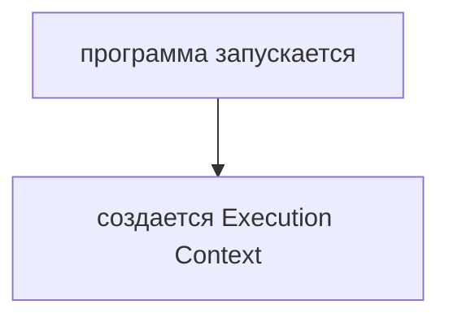
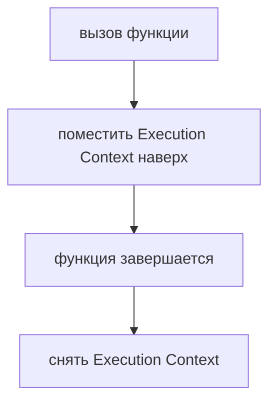
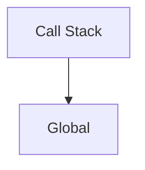
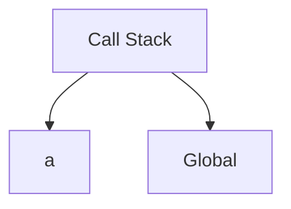
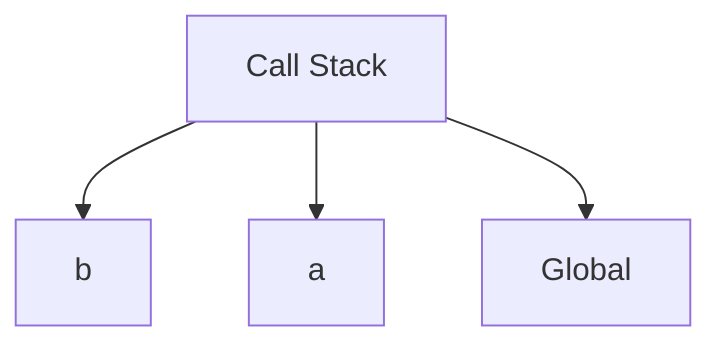
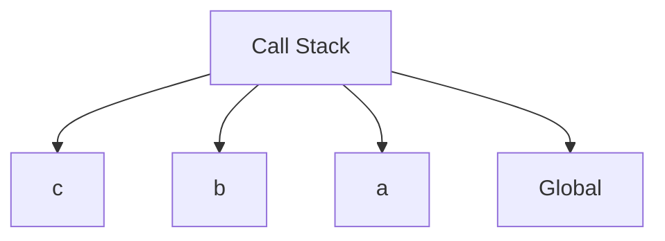

# Call Stack: углубленное повторение

## Связь с предыдущей главой

Предыдущая глава показала, что JavaScript создает Execution Context:



Но в нашем примере функции вызывают друг друга:

```javascript
a();
// a -> b -> c
```

Теперь нужно понять, как JavaScript управляет несколькими активными вызовами функций.

## Главный вопрос

> Как функции выполняются шаг за шагом?

Ответ этой главы: через Call Stack.

## Предварительные требования

Для этой главы нужно понимать:

* что вызов функции создает Function Execution Context;
* что тело функции выполняется после вызова;
* что синхронный код выполняется последовательно;
* что `a()`, `b()`, `c()` образуют цепочку вызовов.

В этой главе рассматривается только обычное последовательное выполнение вызовов функций.

## Цели обучения

После главы вы будете понимать:

* зачем нужен Call Stack;
* что происходит при входе в функцию;
* что происходит при выходе из функции;
* почему JavaScript возвращается в вызывающую функцию;
* как читать простую stack trace.

## Мотивация

Возьмем тот же код:

```javascript
function c() {
  console.log('c');
}

function b() {
  c();
  console.log('b');
}

function a() {
  b();
  console.log('a');
}

a();
```

Вывод:

```text
c
b
a
```

Вопрос:

> Как JavaScript помнит, что после `c()` нужно вернуться в `b()`, а после `b()` — в `a()`?

Для этого нужен Call Stack.

## Теория

Call Stack — это стек вызовов функций.

Когда вызывается функция, JavaScript помещает ее Execution Context наверх Call Stack.

Когда функция завершается, ее Execution Context снимается с Call Stack.



JavaScript выполняет Execution Context, который находится наверху.

Call Stack хранит Execution Context активных вызовов функций. Он не хранит сами объявления функций. Объявление функции описывает, что можно вызвать; Call Stack показывает, какой вызов выполняется сейчас и куда нужно вернуться после завершения.

## Внутренний механизм

Старт программы:



Вызов `a()`:



`a()` вызывает `b()`:



`b()` вызывает `c()`:



`c()` завершается:

`b()` завершается:

`a()` завершается:

Программа завершается, когда выполнение глобального кода закончено и синхронной работы больше не осталось.

### Порядок снятия: последний вошёл — первый вышел

Стек работает по единственному правилу: выполняется тот контекст, который лежит сверху, а снимается он раньше всех, кто лежит под ним.

Для цепочки `a()` → `b()` → `c()` состояние стека меняется так:

| Момент | Содержимое стека (сверху вниз) |
| --- | --- |
| вызван `a()` | `a`, global |
| `a()` вызвал `b()` | `b`, `a`, global |
| `b()` вызвал `c()` | `c`, `b`, `a`, global |
| `c()` завершился | `b`, `a`, global |
| всё завершилось | global |

Отсюда и ответ на вопрос «куда вернётся выполнение»: в тот контекст, который оказался сверху после снятия.

### Трассировка ошибки — это снимок стека

Стек вызовов виден каждый раз, когда программа падает. Порядок кадров в сообщении повторяет порядок в стеке: сверху — место, где ошибка возникла, ниже — те, кто до него дошёл.

```text
Error: упало в c
    at c
    at b
    at a
```

Читать такую трассировку нужно сверху вниз как «где случилось», и снизу вверх как «как сюда попали». Это основной инструмент расследования: по нему видно не только место ошибки, но и путь к нему.

### Переполнение стека

Стек ограничен по размеру. Бесконечная рекурсия исчерпывает его и даёт характерную ошибку:

```text
RangeError: Maximum call stack size exceeded
```

Глубина зависит от среды и от размера кадров — в одном из замеров она составила около девяти тысяч вложенных вызовов. Точное число знать не нужно; важно узнавать эту ошибку: она почти всегда означает рекурсию без условия выхода, а не «сложный алгоритм».

### Стек объясняет синхронность

Пока в стеке есть кадры, движок занят: он не может выполнять ничего другого. Отсюда — однопоточная модель выполнения JavaScript: длинная синхронная функция блокирует всё, включая обработку событий.

Это же объясняет, почему асинхронные операции устроены иначе: их продолжение не может просто «подождать» в стеке. Куда оно попадает и как возвращается — тема глав про event loop.

## Главная ментальная модель

Главная модель главы: **стек вызовов функций**.

Последняя вызванная функция завершается первой.

## Примеры

Примеры находятся в:

```text
examples/01-javascript/chapter-62/
```

Запуск:

```bash
node examples/01-javascript/chapter-62/01-single-call.js
node examples/01-javascript/chapter-62/02-a-b-c.js
node examples/01-javascript/chapter-62/03-return-flow.js
node examples/01-javascript/chapter-62/04-stack-trace.js
```

## Практическое использование

Call Stack помогает понимать порядок выполнения.

Практически это нужно, когда:

* вызовы функций вложены друг в друга;
* ошибка появляется внутри helper;
* нужно понять, почему вывод идет в определенном порядке;
* stack trace показывает несколько имен функций.

## Использование в Automation QA

Минимальная QA-аналогия:

Если assertion helper падает, stack trace показывает цепочку вызывающих функций. Это не новая тема, а прямое применение Call Stack.

## Распространённые мифы

**Миф: Call Stack хранит объявления функций.**
Он хранит контексты активных вызовов. Объявление лишь делает функцию доступной.

**Миф: трассировку читают снизу вверх.**
Сверху — место ошибки, ниже — путь к нему. Полезны оба направления чтения.

**Миф: `Maximum call stack size exceeded` означает слишком сложный алгоритм.**
Почти всегда это рекурсия без условия выхода.

**Миф: стек можно увеличить и забыть о проблеме.**
Ограничение существует всегда; причина в коде, а не в его размере.

**Миф: пока выполняется функция, браузер может делать другое.**
Пока в стеке есть кадры, движок занят: выполнение однопоточное.

## Частые вопросы

**Куда вернётся выполнение после завершения функции?**
В контекст, который окажется сверху стека после снятия текущего.

**Как по трассировке понять путь вызовов?**
Читать кадры сверху вниз: это порядок от места ошибки к самому раннему вызову.

**Почему интерфейс «замирает» на долгой функции?**
Её кадр занимает стек, и движок не может выполнять ничего другого.

**Какая глубина рекурсии допустима?**
Зависит от среды и размера кадров. Полагаться на конкретное число нельзя.

**Что делать при переполнении стека?**
Искать отсутствующее условие выхода из рекурсии, а не увеличивать лимит.

## Проверьте себя

1. Какой контекст выполняется в каждый момент времени?
2. Как выглядит стек в момент вызова `c()` из цепочки `a` → `b` → `c`?
3. Что означает порядок кадров в трассировке ошибки?
4. О чём почти всегда говорит `RangeError: Maximum call stack size exceeded`?
5. Почему длинная синхронная функция блокирует всю программу?

## Распространённые ошибки

### Ошибка 1. Читать вызовы сверху вниз как порядок завершения

Выполнение идет внутрь вызовов, но завершение идет обратно.

### Ошибка 2. Думать, что функции выполняются одновременно

В синхронном коде JavaScript выполняет только верхний Execution Context.

### Ошибка 3. Игнорировать stack trace

Stack trace показывает путь, по которому выполнение пришло к ошибке.

## Практика

Практика находится в:

```text
practice/01-javascript/62-call-stack.md
```

Решения находятся в:

```text
solutions/01-javascript/62-call-stack.md
```

## Краткие итоги

Call Stack управляет порядком выполнения функций.

Главное:

* вызов функции помещает Execution Context наверх;
* завершение функции снимает Execution Context;
* JavaScript выполняет верхний Execution Context;
* Call Stack объясняет возврат к вызывающей функции.

## Переход к следующей главе

Теперь понятно, как JavaScript управляет потоком выполнения.

Следующий вопрос:

> Где значения и объекты живут во время этих вызовов?

Ответ ведет к Memory Model.
