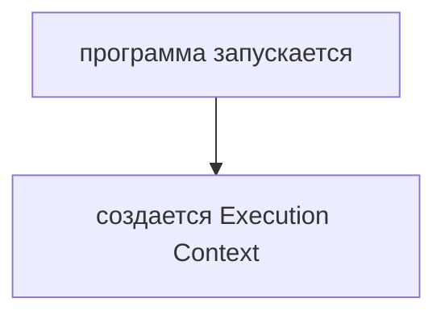
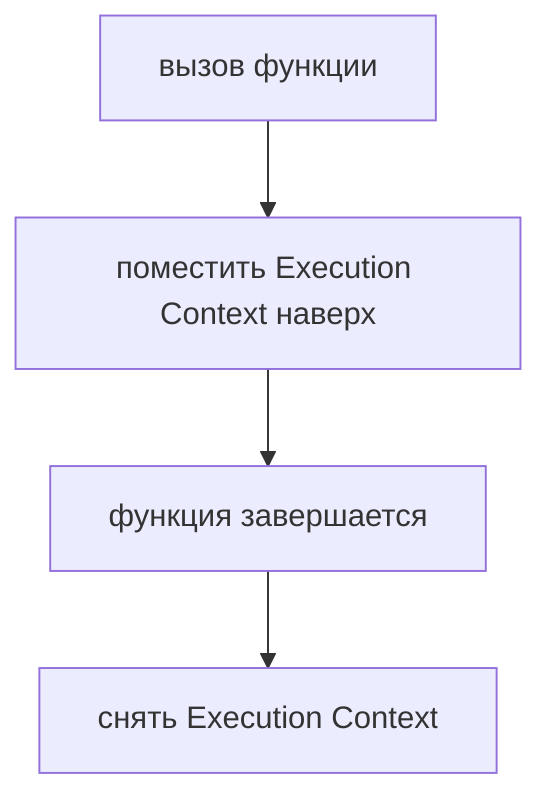
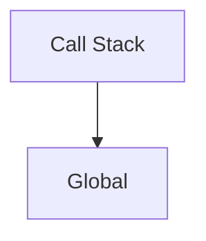
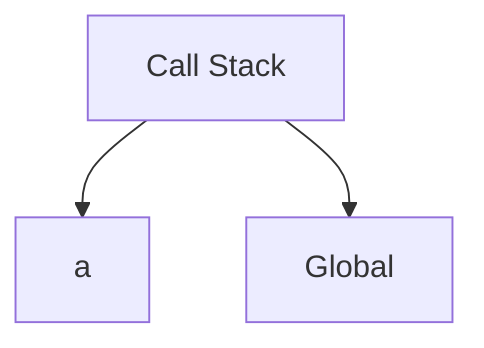
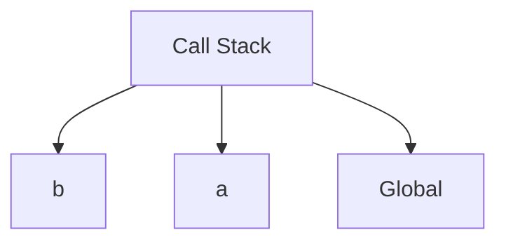
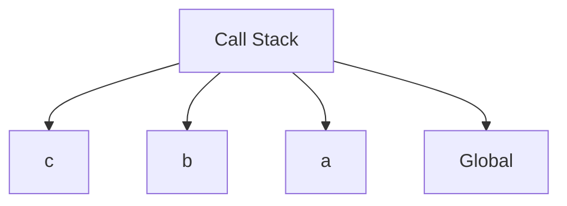
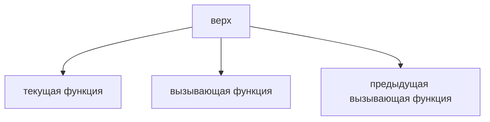
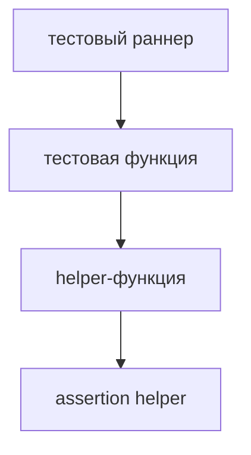

# Call Stack

## Связь с предыдущей главой

Предыдущая глава показала, что JavaScript создает Execution Context:



Но в нашем примере функции вызывают друг друга:

```javascript
a();
// a -> b -> c
```

Теперь нужно понять, как JavaScript управляет несколькими активными вызовами функций.

## Главный вопрос

> Как функции выполняются шаг за шагом?

Ответ этой главы: через Call Stack.

## Предварительные требования

Для этой главы нужно понимать:

* что вызов функции создает Function Execution Context;
* что тело функции выполняется после вызова;
* что синхронный код выполняется последовательно;
* что `a()`, `b()`, `c()` образуют цепочку вызовов.

В этой главе рассматривается только обычное последовательное выполнение вызовов функций.

## Цели обучения

После главы вы будете понимать:

* зачем нужен Call Stack;
* что происходит при входе в функцию;
* что происходит при выходе из функции;
* почему JavaScript возвращается в вызывающую функцию;
* как читать простую stack trace.

## Мотивация

Возьмем тот же код:

```javascript
function c() {
  console.log('c');
}

function b() {
  c();
  console.log('b');
}

function a() {
  b();
  console.log('a');
}

a();
```

Вывод:

```text
c
b
a
```

Вопрос:

> Как JavaScript помнит, что после `c()` нужно вернуться в `b()`, а после `b()` — в `a()`?

Для этого нужен Call Stack.

## Теория

Call Stack — это стек вызовов функций.

Когда вызывается функция, JavaScript помещает ее Execution Context наверх Call Stack.

Когда функция завершается, ее Execution Context снимается с Call Stack.



JavaScript выполняет Execution Context, который находится наверху.

Call Stack хранит Execution Context активных вызовов функций. Он не хранит сами объявления функций. Объявление функции описывает, что можно вызвать; Call Stack показывает, какой вызов выполняется сейчас и куда нужно вернуться после завершения.

## Внутренний механизм

Старт программы:



Вызов `a()`:



`a()` вызывает `b()`:



`b()` вызывает `c()`:



`c()` завершается:


`b()` завершается:


`a()` завершается:


Программа завершается, когда выполнение глобального кода закончено и синхронной работы больше не осталось.

## Главная ментальная модель

Главная модель главы: **стек вызовов функций**.



Последняя вызванная функция завершается первой.

## Примеры

Примеры находятся в:

```text
examples/01-javascript/chapter-62/
```

Запуск:

```bash
node examples/01-javascript/chapter-62/01-single-call.js
node examples/01-javascript/chapter-62/02-a-b-c.js
node examples/01-javascript/chapter-62/03-return-flow.js
node examples/01-javascript/chapter-62/04-stack-trace.js
```

## Практическое использование

Call Stack помогает понимать порядок выполнения.

Практически это нужно, когда:

* вызовы функций вложены друг в друга;
* ошибка появляется внутри helper;
* нужно понять, почему вывод идет в определенном порядке;
* stack trace показывает несколько имен функций.

## Использование в Automation QA

Минимальная QA-аналогия:



Если assertion helper падает, stack trace показывает цепочку вызывающих функций. Это не новая тема, а прямое применение Call Stack.

## Распространённые ошибки

### Ошибка 1. Читать вызовы сверху вниз как порядок завершения

Выполнение идет внутрь вызовов, но завершение идет обратно.

### Ошибка 2. Думать, что функции выполняются одновременно

В синхронном коде JavaScript выполняет только верхний Execution Context.

### Ошибка 3. Игнорировать stack trace

Stack trace показывает путь, по которому выполнение пришло к ошибке.

## Практика

Практика находится в:

```text
practice/01-javascript/62-call-stack.md
```

Решения находятся в:

```text
solutions/01-javascript/62-call-stack.md
```

## Краткие итоги

Call Stack управляет порядком выполнения функций.

Главное:

* вызов функции помещает Execution Context наверх;
* завершение функции снимает Execution Context;
* JavaScript выполняет верхний Execution Context;
* Call Stack объясняет возврат к вызывающей функции.

## Переход к следующей главе

Теперь понятно, как JavaScript управляет потоком выполнения.

Следующий вопрос:

> Где значения и объекты живут во время этих вызовов?

Ответ ведет к Memory Model.
