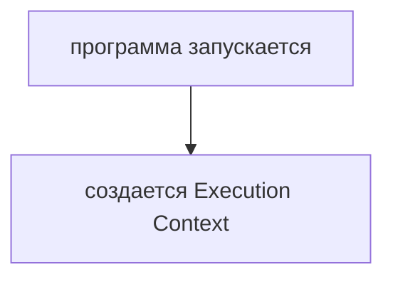
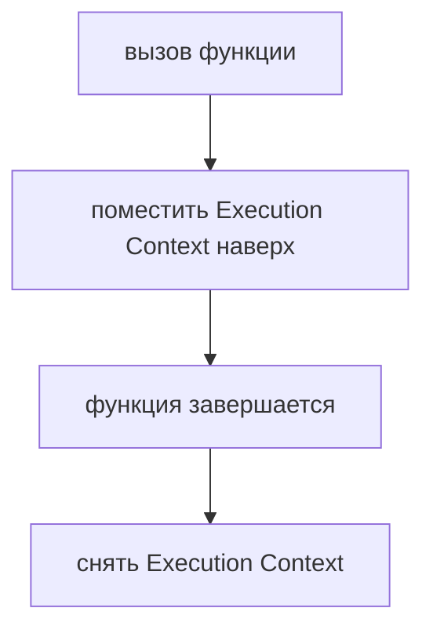
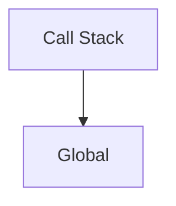
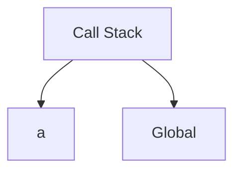
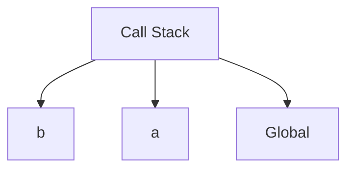
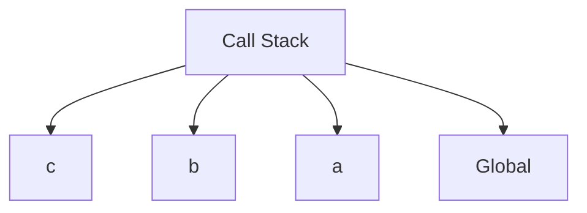

# Стек вызовов: углублённое повторение

## Связь с предыдущей главой

Предыдущая глава показала, что JavaScript создает Execution Context:


```mermaid
flowchart TD
    N1["программа запускается"]
    N2["создается Execution Context"]
    N1 --> N2
```

Но в нашем примере функции вызывают друг друга:

```javascript
a();
// a -> b -> c
```

Теперь нужно понять, как JavaScript управляет несколькими активными вызовами функций.

## Главный вопрос

> Как функции выполняются шаг за шагом?

Ответ этой главы: через стек вызовов.

## Предварительные требования

Для этой главы нужно понимать:

* что вызов функции создает Function Execution Context;
* что тело функции выполняется после вызова;
* что синхронный код выполняется последовательно;
* что `a()`, `b()`, `c()` образуют цепочку вызовов.

В этой главе рассматривается только обычное последовательное выполнение вызовов функций.

## Цели обучения

После главы вы будете понимать:

* зачем нужен Call Stack;
* что происходит при входе в функцию;
* что происходит при выходе из функции;
* почему JavaScript возвращается в вызывающую функцию;
* как читать простую stack trace.

## Мотивация

Возьмем тот же код:

```javascript
function c() {
  console.log('c');
}

function b() {
  c();
  console.log('b');
}

function a() {
  b();
  console.log('a');
}

a();
```

Вывод:

```text
c
b
a
```

Вопрос:

> Как JavaScript помнит, что после `c()` нужно вернуться в `b()`, а после `b()` — в `a()`?

Для этого нужен Call Stack.

## Теория

Стек вызовов — это стопка вызовов функций.

Когда вызывается функция, JavaScript помещает её контекст выполнения наверх стека.

Когда функция завершается, её контекст выполнения снимается со стека.


```mermaid
flowchart TD
    N1["вызов функции"]
    N2["поместить Execution Context наверх"]
    N3["функция завершается"]
    N4["снять Execution Context"]
    N1 --> N2
    N2 --> N3
    N3 --> N4
```

JavaScript выполняет тот контекст выполнения, который находится наверху.

Стек вызовов хранит контексты выполнения активных вызовов. Он не хранит самих объявлений функций. Объявление описывает, что можно вызвать; стек показывает, какой вызов выполняется сейчас и куда нужно вернуться после завершения.

## Внутренний механизм

Старт программы:


```mermaid
flowchart TD
    N1["Call Stack"]
    N2["Global"]
    N1 --> N2
```

Вызов `a()`:


```mermaid
flowchart TD
    N1["Call Stack"]
    N2["a"]
    N3["Global"]
    N1 --> N2
    N1 --> N3
```

`a()` вызывает `b()`:


```mermaid
flowchart TD
    N1["Call Stack"]
    N2["b"]
    N3["a"]
    N4["Global"]
    N1 --> N2
    N1 --> N3
    N1 --> N4
```

`b()` вызывает `c()`:


```mermaid
flowchart TD
    N1["Call Stack"]
    N2["c"]
    N3["b"]
    N4["a"]
    N5["Global"]
    N1 --> N2
    N1 --> N3
    N1 --> N4
    N1 --> N5
```

Снятие кадров идёт в обратном порядке:

```text
c() завершилась  →  её кадр снят, активен кадр b()
b() завершилась  →  её кадр снят, активен кадр a()
a() завершилась  →  её кадр снят, активен глобальный код
```

Программа завершается, когда выполнение глобального кода закончено и синхронной работы больше не осталось.

### Порядок снятия: последний вошёл — первый вышел

Стек работает по единственному правилу: выполняется тот контекст, который лежит сверху, а снимается он раньше всех, кто лежит под ним.

Для цепочки `a()` → `b()` → `c()` состояние стека меняется так:

| Момент | Содержимое стека (сверху вниз) |
| --- | --- |
| вызвана `a()` | `a`, глобальный |
| `a()` вызвала `b()` | `b`, `a`, глобальный |
| `b()` вызвала `c()` | `c`, `b`, `a`, глобальный |
| `c()` завершилась | `b`, `a`, глобальный |
| всё завершилось | глобальный |

Отсюда и ответ на вопрос «куда вернётся выполнение»: в тот контекст, который оказался сверху после снятия.

### Трассировка ошибки — это снимок стека

Стек вызовов виден каждый раз, когда программа падает. Порядок кадров в сообщении повторяет порядок в стеке: сверху — место, где ошибка возникла, ниже — те, кто до него дошёл.

```text
Error: упало в c
    at c
    at b
    at a
```

Читать такую трассировку нужно сверху вниз как «где случилось», и снизу вверх как «как сюда попали». Это основной инструмент расследования: по нему видно не только место ошибки, но и путь к нему.

### Переполнение стека

Стек ограничен по размеру. Бесконечная рекурсия исчерпывает его и даёт характерную ошибку:

```text
RangeError: Maximum call stack size exceeded
```

Глубина зависит от среды и от размера кадров — в одном из замеров она составила около девяти тысяч вложенных вызовов. Точное число знать не нужно; важно узнавать эту ошибку: она почти всегда означает рекурсию без условия выхода, а не «сложный алгоритм».

### Стек объясняет синхронность

Пока в стеке есть кадры, движок занят: он не может выполнять ничего другого. Отсюда — однопоточная модель выполнения JavaScript: длинная синхронная функция блокирует всё, включая обработку событий.

Это же объясняет, почему асинхронные операции устроены иначе: их продолжение не может просто «подождать» в стеке. Куда оно попадает и как возвращается — тема глав про событийный цикл.

## Главная ментальная модель

Главная модель главы: **стек вызовов функций**.

Последняя вызванная функция завершается первой.

## Примеры

Примеры находятся в:

```text
examples/01-javascript/chapter-62/
```

Запуск:

```bash
node examples/01-javascript/chapter-62/01-single-call.js
node examples/01-javascript/chapter-62/02-a-b-c.js
node examples/01-javascript/chapter-62/03-return-flow.js
node examples/01-javascript/chapter-62/04-stack-trace.js
```

## Практическое использование

Стек вызовов помогает понимать порядок выполнения.

Практически это нужно, когда:

* вызовы функций вложены друг в друга;
* ошибка появляется внутри вспомогательной функции;
* нужно понять, почему вывод идет в определенном порядке;
* трассировка стека показывает несколько имён функций.

## Использование в Automation QA

Если вспомогательная функция проверки падает, трассировка стека показывает цепочку вызывающих функций. Это не новая тема, а прямое применение стека вызовов.

### Трассировка читается снизу вверх

```text
    at expectStatus (helpers/assertions.js:12)
    at verifyOrder (scenarios/order.js:34)
    at Object.<anonymous> (tests/order.spec.js:8)
```

Внизу — тест, вверху — место падения. Полезно читать обе границы: верхняя
говорит, **где** сломалось, нижняя — **зачем** туда пошли. Вспомогательная
функция, вызванная из трёх сценариев, без нижней строки ничего не объясняет.

### Асинхронный шаг рвёт цепочку

```javascript
setTimeout(() => {
  expectStatus(response, 200);   // упадёт здесь
}, 0);
```

Отложенный вызов начинается с пустого стека, поэтому в трассировке не будет
ни `verifyOrder`, ни файла теста — только сама проверка. Это первая причина,
по которой в автотестах ожидание оформляют через `await`, а не через таймер:
иначе падение теряет контекст.

## Распространённые мифы

**Миф: стек вызовов хранит объявления функций.**
Он хранит контексты активных вызовов. Объявление лишь делает функцию доступной.

**Миф: трассировку читают снизу вверх.**
Сверху — место ошибки, ниже — путь к нему. Полезны оба направления чтения.

**Миф: `Maximum call stack size exceeded` означает слишком сложный алгоритм.**
Почти всегда это рекурсия без условия выхода.

**Миф: стек можно увеличить и забыть о проблеме.**
Ограничение существует всегда; причина в коде, а не в его размере.

**Миф: пока выполняется функция, браузер может делать другое.**
Пока в стеке есть кадры, движок занят: выполнение однопоточное.

## Частые вопросы

**Куда вернётся выполнение после завершения функции?**
В контекст, который окажется сверху стека после снятия текущего.

**Как по трассировке понять путь вызовов?**
Читать кадры сверху вниз: это порядок от места ошибки к самому раннему вызову.

**Почему интерфейс «замирает» на долгой функции?**
Её кадр занимает стек, и движок не может выполнять ничего другого.

**Какая глубина рекурсии допустима?**
Зависит от среды и размера кадров. Полагаться на конкретное число нельзя.

**Что делать при переполнении стека?**
Искать отсутствующее условие выхода из рекурсии, а не увеличивать лимит.

## Проверьте себя

1. Какой контекст выполняется в каждый момент времени?
2. Как выглядит стек в момент вызова `c()` из цепочки `a` → `b` → `c`?
3. Что означает порядок кадров в трассировке ошибки?
4. О чём почти всегда говорит `RangeError: Maximum call stack size exceeded`?
5. Почему длинная синхронная функция блокирует всю программу?

### Ответы

1. Тот, чей кадр находится на вершине стека.
2. Снизу вверх: глобальный контекст, кадр `a`, кадр `b`, кадр `c`. Кадры `a` и `b` не завершены — они ждут возврата.
3. Верхний кадр — место, где ошибка возникла; ниже идут вызовы, которые туда привели. Это путь выполнения, а не порядок объявления функций.
4. О рекурсии без условия остановки или о взаимном вызове двух функций. Значительно реже — о слишком глубокой, но конечной рекурсии.
5. Пока её кадр на стеке, движок не может взять другую работу: ни таймер, ни обработчик события, ни продолжение промиса не выполнятся до её завершения.

## Распространённые ошибки

### Ошибка 1. Читать вызовы сверху вниз как порядок завершения

Выполнение идет внутрь вызовов, но завершение идет обратно.

### Ошибка 2. Думать, что функции выполняются одновременно

В синхронном коде JavaScript выполняет только верхний контекст выполнения.

### Ошибка 3. Игнорировать трассировку стека

Трассировка стека показывает путь, по которому выполнение пришло к ошибке.

## Практика

Практика находится в:

```text
practice/01-javascript/62-call-stack.md
```

Решения находятся в:

```text
solutions/01-javascript/62-call-stack.md
```

## Краткие итоги

Стек вызовов управляет порядком выполнения функций.

Главное:

* вызов функции помещает контекст выполнения наверх;
* завершение функции снимает контекст выполнения;
* JavaScript выполняет верхний контекст выполнения;
* стек вызовов объясняет возврат к вызывающей функции.

## Переход к следующей главе

Теперь понятно, как JavaScript управляет потоком выполнения.

Следующий вопрос:

> Где значения и объекты живут во время этих вызовов?

Ответ ведёт к модели памяти.
