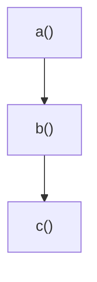
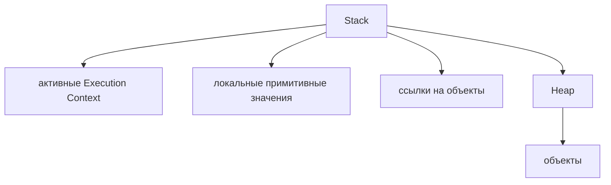
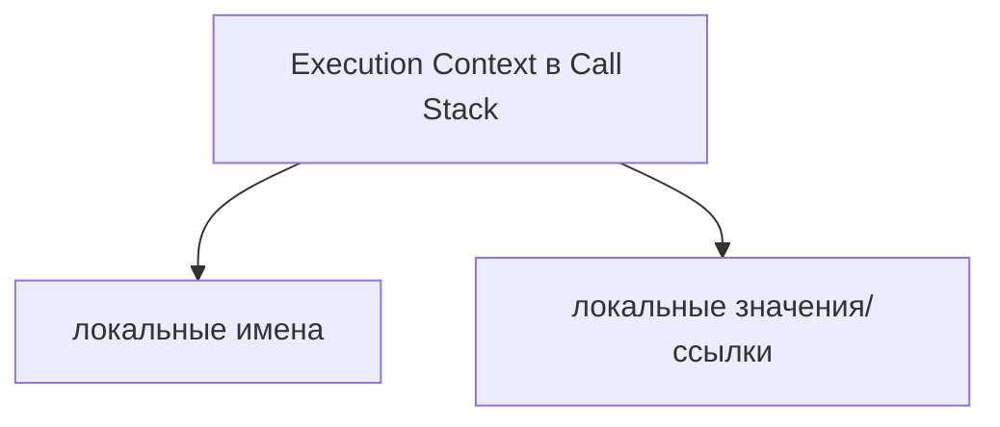
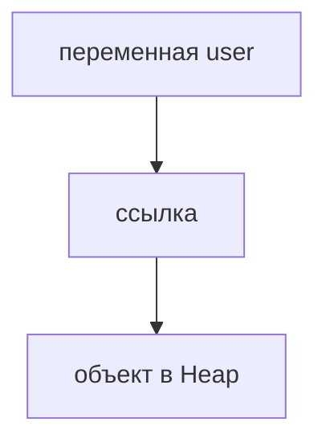
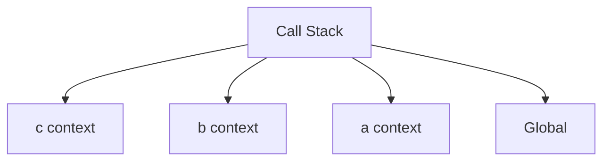
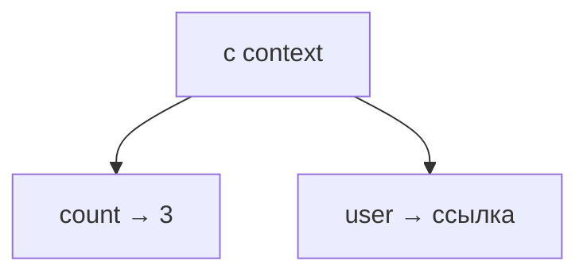

# Memory Model

## Связь с предыдущей главой

Предыдущая глава объяснила Call Stack:



Call Stack показывает, какая функция выполняется сейчас. Но Execution Context должен хранить данные: локальные переменные, примитивные значения и ссылки на объекты.

Теперь вопрос не в порядке выполнения, а в хранении данных.

## Главный вопрос

> Где значения и объекты хранятся во время выполнения?

Ответ этой главы: в Memory Model, которую удобно объяснять через Stack и Heap.

## Предварительные требования

Для этой главы нужно понимать:

* что Call Stack управляет вызовами функций;
* что переменные дают именованный доступ к значениям;
* что примитивные значения и объекты ведут себя по-разному;
* что ссылки уже объяснялись раньше.

Stack/Heap здесь используются как учебная модель. Реальные движки могут хранить данные сложнее, но для понимания поведения JavaScript эта модель достаточно точна.

## Цели обучения

После главы вы будете понимать:

* зачем программе нужна память;
* как Stack связан с активными вызовами;
* зачем Heap нужен для объектов;
* почему примитивные значения и ссылки на объекты удобно рисовать по-разному;
* как Memory Model помогает понять изменение объектов.

## Мотивация

Используем тот же сквозной пример:

```javascript
function c() {
  const count = 3;
  const user = { name: 'Anna' };

  console.log(count);
  console.log(user.name);
}

function b() {
  c();
}

function a() {
  b();
}

a();
```

JavaScript должен где-то хранить:

* число `3`;
* имя `count`;
* объект `{ name: 'Anna' }`;
* ссылку от `user` к этому объекту;
* активные вызовы функций.

## Теория

В этой модели:



Stack удобно связывать с активным выполнением:



Heap удобно связывать с хранением объектов:



## Внутренний механизм

Когда выполнение входит в `c()`, появляется Execution Context:



Внутри `c context` появляются локальные имена:



Объект живет в Heap:

Связь:

Когда `c()` заканчивается, его Execution Context уходит из Call Stack. Если объект больше нигде не доступен по ссылке, позже он может быть очищен. Garbage Collector будет изучаться отдельно; здесь достаточно понимать время жизни данных.

### Примитивы копируются, объекты разделяются

Это главное практическое следствие модели. Присваивание примитива создаёт независимую копию значения, присваивание объекта — копию **ссылки**:

```javascript
let a = 1;
let b = a;
b = 99;
console.log(a);   // 1 — независимые значения

const o1 = { n: 1 };
const o2 = o1;
o2.n = 99;
console.log(o1.n);   // 99 — один объект на две переменные
```

Отсюда происходят почти все «загадочные» изменения данных в тестах: массив тестовых данных, переданный в функцию, меняется внутри неё, потому что это тот же массив.

### `const` защищает имя, а не содержимое

Частое заблуждение, которое стоит проверить:

```javascript
const config = { retries: 1 };
config.retries = 99;      // разрешено
config = {};              // ошибка
```

`const` запрещает переприсваивание **имени**. Объект, на который оно указывает, остаётся изменяемым. За неизменяемость содержимого отвечает `Object.freeze()` — и он тоже поверхностный, как обсуждалось в главах про конфигурацию.

### Что такое «ссылка» в этой модели

Полезно не усложнять: ссылка — это значение, по которому движок находит объект. Переменная хранит ссылку, объект живёт в Heap.

| Что сравнивается | Результат |
| --- | --- |
| два примитива с одинаковым значением | равны |
| два разных объекта с одинаковыми полями | **не равны** |
| две переменные с одной ссылкой | равны |

Вторая строка объясняет поведение `includes()` из главы 58 и вообще любое сравнение объектов через `===`: сравниваются ссылки, а не содержимое.

### Когда память освобождается

Объект остаётся в памяти, пока на него есть хотя бы одна достижимая ссылка. Когда последняя ссылка исчезает, объект становится недостижимым и может быть убран сборщиком мусора.

Из этого следует практическое правило для тестов: долгоживущий массив, в который складывают результаты всех прогонов, удерживает всё, что в нём лежит. Подробности — в главах 87 и 88.

## Главная ментальная модель

Главная модель главы: **разделение памяти на Stack и Heap**.

```text
Stack = активные вызовы и локальный доступ
Heap  = объекты
```

## Примеры

Примеры находятся в:

```text
examples/01-javascript/chapter-63/
```

Запуск:

```bash
node examples/01-javascript/chapter-63/01-stack-values.js
node examples/01-javascript/chapter-63/02-heap-object.js
node examples/01-javascript/chapter-63/03-reference-mutation.js
node examples/01-javascript/chapter-63/04-a-b-c-memory.js
```

## Практическое использование

Memory Model помогает понимать:

* почему переназначение примитива не изменяет старое значение;
* почему изменение объекта видно через ссылку;
* почему локальные переменные исчезают после выполнения функции;
* почему общий объект можно изменить из разных мест.

## Использование в Automation QA

QA-аналогия минимальная:

Memory Model объясняет такие ошибки без мистики: helpers могут разделять ссылки на один и тот же объект.

## Распространённые мифы

**Миф: `const` делает объект неизменяемым.**
Он запрещает переприсваивание имени. Поля объекта остаются изменяемыми.

**Миф: присваивание объекта создаёт копию.**
Копируется ссылка. Обе переменные указывают на один объект.

**Миф: два объекта с одинаковыми полями равны.**
`===` сравнивает ссылки. Одинаковое содержимое равенства не даёт.

**Миф: Stack и Heap — это то, что нужно настраивать.**
Это модель для чтения поведения программы, а не параметры, которыми управляют из кода.

**Миф: переменная «содержит» объект.**
Она содержит ссылку; сам объект живёт в Heap.

## Частые вопросы

**Почему изменение в функции затронуло внешние данные?**
В функцию передана ссылка на тот же объект, а не его копия.

**Как передать объект так, чтобы оригинал не менялся?**
Передать копию — поверхностную через spread или глубокую, если есть вложенность.

**Почему сравнение объектов через `===` даёт `false`?**
Сравниваются ссылки. Для сравнения по содержимому нужно сравнивать поля.

**Что делает `Object.freeze()`?**
Запрещает изменение свойств во время выполнения, но только на верхнем уровне.

**Когда объект исчезает из памяти?**
Когда на него не остаётся достижимых ссылок.

## Проверьте себя

1. Что копируется при присваивании примитива и что — при присваивании объекта?
2. Что именно запрещает `const`?
3. Почему два объекта с одинаковыми полями не равны?
4. Где живут объекты и что хранит переменная?
5. При каком условии объект может быть убран из памяти?

## Распространённые ошибки

### Ошибка 1. Считать Stack и Heap точной схемой устройства движка

Диаграммы не описывают реализацию полностью.

### Ошибка 2. Думать, что переменная содержит сам объект

В этой модели переменная хранит ссылку на объект в Heap.

### Ошибка 3. Забывать про время жизни Execution Context

Локальные переменные существуют во время выполнения соответствующей функции.

## Практика

Практика находится в:

```text
practice/01-javascript/63-memory-model.md
```

Решения находятся в:

```text
solutions/01-javascript/63-memory-model.md
```

## Краткие итоги

Memory Model объясняет, где значения живут во время выполнения.

Главное:

* Execution Context в Call Stack связан с активным вызовом функции;
* примитивные значения удобно рисовать рядом с этим Execution Context;
* объекты удобно рисовать в Heap;
* переменные могут хранить ссылки на объекты;
* эта модель объясняет совместное изменение объекта.

## Переход к следующей главе

Теперь понятно, где живут значения.

Следующий вопрос:

> Почему некоторые переменные ведут себя странно до строки объявления?

Ответ ведет к Hoisting + TDZ.
