# Hoisting + TDZ

## Связь с предыдущей главой

Предыдущая глава объяснила Memory Модель:

```text
Stack = активные Execution Context
Heap  = объекты
```

Теперь можно объяснить странное поведение переменных до строки объявления. JavaScript подготавливает среду выполнения до построчного выполнения, но разные объявления получают разное начальное состояние.

## Главный вопрос

> Почему переменные ведут себя неожиданно до строки объявления?

Ответ этой главы: из-за Hoisting и Temporal Dead Zone.

## Предварительные требования

Для этой главы нужно понимать:

* что Execution Context создается перед выполнением;
* что Call Stack запускает Execution Context функций;
* что Memory Model хранит имена, значения и ссылки;
* чем `var`, `let` и `const` отличаются в обычном коде.

Детали спецификации не нужны. Эта глава объясняет практический жизненный цикл переменных.

## Цели обучения

После главы вы будете понимать:

* почему Hoisting — это подготовка, а не перемещение кода;
* почему объявления функций доступны до строки вызова;
* почему `var` читается как `undefined` до присваивания;
* почему `let` и `const` находятся в TDZ до инициализации;
* как читать ReferenceError до инициализации.

## Мотивация

Сквозной пример:

```javascript
a();

function a() {
  b();
}

function b() {
  c();
}

function c() {
  console.log(message);
  let message = 'inside c';
}
```

Вызов `a()` работает, хотя объявление функции находится ниже.

Но чтение `message` до строки `let message` вызывает ReferenceError.

Вопрос:

> Почему одна часть кода работает до объявления, а другая падает?

## Теория

Hoisting — это подготовка объявлений во время Creation Phase. Это не перемещение строк.

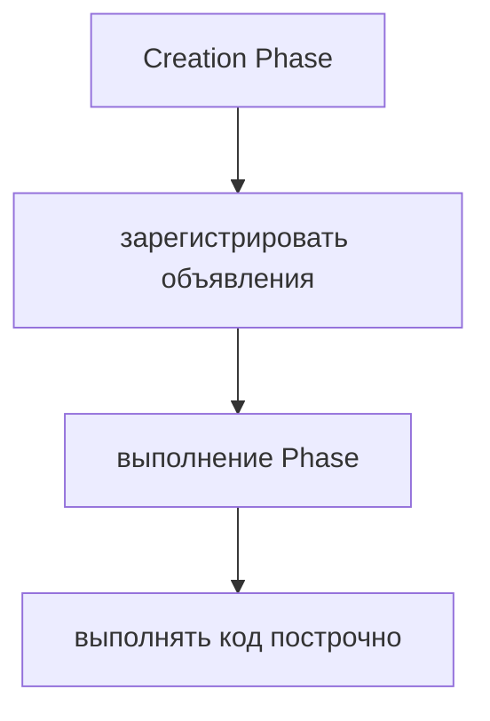

Объявления функций:

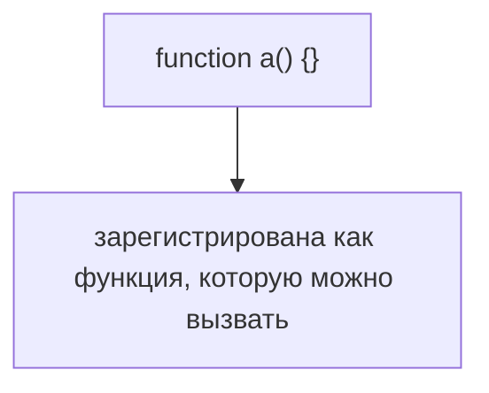

`var`:

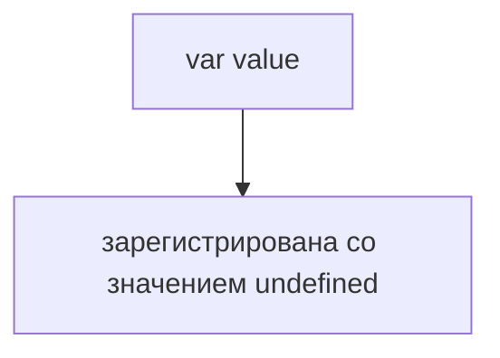

`let` и `const`:

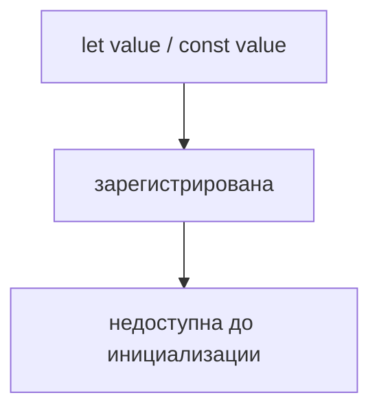

TDZ — это период между регистрацией и инициализацией, когда доступ к переменной запрещен.

## Внутренний механизм

Для объявлений функций:

```javascript
a();

function a() {
  console.log('a');
}
```

Жизненный цикл:

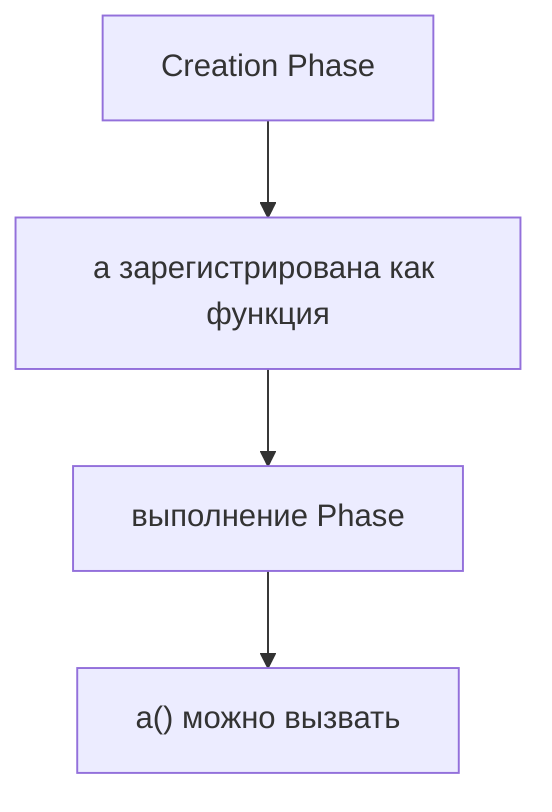

Для `var`:

```javascript
console.log(value);
var value = 'ready';
```

Жизненный цикл:

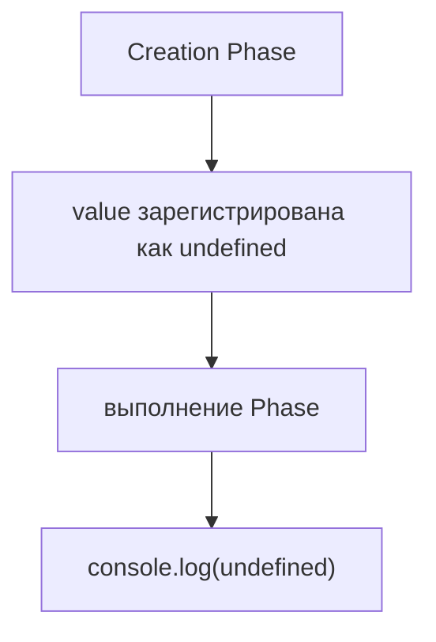

Для `let`:

```javascript
console.log(value);
let value = 'ready';
```

Жизненный цикл:

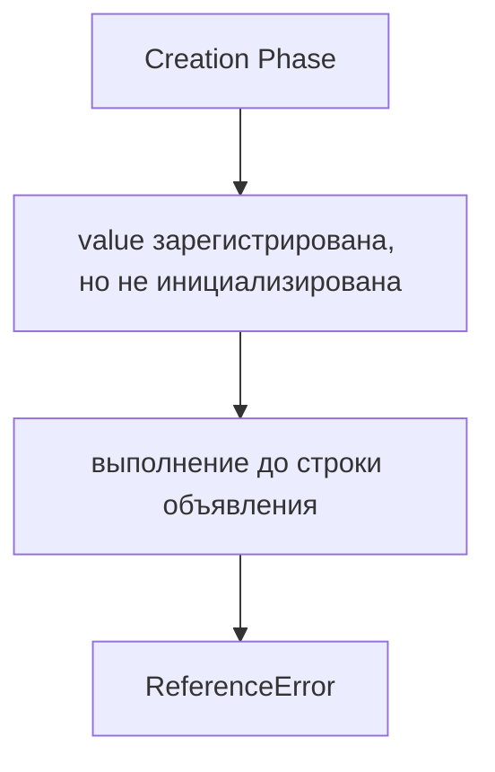

Последовательность состояний:

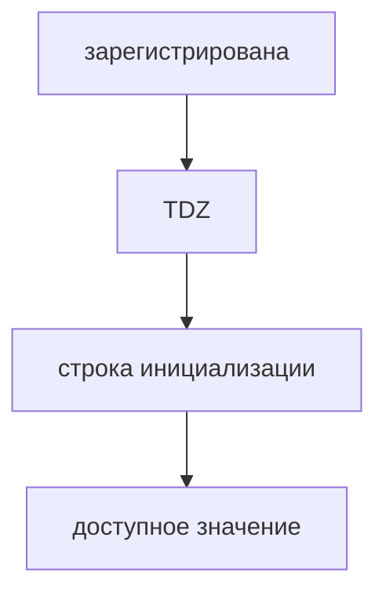

## Главная ментальная модель

Главная модель главы: **жизненный цикл переменной до и после объявления**.

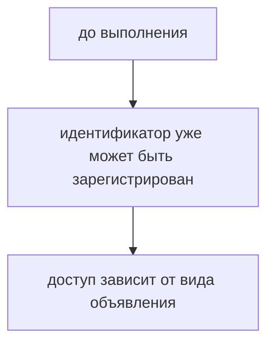

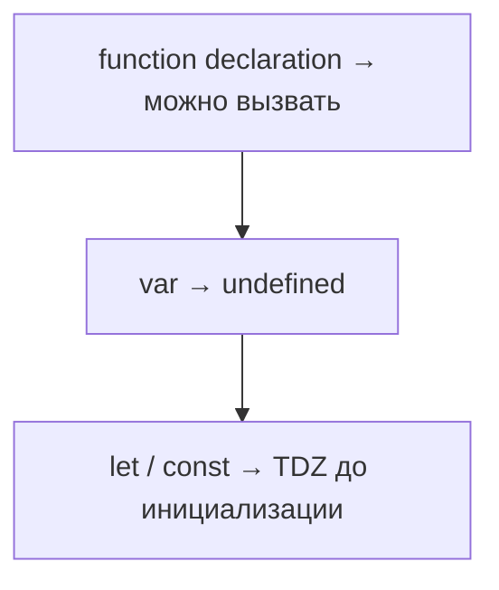

## Примеры

Примеры находятся в:

```text
examples/01-javascript/chapter-64/
```

Запуск:

```bash
node examples/01-javascript/chapter-64/01-function-hoisting.js
node examples/01-javascript/chapter-64/02-var-hoisting.js
node examples/01-javascript/chapter-64/03-tdz-caught.js
node examples/01-javascript/chapter-64/04-a-b-c-hoisting.js
```

Все примеры валидны и запускаются. Пример с TDZ намеренно перехватывает ошибку.

## Практическое использование

Hoisting + TDZ помогают объяснять:

* почему вызов объявления функции до его строки работает;
* почему `var` может скрывать ошибки порядка подготовки через `undefined`;
* почему `let`/`const` падают до инициализации;
* почему порядок объявлений внутри функций важен.

## Использование в Automation QA

QA-аналогия здесь нужна только как предупреждение:

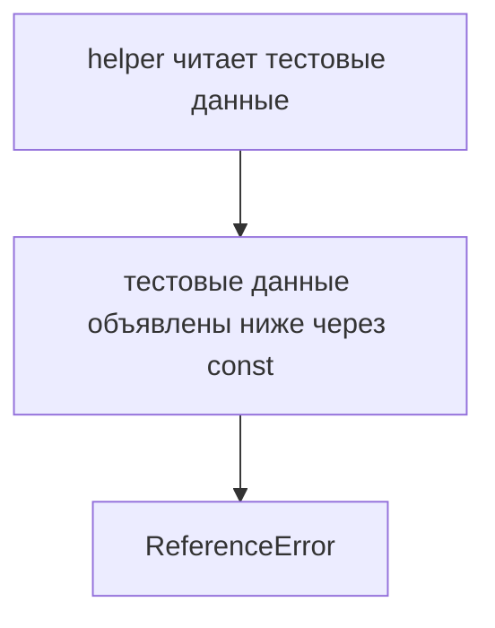

Правило для тестов простое: инициализируйте конфигурацию и тестовые данные до чтения.

## Распространённые ошибки

### Ошибка 1. Говорить, что `let` и `const` не hoisted

Они зарегистрированы, но недоступны до инициализации.

### Ошибка 2. Представлять hoisting как перемещение строк

Исходный код не переезжает. Подготавливается среда выполнения.

### Ошибка 3. Путать `undefined` и TDZ

`var` до присваивания дает `undefined`. `let`/`const` до инициализации выбрасывают ReferenceError.

## Практика

Практика находится в:

```text
practice/01-javascript/64-hoisting-tdz.md
```

Решения находятся в:

```text
solutions/01-javascript/64-hoisting-tdz.md
```

## Краткие итоги

Hoisting + TDZ объясняют жизненный цикл переменной до того, как выполнение дойдет до строки объявления.

| Вид объявления | До строки объявления |
|----------------|----------------------|
| function declaration | можно вызвать |
| var | значение undefined |
| let | TDZ |
| const | TDZ |

Главное:

* Hoisting — это подготовка;
* объявления функций становятся доступными для вызова;
* `var` начинает со значения `undefined`;
* `let` и `const` находятся в TDZ до инициализации;
* TDZ означает, что идентификатор существует, но доступ запрещен.

## Переход к следующей главе

Этот модуль собрал базовую внутреннюю картину:

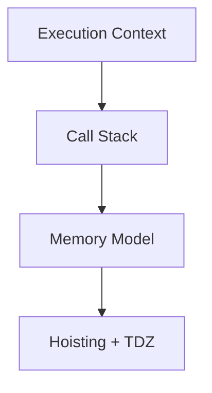

Теперь можно читать JavaScript-код как систему выполнения, а не как набор независимых строк.
