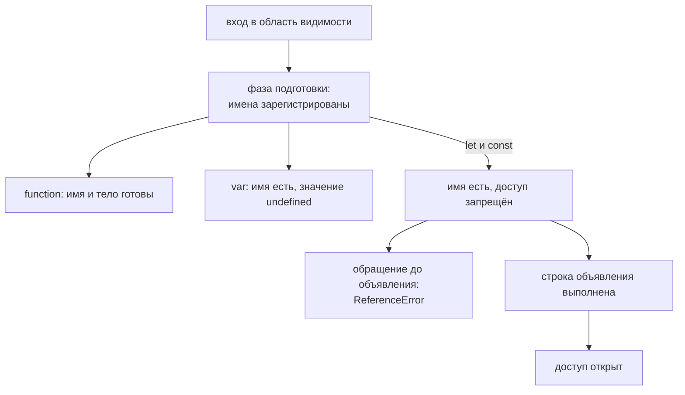

# Подъём объявлений и временная мёртвая зона

## Связь с предыдущей главой

Предыдущая глава объяснила Memory Модель:

```text
Stack = активные Execution Context
Heap  = объекты
```

Теперь можно объяснить странное поведение переменных до строки объявления. JavaScript подготавливает среду выполнения до построчного выполнения, но разные объявления получают разное начальное состояние.

## Главный вопрос

> Почему переменные ведут себя неожиданно до строки объявления?

Ответ этой главы: из-за подъёма объявлений и временной мёртвой зоны.

## Предварительные требования

Для этой главы нужно понимать:

* что Execution Context создается перед выполнением;
* что Call Stack запускает Execution Context функций;
* что Memory Model хранит имена, значения и ссылки;
* чем `var`, `let` и `const` отличаются в обычном коде.

Детали спецификации не нужны. Эта глава объясняет практический жизненный цикл переменных.

## Цели обучения

После главы вы будете понимать:

* почему Hoisting — это подготовка, а не перемещение кода;
* почему объявления функций доступны до строки вызова;
* почему `var` читается как `undefined` до присваивания;
* почему `let` и `const` находятся в TDZ до инициализации;
* как читать ReferenceError до инициализации.

## Мотивация

Сквозной пример:

```javascript
a();

function a() {
  b();
}

function b() {
  c();
}

function c() {
  console.log(message);
  let message = 'inside c';
}
```

Вызов `a()` работает, хотя объявление функции находится ниже.

Но чтение `message` до строки `let message` вызывает ReferenceError.

Вопрос:

> Почему одна часть кода работает до объявления, а другая падает?

## Теория

### Подъём — это подготовка, а не перемещение

Подъём объявлений — это их подготовка во время фазы подготовки. Это не перемещение строк: код остаётся там, где написан, а движок заранее регистрирует объявленные имена.

Разные виды объявлений подготавливаются по-разному — и именно в этом вся суть темы.

### Объявления функций доступны сразу

Функция, объявленная через `function`, полностью готова к моменту выполнения кода — её можно вызвать выше по тексту:

```javascript
console.log(decl());   // 'работает'

function decl() {
  return 'работает';
}
```

Это единственный вид объявления, который доступен целиком. С функцией, присвоенной переменной, так не получится — о ней ниже.

### `var`: имя есть, значения нет

Переменная `var` регистрируется заранее и получает значение `undefined`. Чтение до присваивания не даёт ошибки:

```javascript
console.log(v);   // undefined
var v = 1;
```

Отсюда типичная путаница: код не падает, но работает не так, как выглядит. Особенно неприятно это с функцией в переменной:

```javascript
fe();                       // TypeError: fe is not a function
var fe = function () {};
```

Имя уже существует и содержит `undefined`, поэтому ошибка не про отсутствие переменной, а про попытку вызвать не функцию.

### `let` и `const`: имя есть, доступ запрещён

Эти объявления тоже регистрируются заранее, но остаются недоступными до строки объявления:

```javascript
console.log(l);   // ReferenceError: Cannot access 'l' before initialization
let l = 1;
```

TDZ — это период между регистрацией и инициализацией, когда доступ к переменной запрещён. Сообщение об ошибке точное: не «переменная не определена», а «нельзя обратиться до инициализации».

Классы ведут себя так же: `new C()` до объявления `class C {}` даёт ту же ошибку.

### `typeof` не спасает от TDZ

Отличие, которое проверяется одной строкой и хорошо объясняет природу TDZ:

| Ситуация | `typeof x` |
| --- | --- |
| переменная не объявлена нигде | `'undefined'` |
| переменная объявлена через `let` ниже | **`ReferenceError`** |

Для необъявленного имени `typeof` безопасен — это его историческая особенность. Но для переменной в TDZ он выбрасывает ошибку: имя уже зарегистрировано, просто обращаться к нему ещё нельзя.

Подготовка области видимости идёт до выполнения кода:


```mermaid
flowchart TD
    A["вход в область видимости"] --> B["фаза подготовки:<br/>имена зарегистрированы"]
    B --> C["function: имя и тело готовы"]
    B --> D["var: имя есть, значение undefined"]
    B -- "let и const" --> E["имя есть, доступ запрещён"]
    E --> F["обращение до объявления:<br/>ReferenceError"]
    E --> G["строка объявления выполнена"]
    G --> H["доступ открыт"]
```

## Внутренний механизм

### Две фазы для каждого контекста

Перед выполнением кода движок проходит фазу подготовки, а затем фазу выполнения:

| Фаза | Что происходит |
| --- | --- |
| подготовка | регистрируются объявления: функции — целиком, `var` — со значением `undefined`, `let`/`const`/`class` — без доступа |
| выполнение | код выполняется построчно, при встрече объявления переменная инициализируется |

Это происходит в каждом контексте выполнения из главы 61 — и в глобальном, и в каждом вызове функции.

### Сводная таблица

| Объявление | Зарегистрировано заранее | Доступно до строки объявления |
| --- | --- | --- |
| `function` | да, целиком | да |
| `var` | да, со значением `undefined` | да, но значение `undefined` |
| `let`, `const` | да | нет — TDZ |
| `class` | да | нет — TDZ |
| функция в `var` | как переменная | да, но вызов даёт `TypeError` |

### Зачем существует TDZ

TDZ выглядит как усложнение, но решает реальную проблему: поведение `var` скрывает ошибки. Чтение переменной до присваивания возвращает `undefined`, и дефект проявляется позже и в другом месте.

`let` и `const` превращают ту же ситуацию в немедленную ошибку с точным сообщением. Это то же решение, что и в других местах языка и инструментов: лучше упасть рядом с причиной, чем продолжить с неверным значением.

## Главная ментальная модель

Главная модель этой главы: **объявления подготавливаются заранее, но доступность у них разная**.

Практический вывод простой: объявляйте переменные через `let` и `const` и до первого использования — тогда о подъёме и мёртвой зоне думать не придётся вовсе. Знание нужно для чтения чужого кода и для понимания сообщений об ошибках.

## Примеры

Примеры находятся в:

```text
examples/01-javascript/chapter-64/
```

Запуск:

```bash
node examples/01-javascript/chapter-64/01-function-hoisting.js
node examples/01-javascript/chapter-64/02-var-hoisting.js
node examples/01-javascript/chapter-64/03-tdz-caught.js
node examples/01-javascript/chapter-64/04-a-b-c-hoisting.js
```

Все примеры валидны и запускаются. Пример с TDZ намеренно перехватывает ошибку.

## Практическое использование

Подъём и мёртвая зона помогают объяснять:

* почему вызов объявления функции до его строки работает;
* почему `var` может скрывать ошибки порядка подготовки через `undefined`;
* почему `let`/`const` падают до инициализации;
* почему порядок объявлений внутри функций важен.

## Использование в Automation QA

Правило для тестов простое: инициализируйте конфигурацию и тестовые данные до чтения.

### Где это ломается в тестовом проекте

```javascript
describe('заказы', () => {
  test('создание', () => {
    expect(client.baseUrl).toBe('http://stand');   // ReferenceError
  });

  const client = createClient();
});
```

Тело `describe` выполняется при сборе тестов, а тело `test` — позже. Кажется,
что к моменту запуска `client` уже создан, и это верно. Но если вынести вызов
за пределы `test` — например, в вычисление имени сценария, — обращение придётся
на мёртвую зону.

### Почему `typeof` не спасает

```javascript
if (typeof config !== 'undefined') { /* … */ }

const config = loadConfig();
```

Для необъявленного имени `typeof` вернул бы `'undefined'`, но `config`
объявлено — просто ещё недоступно. Выражение выбросит `ReferenceError` вместо
того, чтобы защитить от него. Проверять наличие настройки нужно по значению
(`config.retries ?? 1`), а не по существованию имени.

## Распространённые мифы

**Миф: подъём перемещает объявления вверх файла.**
Код остаётся на месте. Движок заранее регистрирует имена во время подготовки.

**Миф: `let` не подвержен подъёму.**
Он тоже регистрируется заранее, но остаётся недоступным до строки объявления — это и есть TDZ.

**Миф: `typeof` безопасен для любой переменной.**
Для необъявленной — да. Для переменной в TDZ он выбрасывает `ReferenceError`.

**Миф: вызов функции из переменной до присваивания даст `ReferenceError`.**
Даст `TypeError: fe is not a function`: имя есть, в нём `undefined`.

**Миф: TDZ — искусственное усложнение.**
Он превращает молчаливое `undefined` в немедленную ошибку рядом с причиной.

## Частые вопросы

**Почему функцию можно вызвать выше её объявления?**
Объявления через `function` подготавливаются целиком.

**Чем отличается сообщение при обращении к `let` до объявления?**
Оно говорит «нельзя обратиться до инициализации», а не «переменная не определена».

**Ведут ли себя классы как функции?**
Нет: `class` находится в TDZ, как `let` и `const`.

**Как избежать всех этих тонкостей?**
Объявлять переменные через `let`/`const` до первого использования.

**Зачем тогда знать про `var`?**
Для чтения существующего кода и понимания ошибок вида `TypeError: x is not a function`.

## Проверьте себя

1. Чем отличается доступность `function`, `var` и `let` до строки объявления?
2. Какую ошибку даст вызов функции, присвоенной `var`, до присваивания?
3. Что вернёт `typeof` для необъявленной переменной и для переменной в TDZ?
4. Что происходит в фазе подготовки контекста?
5. Какую проблему решает TDZ?

### Ответы

1. Функция, объявленная через `function`, вызывается и до своей строки. `var` доступна и равна `undefined`. `let` заведена, но обращение к ней даёт `ReferenceError`.
2. `TypeError`: имя доступно и равно `undefined`, а `undefined` вызвать нельзя. Ошибка говорит не об имени, а о попытке вызвать не функцию.
3. Для необъявленной — строку `'undefined'` без ошибки. Для переменной в TDZ — `ReferenceError`: здесь `typeof` не защищает.
4. Создаётся окружение и заводятся записи об объявлениях: функции готовы к вызову, `var` получает `undefined`, `let` и `const` заводятся без доступа.
5. Делает чтение значения до его задания ошибкой на той самой строке, вместо тихого `undefined`, проявляющегося позже.

## Распространённые ошибки

### Ошибка 1. Говорить, что `let` и `const` не поднимаются

Они зарегистрированы, но недоступны до инициализации.

### Ошибка 2. Представлять подъём как перемещение строк

Исходный код не переезжает. Подготавливается среда выполнения.

### Ошибка 3. Путать `undefined` и TDZ

`var` до присваивания даёт `undefined`. `let` и `const` до инициализации выбрасывают `ReferenceError`.

## Практика

Практика находится в:

```text
practice/01-javascript/64-hoisting-tdz.md
```

Решения находятся в:

```text
solutions/01-javascript/64-hoisting-tdz.md
```

## Краткие итоги

Подъём и мёртвая зона объясняют жизненный цикл переменной до того, как выполнение дойдёт до строки объявления.

| Вид объявления | До строки объявления |
|----------------|----------------------|
| объявление функции | можно вызвать |
| `var` | значение `undefined` |
| let | TDZ |
| const | TDZ |

Главное:

* подъём — это подготовка;
* объявления функций становятся доступными для вызова;
* `var` начинает со значения `undefined`;
* `let` и `const` находятся в TDZ до инициализации;
* TDZ означает, что идентификатор существует, но доступ запрещен.

## Переход к следующей главе

Этот модуль собрал базовую внутреннюю картину:

Теперь можно читать JavaScript-код как систему выполнения, а не как набор независимых строк.
