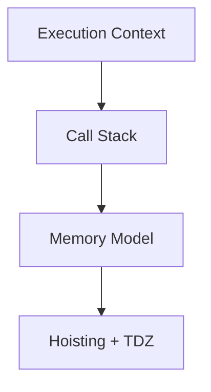
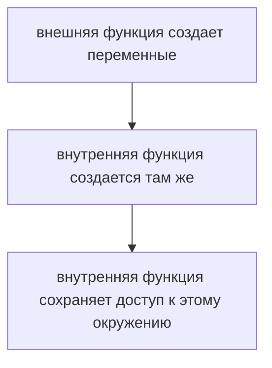
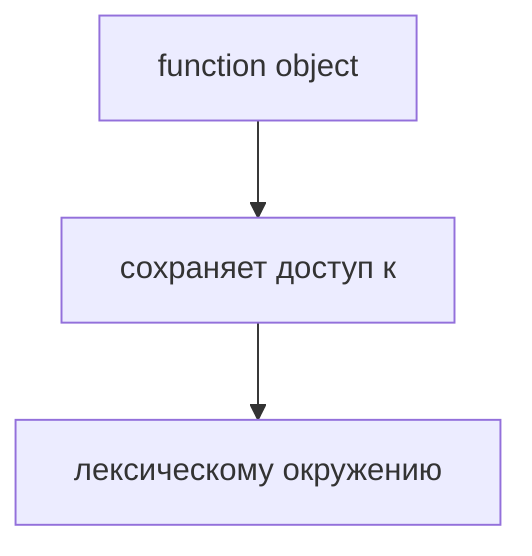
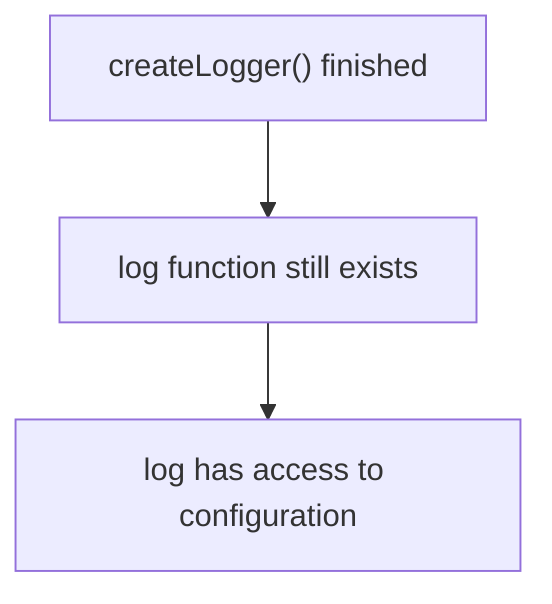
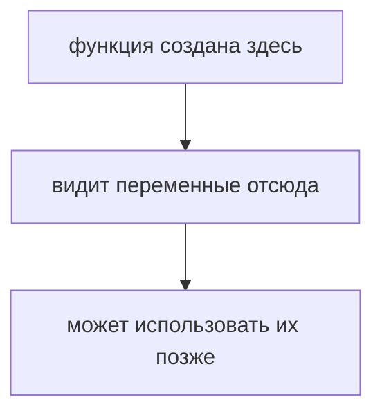
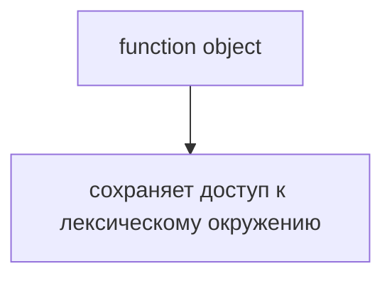

# Closures: углубленное повторение

## Связь с предыдущей главой

Предыдущий модуль завершился на Hoisting и TDZ:



Мы увидели, что Execution Context создается, выполняется и затем уходит из Call Stack. Теперь появляется следующий вопрос: что происходит с данными, если функция уже завершилась, но другая функция все еще может читать ее переменные?

## Главный вопрос

> Почему функция может обращаться к переменным после того, как другая функция уже завершилась?

Ответ этой главы: из-за Closure.

## Предварительные требования

Для этой главы нужно понимать:

* что вызов функции создает Function Execution Context;
* что локальные переменные обычно живут во время выполнения функции;
* что функции являются объектами, которые можно вернуть из другой функции;
* что объект может храниться и использоваться позже.

## Цели обучения

После главы вы будете понимать:

* зачем существуют Closures;
* как функция получает доступ к внешним переменным;
* почему данные могут продолжать существовать после завершения внешней функции;
* как Closure помогает хранить конфигурацию;
* почему Closure не является копией значений.

## Мотивация

В Automation QA Framework часто есть конфигурация:

```javascript
const configuration = {
  baseUrl: 'https://example.test',
  retries: 2,
};
```

Нужно создать helper, который помнит эту конфигурацию и использует ее позже:

```javascript
const createLogger = createConfiguredLogger(configuration);

createLogger('start test');
createLogger('finish test');
```

Внешняя функция уже завершилась, но logger продолжает помнить `configuration`. Это и есть задача Closure.

## Теория

Closure появляется, когда функция сохраняет доступ к лексическому окружению, в котором она была создана.



Важно: Closure не копирует значения. Функция сохраняет доступ к окружению, где эти значения находятся.



## Внутренний механизм

Рассмотрим logger для тестового раннера:

```javascript
function createLogger(configuration) {
  return function log(message) {
    console.log(`[${configuration.environment}] ${message}`);
  };
}
```

Когда вызывается `createLogger(configuration)`, создается Function Execution Context. Внутри него есть параметр `configuration`. Затем создается внутренняя функция `log`.

После завершения `createLogger()` ее Execution Context уходит из Call Stack, но `log` продолжает иметь доступ к тому лексическому окружению, где была создана.



Поэтому позже:

```javascript
log('start test');
```

все еще может прочитать `configuration.environment`.

## Главная ментальная модель

Главная модель главы: **Closure сохраняет доступ к лексическому окружению**.



Более точная формулировка:



## Практические примеры

Примеры находятся в:

```text
examples/01-javascript/chapter-65/
```

Запуск:

```bash
node examples/01-javascript/chapter-65/01-closure-configuration.js
node examples/01-javascript/chapter-65/02-logger-factory.js
node examples/01-javascript/chapter-65/03-retry-manager.js
node examples/01-javascript/chapter-65/04-reporter-state.js
```

## Пример Automation QA

Closure удобно использовать для создания вспомогательных функций с уже сохраненной конфигурацией:

```javascript
function createReporter(configuration) {
  const results = [];

  return function report(testName, status) {
    results.push({ testName, status });
    console.log(`${configuration.environment}: ${testName} -> ${status}`);
  };
}
```

`report` помнит и `configuration`, и `results`. Это позволяет накапливать данные отчета без глобальной переменной.

## Распространённые ошибки

### Ошибка 1. Думать, что Closure копирует значения

Closure сохраняет доступ к окружению, а не делает отдельный снимок всех данных.

### Ошибка 2. Искать переменную только в текущем Execution Context

Функция может читать переменные из окружения, где была создана.

### Ошибка 3. Использовать Closure вместо явных параметров везде

Closure полезен, когда функция действительно должна помнить состояние или конфигурацию. Если значение можно передать явно, это часто проще.

## Практическое использование

Closure помогает:

* хранить конфигурацию helper;
* создавать logger с заранее выбранным окружением;
* накапливать результаты отчета;
* создавать RetryManager с внутренним счетчиком попыток.

## Использование в Automation QA

В тестовом фреймворке Closure полезен там, где helper должен помнить:

* `baseUrl`;
* имя окружения;
* количество повторов;
* список результатов;
* настройки логирования.

Это позволяет избегать глобального изменяемого состояния и передавать во вспомогательные функции только то, что действительно меняется.

## Практика

Практика находится в:

```text
practice/01-javascript/65-closures.md
```

Решения находятся в:

```text
solutions/01-javascript/65-closures.md
```

## Краткие итоги

Closure объясняет, почему функция может использовать переменные из внешнего лексического окружения после завершения внешней функции.

Главное:

* функция сохраняет доступ к окружению, где была создана;
* Closure не является копией значений;
* Closure полезен для сохранения конфигурации и состояния;
* в Automation QA это помогает создавать вспомогательные функции без лишних глобальных переменных.

## Переход к следующей главе

Closure отвечает на вопрос:

> Какие переменные функция помнит?

Следующая глава отвечает на другой вопрос:

> На какой объект указывает `this` при вызове функции?
