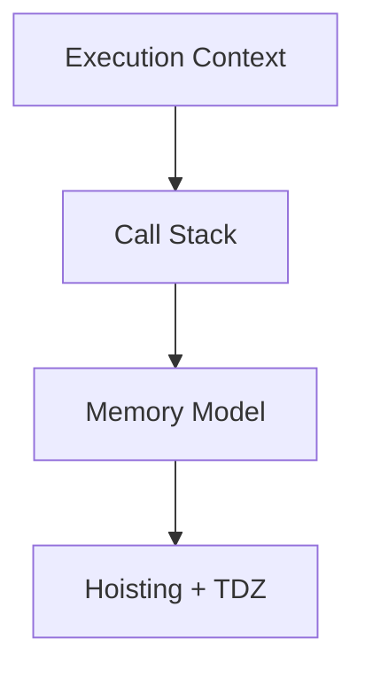
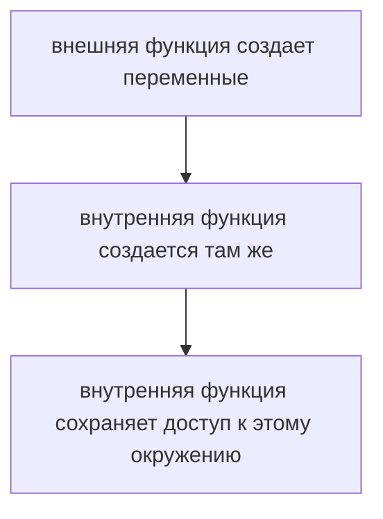
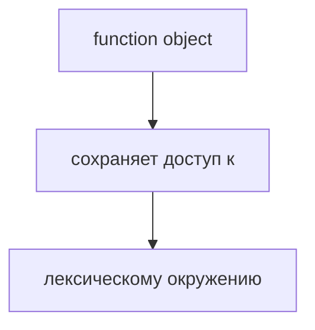
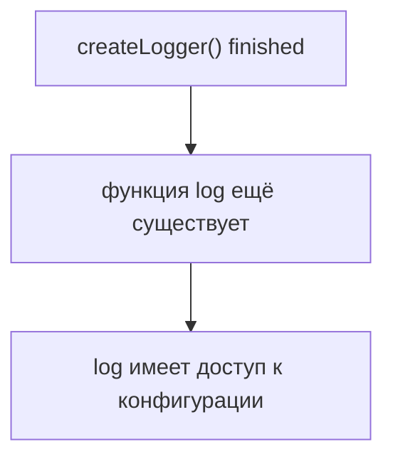
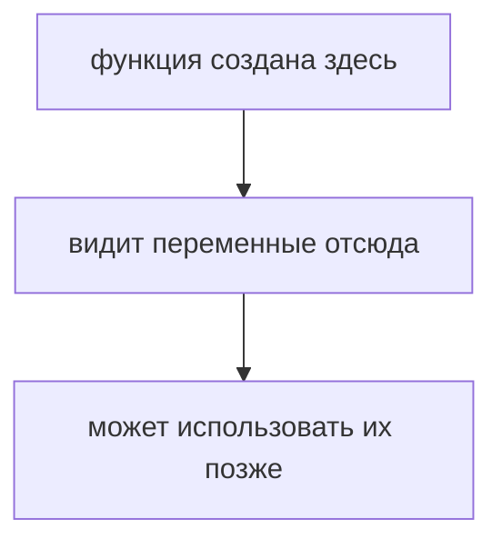
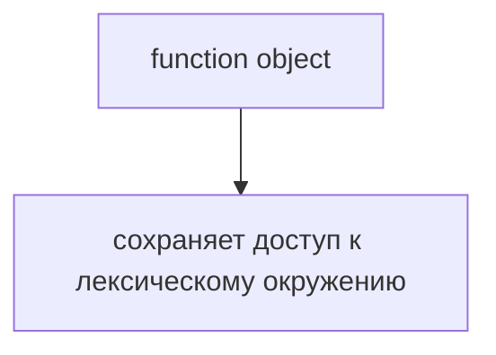

# Замыкания: углублённое повторение

## Связь с предыдущей главой

Предыдущий модуль завершился на Hoisting и TDZ:


```mermaid
flowchart TD
    N1["Execution Context"]
    N2["Call Stack"]
    N3["Memory Model"]
    N4["Hoisting + TDZ"]
    N1 --> N2
    N2 --> N3
    N3 --> N4
```

Мы увидели, что Execution Context создается, выполняется и затем уходит из Call Stack. Теперь появляется следующий вопрос: что происходит с данными, если функция уже завершилась, но другая функция все еще может читать ее переменные?

## Главный вопрос

> Почему функция может обращаться к переменным после того, как другая функция уже завершилась?

Ответ этой главы: из-за замыкания.

## Предварительные требования

Для этой главы нужно понимать:

* что вызов функции создает Function Execution Context;
* что локальные переменные обычно живут во время выполнения функции;
* что функции являются объектами, которые можно вернуть из другой функции;
* что объект может храниться и использоваться позже.

## Цели обучения

После главы вы будете понимать:

* зачем существуют Closures;
* как функция получает доступ к внешним переменным;
* почему данные могут продолжать существовать после завершения внешней функции;
* как Closure помогает хранить конфигурацию;
* почему Closure не является копией значений.

## Мотивация

В Automation QA Framework часто есть конфигурация:

```javascript
const configuration = {
  baseUrl: 'https://example.test',
  retries: 2,
};
```

Нужно создать helper, который помнит эту конфигурацию и использует ее позже:

```javascript
const createLogger = createConfiguredLogger(configuration);

createLogger('start test');
createLogger('finish test');
```

Внешняя функция уже завершилась, но logger продолжает помнить `configuration`. Это и есть задача Closure.

## Теория

Замыкание появляется, когда функция сохраняет доступ к лексическому окружению, в котором была создана.


```mermaid
flowchart TD
    N1["внешняя функция создает переменные"]
    N2["внутренняя функция создается там же"]
    N3["внутренняя функция сохраняет доступ к этому окружению"]
    N1 --> N2
    N2 --> N3
```

Важно: замыкание не копирует значения. Функция сохраняет доступ к окружению, где эти значения находятся.


```mermaid
flowchart TD
    N1["function object"]
    N2["сохраняет доступ к"]
    N3["лексическому окружению"]
    N1 --> N2
    N2 --> N3
```

## Внутренний механизм

Рассмотрим журналирование для раннера:

```javascript
function createLogger(configuration) {
  return function log(message) {
    console.log(`[${configuration.environment}] ${message}`);
  };
}
```

Когда вызывается `createLogger(configuration)`, создаётся контекст выполнения функции. Внутри него есть параметр `configuration`. Затем создаётся внутренняя функция `log`.

После завершения `createLogger()` её контекст выполнения уходит из стека вызовов, но `log` продолжает иметь доступ к тому лексическому окружению, где была создана.


```mermaid
flowchart TD
    N1["createLogger() finished"]
    N2["функция log ещё существует"]
    N3["log имеет доступ к конфигурации"]
    N1 --> N2
    N2 --> N3
```

Поэтому позже:

```javascript
log('start test');
```

все еще может прочитать `configuration.environment`.

### Доступ, а не копия — это проверяется

Утверждение «замыкание не копирует значения» легко принять на веру и ошибиться на практике. Вот проверка:

```javascript
const config = { env: 'local' };
const log = createLogger(config);

config.env = 'preview';
log('старт');   // [preview] старт
```

Функция создавалась, когда `env` был `local`, но читает актуальное значение. Замыкание сохранило доступ к окружению, а не снимок его содержимого.

Практическое следствие для тестов: если фабрика получила объект конфигурации, а кто-то его позже изменил, все созданные функции увидят изменение.

### Каждый вызов фабрики даёт своё окружение

Вторая важная сторона: окружения разных вызовов независимы.

```javascript
function createCounter() {
  let n = 0;
  return () => ++n;
}

const first = createCounter();
const second = createCounter();

first();    // 1
first();    // 2
second();   // 1 — своя переменная
```

Это прямое следствие главы 61: каждый вызов создаёт свой контекст выполнения, и замыкание связывается именно с ним.

### Классический случай: цикл и `var`

Разница между `var` и `let` в цикле — самый известный пример, где модель «доступ, а не копия» видна невооружённым глазом:

```javascript
const fns = [];
for (var i = 0; i < 3; i++) fns.push(() => i);
fns.map((f) => f());   // [3, 3, 3]

const fns2 = [];
for (let j = 0; j < 3; j++) fns2.push(() => j);
fns2.map((f) => f());  // [0, 1, 2]
```

С `var` переменная одна на весь цикл, и все три функции видят её финальное значение. С `let` на каждой итерации создаётся новая привязка — и каждая функция замыкается на свою.

Это не особенность замыканий, а особенность области видимости; но проявляется она именно через них.

### Зачем это в автотестах

Замыкание — механизм, на котором держатся привычные конструкции тестового кода:

- фабрика клиентов, запомнившая конфигурацию;
- обработчик, которому нужен идентификатор сценария;
- функция-предикат, использующая ожидаемое значение из теста;
- накопление данных между вызовами без глобальной переменной.

Обратная сторона та же, что у любого удержания ссылок: пока живёт функция, живёт и её окружение. Массив, замкнутый внутри долгоживущего обработчика, не будет освобождён — об этом главы 87 и 88.

## Главная ментальная модель

Главная модель главы: **замыкание сохраняет доступ к лексическому окружению**.


```mermaid
flowchart TD
    N1["функция создана здесь"]
    N2["видит переменные отсюда"]
    N3["может использовать их позже"]
    N1 --> N2
    N2 --> N3
```

Более точная формулировка:


```mermaid
flowchart TD
    N1["function object"]
    N2["сохраняет доступ к лексическому окружению"]
    N1 --> N2
```

## Практические примеры

Примеры находятся в:

```text
examples/01-javascript/chapter-65/
```

Запуск:

```bash
node examples/01-javascript/chapter-65/01-closure-configuration.js
node examples/01-javascript/chapter-65/02-logger-factory.js
node examples/01-javascript/chapter-65/03-retry-manager.js
node examples/01-javascript/chapter-65/04-reporter-state.js
```

## Пример Automation QA

Замыкание удобно использовать для создания вспомогательных функций с уже сохранённой настройкой:

```javascript
function createReporter(configuration) {
  const results = [];

  return function report(testName, status) {
    results.push({ testName, status });
    console.log(`${configuration.environment}: ${testName} -> ${status}`);
  };
}
```

`report` помнит и `configuration`, и `results`. Это позволяет накапливать данные отчёта без глобальной переменной.

В тестовом фреймворке замыкание полезно там, где вспомогательная функция должна помнить:

* `baseUrl`;
* имя окружения;
* количество повторов;
* список результатов;
* настройки логирования.

Это позволяет избегать глобального изменяемого состояния и передавать во вспомогательные функции только то, что действительно меняется.

### Фабрика клиента вместо параметра в каждом вызове

```javascript
function createClient(baseUrl, token) {
  return {
    get: path => request(`${baseUrl}${path}`, token),
    post: (path, body) => request(`${baseUrl}${path}`, token, body)
  };
}

const client = createClient(baseUrl, token);
```

Адрес стенда и токен заданы один раз и живут в замыкании. Вызовы становятся
короткими, а поменять окружение можно в одном месте — там, где клиент
создаётся.

Так устроены фикстуры: фикстура готовит окружение и отдаёт тесту функции,
которые это окружение помнят.

### Замыкание хранит ссылку, а не снимок

```javascript
const results = [];
const collect = value => results.push(value);

// Каждый тест, получивший collect, пишет в ОДИН И ТОТ ЖЕ массив.
```

Замыкание не копирует значения: оно сохраняет доступ к переменным. Если
вспомогательная функция создана на уровне модуля, состояние, которое она
помнит, общее для всех тестов файла.

Второе следствие — память: пока жива функция, живо и всё, что она удерживает.
Обработчик, замкнувший на себе крупный ответ или страницу, не даёт их
освободить до конца прогона.

## Распространённые мифы

**Миф: замыкание копирует значения переменных.**
Он сохраняет доступ к окружению. Изменение переменной снаружи будет видно внутри.

**Миф: после завершения внешней функции её переменные исчезают.**
Они живут, пока на окружение ссылается хотя бы одна функция.

**Миф: все функции, созданные одной фабрикой, делят состояние.**
Делят только созданные в одном вызове. Каждый вызов даёт своё окружение.

**Миф: `[3, 3, 3]` в цикле — ошибка замыканий.**
Это следствие того, что `var` создаёт одну переменную на весь цикл. С `let` результат ожидаемый.

**Миф: замыкание — редкая продвинутая техника.**
Любая функция, читающая переменную из внешней области, уже является замыканием.

## Частые вопросы

**Почему функция видит изменения переменной после создания?**
Она хранит доступ к окружению, а не копию значений.

**Как сделать независимые счётчики?**
Вызвать фабрику несколько раз: каждый вызов создаёт своё окружение.

**Почему в цикле все функции вернули одно число?**
Переменная объявлена через `var` и существует в одном экземпляре на весь цикл.

**Может ли замыкание удерживать память?**
Да: пока жива функция, живо и её окружение со всеми замкнутыми значениями.

**Как передать значение «снимком»?**
Скопировать его в локальную переменную внутри фабрики или передать параметром.

## Проверьте себя

1. Что сохраняет замыкание — значения или доступ к окружению?
2. Почему два вызова одной фабрики дают независимые счётчики?
3. Почему цикл с `var` даёт `[3, 3, 3]`, а с `let` — `[0, 1, 2]`?
4. Что происходит с переменными внешней функции после её завершения?
5. Как замыкание связано с потреблением памяти?

### Ответы

1. Доступ к окружению. Поэтому функция видит текущее значение переменной, а не то, что было на момент создания.
2. Каждый вызов создаёт своё окружение, и возвращённые функции удерживают разные окружения.
3. `var` не ограничена блоком: на все итерации приходится одна переменная, и после цикла в ней лежит `3`. `let` создаёт свою переменную на каждой итерации.
4. Они продолжают жить, пока на окружение ссылается хотя бы одна функция. Контекст вызова завершился, окружение — нет.
5. Удерживаемое окружение не может быть убрано из памяти. Замыкание, живущее долго и захватившее крупные данные, удерживает их вместе с собой.

## Распространённые ошибки

### Ошибка 1. Думать, что замыкание копирует значения

Замыкание сохраняет доступ к окружению, а не делает отдельного снимка всех данных.

### Ошибка 2. Искать переменную только в текущем контексте выполнения

Функция может читать переменные из окружения, где была создана.

### Ошибка 3. Использовать замыкание вместо явных параметров везде

Замыкание полезно, когда функция действительно должна помнить состояние или настройку. Если значение можно передать явно, это часто проще.

## Практическое использование

Замыкание помогает:

* хранить настройку вспомогательной функции;
* создавать журналирование с заранее выбранным окружением;
* накапливать результаты отчета;
* создавать управление повторами с внутренним счётчиком попыток.

## Практика

Практика находится в:

```text
practice/01-javascript/65-closures.md
```

Решения находятся в:

```text
solutions/01-javascript/65-closures.md
```

## Краткие итоги

Замыкание объясняет, почему функция может использовать переменные внешнего лексического окружения после завершения внешней функции.

Главное:

* функция сохраняет доступ к окружению, где была создана;
* замыкание не является копией значений;
* замыкание полезно для сохранения настройки и состояния;
* в Automation QA это помогает создавать вспомогательные функции без лишних глобальных переменных.

## Переход к следующей главе

Замыкание отвечает на вопрос:

> Какие переменные функция помнит?

Следующая глава отвечает на другой вопрос:

> На какой объект указывает `this` при вызове функции?
