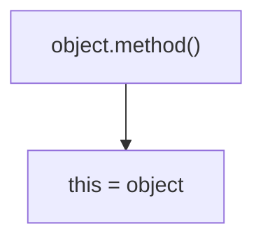
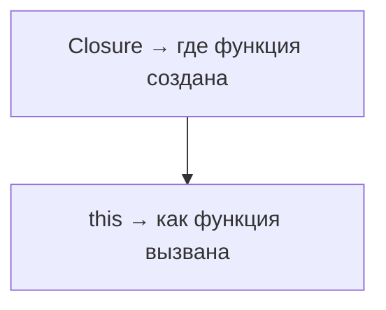
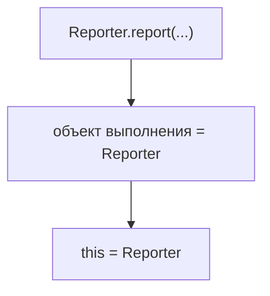
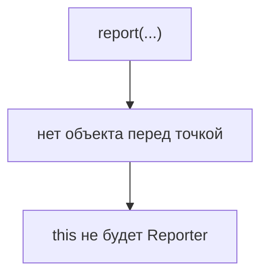
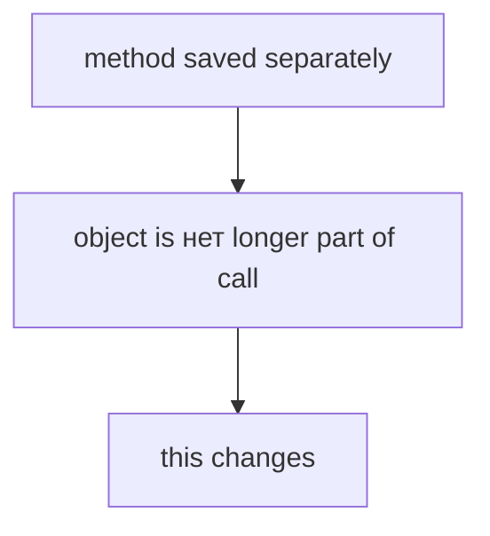

# this

## Связь с предыдущей главой

Предыдущая глава объяснила Closure: функция может сохранять доступ к лексическому окружению, где была создана.

Теперь мы смотрим на другую часть поведения функций. Функция может быть вызвана как метод объекта:

```javascript
logger.log('start test');
```

Внутри `log` может использоваться `this`. Нужно понять, на что он указывает.

## Главный вопрос

> Что означает `this`?

Ответ этой главы: `this` зависит от того, как функция вызвана.

## Предварительные требования

Для этой главы нужно понимать:

* что функция может быть свойством объекта;
* что объект может хранить данные и методы;
* что вызов функции создает Execution Context;
* что Closure и `this` решают разные задачи.

## Цели обучения

После главы вы будете понимать:

* зачем нужен `this`;
* как обычный вызов метода определяет `this`;
* почему потеря связи с объектом меняет поведение;
* чем `this` отличается от Closure;
* почему эта тема важна для вспомогательных функций и объектов отчетности.

## Мотивация

В Automation QA Framework может быть объект logger:

```javascript
const Logger = {
  prefix: 'smoke',
  log(message) {
    console.log(`[${this.prefix}] ${message}`);
  },
};
```

Когда мы вызываем:

```javascript
Logger.log('start test');
```

`this` внутри `log` указывает на `Logger`.

Но если сохранить метод отдельно:

```javascript
const log = Logger.log;
log('start test');
```

связь с объектом теряется. Поэтому `this` нельзя понимать как "объект, где функция была объявлена". Важно смотреть на форму вызова.

## Теория

`this` — это значение, которое JavaScript определяет во время вызова функции.

Для обычного вызова метода:



Это правило относится к обычному вызову метода, который рассматривается в этой главе. Другие формы вызова будут изучаться дальше.

`this` не является Closure. Closure связан с местом создания функции. `this` связан с тем, как функция вызвана.



## Внутренний механизм

Пример:

```javascript
const Reporter = {
  name: 'console reporter',
  report(testName) {
    console.log(`${this.name}: ${testName}`);
  },
};

Reporter.report('login');
```

JavaScript видит форму вызова:



Если метод отделить:

```javascript
const report = Reporter.report;
report('login');
```

вызов уже не имеет объекта выполнения перед точкой.



## Главная ментальная модель

Главная модель главы: **`this` зависит от формы вызова функции**.




## Практические примеры

Примеры находятся в:

```text
examples/01-javascript/chapter-66/
```

Запуск:

```bash
node examples/01-javascript/chapter-66/01-method-this.js
node examples/01-javascript/chapter-66/02-reporter-this.js
node examples/01-javascript/chapter-66/03-lost-context.js
node examples/01-javascript/chapter-66/04-closure-vs-this.js
```

## Пример Automation QA

Reporter часто хранит настройки внутри объекта:

```javascript
const Reporter = {
  environment: 'staging',
  report(testName, status) {
    console.log(`${this.environment}: ${testName} -> ${status}`);
  },
};
```

Пока вызов выглядит как `Reporter.report(...)`, `this` указывает на `Reporter`.

## Распространённые ошибки

### Ошибка 1. Думать, что `this` определяется местом объявления функции

Для обычного метода важна форма вызова, а не место написания функции.

### Ошибка 2. Терять метод при передаче

Если сохранить метод в переменную, объект перед точкой исчезает.

### Ошибка 3. Путать Closure и `this`

Closure сохраняет доступ к лексическому окружению. `this` определяется вызовом.

## Практическое использование

Понимание `this` помогает:

* проектировать методы logger/reporter;
* читать ошибки при передаче методов как обратных вызовов;
* понимать, почему helper потерял доступ к данным объекта;
* заранее видеть риск потери контекста.

## Использование в Automation QA

В тестовых фреймворках `this` часто важен для:

* методов reporter;
* методов logger;
* вспомогательных функций API client;
* retry managers;
* объектов с конфигурацией.

Если метод зависит от `this`, его нельзя бездумно отделять от объекта.

## Практика

Практика находится в:

```text
practice/01-javascript/66-this.md
```

Решения находятся в:

```text
solutions/01-javascript/66-this.md
```

## Краткие итоги

`this` показывает, с каким объектом выполняется функция в конкретном вызове.

Главное:

* для `object.method()` значение `this` — это `object`;
* `this` определяется во время вызова;
* потеря объекта перед точкой меняет поведение;
* Closure и `this` решают разные задачи.

## Переход к следующей главе

Теперь понятно, что обычный вызов метода сам определяет `this`.

Следующий вопрос:

> Что делать, если нужно выбрать `this` явно?

Для этого существуют `call()`, `apply()` и `bind()`.
