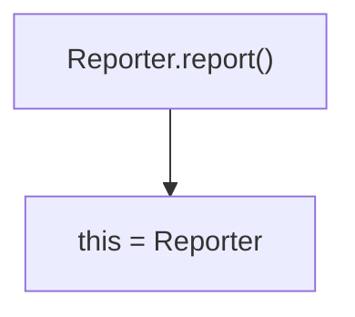
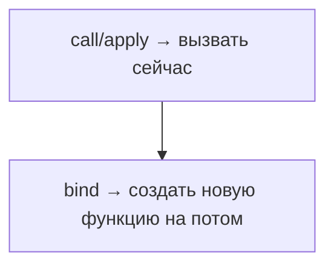
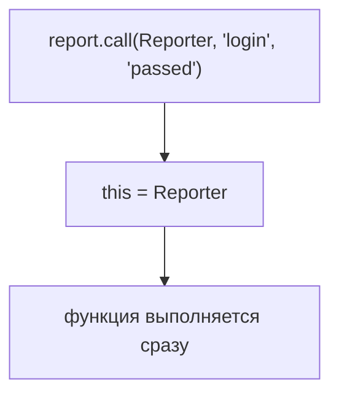
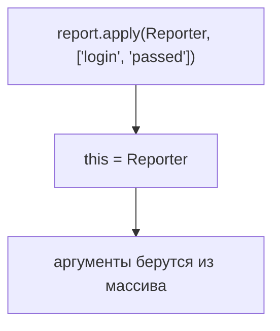
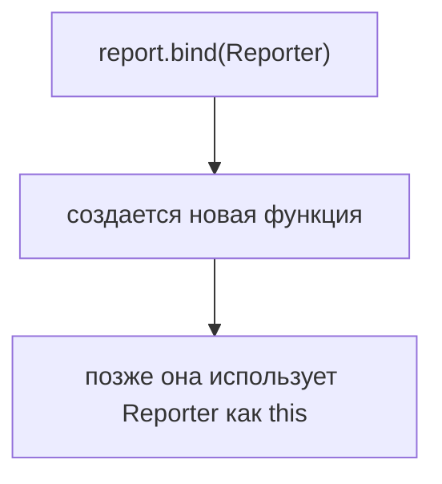
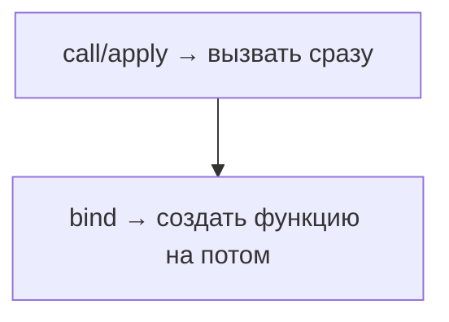
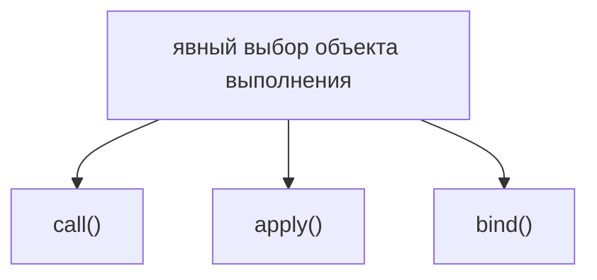
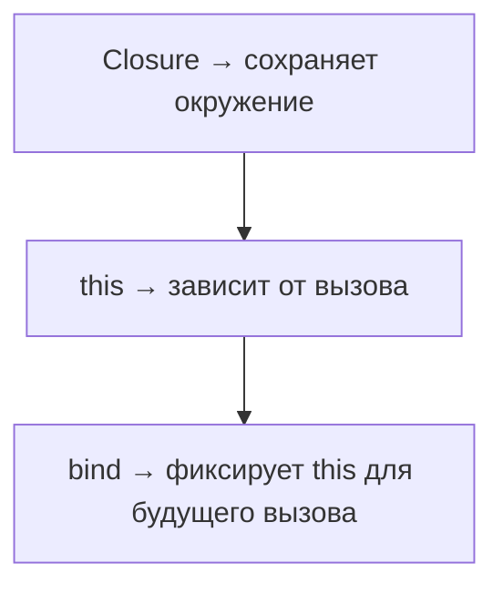

# call(), apply(), bind()

## Связь с предыдущей главой

Предыдущая глава объяснила, что `this` зависит от формы вызова.

Обычный вызов:



Но иногда обычной формы вызова недостаточно. Метод может быть отделен от объекта, передан как обратный вызов или использоваться с другим объектом выполнения.

## Главный вопрос

> Как явно выбрать `this`?

Ответ этой главы: использовать `call()`, `apply()` и `bind()`.

## Предварительные требования

Для этой главы нужно понимать:

* что `this` определяется во время вызова;
* что метод можно отделить от объекта;
* что функция является объектом;
* что `this` и Closure не одно и то же.

## Цели обучения

После главы вы будете понимать:

* зачем нужны `call()`, `apply()` и `bind()`;
* чем `call()` отличается от `apply()`;
* почему `bind()` не вызывает функцию сразу;
* как восстановить потерянный контекст;
* как применять это во вспомогательных logger/reporter функциях.

## Мотивация

Есть Reporter:

```javascript
const Reporter = {
  environment: 'staging',
  report(testName, status) {
    console.log(`${this.environment}: ${testName} -> ${status}`);
  },
};
```

Обычный вызов работает:

```javascript
Reporter.report('login', 'passed');
```

Но отделенный метод теряет объект:

```javascript
const report = Reporter.report;
report('login', 'passed');
```

Нужно явно сказать JavaScript, какой объект использовать как `this`.

## Теория

`call()` вызывает функцию сразу и принимает аргументы отдельно:

```javascript
fn.call(objectForThis, arg1, arg2);
```

`apply()` тоже вызывает функцию сразу, но принимает аргументы массивом или array-like collection:

```javascript
fn.apply(objectForThis, [arg1, arg2]);
```

`bind()` не вызывает функцию сразу. Он создает новую функцию с заранее привязанным `this`:

```javascript
const boundFn = fn.bind(objectForThis);
```

Главная разница:



## Внутренний механизм

Для `call()`:



Для `apply()`:



Для `bind()`:



`bind()` особенно полезен, когда функция будет вызвана позже.

## Главная ментальная модель

Главная модель главы:





## Практические примеры

Примеры находятся в:

```text
examples/01-javascript/chapter-67/
```

Запуск:

```bash
node examples/01-javascript/chapter-67/01-call.js
node examples/01-javascript/chapter-67/02-apply.js
node examples/01-javascript/chapter-67/03-bind.js
node examples/01-javascript/chapter-67/04-restore-context.js
```

## Пример Automation QA

Logger можно привязать к конфигурации:

```javascript
const Logger = {
  prefix: 'api',
  log(message) {
    console.log(`[${this.prefix}] ${message}`);
  },
};

const logApi = Logger.log.bind(Logger);
logApi('request started');
```

Теперь `logApi` можно передать дальше, и он сохранит нужный `this`.

## Распространённые ошибки

### Ошибка 1. Думать, что `bind()` вызывает функцию сразу

`bind()` возвращает новую функцию. Чтобы выполнить код, эту новую функцию нужно вызвать.

### Ошибка 2. Путать `call()` и `apply()`

Оба вызывают функцию сразу. Разница только в форме передачи аргументов.

### Ошибка 3. Использовать `bind()` там, где достаточно обычного вызова

Если метод вызывается как `object.method()`, явная привязка часто не нужна.

## Практическое использование

`call()`, `apply()` и `bind()` помогают:

* восстановить потерянный `this`;
* переиспользовать метод с другим объектом;
* передать метод как обратный вызов без потери контекста;
* создать заранее настроенную функцию для reporter/logger.

## Использование в Automation QA

В Automation QA это встречается, когда:

* метод reporter передается как обратный вызов;
* метод logger сохраняется в переменную;
* helper использует общий метод с разной конфигурацией;
* RetryManager должен передать метод без потери `this`.

## Практика

Практика находится в:

```text
practice/01-javascript/67-call-apply-bind.md
```

Решения находятся в:

```text
solutions/01-javascript/67-call-apply-bind.md
```

## Краткие итоги

`call()`, `apply()` и `bind()` дают явный контроль над `this`.

Главное:

* `call()` вызывает функцию сразу с отдельными аргументами;
* `apply()` вызывает функцию сразу с массивом аргументов;
* `bind()` создает новую функцию для будущего вызова;
* это полезно при потере контекста.

## Переход к следующей главе

Теперь у нас есть три части:



Следующая глава соединит их в практическом управлении контекстом.
