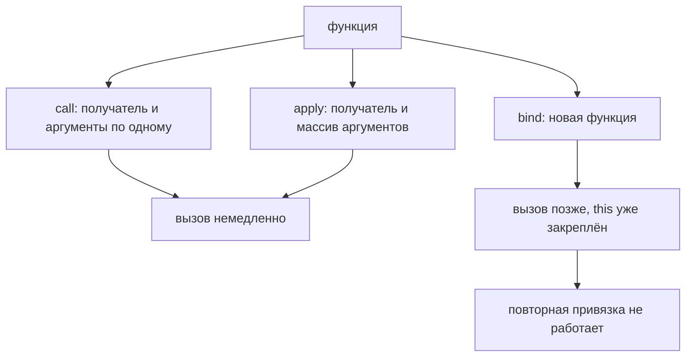

# `call()`, `apply()`, `bind()`

## Связь с предыдущей главой

Предыдущая глава объяснила, что `this` зависит от формы вызова.

Обычный вызов:

Но иногда обычной формы вызова недостаточно. Метод может быть отделен от объекта, передан как обратный вызов или использоваться с другим объектом выполнения.

## Главный вопрос

> Как явно выбрать `this`?

Ответ этой главы: использовать `call()`, `apply()` и `bind()`.

## Предварительные требования

Для этой главы нужно понимать:

* что `this` определяется во время вызова;
* что метод можно отделить от объекта;
* что функция является объектом;
* что `this` и Closure не одно и то же.

## Цели обучения

После главы вы будете понимать:

* зачем нужны `call()`, `apply()` и `bind()`;
* чем `call()` отличается от `apply()`;
* почему `bind()` не вызывает функцию сразу;
* как восстановить потерянный контекст;
* как применять это во вспомогательных logger/reporter функциях.

## Мотивация

Есть Reporter:

```javascript
const Reporter = {
  environment: 'staging',
  report(testName, status) {
    console.log(`${this.environment}: ${testName} -> ${status}`);
  },
};
```

Обычный вызов работает:

```javascript
Reporter.report('login', 'passed');
```

Но отделенный метод теряет объект:

```javascript
const report = Reporter.report;
report('login', 'passed');
```

Нужно явно сказать JavaScript, какой объект использовать как `this`.

## Теория

### Три способа задать `this` явно

Предыдущая глава показала: `this` определяется формой вызова, и при отделении метода привязка теряется. Эти три метода позволяют задать её самостоятельно.

`call()` вызывает функцию сразу и принимает аргументы отдельно:

```javascript
fn.call(objectForThis, arg1, arg2);
```

`apply()` тоже вызывает функцию сразу, но принимает аргументы массивом или массивоподобной коллекцией:

```javascript
fn.apply(objectForThis, [arg1, arg2]);
```

`bind()` не вызывает функцию сразу. Он создаёт новую функцию с заранее привязанным `this`:

```javascript
const boundFn = fn.bind(objectForThis);
```

### Главная разница

| Метод | Когда выполняется | Как передаются аргументы | Что возвращает |
| --- | --- | --- | --- |
| `call()` | немедленно | по одному | результат функции |
| `apply()` | немедленно | массивом | результат функции |
| `bind()` | **позже** | по одному, можно заранее | **новую функцию** |

Между `call()` и `apply()` разница только в форме передачи аргументов. Между ними и `bind()` — принципиальная: первые два вызывают, третий готовит.

### `bind()` умеет частичное применение

Аргументы, переданные в `bind()`, закрепляются за новой функцией:

```javascript
function greet(greeting, mark) {
  return `${greeting}, ${this.name}${mark}`;
}

const bound = greet.bind({ name: 'QA' }, 'Привет');
bound('!');   // 'Привет, QA!'
```

Первый аргумент задан заранее, второй передаётся при вызове. Это удобно для колбэков, которым нужно передать контекст и часть данных.

### Привязка необратима

Свойство, которое удивляет при первом столкновении: повторный `bind()` не меняет уже привязанный `this`.

```javascript
const bound = greet.bind({ name: 'QA' });
const rebound = bound.bind({ name: 'Другой' });

rebound('Привет', '!');   // 'Привет, QA!' — первая привязка сохранилась
```

То же касается `call()` и `apply()` на связанной функции: они не переопределят `this`. Привязка делается один раз и навсегда.

Есть и одно исключение: вызов через `new` игнорирует привязанный `this` и создаёт новый объект, как обычно.

Три способа задать получателя, два из них вызывают сразу:


```mermaid
flowchart TD
    A["функция"] --> B["call: получатель и аргументы по одному"]
    A --> C["apply: получатель и массив аргументов"]
    A --> D["bind: новая функция"]
    B --> E["вызов немедленно"]
    C --> E
    D --> F["вызов позже, this уже закреплён"]
    F --> G["повторная привязка не работает"]
```

## Внутренний механизм

### Что делает каждый метод

**Для `call()`:** движок берёт функцию, подставляет переданный объект как `this`, раскладывает остальные аргументы по параметрам и выполняет тело — прямо сейчас.

**Для `apply()`:** то же самое, но аргументы берутся из переданной коллекции по порядку. Функция может быть любой, а коллекция — массивом или массивоподобным объектом.

**Для `bind()`:** движок создаёт **новую** функцию-обёртку, которая запоминает объект для `this` и заранее заданные аргументы. Исходная функция не изменяется, а вызов происходит только тогда, когда вызовут обёртку.

Что новая функция действительно новая, видно по её свойствам: `bound !== greet`, а имя становится `bound greet` — это помогает узнавать связанные функции в трассировках ошибок.

### `bind()` полезен там, где вызов произойдёт позже

Типичная ситуация — передача метода туда, откуда его вызовут без объекта:

```javascript
setTimeout(Reporter.report.bind(Reporter), 0);
items.forEach(Reporter.report.bind(Reporter));
```

Альтернатива — стрелочная обёртка `() => Reporter.report()`. Она читается проще и не создаёт вопросов о необратимости привязки, поэтому в современном коде встречается чаще. `bind()` остаётся полезен, когда нужно именно частичное применение или когда функцию передают дальше по коду.

## Главная ментальная модель

Главная модель главы: **`call()` и `apply()` вызывают сейчас, `bind()` готовит на потом**.

Вопрос для выбора: нужен результат немедленно или нужна функция, которую вызовут позже?

| Задача | Метод |
| --- | --- |
| выполнить с чужим `this` прямо сейчас | `call()` |
| то же, но аргументы уже в массиве | `apply()` |
| передать метод в колбэк, сохранив `this` | `bind()` или стрелка |
| закрепить часть аргументов заранее | `bind()` |

## Практические примеры

Примеры находятся в:

```text
examples/01-javascript/chapter-67/
```

Запуск:

```bash
node examples/01-javascript/chapter-67/01-call.js
node examples/01-javascript/chapter-67/02-apply.js
node examples/01-javascript/chapter-67/03-bind.js
node examples/01-javascript/chapter-67/04-restore-context.js
```

## Пример Automation QA

Потеря `this` в автотестах случается в четырёх похожих местах: метод отчётности
передан как обратный вызов, метод журналирования сохранён в переменную,
вспомогательная функция вызвана с чужим объектом настройки, управление повторами
передаёт метод дальше. Во всех четырёх помогает явная привязка.

Журналирование можно привязать к настройке:

```javascript
const Logger = {
  prefix: 'api',
  log(message) {
    console.log(`[${this.prefix}] ${message}`);
  },
};

const logApi = Logger.log.bind(Logger);
logApi('request started');
```

Теперь `logApi` можно передать дальше, и он сохранит нужный `this`.

### Что выбрать в тестовом коде

| Задача | Метод |
| --- | --- |
| вызвать метод для другого объекта прямо сейчас | `call()` |
| аргументы уже собраны в массив | `apply()` |
| функцию нужно передать и вызовут её позже | `bind()` |

Третья строка встречается чаще двух первых: метод объекта страницы или клиента
API уходит в обратный вызов, в обработчик события или в очередь задач — и там
объекта слева от точки уже нет.

### Частичное применение для настроек

```javascript
function request(baseUrl, path) {
  return `${baseUrl}${path}`;
}

const stand = request.bind(null, 'http://127.0.0.1:4310');

console.log(stand('/work-items'));
```

`bind()` закрепляет не только объект выполнения, но и первые аргументы. Для
тестов это способ зафиксировать адрес стенда или окружение один раз и дальше
передавать функцию, которой нужен только путь.

Привязка необратима: повторный `bind()` над уже связанной функцией объект
выполнения не поменяет. Это свойство защищает от случайной переустановки
контекста дальше по коду.

## Распространённые мифы

**Миф: `bind()` вызывает функцию.**
Он возвращает новую функцию. Вызов происходит позже.

**Миф: привязку можно переопределить повторным `bind()`.**
Нельзя: сохранится первая. `call()` и `apply()` на связанной функции тоже её не изменят.

**Миф: `call()` и `apply()` отличаются поведением.**
Отличается только форма передачи аргументов.

**Миф: `bind()` изменяет исходную функцию.**
Исходная остаётся прежней; создаётся новая функция-обёртка.

**Миф: `new` на связанной функции использует привязанный объект.**
Он игнорируется: `new` всегда создаёт новый объект.

## Частые вопросы

**Что выбрать для колбэка — `bind()` или стрелку?**
Стрелка читается проще. `bind()` нужен для частичного применения или когда функцию передают дальше.

**Как передать аргументы, которые уже лежат в массиве?**
Через `apply()` или через раскрытие: `fn(...args)`.

**Как узнать связанную функцию в трассировке?**
По имени вида `bound greet`.

**Можно ли «отвязать» функцию?**
Нет. Нужно взять исходную функцию и привязать заново.

**Зачем вообще нужен `call()`, если есть обычный вызов?**
Чтобы выполнить функцию с объектом, которому она не принадлежит.

## Проверьте себя

1. Чем `bind()` принципиально отличается от `call()` и `apply()`?
2. В чём единственная разница между `call()` и `apply()`?
3. Что вернёт повторный `bind()` с другим объектом?
4. Как выглядит имя связанной функции и зачем это знать?
5. Что произойдёт при вызове связанной функции через `new`?

### Ответы

1. `bind()` не вызывает функцию, а возвращает новую с закреплённым объектом выполнения. `call()` и `apply()` вызывают немедленно.
2. Способ передачи аргументов: перечислением через запятую или массивом.
3. Ту же связь, что и первый: повторный `bind()` объект выполнения не меняет. Первое закрепление окончательно.
4. К исходному имени добавляется префикс `bound`, например `bound validateStatus`. Это помогает узнать связанную функцию в трассировке стека.
5. Закреплённый объект выполнения игнорируется: `new` создаёт новый объект и делает его `this`. Аргументы, закреплённые при `bind()`, при этом сохраняются.

## Распространённые ошибки

### Ошибка 1. Думать, что `bind()` вызывает функцию сразу

`bind()` возвращает новую функцию. Чтобы выполнить код, эту новую функцию нужно вызвать.

### Ошибка 2. Путать `call()` и `apply()`

Оба вызывают функцию сразу. Разница только в форме передачи аргументов.

### Ошибка 3. Использовать `bind()` там, где достаточно обычного вызова

Если метод вызывается как `object.method()`, явная привязка часто не нужна.

## Практическое использование

`call()`, `apply()` и `bind()` помогают:

* восстановить потерянный `this`;
* переиспользовать метод с другим объектом;
* передать метод как обратный вызов без потери контекста;
* создать заранее настроенную функцию для отчётности или журналирования.

## Практика

Практика находится в:

```text
practice/01-javascript/67-call-apply-bind.md
```

Решения находятся в:

```text
solutions/01-javascript/67-call-apply-bind.md
```

## Краткие итоги

`call()`, `apply()` и `bind()` дают явный контроль над `this`.

Главное:

* `call()` вызывает функцию сразу с отдельными аргументами;
* `apply()` вызывает функцию сразу с массивом аргументов;
* `bind()` создает новую функцию для будущего вызова;
* это полезно при потере контекста.

## Переход к следующей главе

Теперь у нас есть три части:

Следующая глава соединит их в практическом управлении контекстом.
