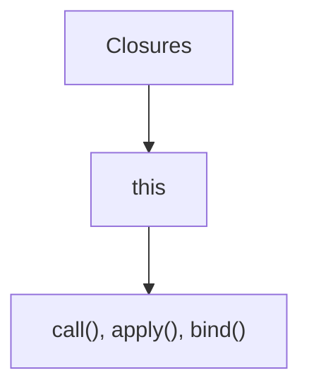
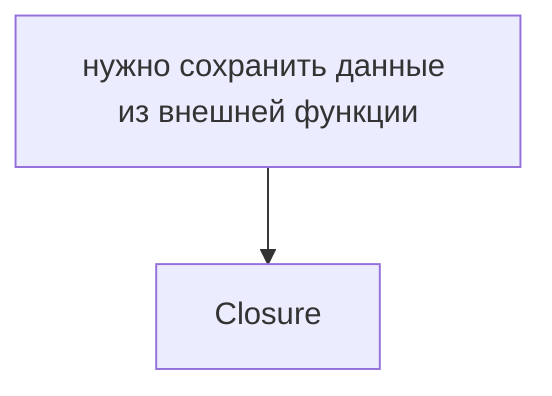
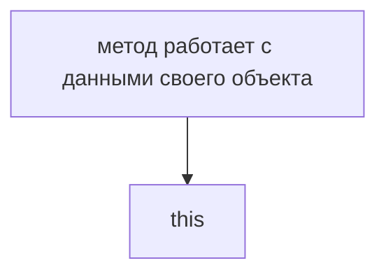
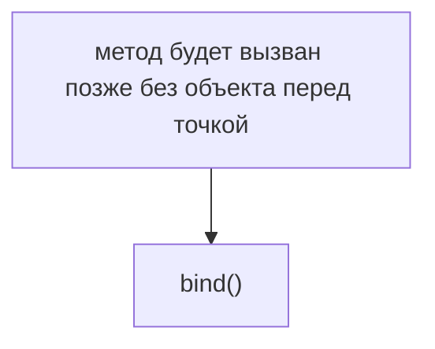
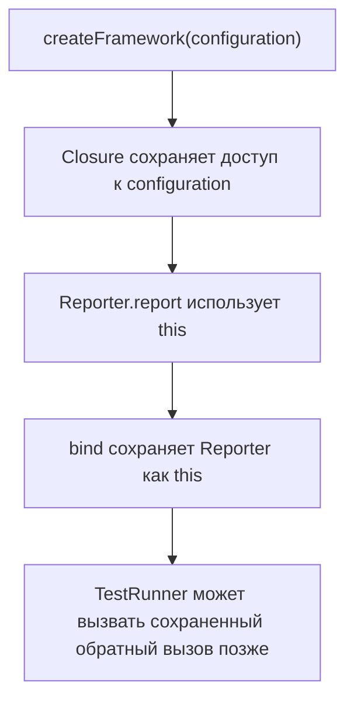
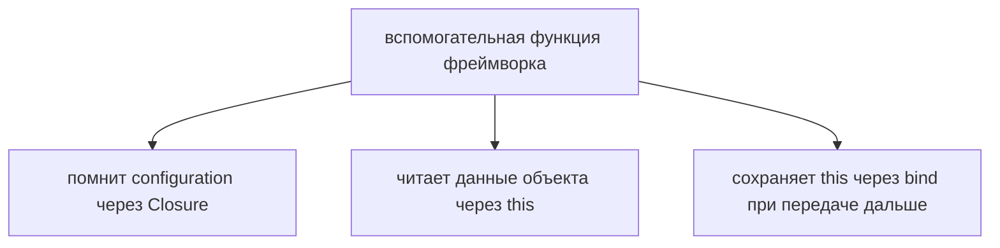
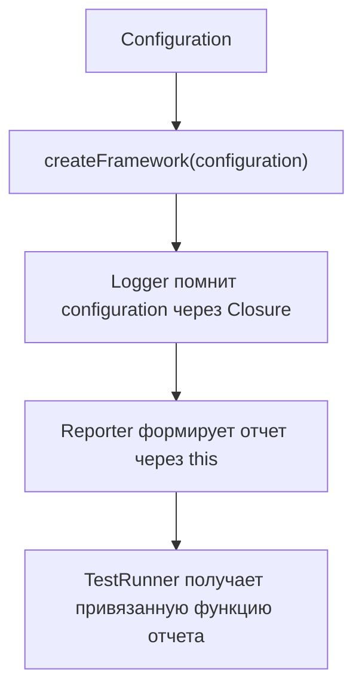
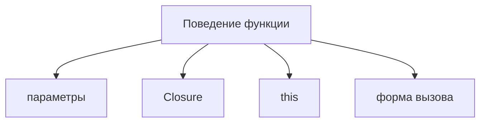

# Практическое управление контекстом

## Связь с предыдущей главой

Предыдущие главы собрали три механизма:



Теперь нужно увидеть, как они работают вместе в инженерном коде.

## Главный вопрос

> Как Closure, `this` и явное управление контекстом работают вместе?

Ответ этой главы: через практическое управление состоянием и контекстом выполнения.

## Предварительные требования

Для этой главы нужно понимать:

* что Closure сохраняет доступ к лексическому окружению;
* что `this` зависит от формы вызова;
* что `call()` и `apply()` вызывают функцию сразу;
* что `bind()` создает новую функцию с привязанным `this`.

## Цели обучения

После главы вы будете понимать:

* когда использовать Closure;
* когда использовать `this`;
* когда нужен `bind()`;
* как избежать потери контекста;
* как проектировать вспомогательные функции для фреймворка Automation QA.

## Мотивация

В реальном Automation QA Framework есть несколько частей:

```text
Configuration
Logger
Reporter
RetryManager
TestRunner
```

Им нужно взаимодействовать:

* configuration должна сохраняться;
* logger должен помнить prefix;
* reporter должен использовать свой `this`;
* retry helper должен хранить счетчик;
* методы могут передаваться как обратные вызовы.

Если не понимать Closure и `this`, такие вспомогательные функции быстро становятся хрупкими.

## Теория

Правило выбора:







`call()` и `apply()` полезны, когда нужно выполнить функцию сразу с явно выбранным `this`.

## Внутренний механизм

Соберем схему:



Ключевая разница:

```text
Closure сохраняет состояние
this выбирает объект выполнения
bind сохраняет объект выполнения на будущее
```

Если функция читает `configuration` из внешней функции — это Closure.

Если функция читает `this.name` — это `this`.

Если функция должна сохранить правильный `this` после передачи — нужен `bind()`.

## Главная ментальная модель

Главная модель главы:

```text
Closure сохраняет состояние
this выбирает объект выполнения
bind сохраняет объект выполнения
```



## Практические примеры

Примеры находятся в:

```text
examples/01-javascript/chapter-68/
```

Запуск:

```bash
node examples/01-javascript/chapter-68/01-framework-factory.js
node examples/01-javascript/chapter-68/02-bound-reporter.js
node examples/01-javascript/chapter-68/03-retry-manager.js
node examples/01-javascript/chapter-68/04-complete-flow.js
```

## Пример Automation QA

Практический поток:



Такой код легче сопровождать, потому что видно:

* где хранится состояние;
* где используется объект;
* где контекст привязан явно;
* где функция вызывается позже.

## Распространённые ошибки

### Ошибка 1. Использовать `this` для данных, которые лучше сохранить через Closure

Если данные приходят из factory function, часто Closure проще и надежнее.

### Ошибка 2. Использовать Closure там, где метод должен работать с объектом

Если функция является поведением объекта и читает его поля, `this` может быть естественным решением.

### Ошибка 3. Передавать метод без `bind()`

Если метод зависит от `this`, при передаче его как обратный вызов нужно явно сохранить объект выполнения.

## Практическое использование

Context management помогает проектировать:

* фабрики logger;
* объекты reporter;
* вспомогательные функции для повторов;
* тестовые раннеры;
* общие утилиты конфигурации.

Важная инженерная привычка: перед передачей функции дальше спросить, от чего она зависит — от Closure, от `this` или от явных параметров.

## Использование в Automation QA

В Automation QA это напрямую влияет на стабильность кода фреймворка.

Например:

* logger сохраняет configuration через Closure;
* reporter использует `this.reportName`;
* `reporter.report.bind(reporter)` безопасно передается в TestRunner;
* RetryManager хранит счетчик попыток в Closure.

Такой код проще отлаживать, потому что зависимости функции видны явно.

## Практика

Практика находится в:

```text
practice/01-javascript/68-context-management.md
```

Решения находятся в:

```text
solutions/01-javascript/68-context-management.md
```

## Краткие итоги

Практическое управление контекстом соединяет несколько механизмов.

Главное:

* Closure сохраняет состояние;
* `this` выбирает объект выполнения;
* `call()` и `apply()` вызывают функцию сразу с выбранным `this`;
* `bind()` создает функцию с сохраненным `this`;
* в Automation QA это помогает строить надежные вспомогательные функции и объекты отчетности.

## Переход к следующей главе

Модуль завершает более полную модель поведения функции:



Параметры передают данные в вызов, Closure сохраняет доступ к окружению, `this` выбирает объект выполнения, а форма вызова определяет, как функция будет выполнена.

Дальше можно изучать следующие механизмы JavaScript, уже понимая, как функции сохраняют данные и как управляется контекст выполнения.
