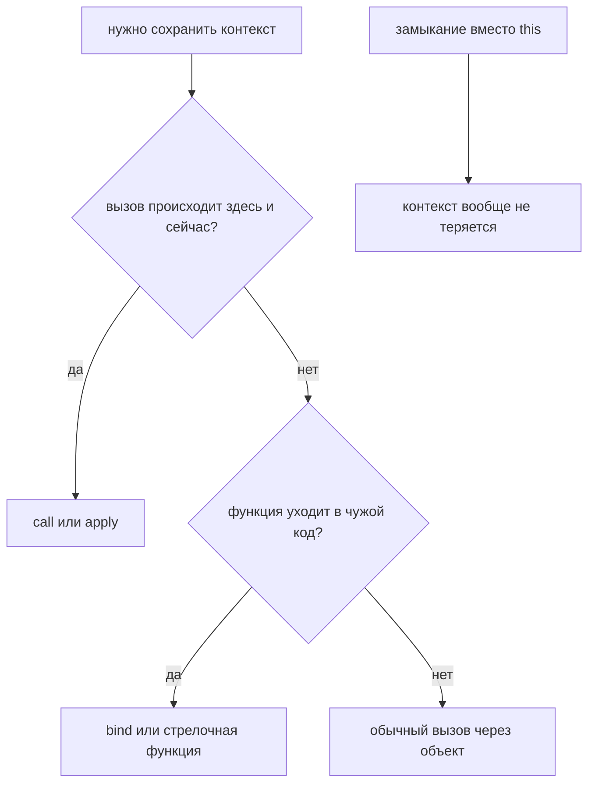

# Практическое управление контекстом

## Связь с предыдущей главой

Предыдущие главы собрали три механизма:

Теперь нужно увидеть, как они работают вместе в инженерном коде.

## Главный вопрос

> Как замыкание, `this` и явное управление контекстом работают вместе?

Ответ этой главы: через практическое управление состоянием и контекстом выполнения.

## Предварительные требования

Для этой главы нужно понимать:

* что Closure сохраняет доступ к лексическому окружению;
* что `this` зависит от формы вызова;
* что `call()` и `apply()` вызывают функцию сразу;
* что `bind()` создает новую функцию с привязанным `this`.

## Цели обучения

После главы вы будете понимать:

* когда использовать Closure;
* когда использовать `this`;
* когда нужен `bind()`;
* как избежать потери контекста;
* как проектировать вспомогательные функции для фреймворка Automation QA.

## Мотивация

В реальном Automation QA Framework есть несколько частей:

```text
Configuration
Logger
Reporter
RetryManager
TestRunner
```

Им нужно взаимодействовать:

* configuration должна сохраняться;
* logger должен помнить prefix;
* reporter должен использовать свой `this`;
* retry helper должен хранить счетчик;
* методы могут передаваться как обратные вызовы.

Если не понимать Closure и `this`, такие вспомогательные функции быстро становятся хрупкими.

## Теория

### Три механизма, которые часто путают

Эта глава сводит вместе то, что разбиралось по отдельности. Все три механизма отвечают на вопрос «откуда функция берёт данные», но на разные его части:

| Механизм | Отвечает на вопрос | Определяется |
| --- | --- | --- |
| Замыкание | откуда функция видит внешние переменные? | местом **создания** |
| `this` | к какому объекту относится вызов? | формой **вызова** |
| `bind()` | как сохранить объект на будущее? | явным решением разработчика |

Ошибки в этой области почти всегда возникают из-за смешения первых двух: разработчик ожидает, что `this` ведёт себя как замкнутая переменная, то есть определяется местом написания кода. Это не так.

### Правило выбора

Практический порядок такой:

1. функция читает переменную из внешней функции — это **замыкание**, ничего делать не нужно;
2. функция читает `this.something` и вызывается через объект — работает само;
3. функция читает `this.something`, но передаётся куда-то — нужен **`bind()`** или стрелочная обёртка;
4. функцию нужно выполнить с чужим объектом прямо сейчас — нужен **`call()`** или `apply()`.

`call()` и `apply()` полезны, когда нужно выполнить функцию сразу с явно выбранным `this`.

### Стрелка как альтернатива `bind()`

Современный код чаще решает третий пункт стрелкой, а не `bind()`:

```javascript
setTimeout(() => reporter.report('login'), 0);     // читается прямо
setTimeout(reporter.report.bind(reporter, 'login'), 0);
```

Обе записи работают. Стрелка выигрывает в читаемости и не порождает вопросов о необратимости привязки; `bind()` уместен, когда связанную функцию нужно передать дальше как значение.

### Зачем вообще разделять эти понятия

Ответ практический: они ломаются по-разному, и починка у них разная.

| Симптом | Скорее всего | Что делать |
| --- | --- | --- |
| `this.x` — `undefined` у переданного метода | потеряна привязка | `bind()` или стрелка |
| функция видит устаревшее значение | замыкание на изменяемый объект | передавать копию или значение |
| все функции из цикла дают одно число | `var` вместо `let` | сменить объявление |
| `this` в стрелке-методе не тот | стрелка вместо метода | сделать обычным методом |

Эта таблица и есть практическая ценность главы: по симптому видно, какой из трёх механизмов задействован.

Выбор механизма зависит от момента вызова:


```mermaid
flowchart TD
    A["нужно сохранить контекст"] --> B{"вызов происходит здесь и сейчас?"}
    B -- "да" --> C["call или apply"]
    B -- "нет" --> D{"функция уходит в чужой код?"}
    D -- "да" --> E["bind или стрелочная функция"]
    D -- "нет" --> F["обычный вызов через объект"]
    G["замыкание вместо this"] --> H["контекст вообще не теряется"]
```

## Внутренний механизм

### Схема принятия решения

```text
Closure  сохраняет доступ к окружению создания
this     выбирает объект выполнения в момент вызова
bind     закрепляет объект выполнения на будущее
```

Если функция читает `configuration` из внешней функции — это замыкание: она получит актуальное значение из окружения, где была создана.

Если функция читает `this.name` — это `this`: значение определится тем, как её вызовут.

Если функция должна сохранить правильный `this` после передачи — нужен `bind()` или стрелочная обёртка.

### Почему замыкание надёжнее привязки

Полезное наблюдение из практики: замыкание нельзя потерять при передаче функции, а привязку `this` — можно.

```javascript
function createReporter(name) {
  return (test) => `${name}: ${test}`;   // name замкнут, передача безопасна
}
```

Такую функцию можно передавать куда угодно — она продолжит работать. Метод объекта, читающий `this.name`, при той же передаче сломается.

Отсюда практический вывод для тестового кода: если функция будет передаваться в колбэки, фабрика с замыканием обычно устойчивее, чем метод объекта.

## Главная ментальная модель

Главная модель главы:

```text
Closure сохраняет состояние
this выбирает объект выполнения
bind сохраняет объект выполнения
```

## Практические примеры

Примеры находятся в:

```text
examples/01-javascript/chapter-68/
```

Запуск:

```bash
node examples/01-javascript/chapter-68/01-framework-factory.js
node examples/01-javascript/chapter-68/02-bound-reporter.js
node examples/01-javascript/chapter-68/03-retry-manager.js
node examples/01-javascript/chapter-68/04-complete-flow.js
```

## Пример Automation QA

В коде фреймворка это влияет на устойчивость напрямую: журналирование хранит
настройку в замыкании, отчётность обращается к `this.reportName`,
`reporter.report.bind(reporter)` безопасно передаётся в раннер, а управление
повторами держит счётчик попыток в замыкании. Такой код проще отлаживать —
зависимости функции видны явно.

```javascript
function createReporter(environment) {
  // Состояние захвачено замыканием, а не хранится в this.
  return {
    line(testName, status) {
      return `${environment}: ${testName} -> ${status}`;
    }
  };
}

const reporter = createReporter('local');
const lines = results.map(item => reporter.line(item.name, item.status));
```

Такой код легче сопровождать, потому что видно:

* где хранится состояние;
* где используется объект;
* где контекст привязан явно;
* где функция вызывается позже.

### Выбор: замыкание для настройки, `this` для объекта

```javascript
// Настройка прогона не меняется — она принадлежит замыканию.
const client = createClient(baseUrl, token);

// Состояние страницы принадлежит объекту — здесь нужен this.
class WorkItemsPage {
  constructor(page) { this.page = page; }
  async open() { await this.page.goto('/work-items'); }
}
```

Правило разделения простое: то, что задано один раз и дальше только читается,
живёт в замыкании; то, что принадлежит конкретному экземпляру, — в `this`.

Смешивание даёт худший вариант обоих: объект, который ведёт себя по-разному в
зависимости от способа вызова его метода.

### Метод объекта страницы нельзя передавать отдельно

```javascript
const page = new WorkItemsPage(browserPage);

await retry(page.open);           // TypeError: this.page is undefined
await retry(() => page.open());   // рабочая форма
```

Как только метод отделён от объекта, `this` теряется — а в тестах методы
передаются постоянно: в повторы, в ожидания, в обработчики событий.

Обёртка в стрелочную функцию решает вопрос на месте вызова, `bind()` — на месте
получения. Опасен здесь не сам сбой (он падает громко), а привычка «починить»
его, переписав метод на обращение к глобальной переменной вместо `this`.

## Распространённые мифы

**Миф: `this` работает как замкнутая переменная.**
Замыкание определяется местом создания, `this` — формой вызова. Это разные механизмы.

**Миф: `bind()` нужен всегда, когда используется `this`.**
Только когда функция передаётся туда, где будет вызвана без объекта.

**Миф: стрелка и `bind()` — взаимозаменяемы во всём.**
Для колбэка — да. Но `bind()` умеет частичное применение и даёт функцию-значение.

**Миф: замыкание можно потерять при передаче функции.**
Нельзя. Теряется привязка `this`, а замкнутое окружение остаётся с функцией.

**Миф: проблемы с контекстом лечатся одинаково.**
Симптомы разные: потерянный `this`, устаревшее значение, общая переменная цикла — три разные причины.

## Частые вопросы

**Как понять, что сломалось — замыкание или `this`?**
Если `undefined` пришёл из `this.x` — привязка. Если значение устарело или общее — замыкание.

**Что выбрать для колбэка?**
Обычно стрелку: она читается прямее. `bind()` — если нужна функция как значение или частичное применение.

**Почему фабрика с замыканием устойчивее метода?**
Замыкание переживает передачу функции, привязка `this` — нет.

**Нужно ли избегать `this` вовсе?**
Нет, но в коде, который много передаёт функции, замыкания дают меньше сюрпризов.

**Когда нужны `call()` и `apply()`?**
Когда функцию надо выполнить немедленно с объектом, которому она не принадлежит.

## Проверьте себя

1. Чем определяется замыкание и чем — значение `this`?
2. В каком из четырёх случаев правила выбора нужен `bind()`?
3. Почему замыкание нельзя потерять при передаче функции?
4. Какой симптом указывает на `var` вместо `let` в цикле?
5. В чём стрелка выигрывает у `bind()` и в чём уступает?

### Ответы

1. Замыкание определяется местом объявления функции, значение `this` — формой её вызова.
2. Когда функцию передают куда-то как значение и вызывать её будут без объекта слева от точки: обработчик события, обратный вызов, отложенный шаг.
3. Замыкание — часть самой функции: оно зафиксировано при создании и передаётся вместе с ней. Теряется при передаче именно `this`.
4. Все обратные вызовы после цикла видят одно и то же последнее значение счётчика.
5. Стрелка короче и не теряет `this` при передаче. Но у неё нет своего `this`, поэтому как метод объекта и как обработчик, которому нужен элемент-источник, она не подходит.

## Распространённые ошибки

### Ошибка 1. Использовать `this` для данных, которые лучше сохранить через замыкание

Если данные приходят из функции-фабрики, часто замыкание проще и надёжнее.

### Ошибка 2. Использовать замыкание там, где метод должен работать с объектом

Если функция является поведением объекта и читает его поля, `this` может быть естественным решением.

### Ошибка 3. Передавать метод без `bind()`

Если метод зависит от `this`, при передаче его как обратный вызов нужно явно сохранить объект выполнения.

## Практическое использование

Управление контекстом помогает проектировать:

* фабрики журналирования;
* объекты отчётности;
* вспомогательные функции для повторов;
* тестовые раннеры;
* общие утилиты конфигурации.

Важная инженерная привычка: перед передачей функции дальше спросить, от чего она зависит — от замыкания, от `this` или от явных параметров.

## Практика

Практика находится в:

```text
practice/01-javascript/68-context-management.md
```

Решения находятся в:

```text
solutions/01-javascript/68-context-management.md
```

## Краткие итоги

Практическое управление контекстом соединяет несколько механизмов.

Главное:

* замыкание сохраняет состояние;
* `this` выбирает объект выполнения;
* `call()` и `apply()` вызывают функцию сразу с выбранным `this`;
* `bind()` создает функцию с сохраненным `this`;
* в Automation QA это помогает строить надежные вспомогательные функции и объекты отчетности.

## Переход к следующей главе

Модуль завершает более полную модель поведения функции:

Параметры передают данные в вызов, замыкание сохраняет доступ к окружению, `this` выбирает объект выполнения, а форма вызова определяет, как функция будет выполнена.

Дальше можно изучать следующие механизмы JavaScript, уже понимая, как функции сохраняют данные и как управляется контекст выполнения.
