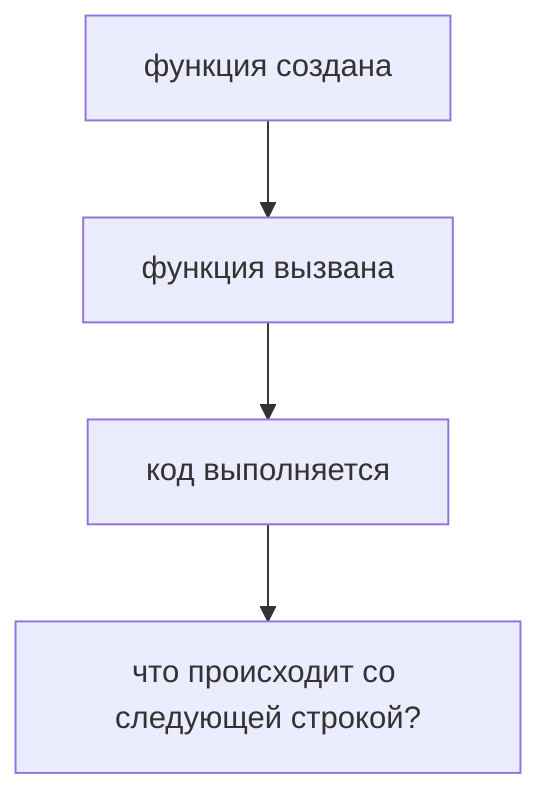
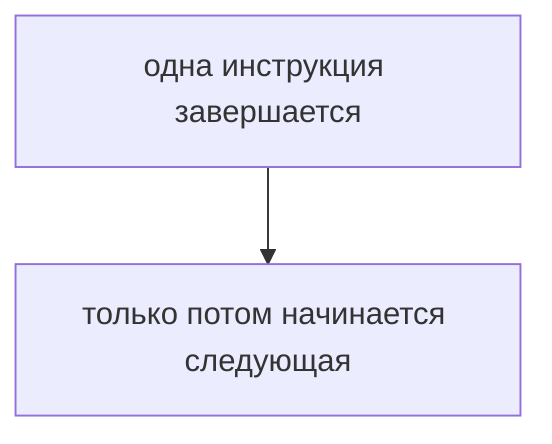
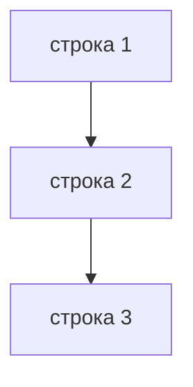
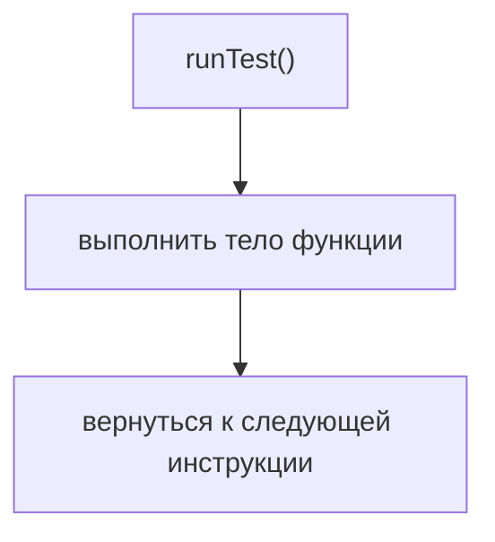
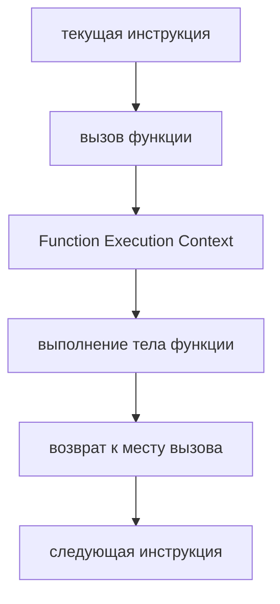
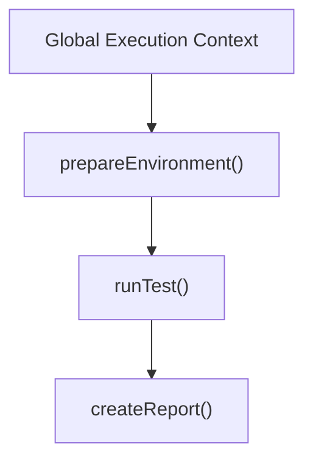
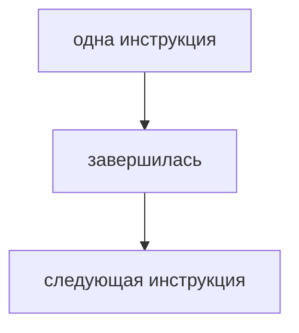
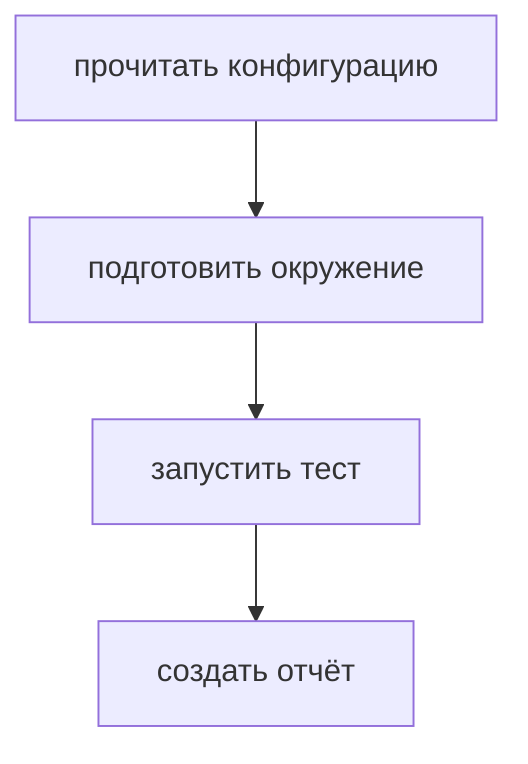

# Synchronous Execution

## Связь с предыдущей главой

Предыдущий модуль объяснил, как функции сохраняют данные через Closure, как `this` выбирает объект выполнения и как `call()`, `apply()` и `bind()` помогают управлять контекстом.

Теперь мы переходим к другой части поведения JavaScript:



Эта глава отвечает на базовый вопрос перед асинхронностью: как JavaScript выполняет обычный синхронный код.

## Главный вопрос

> Как JavaScript выполняет синхронный код?

Короткий ответ:



## Предварительные требования

Для этой главы нужно понимать:

* что вызов функции запускает выполнение ее тела;
* что Call Stack показывает активные вызовы;
* что функция может возвращать результат;
* что программа выполняется в среде выполнения JavaScript.

Event Loop, очереди задач, Promise и `async/await` пока не нужны. Они будут изучаться позже.

## Цели обучения

После главы вы будете понимать:

* что такое синхронное выполнение;
* почему порядок строк важен;
* почему следующая инструкция ждет завершения предыдущей;
* как синхронность влияет на тестовый раннер;
* почему синхронная модель недостаточна для долгих операций.

## Мотивация

Представим простой тестовый раннер:

```javascript
readConfiguration();
prepareEnvironment();
runTest();
createReport();
```

Если каждая операция завершается сразу, порядок понятен:

```text
1. прочитать конфигурацию
2. подготовить окружение
3. выполнить тест
4. создать отчет
```

Проблема появится позже: не все операции могут завершиться сразу. Но сначала нужно увидеть базовую модель, от которой JavaScript отталкивается.

## Теория

Синхронное выполнение означает, что текущий шаг должен закончиться до перехода к следующему.



Если строка вызывает функцию, JavaScript выполняет эту функцию и только потом возвращается к следующей строке.



Синхронный код легко читать сверху вниз. Это его сильная сторона.

Но у синхронного кода есть ограничение: если операция занимает время, выполнение следующей строки останавливается.

## Внутренний механизм

Когда JavaScript встречает синхронный вызов функции, происходит простая цепочка:



Call Stack управляет активными вызовами:



Но важно не путать: Call Stack не делает код асинхронным. Он показывает, какая функция выполняется сейчас.

В синхронной модели JavaScript не переходит дальше, пока текущая работа не завершена.

## Главная ментальная модель

Главная модель главы:



Как очередь шагов тестового раннера:



Каждый шаг должен закончиться перед следующим.

## Практические примеры

Примеры находятся в:

```text
examples/01-javascript/chapter-69/
```

Запуск:

```bash
node examples/01-javascript/chapter-69/01-sync-runner.js
node examples/01-javascript/chapter-69/02-step-order.js
node examples/01-javascript/chapter-69/03-blocking-work.js
node examples/01-javascript/chapter-69/04-qa-flow.js
```

В первом примере массив `testRun` наполняется строго по порядку. Во втором вывод показывает порядок инструкций. Третий пример демонстрирует блокирующую синхронную работу. Четвертый связывает модель с простым QA-потоком.

## Пример Automation QA

Синхронный тестовый сценарий удобен, когда все данные уже доступны:

```javascript
const configuration = readConfiguration();
const result = runSmokeTest(configuration);
printReport(result);
```

Здесь `runSmokeTest()` получает готовую конфигурацию. `printReport()` получает готовый результат. Никакой шаг не обещает завершиться позже.

Такая модель хороша для:

* простой подготовки данных;
* локальной валидации;
* форматирования отчета;
* вычисления ожидаемого результата.

## Распространённые ошибки

### Ошибка 1. Думать, что JavaScript сам перепрыгивает через медленную строку

В синхронном коде следующая строка ждет.

### Ошибка 2. Путать порядок объявления функций и порядок выполнения

Функция может быть объявлена выше или ниже, но выполнение начинается только при вызове.

### Ошибка 3. Использовать синхронную модель для операций, которые завершаются позже

Подготовка окружения, генерация отчета или ожидание внешнего результата часто не завершаются мгновенно.

## Практика

Практика находится в:

```text
practice/01-javascript/69-synchronous-execution.md
```

Решения находятся в:

```text
solutions/01-javascript/69-synchronous-execution.md
```

## Краткие итоги

Синхронное выполнение — базовая модель JavaScript.

Главное:

* текущая инструкция завершается перед следующей;
* вызов функции выполняется полностью перед возвратом к следующей строке;
* синхронный код легко читать сверху вниз;
* долгие операции могут блокировать дальнейшее выполнение;
* эта модель нужна, чтобы понять, зачем появилась асинхронность.

## Переход к следующей главе

Синхронная модель хорошо работает, пока все операции завершаются сразу.

Следующий вопрос:

> Что делать, если операция завершится позже?

Эта проблема приводит к асинхронному программированию.
