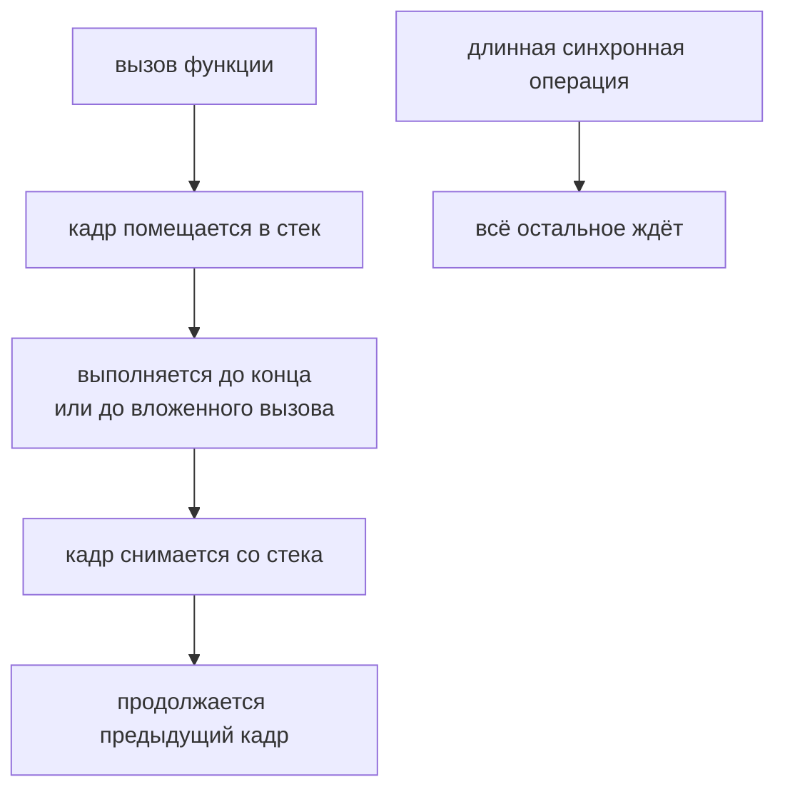

# Синхронное выполнение

## Связь с предыдущей главой

Предыдущий модуль объяснил, как функции сохраняют данные через Closure, как `this` выбирает объект выполнения и как `call()`, `apply()` и `bind()` помогают управлять контекстом.

Теперь мы переходим к другой части поведения JavaScript:

Эта глава отвечает на базовый вопрос перед асинхронностью: как JavaScript выполняет обычный синхронный код.

## Главный вопрос

> Как JavaScript выполняет синхронный код?

Короткий ответ: строка за строкой, полностью завершая каждую операцию перед
началом следующей.

## Предварительные требования

Для этой главы нужно понимать:

* что вызов функции запускает выполнение ее тела;
* что Call Stack показывает активные вызовы;
* что функция может возвращать результат;
* что программа выполняется в среде выполнения JavaScript.

Event Loop, очереди задач, Promise и `async/await` пока не нужны. Они будут изучаться позже.

## Цели обучения

После главы вы будете понимать:

* что такое синхронное выполнение;
* почему порядок строк важен;
* почему следующая инструкция ждет завершения предыдущей;
* как синхронность влияет на тестовый раннер;
* почему синхронная модель недостаточна для долгих операций.

## Мотивация

Представим простой тестовый раннер:

```javascript
readConfiguration();
prepareEnvironment();
runTest();
createReport();
```

Если каждая операция завершается сразу, порядок понятен:

```text
1. прочитать конфигурацию
2. подготовить окружение
3. выполнить тест
4. создать отчет
```

Проблема появится позже: не все операции могут завершиться сразу. Но сначала нужно увидеть базовую модель, от которой JavaScript отталкивается.

## Теория

### Один шаг за раз

Синхронное выполнение означает, что текущий шаг должен закончиться до перехода к следующему.

Если строка вызывает функцию, JavaScript выполняет эту функцию и только потом возвращается к следующей строке. Синхронный код легко читать сверху вниз — это его сильная сторона.

Но у синхронного кода есть ограничение: если операция занимает время, выполнение следующей строки останавливается.

### Однопоточность — следствие стека

Причина такого поведения уже разбиралась в главе 62: пока в стеке вызовов есть кадры, движок занят. Он не может начать другую работу, не завершив текущую.

Отсюда следствие, которое важно для тестов: долгая синхронная операция блокирует **всё**, включая таймеры, обработчики событий и сетевые колбэки. Они не выполняются параллельно — они ждут, пока стек опустеет.

### Что в JavaScript синхронно

Полезно знать перечень, потому что он короче, чем кажется:

| Синхронно | Асинхронно |
| --- | --- |
| арифметика, работа со строками | `setTimeout`, `setInterval` |
| методы массивов из глав 47–60 | сетевые запросы |
| чтение и запись свойств | чтение файлов (в асинхронном варианте) |
| вызовы обычных функций | промисы и `await` |

Строка про методы массивов существенна: `forEach`, `map`, `filter` выполняются синхронно целиком. Именно поэтому `forEach` с асинхронным колбэком из главы 50 не ждёт — сам перебор синхронный, а колбэки просто запускаются.

### Блокирующая операция в тестах

Типичный случай, где это проявляется: «подождать» реализовали синхронным циклом.

```javascript
const until = Date.now() + 1000;
while (Date.now() < until) {}   // блокирует всё на секунду
```

Такой код не просто медленный — он не даёт выполниться ничему другому. В браузере интерфейс замирает, в Node не обрабатываются события, в тестах не срабатывают таймеры.

Правильное ожидание не блокирует стек, и как оно устроено — тема следующих глав.

Один стек — одна выполняемая задача:


```mermaid
flowchart TD
    A["вызов функции"] --> B["кадр помещается в стек"]
    B --> C["выполняется до конца<br/>или до вложенного вызова"]
    C --> D["кадр снимается со стека"]
    D --> E["продолжается предыдущий кадр"]
    F["длинная синхронная операция"] --> G["всё остальное ждёт"]
```

## Внутренний механизм

### Цепочка синхронного вызова

Когда JavaScript встречает синхронный вызов функции, происходит простая цепочка:

1. текущий кадр приостанавливается на строке вызова;
2. создаётся контекст выполнения вызываемой функции и кладётся на стек;
3. тело выполняется до конца или до `return`;
4. контекст снимается со стека;
5. выполнение продолжается со следующей строки вызывающего кода.

Стек вызовов управляет активными вызовами: наверху всегда тот, который выполняется сейчас, под ним — те, кто его дождётся.

Но важно не путать: стек вызовов не делает код асинхронным. Он показывает, какая функция выполняется сейчас.

### Почему нельзя «перескочить» строку

В синхронной модели JavaScript не переходит дальше, пока текущая работа не завершена. Движок не имеет возможности отложить строку и вернуться к ней позже — такой механизм существует только для асинхронных операций, и он устроен принципиально иначе.

Это объясняет, почему синхронный код детерминирован и легко читается: порядок выполнения в точности совпадает с порядком записи.

## Главная ментальная модель

Главная модель главы: **выполнение идёт строка за строкой, и каждая дожидается предыдущей**.

Как очередь шагов тестового раннера: подготовить данные → выполнить действие → проверить результат. Каждый шаг должен закончиться перед следующим, и порядок гарантирован.

Сильная и слабая стороны здесь — одно и то же свойство:

| Свойство | Плюс | Минус |
| --- | --- | --- |
| строгий порядок | код читается сверху вниз | долгий шаг блокирует всё |
| один поток | нет гонок за данные | нельзя ждать без блокировки |

Следующие главы показывают, как получить ожидание без блокировки, сохранив читаемость.

## Практические примеры

Примеры находятся в:

```text
examples/01-javascript/chapter-69/
```

Запуск:

```bash
node examples/01-javascript/chapter-69/01-sync-runner.js
node examples/01-javascript/chapter-69/02-step-order.js
node examples/01-javascript/chapter-69/03-blocking-work.js
node examples/01-javascript/chapter-69/04-qa-flow.js
```

В первом примере массив `testRun` наполняется строго по порядку. Во втором вывод показывает порядок инструкций. Третий пример демонстрирует блокирующую синхронную работу. Четвертый связывает модель с простым QA-потоком.

## Пример Automation QA

Синхронный тестовый сценарий удобен, когда все данные уже доступны:

```javascript
const configuration = readConfiguration();
const result = runSmokeTest(configuration);
printReport(result);
```

Здесь `runSmokeTest()` получает готовую конфигурацию. `printReport()` получает готовый результат. Никакой шаг не обещает завершиться позже.

Такая модель хороша для:

* простой подготовки данных;
* локальной валидации;
* форматирования отчета;
* вычисления ожидаемого результата.

### Синхронный цикл ожидания не работает совсем

```javascript
const until = Date.now() + 1000;

while (Date.now() < until) {}   // стек занят всю секунду

// Ни один таймер, ни один ответ сети за это время не обработается.
```

Пока в стеке есть кадр, очередь не разбирается. «Подождать» таким циклом
нельзя: он не даёт продвинуться ровно тем событиям, которых ждут.

Правильная пауза возвращает управление движку:

```javascript
await new Promise(resolve => setTimeout(resolve, 1000));
```

Но и она в тестах почти всегда хуже, чем ожидание условия.

### Проверка синхронна, а получение данных — нет

```javascript
const response = await client.get('/work-items');   // ждём

expect(response.items).toHaveLength(1);             // сравниваем мгновенно
```

Сравнение выполняется на том состоянии, которое уже получено. Оно не станет
ждать, пока сервис «догонит», — и именно поэтому забытый `await` даёт
утверждение о промисе вместо утверждения о данных.

Граница проходит ровно здесь: всё, что обращается наружу, асинхронно; всё, что
считает и сравнивает, синхронно.

## Распространённые мифы

**Миф: JavaScript может выполнять две функции одновременно.**
Пока в стеке есть кадры, движок занят. Параллельного выполнения кода нет.

**Миф: таймер сработает вовремя, даже если код занят.**
Он дождётся, пока стек опустеет. Указанная задержка — минимальная, а не точная.

**Миф: методы массивов асинхронны.**
`forEach`, `map`, `filter` выполняются синхронно целиком.

**Миф: цикл ожидания — нормальный способ сделать паузу.**
Он блокирует всё: события, таймеры, интерфейс.

**Миф: стек вызовов как-то связан с асинхронностью.**
Он лишь показывает активные вызовы. Асинхронность устроена отдельно.

## Частые вопросы

**Почему интерфейс замирает на долгой операции?**
Её кадр занимает стек, и обработчики событий не могут выполниться.

**Почему `setTimeout(fn, 0)` выполняется не сразу?**
Он ждёт освобождения стека. Ноль задаёт минимальную задержку, а не немедленный запуск.

**Синхронен ли `forEach` с `async`-колбэком?**
Сам перебор синхронен: он запускает колбэки и не ждёт их результатов.

**Как сделать паузу, не блокируя выполнение?**
Асинхронным ожиданием — это тема следующих глав.

**Чем хорош синхронный код?**
Детерминированностью: порядок выполнения совпадает с порядком записи.

## Проверьте себя

1. Почему долгая синхронная функция блокирует таймеры и события?
2. Из каких шагов состоит цепочка синхронного вызова?
3. Какие привычные конструкции выполняются синхронно?
4. Чем плох цикл ожидания по времени?
5. В чём одновременно сильная и слабая сторона синхронной модели?

### Ответы

1. Пока её кадр на стеке, движок не может взять другую работу. Таймер и обработчик события ждут освобождения стека, даже если срок уже наступил.
2. Вызов кладёт кадр на стек, тело выполняется до конца или до `return`, кадр снимается, управление возвращается на строку вызова.
3. Обращение к переменным и свойствам, арифметика, условия, циклы, вызовы обычных функций, методы массивов вроде `map()` и `filter()`.
4. Он занимает стек и не даёт выполниться тому, чего ждёт: состояние не изменится, потому что изменить его некому.
5. Порядок предсказуем — код выполняется ровно сверху вниз. И он же не даёт делать ничего одновременно: одна долгая операция останавливает всё.

## Распространённые ошибки

### Ошибка 1. Думать, что JavaScript сам перепрыгивает через медленную строку

В синхронном коде следующая строка ждет.

### Ошибка 2. Путать порядок объявления функций и порядок выполнения

Функция может быть объявлена выше или ниже, но выполнение начинается только при вызове.

### Ошибка 3. Использовать синхронную модель для операций, которые завершаются позже

Подготовка окружения, генерация отчета или ожидание внешнего результата часто не завершаются мгновенно.

## Практика

Практика находится в:

```text
practice/01-javascript/69-synchronous-execution.md
```

Решения находятся в:

```text
solutions/01-javascript/69-synchronous-execution.md
```

## Краткие итоги

Синхронное выполнение — базовая модель JavaScript.

Главное:

* текущая инструкция завершается перед следующей;
* вызов функции выполняется полностью перед возвратом к следующей строке;
* синхронный код легко читать сверху вниз;
* долгие операции могут блокировать дальнейшее выполнение;
* эта модель нужна, чтобы понять, зачем появилась асинхронность.

## Переход к следующей главе

Синхронная модель хорошо работает, пока все операции завершаются сразу.

Следующий вопрос:

> Что делать, если операция завершится позже?

Эта проблема приводит к асинхронному программированию.
