# Asynchronous Programming

## Связь с предыдущей главой

Предыдущая глава показала синхронную модель:

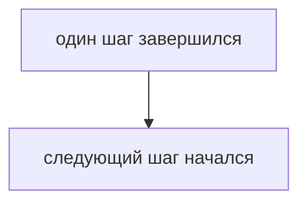

Теперь появляется новая ситуация: часть операций не может вернуть результат немедленно.

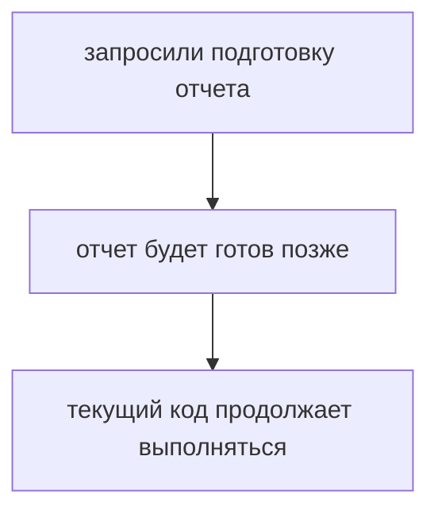

## Главный вопрос

> Почему некоторые операции завершаются позже?

Короткий ответ: потому что они зависят не только от текущего JavaScript-кода.

## Предварительные требования

Для этой главы нужно понимать:

* синхронное выполнение;
* вызовы функций;
* Call Stack на концептуальном уровне;
* что среда выполнения JavaScript предоставляет дополнительные возможности.

Event Loop, microtasks и macrotasks в этой главе не изучаются. Сейчас достаточно понять проблему отложенного результата.

## Цели обучения

После главы вы будете понимать:

* зачем нужна асинхронность;
* почему не все операции завершаются сразу;
* чем отличается запуск операции от получения результата;
* почему нельзя читать результат раньше времени;
* как это встречается в Automation QA.

## Мотивация

В тестовом фреймворке есть действия, которые невозможно завершить мгновенно:

* подготовить окружение;
* дождаться результата теста;
* создать отчет;
* записать лог;
* получить ответ внешней системы.

Если заставить JavaScript ждать каждый такой шаг синхронно, программа будет простаивать.

Асинхронность появляется как ответ на проблему отложенного результата.

## Теория

Асинхронная операция — это операция, у которой момент запуска и момент завершения не совпадают.

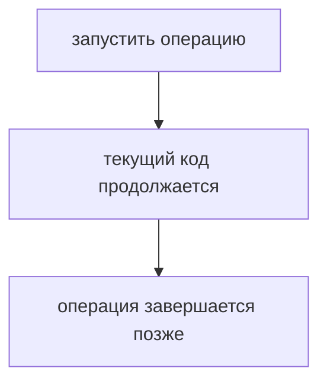

В этой главе для демонстрации используется `setTimeout()`. Это API среды выполнения для отложенного выполнения функции. Подробная работа таймеров и Event Loop будет изучаться позже.

Важно различать два момента:

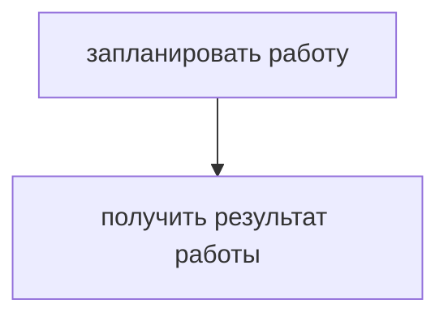

Это разные события.

## Внутренний механизм

На высоком уровне происходит так:

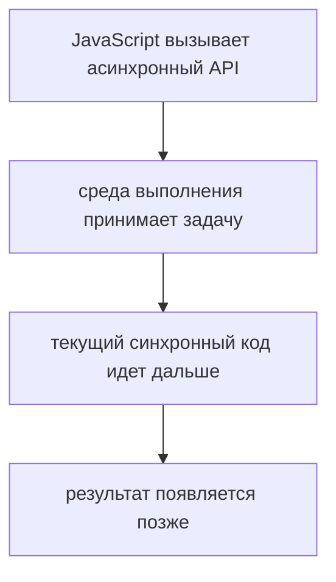

В этой главе не нужно знать, какие очереди использует среда выполнения. Достаточно понимать:

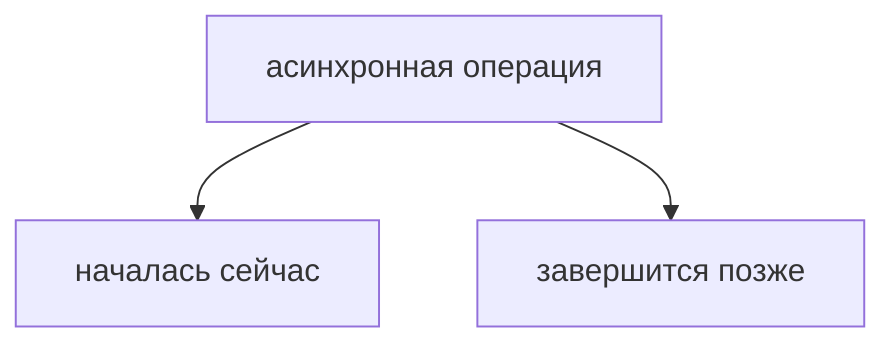

Поэтому такой код не работает так, как ожидают новички:

```javascript
let reportStatus = 'not ready';

setTimeout(function createReport() {
  reportStatus = 'ready';
}, 100);

console.log(reportStatus);
```

Последняя строка выполняется раньше, чем отложенная функция изменит статус.

## Главная ментальная модель

Главная модель главы:

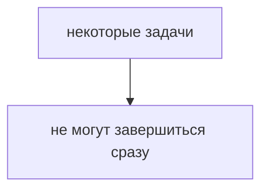

Для тестового раннера:

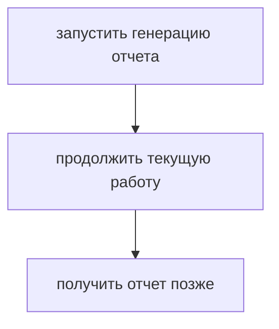

## Практические примеры

Примеры находятся в:

```text
examples/01-javascript/chapter-70/
```

Запуск:

```bash
node examples/01-javascript/chapter-70/01-delayed-report.js
node examples/01-javascript/chapter-70/02-environment-preparation.js
node examples/01-javascript/chapter-70/03-wrong-assumption.js
node examples/01-javascript/chapter-70/04-qa-flow.js
```

Обратите внимание на порядок вывода. Строки после планирования отложенной операции выполняются раньше, чем сама отложенная операция завершается.

## Пример Automation QA

В Automation QA это видно постоянно:

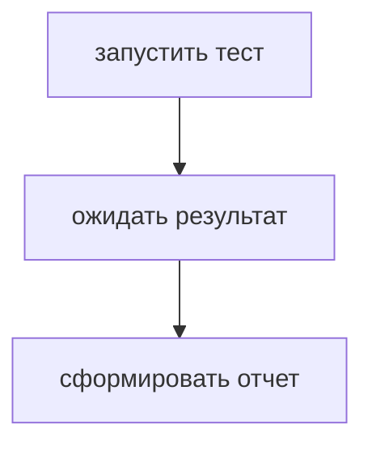

Если отчет создается позже, код не может просто взять его сразу после запуска операции.

Нужно иметь механизм продолжения:

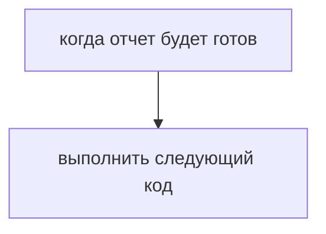

Именно к этому ведет следующая глава.

## Распространённые ошибки

### Ошибка 1. Читать результат сразу после запуска асинхронной операции

Запуск операции не означает, что результат уже готов.

### Ошибка 2. Думать, что задержка делает весь код медленным сверху вниз

Текущий синхронный код продолжает выполняться.

### Ошибка 3. Объяснять асинхронность через магию

Модель проще: часть работы передается среде выполнения, а результат приходит позже.

## Практика

Практика находится в:

```text
practice/01-javascript/70-asynchronous-programming.md
```

Решения находятся в:

```text
solutions/01-javascript/70-asynchronous-programming.md
```

## Краткие итоги

Асинхронность нужна, когда операция не может завершиться немедленно.

Главное:

* запуск операции и получение результата — разные моменты;
* текущий синхронный код продолжает выполняться;
* результат появляется позже;
* нельзя читать отложенный результат как обычное синхронное значение;
* нужен способ выполнить код после завершения операции.

## Переход к следующей главе

Теперь проблема ясна:

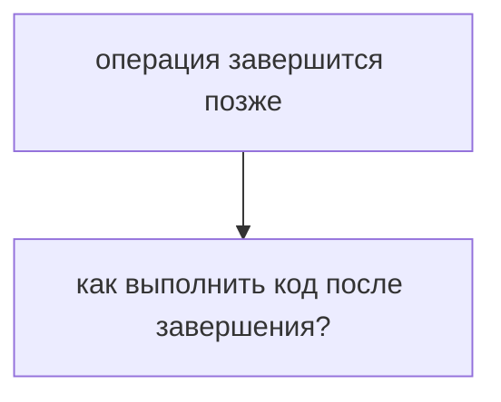

Первый ответ JavaScript-практики — обратный вызов.
