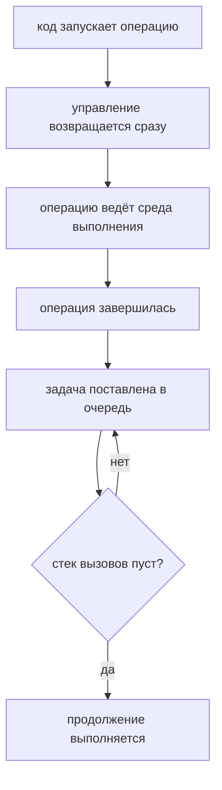

# Asynchronous Programming

## Связь с предыдущей главой

Предыдущая глава показала синхронную модель: каждая строка дожидается предыдущей, а долгая операция блокирует всё выполнение.

Теперь появляется новая ситуация: часть операций не может вернуть результат немедленно.

## Главный вопрос

> Почему некоторые операции завершаются позже?

Короткий ответ: потому что они зависят не только от текущего JavaScript-кода.

## Предварительные требования

Для этой главы нужно понимать:

* синхронное выполнение;
* вызовы функций;
* Call Stack на концептуальном уровне;
* что среда выполнения JavaScript предоставляет дополнительные возможности.

Event Loop, microtasks и macrotasks в этой главе не изучаются. Сейчас достаточно понять проблему отложенного результата.

## Цели обучения

После главы вы будете понимать:

* зачем нужна асинхронность;
* почему не все операции завершаются сразу;
* чем отличается запуск операции от получения результата;
* почему нельзя читать результат раньше времени;
* как это встречается в Automation QA.

## Мотивация

В тестовом фреймворке есть действия, которые невозможно завершить мгновенно:

* подготовить окружение;
* дождаться результата теста;
* создать отчет;
* записать лог;
* получить ответ внешней системы.

Если заставить JavaScript ждать каждый такой шаг синхронно, программа будет простаивать.

Асинхронность появляется как ответ на проблему отложенного результата.

## Теория

### Запуск и завершение — разные моменты

Асинхронная операция — это операция, у которой момент запуска и момент завершения не совпадают.

Важно различать два момента:

| Момент | Что происходит |
| --- | --- |
| запуск | код просит среду выполнения начать операцию и сразу идёт дальше |
| завершение | среда сообщает о результате, и назначенная функция выполняется |

Это разные события, и между ними может выполниться сколько угодно другого кода. Вся сложность асинхронного программирования сводится к тому, чтобы не перепутать эти два момента.

В этой главе для демонстрации используется `setTimeout()`. Это API среды выполнения для отложенного выполнения функции. Подробная работа таймеров и Event Loop будет изучаться позже.

### Асинхронность — не параллельность

Частое заблуждение, которое стоит снять сразу. Асинхронная операция не выполняется «одновременно» с вашим кодом в том же потоке.

Происходит другое: работу берёт на себя среда выполнения — браузер или Node.js, — а ваш код продолжает идти дальше. Когда работа завершится, среда поставит в очередь функцию продолжения, и движок выполнит её, когда освободится стек.

Отсюда следует то, что разбиралось в предыдущей главе: если стек занят долгой синхронной операцией, ни один асинхронный результат обработан не будет — сколько бы их ни завершилось.

### Задержка таймера — минимальная, а не точная

`setTimeout(fn, 100)` означает «не раньше чем через 100 мс», а не «ровно через 100 мс». Если к этому моменту стек занят, функция подождёт.

Практический вывод для тестов уже знаком по другим главам: ожидание фиксированной паузой ненадёжно. Синхронизироваться нужно с наблюдаемым состоянием, а не с временем.

### Что нельзя вернуть из асинхронной операции

Главное ограничение, порождающее большинство ошибок новичка: значение, которое появится позже, нельзя вернуть сейчас.

```javascript
function getStatus() {
  let status = 'not ready';
  setTimeout(() => { status = 'ready'; }, 100);
  return status;          // всегда 'not ready'
}
```

Функция завершается до того, как таймер сработает. Результат асинхронной операции доступен только внутри продолжения — в колбэке, а в следующих главах в промисе и через `await`.

Запуск и завершение операции разнесены во времени:



## Внутренний механизм

### Что происходит на высоком уровне

1. код вызывает асинхронный API и передаёт ему функцию продолжения;
2. среда выполнения принимает задачу и **сразу возвращает управление**;
3. выполнение продолжается со следующей строки;
4. когда задача завершена, среда ставит продолжение в очередь;
5. как только стек пуст, движок берёт продолжение из очереди и выполняет его.

В этой главе не нужно знать, какие именно очереди использует среда выполнения. Достаточно понимать: продолжение выполняется **после** того, как текущий синхронный код дошёл до конца.

### Классический пример путаницы

Поэтому такой код не работает так, как ожидают новички:

```javascript
let reportStatus = 'not ready';

setTimeout(function createReport() {
  reportStatus = 'ready';
}, 100);

console.log(reportStatus);
```

Последняя строка выполняется раньше, чем отложенная функция изменит статус. Вывод будет `not ready` — и это не ошибка, а прямое следствие пятишаговой схемы выше.

Проверить понимание легко: если поставить задержку `0`, вывод не изменится. Продолжение всё равно дождётся конца синхронного кода.

### Порядок вывода как способ рассуждать

Удобный приём при чтении асинхронного кода — мысленно разделить строки на две группы: что выполнится сейчас и что позже. Всё, что «позже», выполнится в порядке готовности, но строго после всего, что «сейчас».

## Главная ментальная модель

Главная модель главы: **запустить сейчас, обработать результат позже**.

Для тестового раннера аналогия прямая: тест просит приложение выполнить операцию и не стоит рядом всё это время — он подписывается на результат и продолжает работу, а проверку делает тогда, когда результат появился.

| Вопрос | Синхронный код | Асинхронный код |
| --- | --- | --- |
| когда известен результат? | сразу после строки | позже, в продолжении |
| можно ли вернуть значение? | да | нет, только через продолжение |
| блокирует ли ожидание? | да | нет |

## Практические примеры

Примеры находятся в:

```text
examples/01-javascript/chapter-70/
```

Запуск:

```bash
node examples/01-javascript/chapter-70/01-delayed-report.js
node examples/01-javascript/chapter-70/02-environment-preparation.js
node examples/01-javascript/chapter-70/03-wrong-assumption.js
node examples/01-javascript/chapter-70/04-qa-flow.js
```

Обратите внимание на порядок вывода. Строки после планирования отложенной операции выполняются раньше, чем сама отложенная операция завершается.

## Пример Automation QA

В Automation QA это видно постоянно:

Если отчет создается позже, код не может просто взять его сразу после запуска операции.

Нужно иметь механизм продолжения:

Именно к этому ведет следующая глава.

## Распространённые мифы

**Миф: асинхронный код выполняется параллельно с вашим.**
Работу берёт среда выполнения. Ваш код продолжает идти в том же единственном потоке.

**Миф: `setTimeout(fn, 100)` выполнится ровно через 100 мс.**
Это минимальная задержка. Занятый стек отодвинет выполнение.

**Миф: `setTimeout(fn, 0)` выполнится немедленно.**
Продолжение всё равно дождётся конца текущего синхронного кода.

**Миф: результат асинхронной операции можно вернуть из функции.**
К моменту `return` его ещё нет. Он доступен только в продолжении.

**Миф: если операций много, они ускорят друг друга.**
Обработка их результатов всё равно происходит по одному, когда стек свободен.

## Частые вопросы

**Почему переменная не изменилась после `setTimeout`?**
Продолжение ещё не выполнялось: сначала до конца идёт синхронный код.

**Почему таймер не сработал вовремя?**
Стек был занят. Задержка гарантирует «не раньше», а не «точно тогда».

**Как получить результат асинхронной операции?**
Только внутри продолжения — колбэка, промиса или после `await`.

**Асинхронность делает код быстрее?**
Она не ускоряет саму операцию, а освобождает выполнение на время ожидания.

**Почему нельзя просто подождать в цикле?**
Цикл занимает стек, и продолжение не сможет выполниться вовсе.

## Проверьте себя

1. Какие два момента нужно различать в асинхронной операции?
2. Почему асинхронность — это не параллельность?
3. Что означает второй аргумент `setTimeout` на самом деле?
4. Почему нельзя вернуть результат асинхронной операции обычным `return`?
5. Изменится ли вывод примера, если задержку заменить на `0`?

## Распространённые ошибки

### Ошибка 1. Читать результат сразу после запуска асинхронной операции

Запуск операции не означает, что результат уже готов.

### Ошибка 2. Думать, что задержка делает весь код медленным сверху вниз

Текущий синхронный код продолжает выполняться.

### Ошибка 3. Объяснять асинхронность через магию

Модель проще: часть работы передается среде выполнения, а результат приходит позже.

## Практика

Практика находится в:

```text
practice/01-javascript/70-asynchronous-programming.md
```

Решения находятся в:

```text
solutions/01-javascript/70-asynchronous-programming.md
```

## Краткие итоги

Асинхронность нужна, когда операция не может завершиться немедленно.

Главное:

* запуск операции и получение результата — разные моменты;
* текущий синхронный код продолжает выполняться;
* результат появляется позже;
* нельзя читать отложенный результат как обычное синхронное значение;
* нужен способ выполнить код после завершения операции.

## Переход к следующей главе

Теперь проблема ясна:

Первый ответ JavaScript-практики — обратный вызов.
