# Callback

## Связь с предыдущей главой

Предыдущая глава показала проблему:

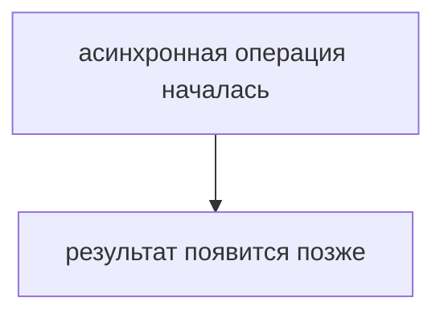

Теперь нужен способ сказать:

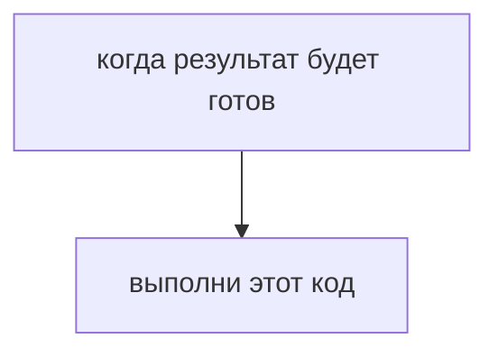

Так появляется обратный вызов.

## Главный вопрос

> Как продолжить код после асинхронной операции?

Короткий ответ: передать функцию, которую вызовут позже.

## Предварительные требования

Для этой главы нужно понимать:

* что функция является значением;
* что функцию можно передать как аргумент;
* что асинхронная операция завершается позже;
* что Closure и `this` могут влиять на функцию, вызванную позже.

## Цели обучения

После главы вы будете понимать:

* что такое обратный вызов;
* зачем функция передается другой функции;
* как результат попадает в отложенный код;
* почему обратные вызовы помогают продолжить выполнение;
* какие проблемы появляются при большом количестве обратных вызовов.

## Мотивация

В тестовом раннере отчет создается не сразу:

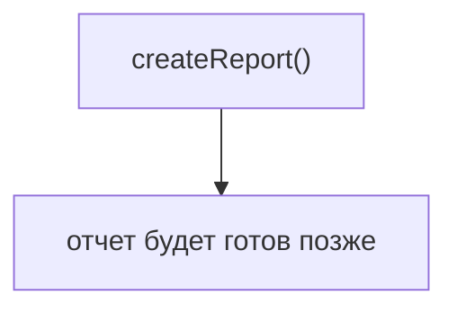

Но нам нужно выполнить код после готовности отчета:

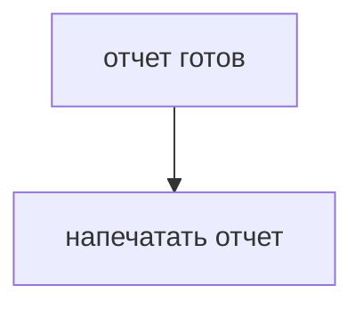

Для этого можно передать функцию:

```javascript
createReport(function printReport(report) {
  console.log(report);
});
```

`printReport` — обратный вызов.

## Теория

Обратный вызов — это функция, которую передают другому коду для будущего вызова.

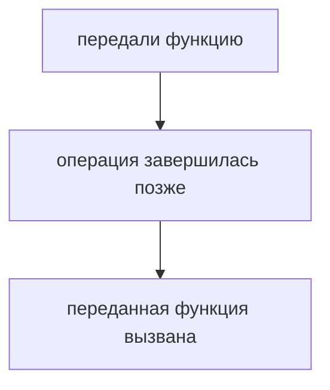

Важная идея:

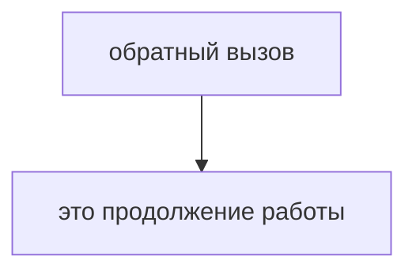

Он описывает, что нужно сделать после результата.

## Внутренний механизм

На высоком уровне:

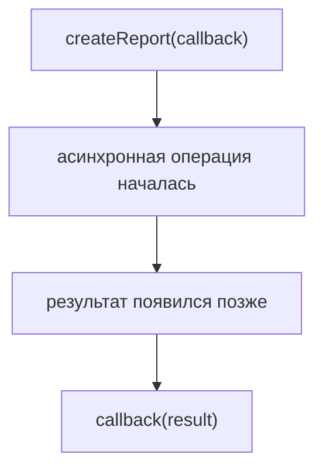

Если операция может завершиться ошибкой, часто используют два значения:

```text
callback(error, result)
```

Это распространенное соглашение многих API, а не обязательное правило языка JavaScript. Конкретная функция сама решает, какие аргументы и в каком порядке передавать в обратный вызов.

В разных библиотеках сигнатура обратного вызова может отличаться. Это лишь одно из наиболее распространенных соглашений.

Обычно это читают так:

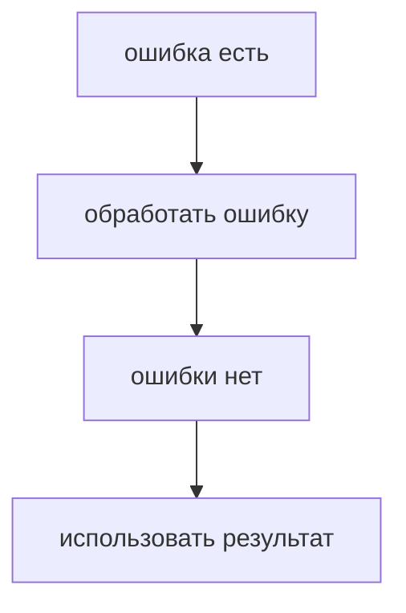

В этой главе мы не изучаем Promise и `async/await`. Они появятся позже как более удобные способы управления асинхронным результатом.

## Главная ментальная модель

Главная модель главы:

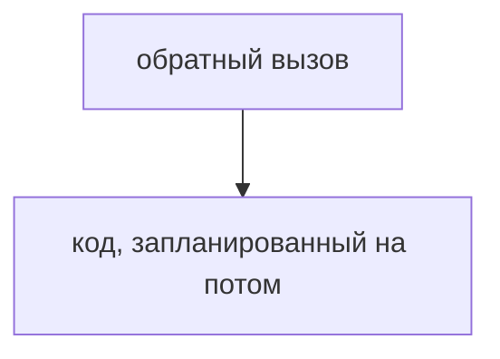

Для Automation QA:

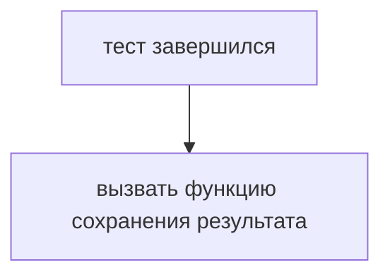

## Практические примеры

Примеры находятся в:

```text
examples/01-javascript/chapter-71/
```

Запуск:

```bash
node examples/01-javascript/chapter-71/01-basic-callback.js
node examples/01-javascript/chapter-71/02-callback-data.js
node examples/01-javascript/chapter-71/03-callback-error.js
node examples/01-javascript/chapter-71/04-qa-flow.js
```

Примеры показывают:

* простой обратный вызов после генерации отчета;
* передачу данных в обратный вызов;
* обработку ошибки;
* сохранение результата теста.

## Пример Automation QA

Тестовый раннер может принимать функцию, которая будет вызвана после завершения теста:

```javascript
runTest('login smoke', function saveResult(result) {
  console.log(`${result.testName}: ${result.status}`);
});
```

Такой код говорит:

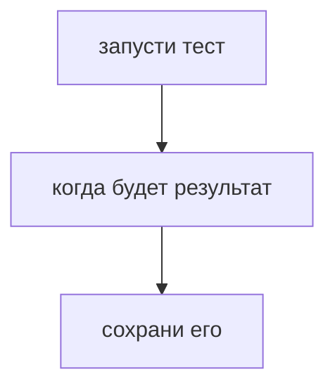

Это решает проблему отложенного результата.

## Распространённые ошибки

### Ошибка 1. Вызывать обратный вызов сразу при передаче

Нужно передать функцию, а не результат ее выполнения.

### Ошибка 2. Забывать обработку ошибки

Если операция может завершиться неуспешно, обратный вызов должен учитывать ошибку.

### Ошибка 3. Строить слишком глубокую цепочку обратных вызовов

Когда один обратный вызов запускает второй, второй запускает третий, код становится трудно читать. Promise решает именно эту проблему управления.

## Практика

Практика находится в:

```text
practice/01-javascript/71-callback.md
```

Решения находятся в:

```text
solutions/01-javascript/71-callback.md
```

## Краткие итоги

Обратный вызов позволяет выполнить код после асинхронной операции.

Главное:

* функция передается как аргумент;
* другой код вызывает ее позже;
* результат можно передать в параметры обратного вызова;
* ошибки нужно обрабатывать явно;
* большое количество вложенных обратных вызовов усложняет код.

## Переход к следующей главе

Обратные вызовы решают проблему отложенного выполнения.

Но появляется новая проблема:

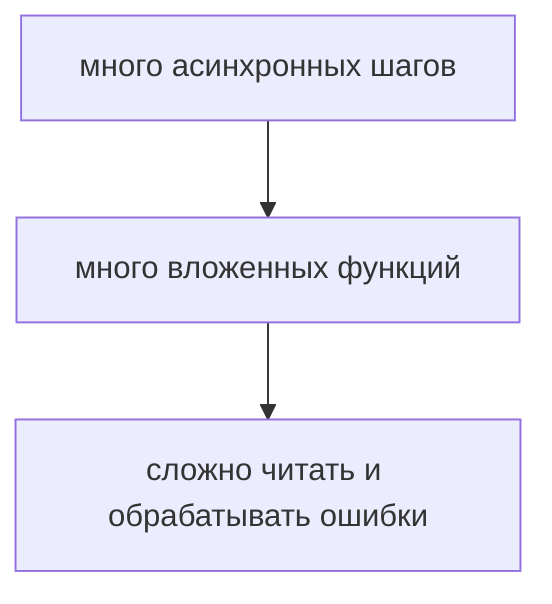

Следующая глава объясняет, почему был введен Promise.
