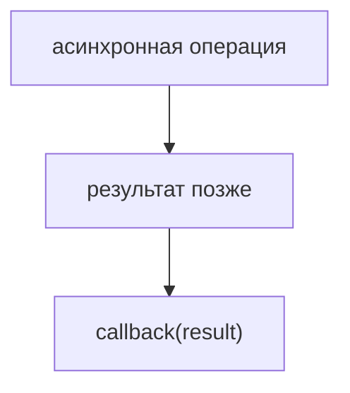
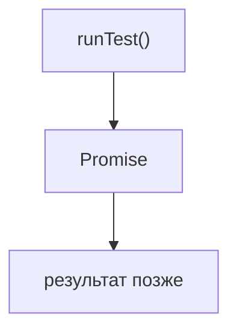
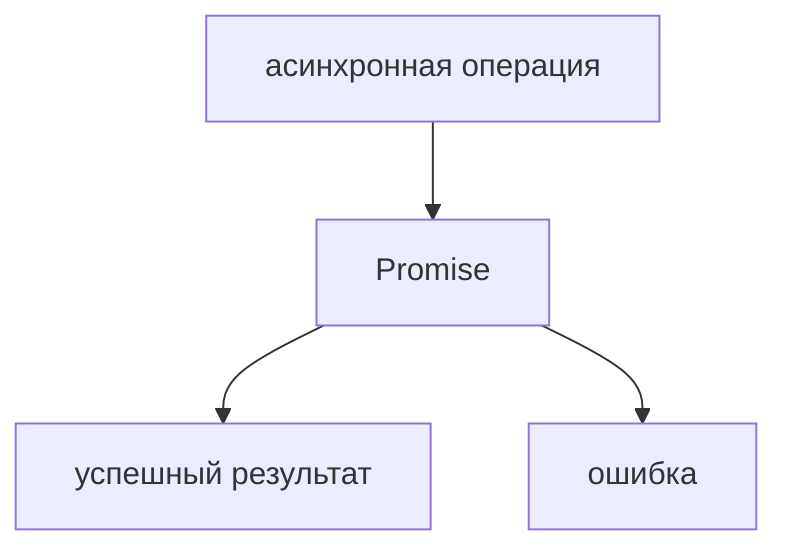
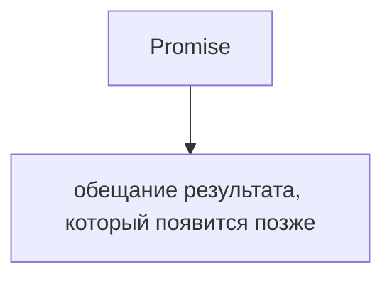
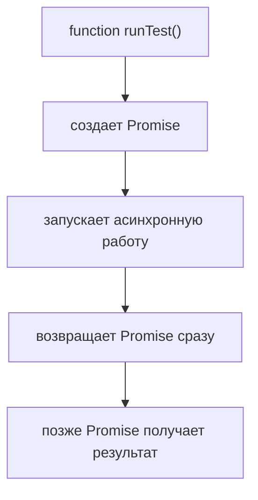
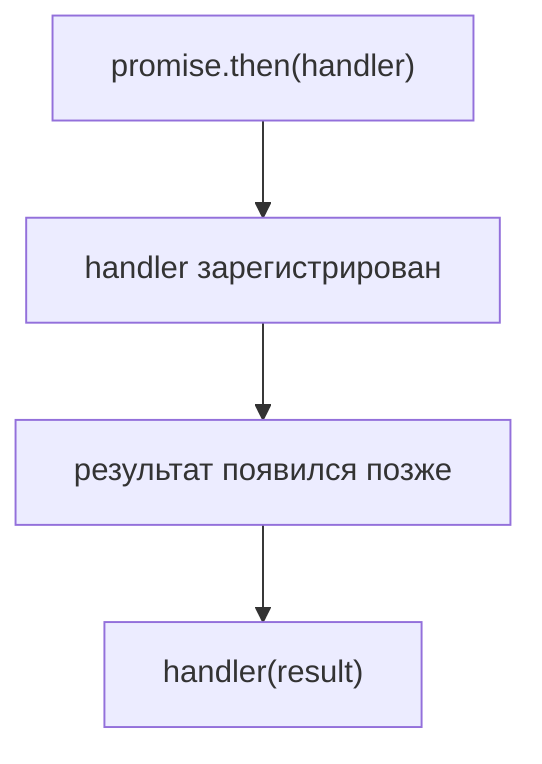
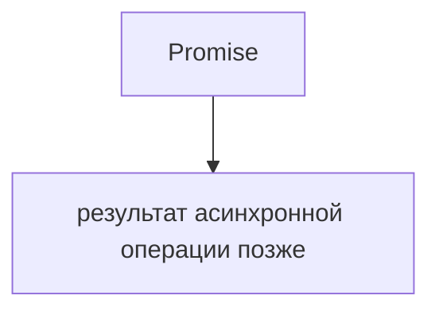
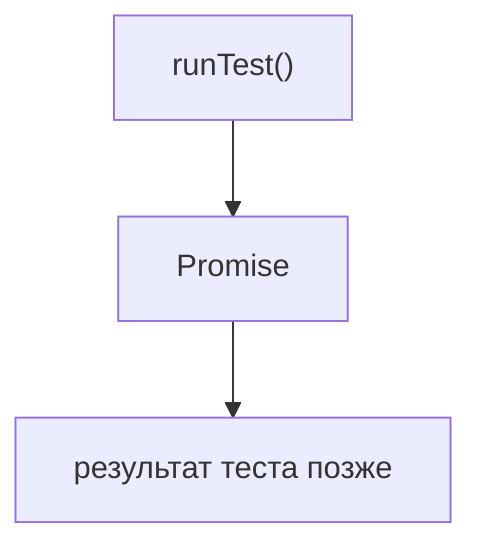
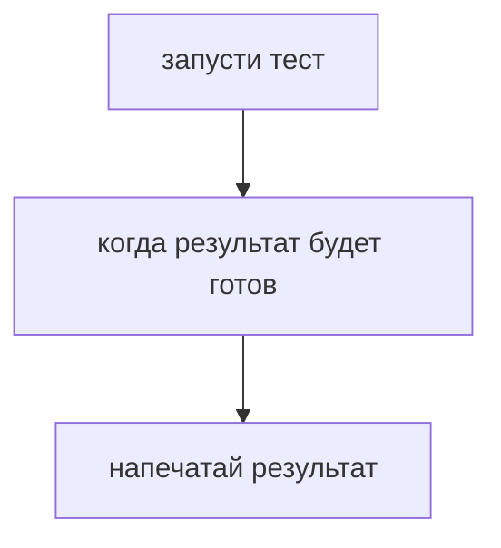
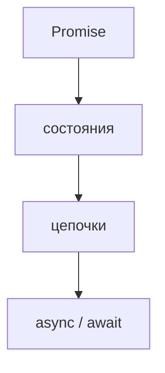

# Promise

## Связь с предыдущей главой

Предыдущая глава показала обратные вызовы:



Обратный вызов работает, но при росте сценария код становится труднее читать.

Promise появляется как более управляемая модель результата, который станет доступен позже.

## Главный вопрос

> Почему были введены Promise?

Короткий ответ: Promise представляет результат асинхронной операции, который станет доступен позже, и позволяет работать с ним как с отдельным объектом.

## Предварительные требования

Для этой главы нужно понимать:

* что асинхронная операция завершается позже;
* что обратный вызов может получить результат;
* что функция может вернуть объект;
* что ошибки асинхронных операций нужно обрабатывать отдельно.

`async/await`, Promise API, microtasks и Event Loop internals в этой главе не изучаются.

## Цели обучения

После главы вы будете понимать:

* что Promise представляет результат, который станет доступен позже;
* зачем Promise возвращают из функций;
* как использовать `then()`;
* как использовать `catch()`;
* какую проблему Promise решает после обратных вызовов.

## Мотивация

В модели обратных вызовов продолжение передается внутрь функции:

```javascript
runTest('login smoke', function saveResult(result) {
  console.log(result);
});
```

Promise меняет форму:

```javascript
runTest('login smoke').then(function saveResult(result) {
  console.log(result);
});
```

Теперь функция `runTest()` возвращает объект, который представляет будущий результат операции.



## Теория

Promise — это объект, который представляет результат асинхронной операции, доступный не сейчас, а позже.

Promise сам по себе не делает код асинхронным. Асинхронная операция уже запущена другим механизмом. Promise только представляет ее будущий результат и дает удобный способ зарегистрировать код для успешного завершения или ошибки.

Promise — обычный JavaScript-объект. Его можно сохранить в переменную, вернуть из функции или передать в другую функцию так же, как другие объекты JavaScript. Это важно: Promise не является специальной "магической паузой" в коде, он является объектом для работы с результатом, который появится позже.



Для успешного результата используется `then()`:

```javascript
operation().then(function handleResult(result) {
  console.log(result);
});
```

Для ошибки используется `catch()`:

```javascript
operation().catch(function handleError(error) {
  console.log(error);
});
```

В этой главе важно не количество методов, а модель:



## Внутренний механизм

На высоком уровне:



Код, переданный в `then()`, не выполняется в момент регистрации. Он будет выполнен после успешного завершения операции.



Если операция завершается ошибкой, управление попадает в `catch()`.

Подробные состояния Promise, цепочки Promise и `async/await` будут изучаться в следующих главах. Сейчас достаточно модели результата после завершения операции.

## Главная ментальная модель

Главная модель главы:



Для тестового раннера:



## Практические примеры

Примеры находятся в:

```text
examples/01-javascript/chapter-72/
```

Запуск:

```bash
node examples/01-javascript/chapter-72/01-basic-promise.js
node examples/01-javascript/chapter-72/02-promise-result.js
node examples/01-javascript/chapter-72/03-promise-rejection.js
node examples/01-javascript/chapter-72/04-qa-flow.js
```

Примеры показывают:

* Promise для отчета;
* передачу результата в `then()`;
* обработку ошибки через `catch()`;
* QA-поток запуска теста.

## Пример Automation QA

Асинхронная вспомогательная функция может возвращать Promise:

```javascript
runTest('login smoke').then(function printResult(result) {
  console.log(`${result.testName}: ${result.status}`);
});
```

Это читается как:



Promise делает отложенный результат явным: функция не прячет продолжение внутри себя, а возвращает объект, с которым можно работать дальше.

## Распространённые ошибки

### Ошибка 1. Думать, что Promise уже содержит готовое значение

Promise представляет значение, которое появится позже. Готового результата в момент создания может еще не быть.

### Ошибка 2. Забывать вернуть Promise из вспомогательной функции

Если вспомогательная функция запускает асинхронную работу, но не возвращает Promise, вызывающий код не сможет дождаться результата.

### Ошибка 3. Обрабатывать только успешный сценарий

Асинхронная операция может завершиться ошибкой. Для этого нужен `catch()`.

## Практика

Практика находится в:

```text
practice/01-javascript/72-promise.md
```

Решения находятся в:

```text
solutions/01-javascript/72-promise.md
```

## Краткие итоги

Promise решает проблему управления асинхронным результатом.

Главное:

* Promise представляет результат, который станет доступен позже;
* `then()` регистрирует обработчик успешного результата;
* `catch()` регистрирует обработчик ошибки;
* Promise делает асинхронный результат явным;
* это естественное продолжение модели обратных вызовов.

## Переход к следующей главе

Эта глава ввела Promise как объект для работы с будущим результатом операции.

Следующие темы смогут углубить модель:



Но базовый вывод уже есть: Promise появился не ради нового синтаксиса, а чтобы управлять асинхронным результатом понятнее, чем через вложенные обратные вызовы.
