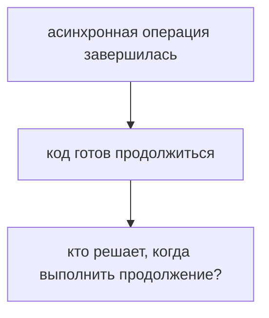
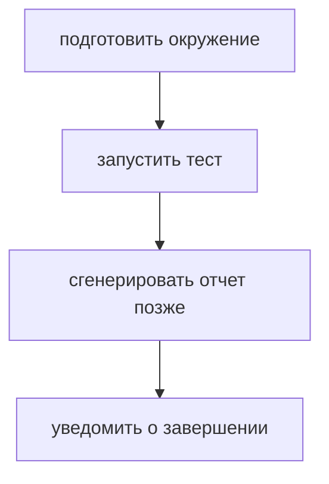
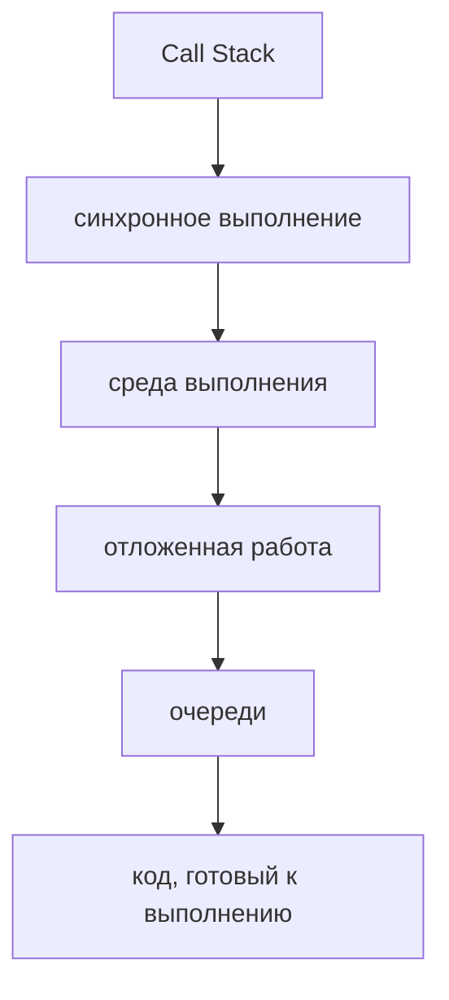
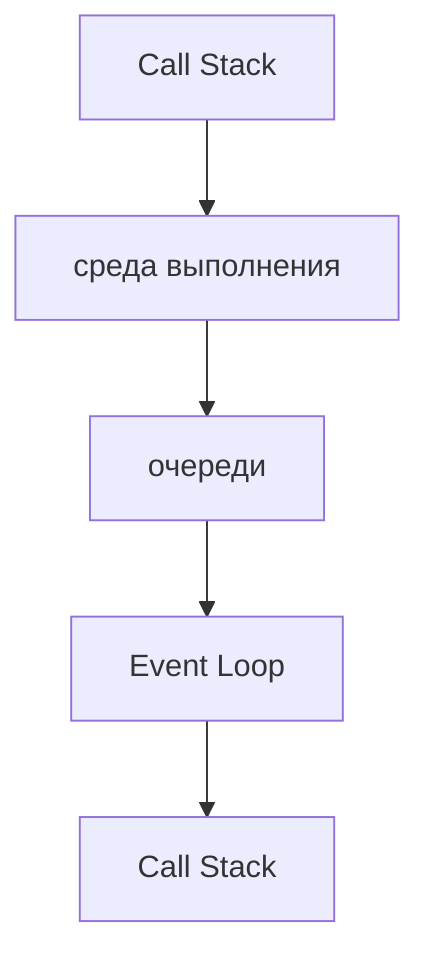
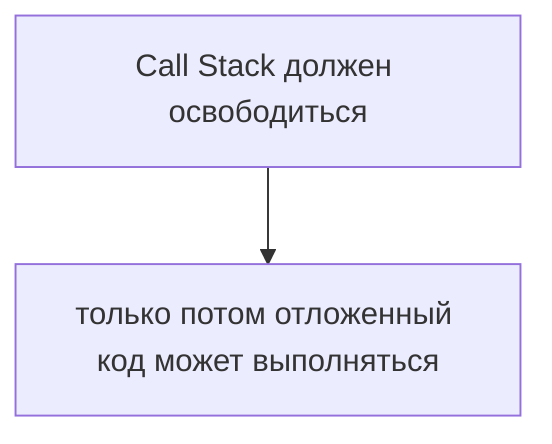
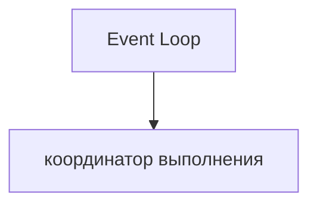
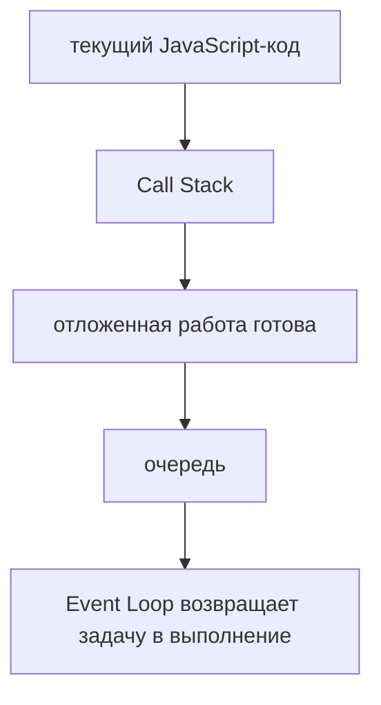
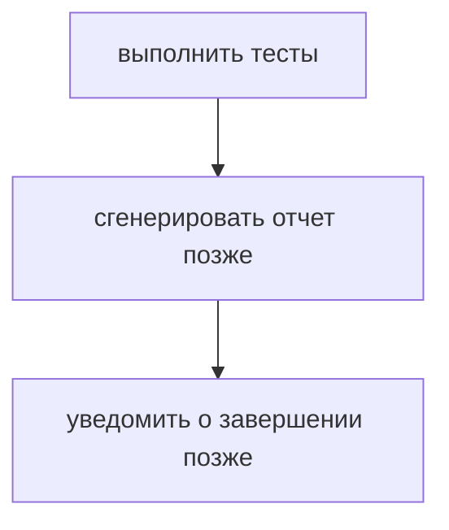

# Event Loop

## Связь с предыдущей главой

Предыдущий модуль объяснил, что Promise представляет результат асинхронной операции, который станет доступен позже.

Теперь возникает следующий вопрос:



Эта глава вводит Event Loop как координатор асинхронного выполнения.

## Главный вопрос

> Кто решает, когда отложенный код будет выполнен?

Короткий ответ: Event Loop координирует момент, когда отложенная работа может попасть обратно в выполнение JavaScript.

## Предварительные требования

Для этой главы нужно понимать:

* синхронное выполнение;
* Call Stack;
* среду выполнения JavaScript;
* обратные вызовы;
* базовую идею Promise.

В этой главе Event Loop не рассматривается как поток, JavaScript Engine или отдельный исполнитель кода. Это координатор между текущим выполнением, средой выполнения и очередями.

## Цели обучения

После главы вы будете понимать:

* зачем нужен Event Loop;
* почему отложенный код не выполняется посреди текущей строки;
* как Call Stack связан с очередями;
* почему асинхронность не означает параллельное выполнение JavaScript-кода;
* как предсказывать простой порядок выполнения.

## Мотивация

В тестовом фреймворке есть последовательность:



Синхронная часть выполняется сразу. Отложенная часть должна дождаться подходящего момента.

Если бы отложенный код мог выполняться в любой момент, программа была бы непредсказуемой. Event Loop нужен, чтобы координировать возвращение отложенной работы.

## Теория

Event Loop связывает несколько частей:



Общая схема:



Event Loop не выполняет тело функции вместо JavaScript. Он координирует, когда готовая задача может попасть в Call Stack.

Event Loop не заставляет задачу выполниться силой. Он проверяет, свободен ли Call Stack и может ли задача из очереди начать выполнение. Если Call Stack все еще занят, задача продолжает ждать в очереди.

## Внутренний механизм

Упрощенная модель:

```text
1. Выполняется текущий синхронный код
2. Асинхронная операция передается среде выполнения
3. Когда операция готова, продолжение попадает в очередь
4. Event Loop проверяет, можно ли вернуть задачу в Call Stack
5. JavaScript выполняет эту задачу
```

Главное условие:



Поэтому:

```javascript
console.log('start');

setTimeout(function generateReport() {
  console.log('report');
}, 0);

console.log('finish');
```

выводит сначала синхронные строки, а не отложенный отчет.

## Главная ментальная модель

Главная модель главы:



Более полная схема:



## Практические примеры

Примеры находятся в:

```text
examples/01-javascript/chapter-73/
```

Запуск:

```bash
node examples/01-javascript/chapter-73/01-event-loop-order.js
node examples/01-javascript/chapter-73/02-stack-before-deferred.js
node examples/01-javascript/chapter-73/03-coordinator-model.js
node examples/01-javascript/chapter-73/04-qa-flow.js
```

Примеры показывают, что текущий синхронный код завершается до выполнения отложенной работы.

## Пример Automation QA

В тестовом фреймворке это выглядит так:



Event Loop помогает понять, почему уведомление или загрузка отчета не выполняются прямо внутри текущего синхронного блока.

Это важно при отладке:

* задержанной генерации отчета;
* ожидания окружения;
* отложенного сохранения результата;
* порядка логов в тестовом раннере.

## Распространённые ошибки

### Ошибка 1. Думать, что Event Loop выполняет JavaScript-код параллельно

Event Loop координирует возвращение задач, но не превращает JavaScript в параллельное выполнение одного и того же Call Stack.

### Ошибка 2. Ожидать, что `setTimeout(..., 0)` выполнится сразу

Нулевая задержка не отменяет правило: текущий Call Stack должен завершиться.

### Ошибка 3. Объяснять порядок только сверху вниз

В асинхронном коде нужно учитывать не только строки файла, но и очереди.

## Практика

Практика находится в:

```text
practice/01-javascript/73-event-loop.md
```

Решения находятся в:

```text
solutions/01-javascript/73-event-loop.md
```

## Краткие итоги

Event Loop объясняет, когда отложенный код возвращается к выполнению.

Главное:

* Event Loop — координатор;
* он не является JavaScript Engine;
* он не является отдельным потоком выполнения JavaScript-кода;
* текущий Call Stack должен завершиться;
* готовые задачи ждут своей очереди;
* порядок выполнения можно предсказывать через Call Stack, среду выполнения и очереди.

## Переход к следующей главе

Теперь понятно, что Event Loop координирует выполнение.

Следующий вопрос:

> Кто выполняет долгую асинхронную работу до того, как задача попадет в очередь?

Ответ следующей главы: Web APIs и возможности среды выполнения.
