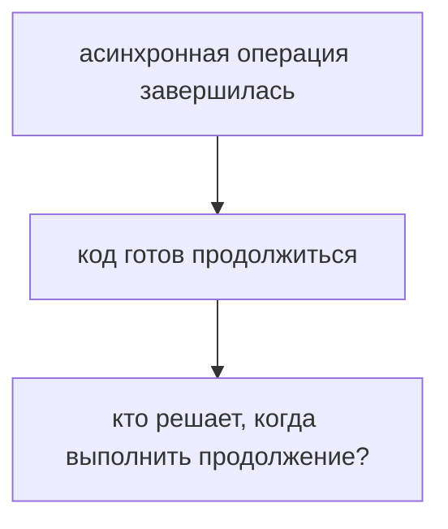
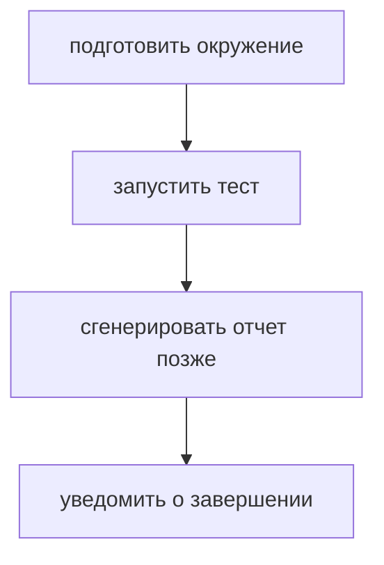
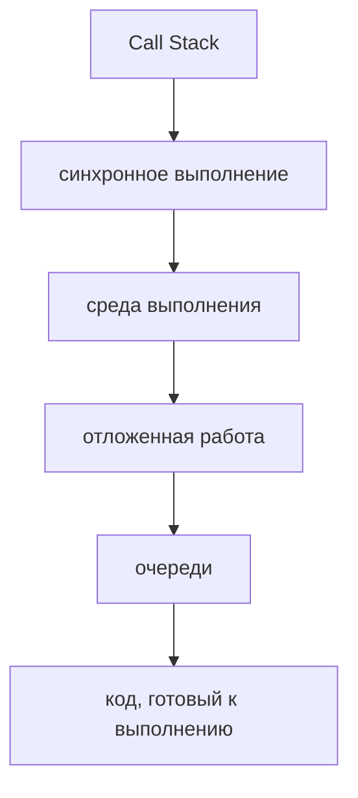
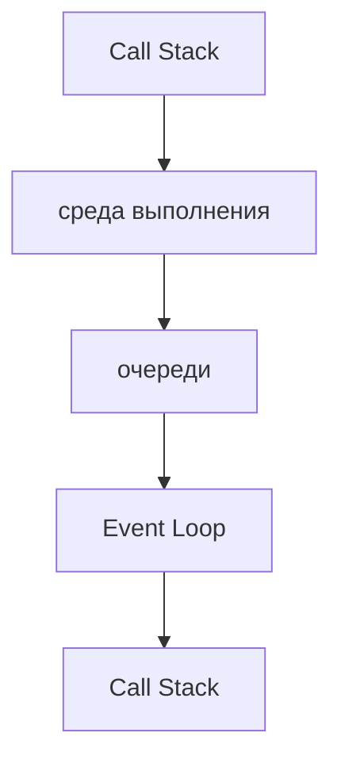
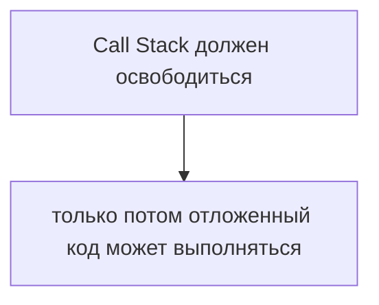
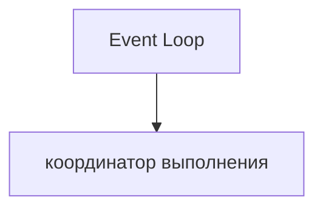
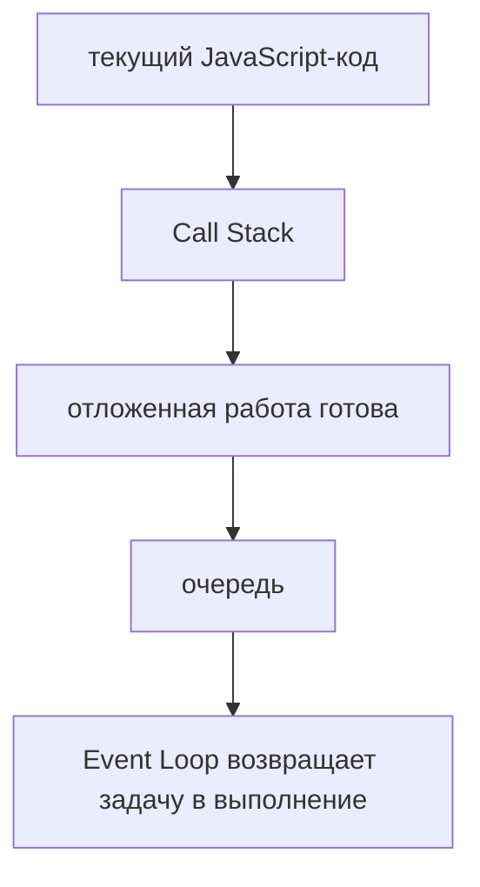
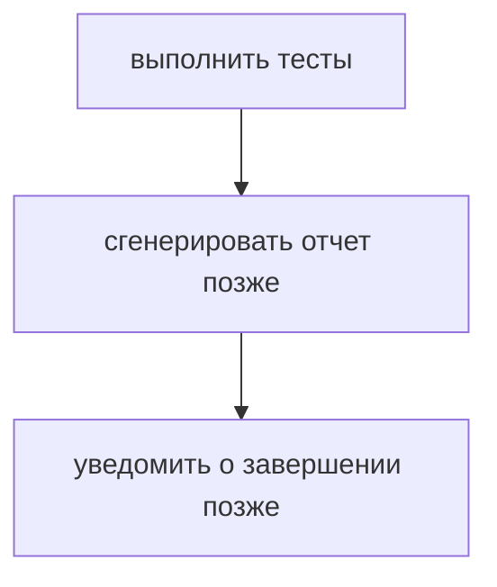

# Event Loop

## Связь с предыдущей главой

Предыдущий модуль объяснил, что Promise представляет результат асинхронной операции, который станет доступен позже.

Теперь возникает следующий вопрос:



Эта глава вводит Event Loop как координатор асинхронного выполнения.

## Главный вопрос

> Кто решает, когда отложенный код будет выполнен?

Короткий ответ: Event Loop координирует момент, когда отложенная работа может попасть обратно в выполнение JavaScript.

## Предварительные требования

Для этой главы нужно понимать:

* синхронное выполнение;
* Call Stack;
* среду выполнения JavaScript;
* обратные вызовы;
* базовую идею Promise.

В этой главе Event Loop не рассматривается как поток, JavaScript Engine или отдельный исполнитель кода. Это координатор между текущим выполнением, средой выполнения и очередями.

## Цели обучения

После главы вы будете понимать:

* зачем нужен Event Loop;
* почему отложенный код не выполняется посреди текущей строки;
* как Call Stack связан с очередями;
* почему асинхронность не означает параллельное выполнение JavaScript-кода;
* как предсказывать простой порядок выполнения.

## Мотивация

В тестовом фреймворке есть последовательность:



Синхронная часть выполняется сразу. Отложенная часть должна дождаться подходящего момента.

Если бы отложенный код мог выполняться в любой момент, программа была бы непредсказуемой. Event Loop нужен, чтобы координировать возвращение отложенной работы.

## Теория

Event Loop связывает несколько частей:



Общая схема:



Event Loop не выполняет тело функции вместо JavaScript. Он координирует, когда готовая задача может попасть в Call Stack.

Event Loop не заставляет задачу выполниться силой. Он проверяет, свободен ли Call Stack и может ли задача из очереди начать выполнение. Если Call Stack все еще занят, задача продолжает ждать в очереди.

## Внутренний механизм

Упрощенная модель:

```text
1. Выполняется текущий синхронный код
2. Асинхронная операция передается среде выполнения
3. Когда операция готова, продолжение попадает в очередь
4. Event Loop проверяет, можно ли вернуть задачу в Call Stack
5. JavaScript выполняет эту задачу
```

Главное условие:



Поэтому:

```javascript
console.log('start');

setTimeout(function generateReport() {
  console.log('report');
}, 0);

console.log('finish');
```

выводит сначала синхронные строки, а не отложенный отчет.

### Проверяемый порядок выполнения

Всю модель можно свести к одному воспроизводимому примеру:

```javascript
const order = [];
order.push('1 синхронно');
setTimeout(() => order.push('5 setTimeout 0'), 0);
Promise.resolve().then(() => order.push('3 промис'));
queueMicrotask(() => order.push('4 микрозадача'));
order.push('2 синхронно');
```

Результат всегда один и тот же:

```text
['1 синхронно', '2 синхронно', '3 промис', '4 микрозадача', '5 setTimeout 0']
```

Из него читаются все правила сразу: синхронный код идёт до конца первым, затем выполняются микрозадачи, и только потом — отложенные задачи вроде таймеров.

### Два вида очередей

| Очередь | Что попадает | Когда выполняется |
| --- | --- | --- |
| микрозадачи | обработчики Promise, `queueMicrotask()` | сразу после текущего синхронного кода |
| макрозадачи | `setTimeout`, `setInterval`, события | после того, как очередь микрозадач опустела |

Ключевое правило: перед тем как взять следующую макрозадачу, Event Loop полностью опустошает очередь микрозадач. Подробности — в главах 75 и 76.

### Почему порядок именно такой

Модель становится понятной, если помнить главное ограничение из главы 62: задача из очереди может начать выполнение только тогда, когда Call Stack пуст.

Отсюда следует то, что иначе выглядит произволом:

- нулевая задержка не означает немедленного выполнения;
- долгая синхронная функция задерживает **все** очереди сразу;
- порядок внутри одной очереди сохраняется, а между очередями действует приоритет.

### Event Loop ничего не выполняет сам

Event Loop не выполняет тело функции вместо JavaScript. Он координирует, когда готовая задача может попасть в Call Stack.

Он не заставляет задачу выполниться силой: он проверяет, свободен ли Call Stack и может ли задача из очереди начать выполнение. Если Call Stack всё ещё занят, задача продолжает ждать в очереди.

Это объясняет, почему Event Loop не спасает от блокировки. Он не прерывает выполняющийся код — у него нет такой возможности.

### Зачем это в автотестах

Понимание модели напрямую отвечает на вопросы, которые возникают при отладке тестов:

- почему проверка сработала раньше, чем обновился интерфейс;
- почему `forEach` с `async`-колбэком не дождался операций из главы 50;
- почему увеличение таймаута не помогает, если стек занят;
- почему ожидание условием надёжнее ожидания паузой.

Во всех четырёх случаях ответ один и тот же: продолжение не может выполниться, пока не освободится стек и не подойдёт очередь.

## Главная ментальная модель

Главная модель главы:



Более полная схема:



## Практические примеры

Примеры находятся в:

```text
examples/01-javascript/chapter-73/
```

Запуск:

```bash
node examples/01-javascript/chapter-73/01-event-loop-order.js
node examples/01-javascript/chapter-73/02-stack-before-deferred.js
node examples/01-javascript/chapter-73/03-coordinator-model.js
node examples/01-javascript/chapter-73/04-qa-flow.js
```

Примеры показывают, что текущий синхронный код завершается до выполнения отложенной работы.

## Пример Automation QA

В тестовом фреймворке это выглядит так:



Event Loop помогает понять, почему уведомление или загрузка отчета не выполняются прямо внутри текущего синхронного блока.

Это важно при отладке:

* задержанной генерации отчета;
* ожидания окружения;
* отложенного сохранения результата;
* порядка логов в тестовом раннере.

## Распространённые мифы

**Миф: Event Loop выполняет асинхронный код.**
Он координирует, когда готовая задача попадёт в стек. Выполняет код всё тот же движок.

**Миф: Event Loop может прервать выполняющуюся функцию.**
Не может. Задача ждёт, пока стек освободится сам.

**Миф: `setTimeout(fn, 0)` выполнится раньше обработчика Promise.**
Микрозадачи имеют приоритет: обработчик Promise выполнится первым.

**Миф: очередь одна.**
Их как минимум две — микрозадачи и макрозадачи, с разным приоритетом.

**Миф: асинхронность даёт параллельное выполнение JavaScript.**
Работу выполняет среда, а ваш код по-прежнему идёт в одном потоке.

## Частые вопросы

**В каком порядке выполнятся синхронный код, Promise и таймер?**
Синхронный код, затем микрозадачи (Promise), затем таймер.

**Почему долгая функция задерживает все таймеры?**
Пока стек занят, ни одна задача из очередей не может начать выполнение.

**Сохраняется ли порядок внутри очереди?**
Да. Приоритет действует между очередями, а внутри задачи идут по порядку.

**Помогает ли увеличение таймаута при занятом стеке?**
Нет. Проблема не в задержке, а в невозможности выполнить продолжение.

**Как это связано с ожиданиями в тестах?**
Ожидание условием переживает занятый стек, ожидание паузой — нет.

## Проверьте себя

1. В каком порядке выполнятся синхронный код, обработчик Promise и `setTimeout(fn, 0)`?
2. Какие две очереди участвуют и какая имеет приоритет?
3. Что Event Loop делает и чего он не делает?
4. При каком условии задача из очереди попадает в Call Stack?
5. Почему долгая синхронная функция задерживает все отложенные задачи?

## Распространённые ошибки

### Ошибка 1. Думать, что Event Loop выполняет JavaScript-код параллельно

Event Loop координирует возвращение задач, но не превращает JavaScript в параллельное выполнение одного и того же Call Stack.

### Ошибка 2. Ожидать, что `setTimeout(..., 0)` выполнится сразу

Нулевая задержка не отменяет правило: текущий Call Stack должен завершиться.

### Ошибка 3. Объяснять порядок только сверху вниз

В асинхронном коде нужно учитывать не только строки файла, но и очереди.

## Практика

Практика находится в:

```text
practice/01-javascript/73-event-loop.md
```

Решения находятся в:

```text
solutions/01-javascript/73-event-loop.md
```

## Краткие итоги

Event Loop объясняет, когда отложенный код возвращается к выполнению.

Главное:

* Event Loop — координатор;
* он не является JavaScript Engine;
* он не является отдельным потоком выполнения JavaScript-кода;
* текущий Call Stack должен завершиться;
* готовые задачи ждут своей очереди;
* порядок выполнения можно предсказывать через Call Stack, среду выполнения и очереди.

## Переход к следующей главе

Теперь понятно, что Event Loop координирует выполнение.

Следующий вопрос:

> Кто выполняет долгую асинхронную работу до того, как задача попадет в очередь?

Ответ следующей главы: Web APIs и возможности среды выполнения.
