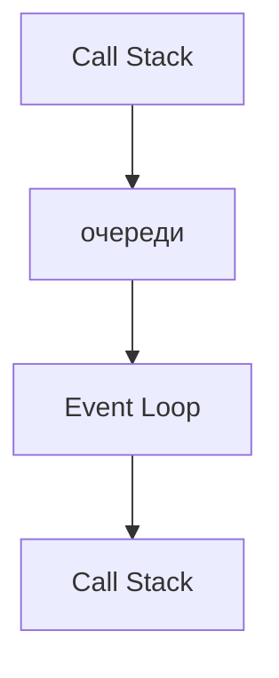
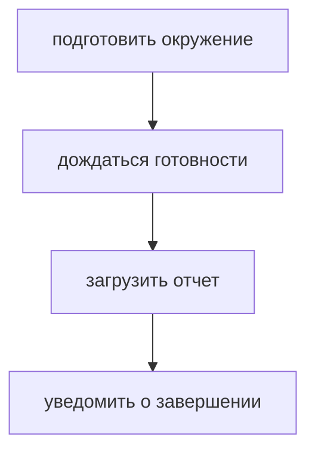
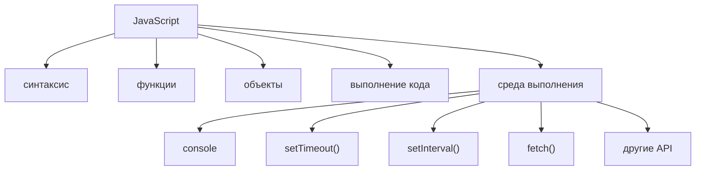
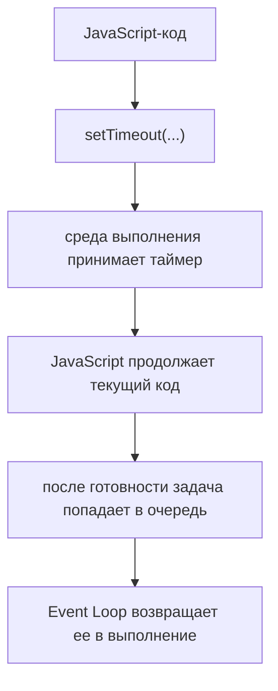
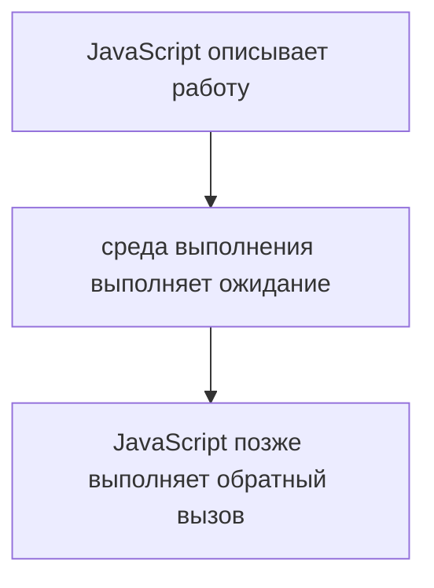
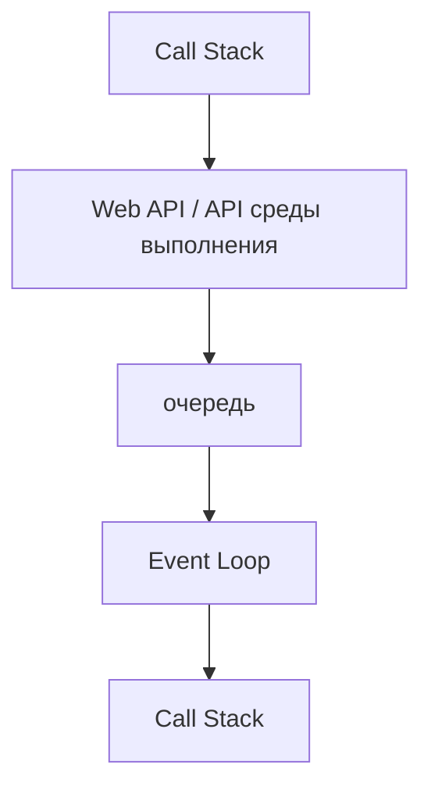
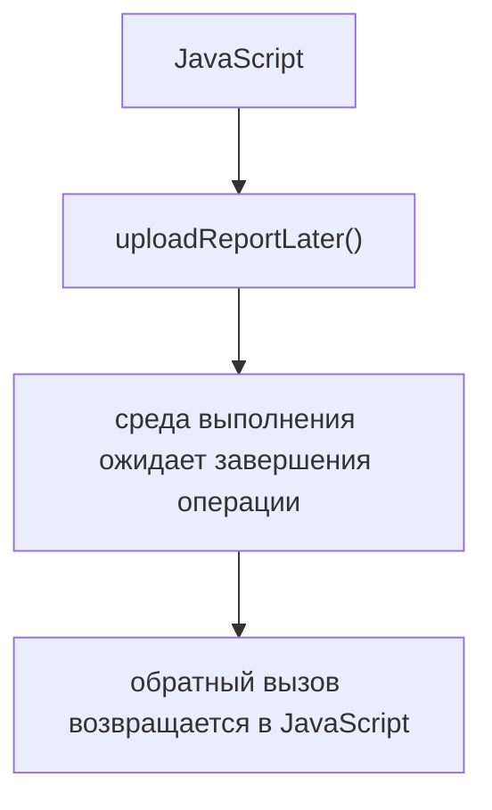

# Web APIs

## Связь с предыдущей главой

Предыдущая глава показала Event Loop как координатор:



Но Event Loop не выполняет долгую работу. Теперь нужно понять, кто занимается ожиданием таймера, сетевой операцией или другой внешней задачей.

## Главный вопрос

> Кто выполняет асинхронную работу?

Короткий ответ: JavaScript делегирует долгую работу среде выполнения через API.

## Предварительные требования

Для этой главы нужно понимать:

* синхронное выполнение;
* Event Loop как координатор;
* Call Stack;
* отложенный код;
* что JavaScript выполняется внутри среды выполнения.

## Цели обучения

После главы вы будете понимать:

* чем JavaScript отличается от среды выполнения;
* зачем нужны Web APIs;
* почему `setTimeout()` не является частью синтаксиса языка;
* почему `console`, `setTimeout()` и `fetch()` предоставляет среда выполнения;
* как это связано с тестовым фреймворком.

## Мотивация

В тестовом фреймворке есть операции:



JavaScript-код может описать такие действия, но само ожидание часто выполняется не языком, а средой выполнения.

## Теория

Нужно различать:



Web APIs — это возможности браузерной среды выполнения, доступные JavaScript-коду в браузере. Node.js предоставляет собственные API среды выполнения. Общая идея одна: JavaScript получает дополнительные возможности от среды, в которой выполняется.

В этой главе `fetch()` упоминается только как пример API среды выполнения. Подробная работа сетевых запросов будет изучаться отдельно.

## Внутренний механизм

Когда код вызывает `setTimeout()`:



Важно:



Это не означает, что весь JavaScript-код выполняется параллельно. Асинхронная часть передается среде выполнения, а сам обратный вызов выполнится позже в обычном JavaScript-выполнении.

## Главная ментальная модель

Главная модель главы:

```text
JavaScript делегирует долгую работу среде выполнения
```

Схема:



## Практические примеры

Примеры находятся в:

```text
examples/01-javascript/chapter-74/
```

Запуск:

```bash
node examples/01-javascript/chapter-74/01-runtime-api.js
node examples/01-javascript/chapter-74/02-timeout-delegation.js
node examples/01-javascript/chapter-74/03-api-vs-language.js
node examples/01-javascript/chapter-74/04-qa-flow.js
```

Примеры показывают, что JavaScript запускает операцию, а ожидание выполняется возможностями среды выполнения.

## Пример Automation QA

В тестовом фреймворке это особенно заметно при загрузке отчета:



Такой подход помогает не блокировать весь текущий код ожиданием внешнего действия.

## Распространённые ошибки

### Ошибка 1. Считать `setTimeout()` частью языка JavaScript

`setTimeout()` предоставляет среда выполнения. JavaScript-код только вызывает этот API.

### Ошибка 2. Думать, что Web APIs выполняют тело обратного вызова вместо JavaScript

Среда выполнения ожидает событие. Тело функции выполняется позже как JavaScript-код.

### Ошибка 3. Не различать JavaScript Engine и среду выполнения

Engine выполняет JavaScript-код. Среда выполнения предоставляет дополнительные API и инфраструктуру.

## Практика

Практика находится в:

```text
practice/01-javascript/74-web-apis.md
```

Решения находятся в:

```text
solutions/01-javascript/74-web-apis.md
```

## Краткие итоги

Web APIs объясняют, кто занимается долгими асинхронными задачами.

Главное:

* JavaScript и среда выполнения — не одно и то же;
* `console`, `setTimeout()`, `setInterval()` и `fetch()` предоставляются средой выполнения;
* JavaScript делегирует долгую работу API среды выполнения;
* готовое продолжение возвращается через очередь;
* Event Loop координирует возвращение задачи в Call Stack.

## Переход к следующей главе

Теперь понятно, кто принимает асинхронную работу.

Следующий вопрос:

> Если несколько задач готовы, какая выполнится первой?

Ответ начинается с Microtasks.
