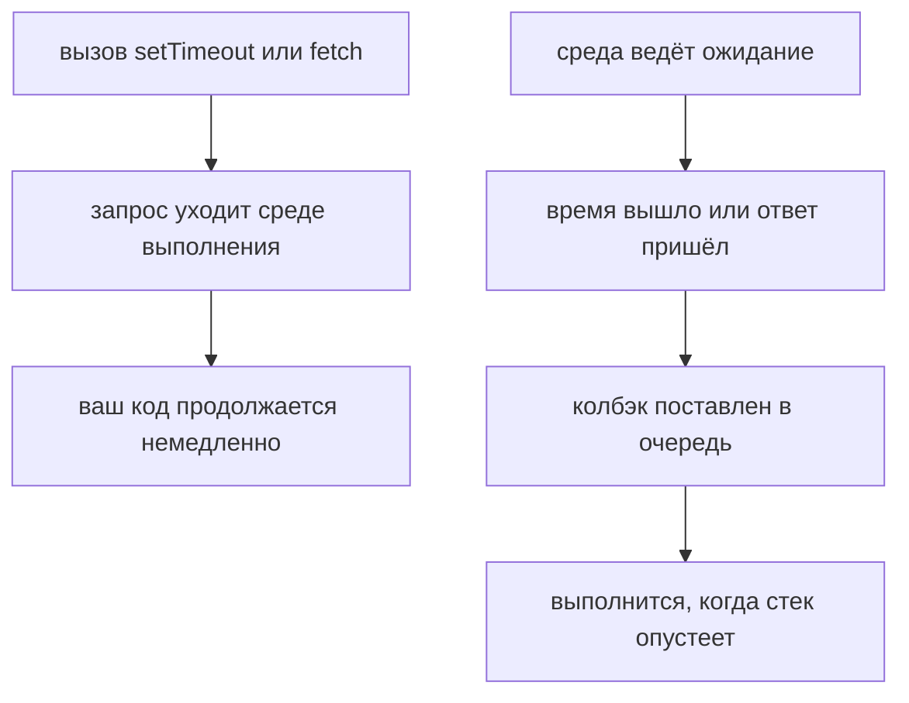

# Браузерные API

## Связь с предыдущей главой

Предыдущая глава показала Event Loop как координатор:

Но Event Loop не выполняет долгую работу. Теперь нужно понять, кто занимается ожиданием таймера, сетевой операцией или другой внешней задачей.

## Главный вопрос

> Кто выполняет асинхронную работу?

Короткий ответ: JavaScript делегирует долгую работу среде выполнения через API.

## Предварительные требования

Для этой главы нужно понимать:

* синхронное выполнение;
* Event Loop как координатор;
* Call Stack;
* отложенный код;
* что JavaScript выполняется внутри среды выполнения.

## Цели обучения

После главы вы будете понимать:

* чем JavaScript отличается от среды выполнения;
* зачем нужны Web APIs;
* почему `setTimeout()` не является частью синтаксиса языка;
* почему `console`, `setTimeout()` и `fetch()` предоставляет среда выполнения;
* как это связано с тестовым фреймворком.

## Мотивация

В тестовом фреймворке есть операции:

JavaScript-код может описать такие действия, но само ожидание часто выполняется не языком, а средой выполнения.

## Теория

### Язык и среда выполнения — разные вещи

Нужно различать:

| Что это | Примеры | Кто предоставляет |
| --- | --- | --- |
| язык JavaScript | переменные, функции, объекты, Promise | спецификация языка |
| API среды выполнения | `setTimeout`, `fetch`, DOM, файловая система | браузер или Node.js |

Web APIs — это возможности браузерной среды выполнения, доступные JavaScript-коду в браузере. Node.js предоставляет собственные API среды выполнения. Общая идея одна: JavaScript получает дополнительные возможности от среды, в которой выполняется.

Практическое следствие: код, работающий в браузере, может не работать в Node — и наоборот. Обращение к `document` в Node даёт ошибку не потому, что язык сломан, а потому, что такого API в этой среде нет.

### Кто на самом деле ждёт

Это главная мысль главы, объясняющая асинхронность до конца.

Движок JavaScript однопоточен и ничего не ждёт. Когда код вызывает `setTimeout()`, отсчёт времени ведёт **среда выполнения** — не движок. Пока она считает, движок занят обычным выполнением кода.

То же с сетевым запросом: соединение, передачу и получение ответа обслуживает среда. JavaScript получает только момент готовности.

В этой главе `fetch()` упоминается только как пример API среды выполнения. Подробная работа сетевых запросов будет изучаться отдельно.

### Разделение обязанностей

| Кто | Что делает |
| --- | --- |
| движок JavaScript | выполняет код, ведёт стек вызовов |
| среда выполнения | ведёт отсчёт, обслуживает сеть и события |
| событийный цикл | переносит готовые продолжения в стек |

Эта таблица закрывает вопрос «как однопоточный язык делает несколько дел»: он их не делает — их делает среда, а язык обрабатывает результаты по одному.

Ждёт не ваш код, а среда выполнения:


```mermaid
flowchart TD
    A["вызов setTimeout или fetch"] --> B["запрос уходит среде выполнения"]
    B --> C["ваш код продолжается немедленно"]
    D["среда ведёт ожидание"] --> E["время вышло или ответ пришёл"]
    E --> F["колбэк поставлен в очередь"]
    F --> G["выполнится, когда стек опустеет"]
```

## Внутренний механизм

### Что происходит при вызове `setTimeout()`

1. движок вызывает API среды выполнения и передаёт ему функцию и задержку;
2. среда регистрирует таймер и **сразу возвращает управление**;
3. движок продолжает выполнять следующие строки;
4. когда задержка истекла, среда кладёт функцию в очередь макрозадач;
5. Событийный цикл переносит её в стек вызовов, как только тот освободится.

Важно: шаг 4 — это попадание **в очередь**, а не выполнение. Между истечением задержки и фактическим вызовом может пройти сколько угодно времени, если стек занят.

### Параллельна среда, а не ваш код

Это не означает, что весь JavaScript-код выполняется параллельно. Асинхронная часть передаётся среде выполнения, а сам обратный вызов выполнится позже в обычном JavaScript-выполнении.

Проверить это просто: сто одновременных таймеров действительно отсчитываются одновременно — но сто их колбэков выполнятся по одному, друг за другом, когда освободится стек.

### Node.js и браузер: одна модель, разные API

Набор API различается, но схема одна:

| Задача | Браузер | Node.js |
| --- | --- | --- |
| отложить выполнение | `setTimeout` | `setTimeout` |
| сетевой запрос | `fetch`, `XMLHttpRequest` | `fetch`, модули HTTP |
| работа с интерфейсом | DOM | нет |
| файлы | ограниченно | файловая система |

Для автотестов это различие практическое: код тестового раннера выполняется в Node, а код страницы — в браузере, и доступные им API разные. Именно поэтому в главах про Playwright обращение к `document` возможно только внутри выполнения на странице.

## Главная ментальная модель

Главная модель главы:

```text
JavaScript делегирует долгую работу среде выполнения
```

Схема разделения обязанностей:

```text
JavaScript  → вызывает API среды и идёт дальше
среда       → выполняет долгую работу
очередь     → принимает готовое продолжение
JavaScript  → выполняет продолжение, когда стек свободен
```

## Практические примеры

Примеры находятся в:

```text
examples/01-javascript/chapter-74/
```

Запуск:

```bash
node examples/01-javascript/chapter-74/01-runtime-api.js
node examples/01-javascript/chapter-74/02-timeout-delegation.js
node examples/01-javascript/chapter-74/03-api-vs-language.js
node examples/01-javascript/chapter-74/04-qa-flow.js
```

Примеры показывают, что JavaScript запускает операцию, а ожидание выполняется возможностями среды выполнения.

## Пример Automation QA

В тестовом фреймворке это особенно заметно при загрузке отчёта: запрос уходит
наружу, а движок продолжает выполнять текущий код.

```javascript
const upload = fetch('/reports', { method: 'POST', body: report });

console.log('отчёт отправляется');   // выполнится раньше ответа

await upload;
console.log('отчёт доставлен');
```

Такой подход помогает не блокировать весь текущий код ожиданием внешнего
действия.

### Где проходит граница сред выполнения

Код теста выполняется в Node.js, код страницы — в браузере. Это разные среды
с разными доступными интерфейсами:

```javascript
// В коде теста document не существует.
await page.evaluate(() => document.title);   // а здесь существует
```

Отсюда правило, которое экономит часы: если в тесте появилось обращение к
`document` или `window`, оно должно находиться внутри выполнения на странице.
В главах про Playwright это ограничение будет повторяться постоянно.

### Таймер — не механизм ожидания

`setTimeout` знает только о времени и ничего не знает о состоянии системы.
Пауза «на всякий случай» либо делает набор медленным, либо оставляет его
нестабильным — а чаще и то и другое. Ожидание должно быть привязано к
наблюдаемому условию, и глава 172 разбирает это подробно.

## Распространённые мифы

**Миф: `setTimeout` — часть языка JavaScript.**
Это API среды выполнения. Язык описывает синтаксис и объекты, а таймеры даёт браузер или Node.

**Миф: движок ведёт отсчёт времени.**
Отсчёт ведёт среда. Движок в это время выполняет обычный код.

**Миф: истечение задержки означает выполнение колбэка.**
Он попадает в очередь. Выполнение произойдёт, когда освободится стек.

**Миф: много таймеров — много параллельного JavaScript.**
Параллельно идёт отсчёт. Колбэки выполняются по одному.

**Миф: код одинаково работает в браузере и в Node.**
Набор API разный: `document` есть только в браузере, файловая система — только в Node.

## Частые вопросы

**Почему `document is not defined` в Node?**
DOM — браузерный API. В Node его нет.

**Кто ждёт во время сетевого запроса?**
Среда выполнения. Движок в это время свободен для другого кода.

**Почему колбэк таймера выполнился позже заявленной задержки?**
Он ждал в очереди, пока стек не освободился.

**Значит ли асинхронность, что кода выполняется больше одновременно?**
Нет. Одновременно работает среда, а JavaScript обрабатывает результаты по одному.

**Где проходит граница между языком и средой?**
Язык — синтаксис, типы, объекты. Среда — таймеры, сеть, интерфейс, файлы.

## Проверьте себя

1. Чем возможности языка отличаются от API среды выполнения?
2. Кто ведёт отсчёт времени при вызове `setTimeout()`?
3. Что происходит по истечении задержки — выполнение или попадание в очередь?
4. Почему сто таймеров не дают параллельного выполнения JavaScript?
5. Какие API есть в браузере, но отсутствуют в Node?

### Ответы

1. Язык описывает синтаксис и вычисления. Среда добавляет возможности вне языка: таймеры, сеть, файлы, работу со страницей. В спецификации языка их нет.
2. Среда выполнения, а не движок. Движок в это время свободен и выполняет другой код.
3. Попадание обратного вызова в очередь. Выполнится он, когда освободится стек.
4. Таймеры отсчитываются средой, но обратные вызовы выполняются по одному в том же единственном потоке. Одновременно идёт ожидание, а не выполнение кода.
5. `document`, `window`, `localStorage`, `alert` — всё, что описывает страницу и окно браузера.

## Распространённые ошибки

### Ошибка 1. Считать `setTimeout()` частью языка JavaScript

`setTimeout()` предоставляет среда выполнения. JavaScript-код только вызывает этот API.

### Ошибка 2. Думать, что Web APIs выполняют тело обратного вызова вместо JavaScript

Среда выполнения ожидает событие. Тело функции выполняется позже как JavaScript-код.

### Ошибка 3. Не различать движок и среду выполнения

Движок выполняет код. Среда выполнения предоставляет дополнительные API и инфраструктуру.

## Практика

Практика находится в:

```text
practice/01-javascript/74-web-apis.md
```

Решения находятся в:

```text
solutions/01-javascript/74-web-apis.md
```

## Краткие итоги

Web APIs объясняют, кто занимается долгими асинхронными задачами.

Главное:

* JavaScript и среда выполнения — не одно и то же;
* `console`, `setTimeout()`, `setInterval()` и `fetch()` предоставляются средой выполнения;
* JavaScript делегирует долгую работу API среды выполнения;
* готовое продолжение возвращается через очередь;
* событийный цикл координирует возвращение задачи в стек вызовов.

## Переход к следующей главе

Теперь понятно, кто принимает асинхронную работу.

Следующий вопрос:

> Если несколько задач готовы, какая выполнится первой?

Ответ начинается с микрозадач.
