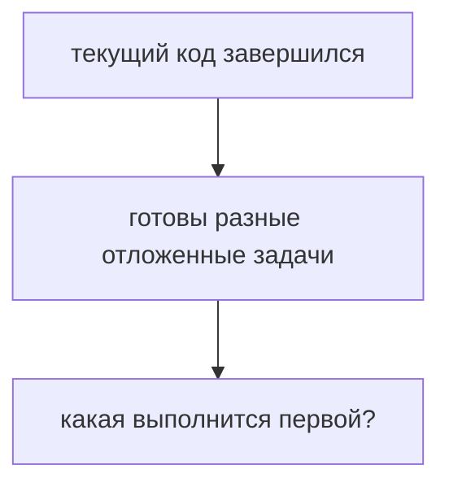
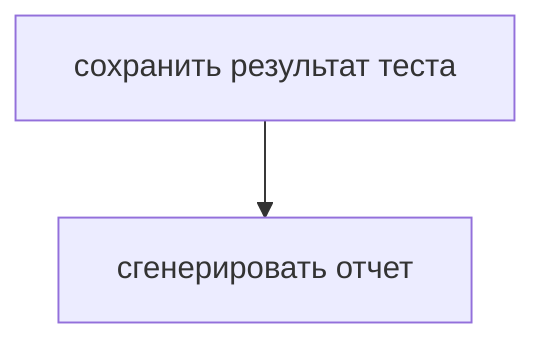
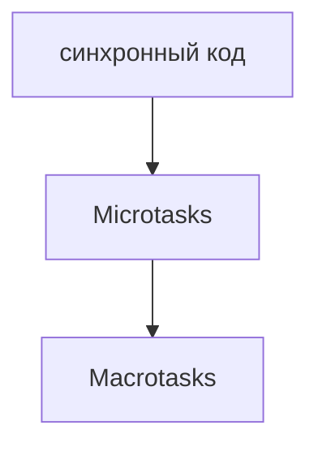
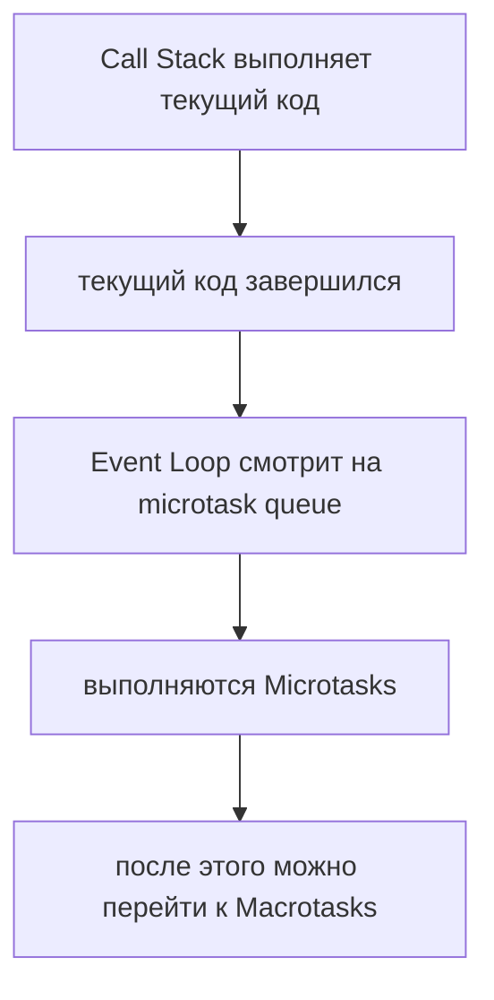
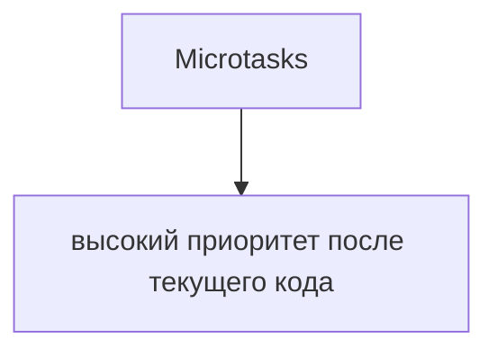
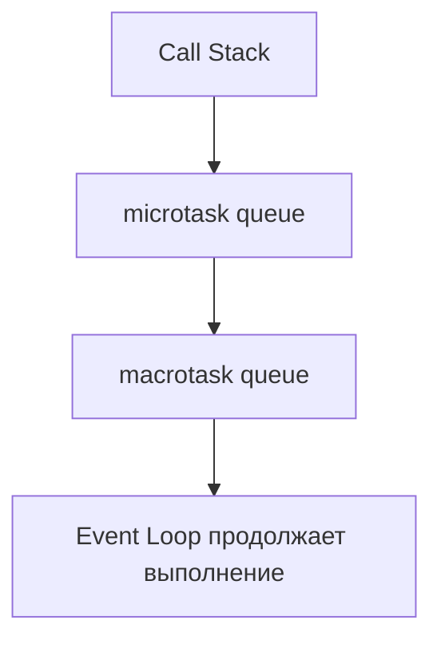
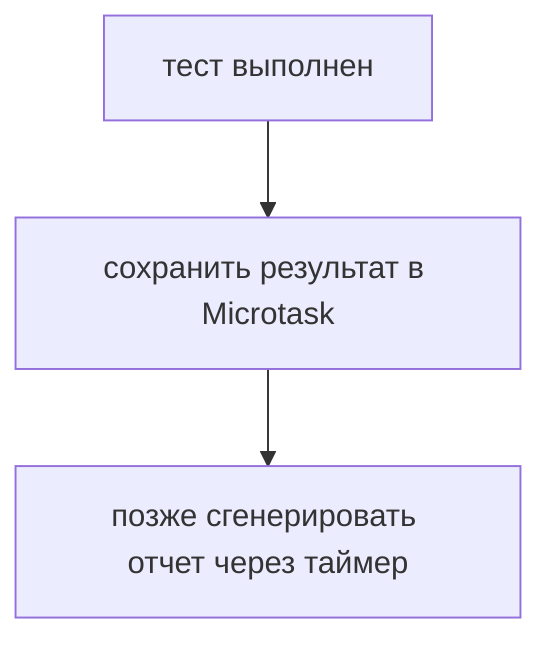

# Microtasks

## Связь с предыдущей главой

Предыдущая глава показала, что JavaScript делегирует долгую работу среде выполнения.

Теперь появляется новый вопрос:



Эта глава вводит Microtasks.

## Главный вопрос

> Какие задачи выполняются первыми после текущего кода?

Короткий ответ: Microtasks имеют более высокий приоритет, чем macrotasks.

## Предварительные требования

Для этой главы нужно понимать:

* Event Loop как координатор;
* Call Stack;
* Promise на базовом уровне;
* среду выполнения JavaScript;
* что отложенный код может ждать в очереди.

## Цели обучения

После главы вы будете понимать:

* что такое Microtasks;
* почему обработчики Promise выполняются раньше таймеров;
* зачем существует microtask queue;
* как работает `queueMicrotask()`;
* как это влияет на порядок операций в Automation QA.

## Мотивация

В тестовом фреймворке после выполнения теста могут быть готовы две задачи:



Сохранение результата часто должно произойти как можно раньше после текущего кода, до более крупных отложенных задач вроде таймера.

Для таких продолжений используется очередь Microtasks.

## Теория

Microtasks — это задачи с высоким приоритетом, которые выполняются после завершения текущего синхронного кода и перед macrotasks.

К Microtasks относятся:

```text
обработчики Promise
queueMicrotask()
```

Здесь обработчики Promise означают функции, переданные в `then()` и `catch()`. Подробные внутренние состояния Promise не нужны для этой главы.

`Promise.then()` и `queueMicrotask()` оба планируют работу в microtask queue, хотя обычно используются для разных задач. Внутренние различия их реализации в этой главе не нужны.

Базовый порядок:



## Внутренний механизм

Упрощенная схема:



Пример:

```javascript
console.log('start');

setTimeout(function timer() {
  console.log('timer');
}, 0);

Promise.resolve().then(function promiseHandler() {
  console.log('promise');
});

console.log('finish');
```

Порядок:

```text
start
finish
promise
timer
```

`promise` выводится раньше `timer`, потому что обработчик Promise попадает в microtask queue.

## Главная ментальная модель

Главная модель главы:



Схема:



## Практические примеры

Примеры находятся в:

```text
examples/01-javascript/chapter-75/
```

Запуск:

```bash
node examples/01-javascript/chapter-75/01-promise-microtask.js
node examples/01-javascript/chapter-75/02-queue-microtask.js
node examples/01-javascript/chapter-75/03-microtask-before-timer.js
node examples/01-javascript/chapter-75/04-qa-flow.js
```

Примеры показывают, что Microtasks выполняются после текущего синхронного кода, но до таймеров.

## Пример Automation QA

В тестовом фреймворке microtask может использоваться для короткого продолжения:



Это объясняет, почему лог сохранения результата может появиться раньше лога генерации отчета, даже если таймер был запланирован раньше.

## Распространённые ошибки

### Ошибка 1. Думать, что Promise выполняется параллельно с текущей строкой

Обработчик Promise не прерывает текущий синхронный код. Он выполняется после освобождения Call Stack.

### Ошибка 2. Ожидать, что таймер всегда идет раньше Promise

Даже если `setTimeout()` написан раньше, Microtasks имеют приоритет после текущего кода.

### Ошибка 3. Считать `queueMicrotask()` заменой таймера

`queueMicrotask()` планирует короткую задачу с высоким приоритетом, а не задержку по времени.

## Практика

Практика находится в:

```text
practice/01-javascript/75-microtasks.md
```

Решения находятся в:

```text
solutions/01-javascript/75-microtasks.md
```

## Краткие итоги

Microtasks объясняют, почему некоторые отложенные действия выполняются раньше таймеров.

Главное:

* обработчики `then()` и `catch()` относятся к Microtasks;
* `queueMicrotask()` явно добавляет microtask;
* Microtasks выполняются после текущего синхронного кода;
* Microtasks выполняются до macrotasks;
* порядок можно предсказывать без запоминания отдельных примеров.

## Переход к следующей главе

Теперь понятно, почему Promise-обработчик может выполниться раньше таймера.

Следующий вопрос:

> Когда выполняются таймеры и похожие задачи?

Ответ: через Macrotasks.
