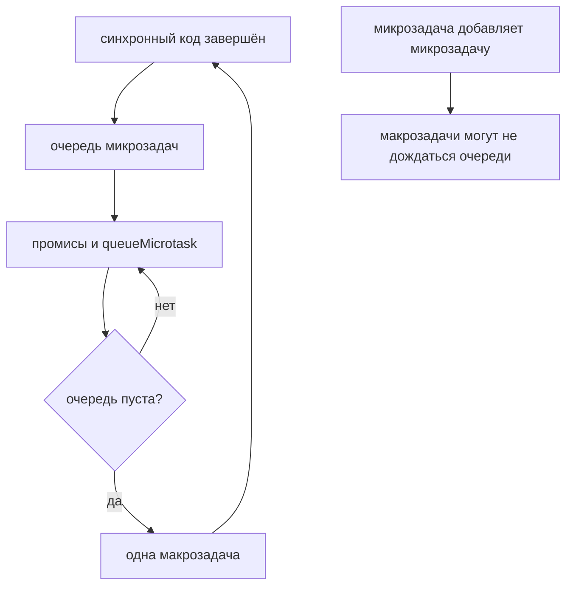

# Микрозадачи

## Связь с предыдущей главой

Предыдущая глава показала, что JavaScript делегирует долгую работу среде выполнения.

Теперь появляется новый вопрос:

Эта глава вводит Microtasks.

## Главный вопрос

> Какие задачи выполняются первыми после текущего кода?

Короткий ответ: у микрозадач более высокий приоритет, чем у макрозадач.

## Предварительные требования

Для этой главы нужно понимать:

* Event Loop как координатор;
* Call Stack;
* Promise на базовом уровне;
* среду выполнения JavaScript;
* что отложенный код может ждать в очереди.

## Цели обучения

После главы вы будете понимать:

* что такое Microtasks;
* почему обработчики Promise выполняются раньше таймеров;
* зачем существует microtask queue;
* как работает `queueMicrotask()`;
* как это влияет на порядок операций в Automation QA.

## Мотивация

В тестовом фреймворке после выполнения теста могут быть готовы две задачи:

Сохранение результата часто должно произойти как можно раньше после текущего кода, до более крупных отложенных задач вроде таймера.

Для таких продолжений используется очередь Microtasks.

## Теория

### Задачи с приоритетом

Микрозадачи — это задачи с высоким приоритетом, которые выполняются после завершения текущего синхронного кода и перед макрозадачами.

К микрозадачам относятся:

```text
обработчики Promise
queueMicrotask()
```

Здесь обработчики Promise означают функции, переданные в `then()` и `catch()`. Подробные внутренние состояния Promise не нужны для этой главы.

`Promise.then()` и `queueMicrotask()` оба планируют работу в очереди микрозадач, хотя обычно используются для разных задач. Внутренние различия их реализации в этой главе не нужны.

### Базовый порядок

| Очередь | Когда выполняется |
| --- | --- |
| текущий синхронный код | сейчас, до конца |
| микрозадачи | сразу после него, **вся очередь целиком** |
| макрозадачи | после того, как микрозадач не осталось |

Слова «вся очередь целиком» — самая важная часть. Событийный цикл не берёт одну микрозадачу и не переходит к таймеру: он опустошает очередь полностью.

### Приоритет проверяется

```javascript
const order = [];
setTimeout(() => order.push('таймер'), 0);
Promise.resolve()
  .then(() => { order.push('микро 1'); return Promise.resolve(); })
  .then(() => order.push('микро 2'));
```

Результат: `['микро 1', 'микро 2', 'таймер']`.

Обратите внимание на вторую микрозадачу: она была **создана** уже во время обработки очереди — и всё равно выполнилась раньше таймера, который стоял в очереди дольше. Микрозадачи, порождённые микрозадачами, обрабатываются в том же проходе.

### Чем это опасно

Отсюда следует неприятная возможность: бесконечно порождая микрозадачи, можно полностью заблокировать макрозадачи.

```javascript
function loop() {
  Promise.resolve().then(loop);   // очередь микрозадач никогда не опустеет
}
```

Такой код не нагружает процессор бесконечным циклом в привычном смысле, но таймеры и события перестают выполняться совсем. Это редкий случай, однако он хорошо объясняет, почему приоритет микрозадач — не просто «чуть раньше».

### Почему приоритет вообще нужен

Микрозадачи предназначены для завершения текущей логической операции. Когда Promise разрешается, его обработчики логически принадлежат тому же «моменту», что и разрешение: нежелательно, чтобы между ними успел выполниться таймер или обработчик события.

Это даёт предсказуемость: цепочка `.then()` отрабатывает целиком, не перемежаясь посторонними задачами.

Микрозадачи выполняются раньше следующей макрозадачи:


```mermaid
flowchart TD
    A["синхронный код завершён"] --> B["очередь микрозадач"]
    B --> C["промисы и queueMicrotask"]
    C --> D{"очередь пуста?"}
    D -- "нет" --> C
    D -- "да" --> E["одна макрозадача"]
    E --> A
    F["микрозадача добавляет микрозадачу"] --> G["макрозадачи могут не дождаться очереди"]
```

## Внутренний механизм

Упрощённая схема прохода:

```text
1. выполнить текущий синхронный код до конца
2. опустошить очередь микрозадач целиком
3. взять одну макрозадачу
4. вернуться к шагу 2
```

Пример:

```javascript
console.log('start');

setTimeout(function timer() {
  console.log('timer');
}, 0);

Promise.resolve().then(function promiseHandler() {
  console.log('promise');
});

console.log('finish');
```

Порядок:

```text
start
finish
promise
timer
```

`promise` выводится раньше `timer`, потому что обработчик промиса попадает в очередь микрозадач.

## Главная ментальная модель

Главная модель главы: **микрозадачи завершают текущую логическую операцию и выполняются раньше любых отложенных задач**.

```text
синхронный код → ВСЕ микрозадачи → одна макрозадача
```

## Практические примеры

Примеры находятся в:

```text
examples/01-javascript/chapter-75/
```

Запуск:

```bash
node examples/01-javascript/chapter-75/01-promise-microtask.js
node examples/01-javascript/chapter-75/02-queue-microtask.js
node examples/01-javascript/chapter-75/03-microtask-before-timer.js
node examples/01-javascript/chapter-75/04-qa-flow.js
```

Примеры показывают, что микрозадачи выполняются после текущего синхронного кода, но до таймеров.

## Пример Automation QA

В тестовом фреймворке микрозадача — это короткое продолжение уже полученного
результата:

```javascript
saveResult(result).then(() => console.log('результат сохранён'));

setTimeout(() => console.log('отчёт сформирован'), 0);
```

Это объясняет, почему запись о сохранении результата может появиться раньше
записи о формировании отчёта, даже если таймер был запланирован первым.

### Почему это важно для порядка записей в журнале

Очередь микрозадач опустошается **полностью** перед следующей макрозадачей.
Поэтому цепочка `then` из десяти шагов выполнится до первого `setTimeout`,
и журнал покажет их подряд, без чередования с таймерами.

Для расследования это удобно: связанные события не перемешиваются. Но
полагаться на этот порядок в проверках нельзя — он описывает механизм движка,
а не контракт системы.

### Где это встречается в тестах на практике

Самый частый случай — сравнение «до и после» в одном тике:

```javascript
const before = await readState();

await performAction();

const after = await readState();
```

Каждый `await` — переход через очередь микрозадач. Между `before` и `after`
движок успевает обработать все готовые продолжения, и если система меняет
состояние асинхронно, второе чтение может застать промежуточный момент.
Устойчивая проверка ждёт условие, а не следующий тик.

## Распространённые мифы

**Миф: микрозадачи выполняются «чуть быстрее».**
Дело не в скорости, а в приоритете: вся их очередь опустошается до первой макрозадачи.

**Миф: событийный цикл берёт по одной микрозадаче между таймерами.**
Он обрабатывает очередь целиком, включая задачи, порождённые в процессе.

**Миф: микрозадача, созданная позже таймера, выполнится после него.**
Она выполнится раньше: приоритет важнее времени постановки.

**Миф: микрозадачами нельзя заблокировать программу.**
Можно: бесконечное порождение микрозадач не даёт выполниться ни одной макрозадаче.

**Миф: `queueMicrotask()` и `then()` принципиально различаются.**
Оба планируют работу в одну и ту же очередь.

## Частые вопросы

**Что выполнится раньше — `then()` или `setTimeout(fn, 0)`?**
Обработчик Promise: микрозадачи имеют приоритет.

**Выполнится ли микрозадача, созданная внутри микрозадачи, в том же проходе?**
Да. Очередь обрабатывается до полного опустошения.

**Зачем микрозадачам приоритет?**
Чтобы логически связанная работа завершилась целиком, не перемежаясь посторонними задачами.

**Можно ли «зависнуть» на микрозадачах?**
Да, если порождать их бесконечно: макрозадачи перестанут выполняться.

**Когда использовать `queueMicrotask()`?**
Когда нужно отложить работу до конца текущего синхронного кода, но выполнить её раньше таймеров.

## Проверьте себя

1. Когда выполняются микрозадачи относительно синхронного кода и таймеров?
2. Что происходит с микрозадачей, порождённой во время обработки очереди?
3. Почему микрозадача, созданная позже таймера, выполняется раньше него?
4. Как бесконечные микрозадачи блокируют программу?
5. Зачем микрозадачам дан приоритет над макрозадачами?

### Ответы

1. После завершения синхронного кода и до ближайшей макрозадачи, включая таймер с нулевой задержкой.
2. Она добавляется в ту же очередь и выполняется в этом же проходе — до перехода к макрозадачам.
3. Потому что приоритет определяется очередью, а не временем постановки. Очередь микрозадач разбирается целиком раньше.
4. Каждая новая микрозадача добавляется в очередь, которая разбирается до конца. Очередь не пустеет, и до макрозадач и отрисовки дело не доходит.
5. Чтобы продолжения промисов выполнялись как можно раньше после текущей операции и состояние программы не оставалось незавершённым до следующего таймера.

## Распространённые ошибки

### Ошибка 1. Думать, что Promise выполняется параллельно с текущей строкой

Обработчик промиса не прерывает текущий синхронный код. Он выполняется после освобождения стека вызовов.

### Ошибка 2. Ожидать, что таймер всегда идет раньше Promise

Даже если `setTimeout()` написан раньше, микрозадачи имеют приоритет после текущего кода.

### Ошибка 3. Считать `queueMicrotask()` заменой таймера

`queueMicrotask()` планирует короткую задачу с высоким приоритетом, а не задержку по времени.

## Практика

Практика находится в:

```text
practice/01-javascript/75-microtasks.md
```

Решения находятся в:

```text
solutions/01-javascript/75-microtasks.md
```

## Краткие итоги

Микрозадачи объясняют, почему некоторые отложенные действия выполняются раньше таймеров.

Главное:

* обработчики `then()` и `catch()` относятся к микрозадачам;
* `queueMicrotask()` явно добавляет микрозадачу;
* микрозадачи выполняются после текущего синхронного кода;
* микрозадачи выполняются до макрозадач;
* порядок можно предсказывать без запоминания отдельных примеров.

## Переход к следующей главе

Теперь понятно, почему Promise-обработчик может выполниться раньше таймера.

Следующий вопрос:

> Когда выполняются таймеры и похожие задачи?

Ответ: через макрозадачи.
