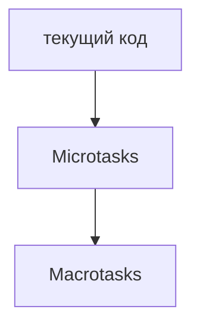
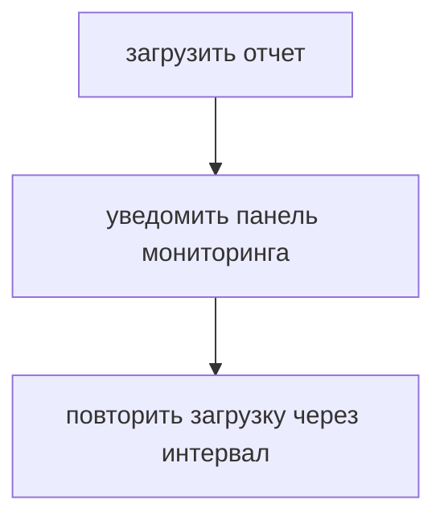
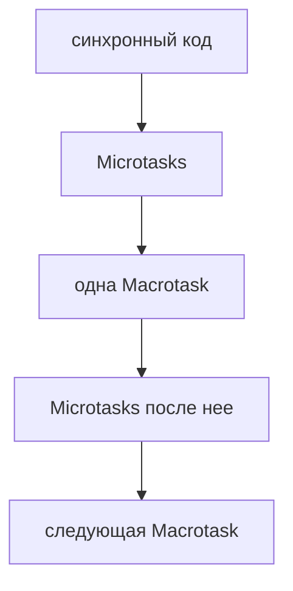
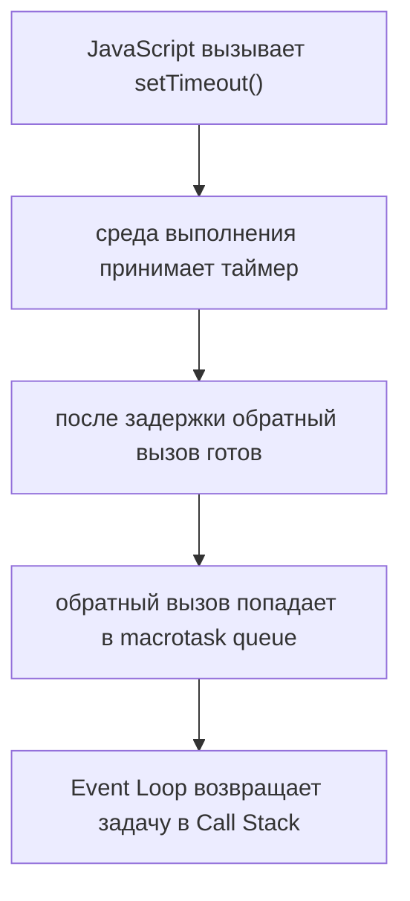
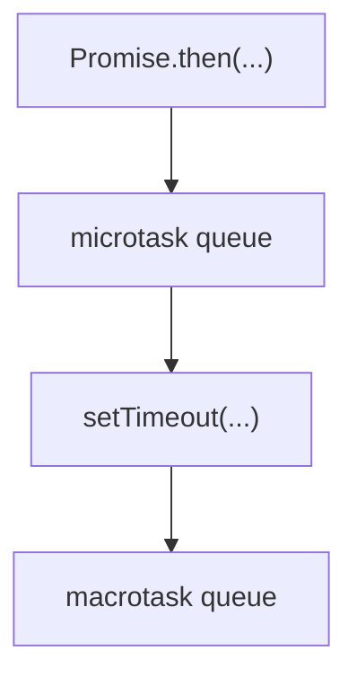
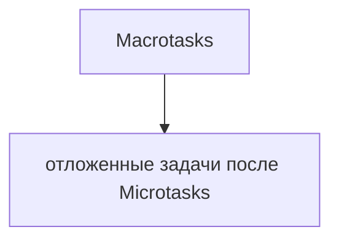
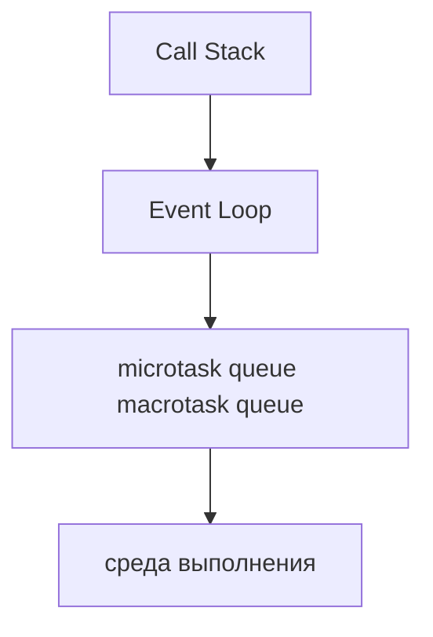
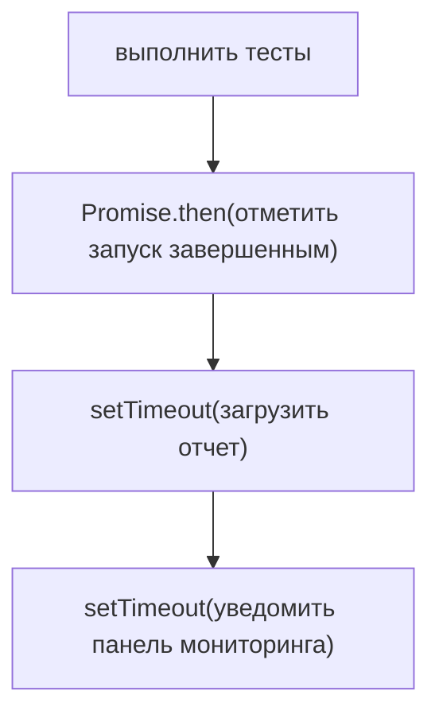
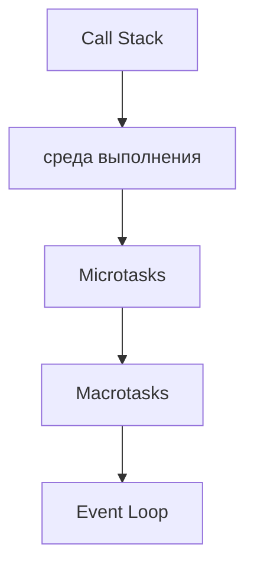

# Macrotasks

## Связь с предыдущей главой

Предыдущая глава объяснила Microtспрашивает:



Теперь нужно отдельно разобрать задачи вроде таймеров.

## Главный вопрос

> Когда выполняются таймеры и похожие задачи?

Короткий ответ: Macrotasks выполняются после текущего кода и после Microtasks.

## Предварительные требования

Для этой главы нужно понимать:

* Event Loop;
* Web APIs;
* Microtasks;
* Call Stack;
* базовую асинхронность.

## Цели обучения

После главы вы будете понимать:

* что такое Macrotasks;
* почему `setTimeout()` выполняется после текущего кода;
* почему Microtasks идут раньше Macrotasks;
* как `setInterval()` планирует повторяющиеся macrotasks;
* как предсказывать порядок в тестовом фреймворке.

## Мотивация

В Automation QA часто есть задачи, которые должны выполниться позже:



Такие задачи обычно планируются через API среды выполнения и попадают в очередь macrotasks.

## Теория

Macrotasks — это отложенные задачи более крупного уровня.

К ним относятся:

```text
setTimeout()
setInterval()
```

Упрощенный порядок:



Эта глава не углубляется в разные типы очередей браузера или Node.js. Здесь важна рабочая модель: таймеры выполняются через очередь macrotasks и уступают Microtasks после текущего кода.

## Внутренний механизм

Когда вызывается `setTimeout()`:



Сравнение:



Поэтому:


## Главная ментальная модель

Главная модель главы:



Полная схема модуля:



## Практические примеры

Примеры находятся в:

```text
examples/01-javascript/chapter-76/
```

Запуск:

```bash
node examples/01-javascript/chapter-76/01-timeout-macrotask.js
node examples/01-javascript/chapter-76/02-interval-macrotask.js
node examples/01-javascript/chapter-76/03-macro-after-micro.js
node examples/01-javascript/chapter-76/04-qa-flow.js
```

Примеры показывают, что таймеры выполняются после текущего кода и после Microtasks.

## Пример Automation QA

Представим тестовый фреймворк:



Сначала завершится текущий код. Затем выполнятся Microtasks. Потом начнут выполняться macrotasks, связанные с таймерами.

Это помогает объяснять порядок логов:

```text
framework: synchronous part complete
microtask: отметить запуск завершенным
macrotask: загрузить отчет
macrotask: уведомить панель мониторинга
```

## Распространённые ошибки

### Ошибка 1. Думать, что `setTimeout(..., 0)` означает "прямо сейчас"

Таймер с нулевой задержкой все равно попадает в macrotask queue.

### Ошибка 2. Игнорировать Microtasks

Если есть Promise-обработчики, они выполнятся раньше таймера после текущего кода.

### Ошибка 3. Считать macrotasks параллельным выполнением JavaScript

Macrotasks возвращаются в обычный Call Stack. JavaScript-код задачи выполняется как обычная функция.

## Практика

Практика находится в:

```text
practice/01-javascript/76-macrotasks.md
```

Решения находятся в:

```text
solutions/01-javascript/76-macrotasks.md
```

## Краткие итоги

Macrotasks объясняют поведение таймеров и похожих отложенных задач.

Главное:

* `setTimeout()` и `setInterval()` планируют macrotasks;
* macrotasks выполняются после текущего синхронного кода;
* Microtasks выполняются раньше macrotasks;
* Event Loop координирует возвращение задач в Call Stack;
* асинхронность не означает параллельное выполнение JavaScript-кода.

## Переход к следующей главе

Теперь общая модель асинхронного JavaScript выглядит так:



Следующие главы смогут использовать эту модель для более удобных инструментов работы с асинхронностью.
