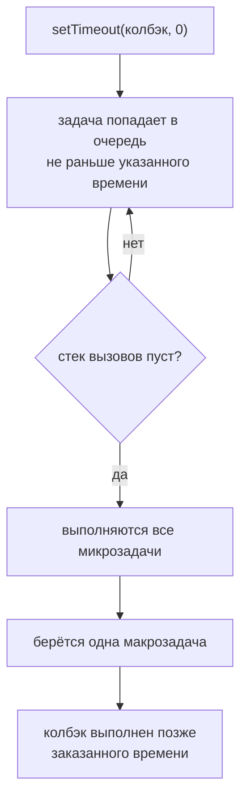

# Макрозадачи

## Связь с предыдущей главой

Предыдущая глава объяснила Microtasks:

Теперь нужно отдельно разобрать задачи вроде таймеров.

## Главный вопрос

> Когда выполняются таймеры и похожие задачи?

Короткий ответ: макрозадачи выполняются после текущего кода и после микрозадач.

## Предварительные требования

Для этой главы нужно понимать:

* Event Loop;
* Web APIs;
* Microtasks;
* Call Stack;
* базовую асинхронность.

## Цели обучения

После главы вы будете понимать:

* что такое Macrotasks;
* почему `setTimeout()` выполняется после текущего кода;
* почему Microtasks идут раньше Macrotasks;
* как `setInterval()` планирует повторяющиеся macrotasks;
* как предсказывать порядок в тестовом фреймворке.

## Мотивация

В Automation QA часто есть задачи, которые должны выполниться позже:

Такие задачи обычно планируются через API среды выполнения и попадают в очередь macrotasks.

## Теория

### Отложенные задачи крупного уровня

Макрозадачи — это отложенные задачи более крупного уровня.

К ним относятся:

```text
setTimeout()
setInterval()
```

Сюда же относятся обработчики событий и другие задачи, которые среда выполнения ставит в очередь после завершения внешней работы.

### Упрощённый порядок

| Шаг | Что выполняется |
| --- | --- |
| 1 | текущий синхронный код до конца |
| 2 | вся очередь микрозадач |
| 3 | **одна** макрозадача |
| 4 | снова вся очередь микрозадач |
| 5 | следующая макрозадача |

Асимметрия между шагами 2 и 3 — суть модели. Микрозадачи обрабатываются пачкой, макрозадачи — по одной, и между ними снова опустошается очередь микрозадач.

Эта глава не углубляется в разные типы очередей браузера или Node.js. Здесь важна рабочая модель: таймеры выполняются через очередь макрозадач и уступают микрозадачам после текущего кода.

### Что означает задержка

Когда вызывается `setTimeout(fn, 100)`:

1. среда выполнения регистрирует таймер и возвращает управление;
2. по истечении 100 мс функция попадает в очередь макрозадач;
3. когда стек свободен и очередь микрозадач пуста, функция выполняется.

Между вторым и третьим шагом может пройти сколько угодно времени. Поэтому задержка задаёт момент **постановки в очередь**, а не момент выполнения.

### Сравнение двух очередей

| | Microtasks | Macrotasks |
| --- | --- | --- |
| источники | обработчики Promise, `queueMicrotask()` | `setTimeout`, `setInterval`, события |
| сколько обрабатывается за раз | вся очередь | одна задача |
| приоритет | выше | ниже |
| порождённые в процессе | выполняются в том же проходе | ждут следующего прохода |

Последняя строка важна: `setTimeout`, вызванный внутри колбэка таймера, не выполнится немедленно — он встанет в очередь и дождётся своей очереди.

Поэтому `setInterval` не гарантирует равных промежутков: если предыдущий колбэк выполнялся долго или стек был занят, следующий сработает позже.

### Практический вывод для тестов

Из модели следуют три вещи, с которыми сталкиваются при написании автотестов:

- пауза на фиксированное время не гарантирует, что что-то успеет произойти;
- увеличение задержки не помогает, если стек занят синхронной работой;
- ожидание, построенное на проверке условия, переживает любую загрузку — оно просто проверит состояние в следующий доступный момент.

Именно поэтому во всех главах про ожидания рекомендовано условие вместо паузы.

Задержка — это минимум ожидания, а не точное время:


```mermaid
flowchart TD
    A["setTimeout(колбэк, 0)"] --> B["задача попадает в очередь<br/>не раньше указанного времени"]
    B --> C{"стек вызовов пуст?"}
    C -- "нет" --> B
    C -- "да" --> D["выполняются все микрозадачи"]
    D --> E["берётся одна макрозадача"]
    E --> F["колбэк выполнен позже<br/>заказанного времени"]
```

## Внутренний механизм

Когда вызывается `setTimeout()`, среда выполнения регистрирует таймер, по истечении задержки кладёт функцию в очередь макрозадач, и только потом событийный цикл переносит её в стек вызовов.

Сравнение с микрозадачами: очередь микрозадач опустошается целиком, а макрозадача берётся по одной за проход.

Поэтому обработчик Promise, зарегистрированный позже таймера, всё равно выполнится раньше него.

### Где живёт таймер

```text
setTimeout(fn, 100)
   │
   ├─ среда выполнения регистрирует таймер   ← не движок, а среда
   │  (прошло 100 мс)
   ├─ fn кладётся в очередь макрозадач
   │
   └─ событийный цикл берёт её, когда стек пуст и микрозадачи разобраны
```

Задержка отмеряет момент, когда задача **станет доступной**, а не момент
выполнения. Между этими событиями может пройти сколько угодно времени: стек
занят, очередь микрозадач не опустела, впереди другая макрозадача.

### Что видно в порядке вывода

| Что зарегистрировали | Когда выполнится |
| --- | --- |
| `setTimeout(fn, 0)` | после синхронного кода и всех микрозадач |
| `setTimeout(fn, 0)` дважды | по порядку регистрации, по одной за проход |
| таймер внутри таймера | не в этом проходе, а в следующем |
| `Promise.then` после таймера | **раньше** таймера |

Последняя строка — самая практичная: обработчик промиса, зарегистрированный
позже таймера, всё равно выполнится первым, потому что очередь микрозадач
разбирается целиком перед взятием макрозадачи.

## Главная ментальная модель

Главная модель главы: **макрозадача — единица отложенной работы, которая ждёт и свободного стека, и пустой очереди микрозадач**.

Полная схема модуля:

```text
Call Stack      → выполняет код сейчас
среда выполнения → ведёт таймеры, сеть, события
микрозадачи     → выполняются все сразу после синхронного кода
макрозадачи     → по одной, между ними снова микрозадачи
Event Loop      → переносит готовое в стек, когда он свободен
```

## Практические примеры

Примеры находятся в:

```text
examples/01-javascript/chapter-76/
```

Запуск:

```bash
node examples/01-javascript/chapter-76/01-timeout-macrotask.js
node examples/01-javascript/chapter-76/02-interval-macrotask.js
node examples/01-javascript/chapter-76/03-macro-after-micro.js
node examples/01-javascript/chapter-76/04-qa-flow.js
```

Примеры показывают, что таймеры выполняются после текущего кода и после микрозадач.

## Пример Automation QA

Представим тестовый фреймворк:

Сначала завершится текущий код. Затем выполнятся микрозадачи. Потом начнут выполняться макрозадачи, связанные с таймерами.

Это помогает объяснять порядок логов:

```text
фреймворк: синхронная часть завершена
микрозадача: запуск отмечен завершённым
макрозадача: отчёт загружен
макрозадача: панель мониторинга уведомлена
```

### Таймер задаёт минимум, а не точное время

```javascript
setTimeout(() => console.log('через 100 мс'), 100);
```

Сто миллисекунд — это когда задача **станет доступной** к выполнению, а не
когда выполнится. Если в этот момент занят стек или очередь микрозадач ещё не
опустела, макрозадача ждёт.

Отсюда следствие для тестов: `setTimeout(…, 100)` не гарантирует, что через
сто миллисекунд состояние изменилось. Ожидание, построенное на таймере, даёт
нестабильность, которая усиливается под нагрузкой — то есть именно в CI.

### Почему это объясняет «плавающие» падения

Локально машина свободна, очереди пустые, и пауза кажется достаточной. В CI
несколько процессов делят ядра, очередь микрозадач дольше, и та же пауза
перестаёт хватать.

Такое падение выглядит как нестабильность продукта, хотя причина в тесте.
Проверка условия вместо ожидания времени убирает эту зависимость целиком —
глава 172 разбирает её подробно.

## Распространённые мифы

**Миф: задержка таймера задаёт момент выполнения.**
Она задаёт момент постановки в очередь. Выполнение произойдёт, когда освободится стек.

**Миф: за один проход выполняются все макрозадачи из очереди.**
Выполняется одна, затем снова опустошается очередь микрозадач.

**Миф: `setInterval` гарантирует равные промежутки.**
Не гарантирует: занятый стек и долгий колбэк сдвигают следующий запуск.

**Миф: `setTimeout` внутри колбэка таймера выполнится сразу.**
Он встанет в очередь и дождётся следующего прохода.

**Миф: увеличение задержки решает проблему нестабильного ожидания.**
Если стек занят, задержка не играет роли. Нужна синхронизация по условию.

## Частые вопросы

**Почему между двумя таймерами выполнились обработчики Promise?**
После каждой макрозадачи очередь микрозадач опустошается заново.

**Почему `setInterval` «плывёт»?**
Запуски сдвигаются, если стек занят или предыдущий колбэк выполнялся долго.

**Сколько макрозадач выполнится за один проход?**
Одна.

**Помогает ли `setTimeout(fn, 0)` дать «передышку» другим задачам?**
Да, он уступает очередь, но только после опустошения микрозадач.

**Почему ожидание условием надёжнее паузы?**
Условие проверяется в следующий доступный момент независимо от загрузки, а пауза — нет.

## Проверьте себя

1. Сколько макрозадач выполняется за один проход и что происходит между ними?
2. Что означает второй аргумент `setTimeout` на самом деле?
3. Почему `setInterval` не даёт равных промежутков?
4. Когда выполнится `setTimeout`, вызванный внутри колбэка другого таймера?
5. Почему увеличение задержки не спасает при занятом стеке?

### Ответы

1. Одна. Между макрозадачами полностью разбирается очередь микрозадач.
2. Минимальную задержку до попадания обратного вызова в очередь, а не точный момент выполнения.
3. Отсчёт следующего интервала начинается независимо от того, сколько выполнялся обратный вызов. Если он длиннее интервала, вызовы идут подряд без паузы.
4. В следующем проходе цикла событий — не в текущем, даже если задержка нулевая.
5. Задержка определяет только момент попадания в очередь. Пока стек занят, обратный вызов ждёт, сколько бы времени ни прошло.

## Распространённые ошибки

### Ошибка 1. Думать, что `setTimeout(..., 0)` означает "прямо сейчас"

Таймер с нулевой задержкой всё равно попадает в очередь макрозадач.

### Ошибка 2. Игнорировать микрозадачи

Если есть Promise-обработчики, они выполнятся раньше таймера после текущего кода.

### Ошибка 3. Считать макрозадачи параллельным выполнением

Макрозадачи возвращаются в обычный стек вызовов. Их код выполняется как обычная функция.

## Практика

Практика находится в:

```text
practice/01-javascript/76-macrotasks.md
```

Решения находятся в:

```text
solutions/01-javascript/76-macrotasks.md
```

## Краткие итоги

Макрозадачи объясняют поведение таймеров и похожих отложенных задач.

Главное:

* `setTimeout()` и `setInterval()` планируют макрозадачи;
* макрозадачи выполняются после текущего синхронного кода;
* микрозадачи выполняются раньше макрозадач;
* событийный цикл координирует возвращение задач в стек вызовов;
* асинхронность не означает параллельное выполнение JavaScript-кода.

## Переход к следующей главе

Теперь общая модель асинхронного JavaScript выглядит так: код выполняется синхронно до конца, долгую работу ведёт среда, готовые продолжения ждут в двух очередях с разным приоритетом, а событийный цикл переносит их в стек по мере его освобождения.

Следующие главы смогут использовать эту модель для более удобных инструментов работы с асинхронностью.
