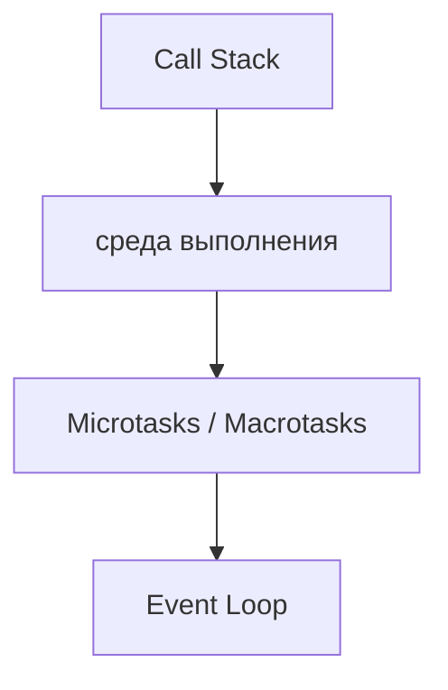
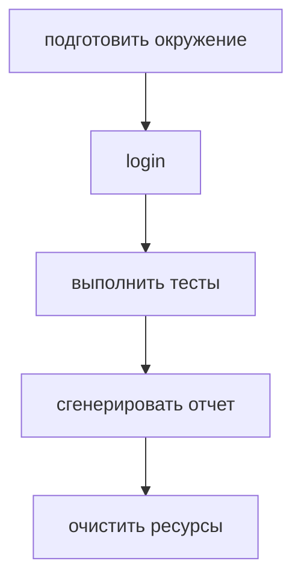
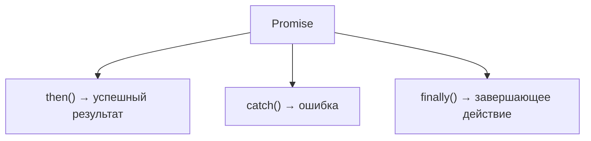
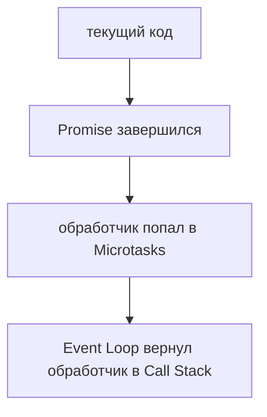

# Promise API

## Связь с предыдущей главой

Предыдущий модуль объяснил, как асинхронный код возвращается к выполнению:



Теперь мы уже понимаем, почему Promise-обработчики выполняются после текущего кода и до таймеров. Следующий шаг — научиться правильно работать с Promise-объектами в инженерном коде.

## Главный вопрос

> Как работать с Promise-объектами?

Короткий ответ: через `then()`, `catch()` и `finally()`.

## Мотивация

В тестовом фреймворке типичный поток выглядит так:



Каждый шаг может завершиться позже. Promise API дает способ описать:

* что делать при успешном результате;
* что делать при ошибке;
* что выполнить в любом случае.

## Теория

`then()` регистрирует обработчик успешного результата:

```javascript
promise.then(function handleResult(result) {
  console.log(result);
});
```

`catch()` регистрирует обработчик ошибки:

```javascript
promise.catch(function handleError(error) {
  console.log(error);
});
```

`finally()` регистрирует действие, которое должно выполниться после завершения Promise независимо от результата:

```javascript
promise.finally(function cleanup() {
  console.log('cleanup');
});
```

Эта глава не повторяет внутренние состояния Promise. Здесь важно инженерное назначение методов.

## Внутренний механизм

На уровне выполнения:



Когда Promise получает результат, соответствующий обработчик попадает в очередь Microtasks. Поэтому обработчик не прерывает текущую строку, а выполняется после завершения текущего синхронного кода.



### `finally()` не меняет результат

Тонкость, ради которой метод и существует. `finally()` выполняется при любом исходе, но **не влияет** на значение, идущее по цепочке:

```javascript
await Promise.resolve('значение').finally(() => 'другое');   // 'значение'
```

Возвращённое из него значение игнорируется — в отличие от `then()`, где результат обработчика становится новым значением.

Исключение одно: если `finally()` выбросит ошибку, она **заменит** прежний результат.

```javascript
Promise.resolve('v').finally(() => { throw new Error('из finally'); });
// цепочка завершится этой ошибкой
```

Это ровно та же ловушка, что с очисткой в главе про жизненный цикл данных: упавшая очистка заслоняет исходный результат.

### Что возвращает каждый метод

| Метод | Когда вызывается обработчик | Что становится результатом |
| --- | --- | --- |
| `then()` | при успехе | значение, возвращённое обработчиком |
| `catch()` | при ошибке | значение обработчика — цепочка «восстанавливается» |
| `finally()` | всегда | прежний результат, если не выброшена ошибка |

Вторая строка объясняет поведение, которое иногда удивляет: после `catch()` цепочка продолжается как успешная. Это полезно для значений по умолчанию, но опасно, если ошибку нужно было пропустить дальше.

### Порядок регистрации важен

`catch()` ловит ошибки только тех звеньев, которые стоят **выше** него:

```javascript
operation()
  .catch(handleError)      // не поймает ошибку из следующей строки
  .then(mayThrow);

operation()
  .then(mayThrow)
  .catch(handleError);     // поймает обе
```

Практическое правило: обработчик ошибок ставят в конце цепочки, а промежуточный `catch()` — только там, где ошибку действительно нужно погасить и продолжить.

### Два эквивалентных способа

`then()` принимает и второй аргумент — обработчик ошибки:

```javascript
promise.then(onSuccess, onError);   // onError не поймает ошибку из onSuccess
promise.then(onSuccess).catch(onError);   // поймает
```

Разница существенна: во втором варианте `catch()` стоит ниже и видит ошибки обоих звеньев. Поэтому форма с отдельным `catch()` обычно предпочтительнее.

## Главная ментальная модель

Главная модель главы: **`then()` продолжает цепочку значением, `catch()` восстанавливает её после ошибки, `finally()` выполняет очистку, не вмешиваясь в результат**.

## Практические примеры

Примеры находятся в:

```text
examples/01-javascript/chapter-77/
```

Запуск:

```bash
node examples/01-javascript/chapter-77/01-then.js
node examples/01-javascript/chapter-77/02-catch.js
node examples/01-javascript/chapter-77/03-finally.js
node examples/01-javascript/chapter-77/04-qa-flow.js
```

## Пример Automation QA

Для тестового запуска:

```javascript
executeTest()
  .then(function generateReport(result) {
    return createReport(result);
  })
  .catch(function handleError(error) {
    console.log(error);
  })
  .finally(function cleanup() {
    console.log('cleanup finished');
  });
```

Такой код явно разделяет успешный путь, ошибку и завершающую очистку.

## Распространённые мифы

**Миф: `finally()` может изменить результат.**
Возвращённое им значение игнорируется. Изменить результат может только выброшенная в нём ошибка.

**Миф: `catch()` ловит любые ошибки цепочки.**
Только те, что возникли выше него. Ошибку из следующего `then()` он не увидит.

**Миф: после `catch()` цепочка обрывается.**
Она продолжается как успешная — значение обработчика идёт дальше.

**Миф: `then(onSuccess, onError)` и `then(onSuccess).catch(onError)` одинаковы.**
Во втором случае обработчик увидит и ошибку из `onSuccess`.

**Миф: `finally()` нужен только для симметрии с `try/finally`.**
Он решает конкретную задачу: выполнить очистку, не вмешиваясь в результат.

## Частые вопросы

**Где ставить `catch()`?**
В конце цепочки. Промежуточный — только чтобы погасить ошибку и продолжить.

**Как задать значение по умолчанию при ошибке?**
Вернуть его из `catch()`: следующий `then()` получит это значение.

**Что произойдёт, если `finally()` выбросит ошибку?**
Она заменит прежний результат цепочки.

**Зачем второй аргумент у `then()`?**
Это более старая форма. Она не ловит ошибки собственного обработчика успеха.

**Можно ли повесить несколько `catch()`?**
Да, каждый обработает ошибки своего участка цепочки.

## Проверьте себя

1. Что вернёт цепочка, если `finally()` вернёт другое значение?
2. В каком единственном случае `finally()` влияет на результат?
3. Почему `catch()` в начале цепочки не поймает ошибку из следующего `then()`?
4. Что происходит с цепочкой после `catch()`?
5. Чем `then(onSuccess, onError)` отличается от `then().catch()`?

## Распространённые ошибки

### Ошибка 1. Использовать `then()` для обработки ошибок

Ошибки должны попадать в `catch()`, если задача — централизованно обработать неуспешное завершение.

### Ошибка 2. Думать, что `finally()` получает результат

`finally()` нужен для завершающего действия, а не для обработки данных результата.

### Ошибка 3. Забывать вернуть Promise из шага

Если внутри `then()` запускается следующий асинхронный шаг, его Promise нужно вернуть, чтобы цепочка ожидала его завершения.

## Практика

Практика находится в:

```text
practice/01-javascript/77-promise-api.md
```

Решения находятся в:

```text
solutions/01-javascript/77-promise-api.md
```

## Краткие итоги

Promise API помогает описывать поведение после асинхронного результата.

Главное:

* `then()` обрабатывает успешный результат;
* `catch()` обрабатывает ошибку;
* `finally()` выполняет завершающее действие;
* обработчики Promise выполняются через Microtasks;
* инженерный код должен явно разделять успех, ошибку и очистку ресурсов.

## Переход к следующей главе

Promise API работает, но цепочки могут становиться длинными.

Следующий вопрос:

> Можно ли писать асинхронный код так, чтобы он читался почти как синхронный?

Ответ — `async` и `await`.
