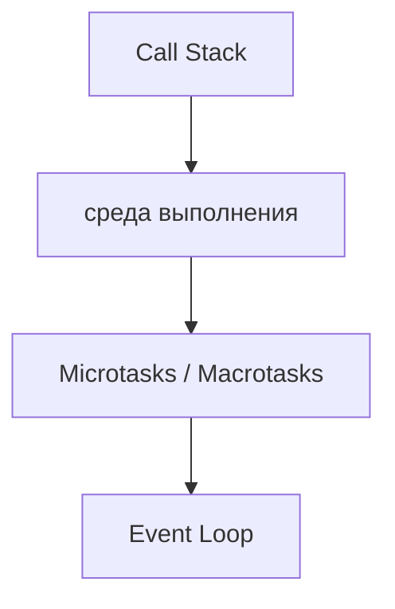
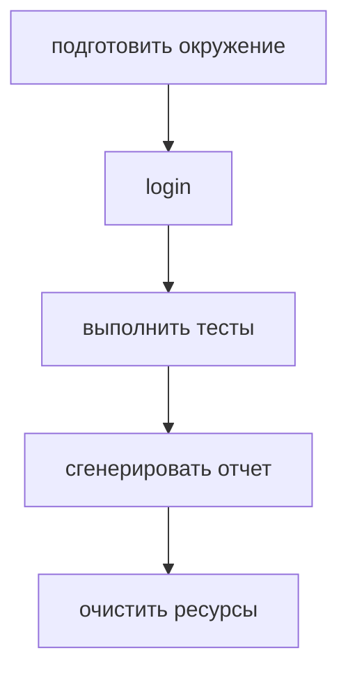
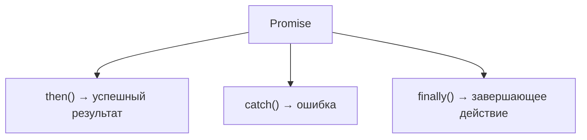
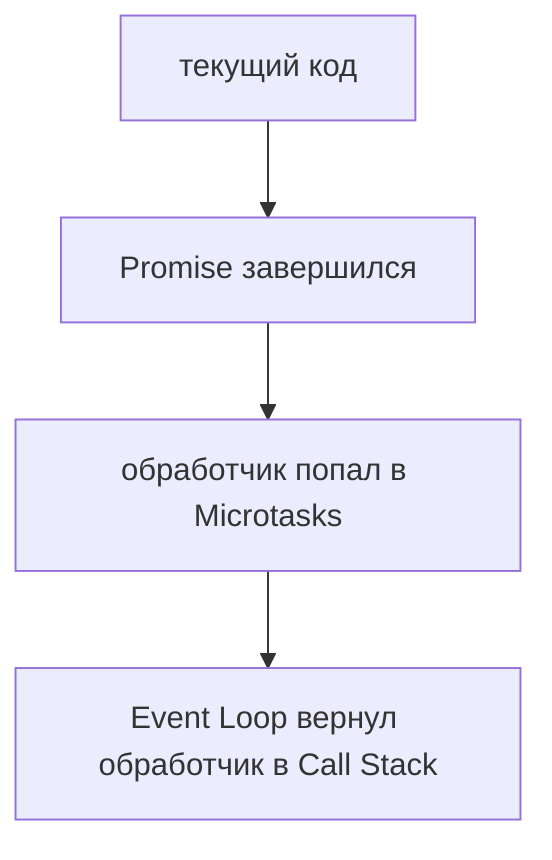
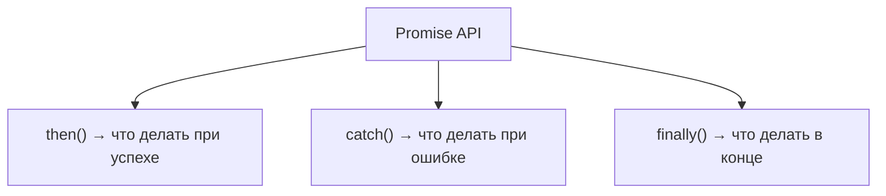

# Promise API

## Связь с предыдущей главой

Предыдущий модуль объяснил, как асинхронный код возвращается к выполнению:



Теперь мы уже понимаем, почему Promise-обработчики выполняются после текущего кода и до таймеров. Следующий шаг — научиться правильно работать с Promise-объектами в инженерном коде.

## Главный вопрос

> Как работать с Promise-объектами?

Короткий ответ: через `then()`, `catch()` и `finally()`.

## Мотивация

В тестовом фреймворке типичный поток выглядит так:



Каждый шаг может завершиться позже. Promise API дает способ описать:

* что делать при успешном результате;
* что делать при ошибке;
* что выполнить в любом случае.

## Теория

`then()` регистрирует обработчик успешного результата:

```javascript
promise.then(function handleResult(result) {
  console.log(result);
});
```

`catch()` регистрирует обработчик ошибки:

```javascript
promise.catch(function handleError(error) {
  console.log(error);
});
```

`finally()` регистрирует действие, которое должно выполниться после завершения Promise независимо от результата:

```javascript
promise.finally(function cleanup() {
  console.log('cleanup');
});
```

Эта глава не повторяет внутренние состояния Promise. Здесь важно инженерное назначение методов.

## Внутренний механизм

На уровне выполнения:



Когда Promise получает результат, соответствующий обработчик попадает в очередь Microtasks. Поэтому обработчик не прерывает текущую строку, а выполняется после завершения текущего синхронного кода.



## Главная ментальная модель

Главная модель главы:



## Практические примеры

Примеры находятся в:

```text
examples/01-javascript/chapter-77/
```

Запуск:

```bash
node examples/01-javascript/chapter-77/01-then.js
node examples/01-javascript/chapter-77/02-catch.js
node examples/01-javascript/chapter-77/03-finally.js
node examples/01-javascript/chapter-77/04-qa-flow.js
```

## Пример Automation QA

Для тестового запуска:

```javascript
executeTest()
  .then(function generateReport(result) {
    return createReport(result);
  })
  .catch(function handleError(error) {
    console.log(error);
  })
  .finally(function cleanup() {
    console.log('cleanup finished');
  });
```

Такой код явно разделяет успешный путь, ошибку и завершающую очистку.

## Распространённые ошибки

### Ошибка 1. Использовать `then()` для обработки ошибок

Ошибки должны попадать в `catch()`, если задача — централизованно обработать неуспешное завершение.

### Ошибка 2. Думать, что `finally()` получает результат

`finally()` нужен для завершающего действия, а не для обработки данных результата.

### Ошибка 3. Забывать вернуть Promise из шага

Если внутри `then()` запускается следующий асинхронный шаг, его Promise нужно вернуть, чтобы цепочка ожидала его завершения.

## Практика

Практика находится в:

```text
practice/01-javascript/77-promise-api.md
```

Решения находятся в:

```text
solutions/01-javascript/77-promise-api.md
```

## Краткие итоги

Promise API помогает описывать поведение после асинхронного результата.

Главное:

* `then()` обрабатывает успешный результат;
* `catch()` обрабатывает ошибку;
* `finally()` выполняет завершающее действие;
* обработчики Promise выполняются через Microtasks;
* инженерный код должен явно разделять успех, ошибку и очистку ресурсов.

## Переход к следующей главе

Promise API работает, но цепочки могут становиться длинными.

Следующий вопрос:

> Можно ли писать асинхронный код так, чтобы он читался почти как синхронный?

Ответ — `async` и `await`.
